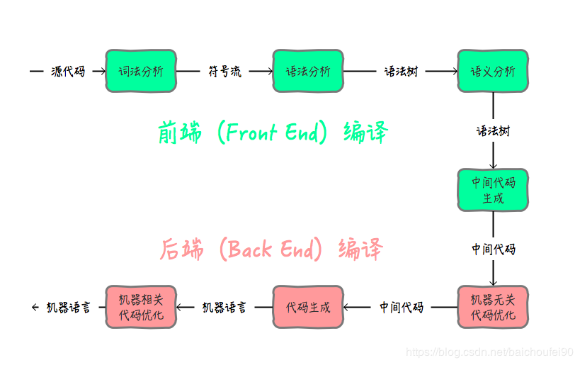
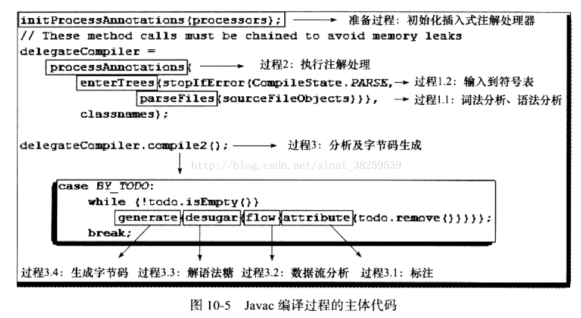

= Dubbo之SPI动态代码编译

Dubbo的SPI动态扩展点加载中，若当前扩展点中的方法含有``@Adaptive``注解，但却不存在相应含有在类上注解了``@Adaptive``的具类，Dubbo就会为其动态生成一个扩展点具类，生成源码只是第一步，由源码得到相应的元数据~一个Class<?>对象~才是最关键的一步，也即下述源码：

[source,java]
----
private Class<?> createAdaptiveExtensionClass() {
    //生成代码
    String code = new AdaptiveClassCodeGenerator(type, cachedDefaultName).generate();

    //获取classloader
    ClassLoader classLoader = findClassLoader();

    //使用SPI获取用于编译字符串得到类的Compiler
    Compiler compiler = ExtensionLoader.getExtensionLoader(Compiler.class)
            .getAdaptiveExtension();

    //完成字符串到Class<?>对象的转换处理
    return compiler.compile(code, classLoader);
}
----

此文的主角正是围绕着``Compiler``转开的，它的作用是将字符串源码编译成类字节码，再将字节码加载成``Class<?>对象``。``Compiler``是一个扩展点，Dubbo为其提供了两种实现——``JdkCompiler``和``JavassistCompiler``，分别由JDK和Javassist支持，默认使用前者，本文也只介绍前者。

扩展点定义如下：
[source,java]
----
@SPI("javassist")
public interface Compiler {

    /**
     * Compile java source code.
     *
     * @param code        Java source code
     * @param classLoader classloader
     * @return Compiled class
     */
    Class<?> compile(String code, ClassLoader classLoader);

}
----

下文将展开讨论的``JdkCompiler``除了是``Compiler``扩展点实现~具类~外，实际上扩展自``AbstractCompiler``，后者存在的主要目的是从入参``code``中提取出类的名称，然后再以其作为参数试图使用当前``ClassLoader``加载出类对象，如果不存在才会进一步让子类实现的下述抽象方法去编译源码加载出对应类对象。

[source,java]
----
protected abstract Class<?> doCompile(String name, String source) throws Throwable
----

这里涉及的编译实际上只仅限于Java的前端编译，和后端编译相距甚远。遇到两陌生概念了？莫急，下文会先系统介绍下他们，也就是先搞清楚``Compiler``背后到底在干啥。

== Java 编译原理基本介绍

编译，通常是指将源码转换成机器码的过程，但于Java来说，这个过程有点不一样，源码先转换成在JVM能理解的字节码^*.class文件^，字节码于机器来说是理解不了的，还得进一步由JVM负责将其翻译成机器指令。两个过程都是Java的编译，被归纳成前端编译和后端编译：
____
* **前端编译**：主要指与源语言有关但与目标机无关的部分，包括词法分析、语法分析、语义分析与中间代码生成，是将.java文件编译成.class的编译过程。
* **后端编译**：主要指与目标机有关的部分，包括代码优化和目标代码生成等，是将.class文件翻译成机器指令的编译过程。
____

[NOTE]
和优化相关的部分，都放在后端的即时编译器部分，有利于JRuby、Clojure、Groovy等基于JVM的编程语言产生的Class文件同样能享受到编译器优化所带来的好处。

本文所讨论的Dubbo动态编译所指的是前端编译，下述对其细节展开更深入的介绍。

=== 聚焦前端编译

image::../res/imgs/javac_compile_process.png[Javac编译过程]

前端编译过程大致可以分为上图所示的 3 个过程，分别是：

. 解析与填充符号表过程：
.. 词法分析
.. 语法分析
. 插入式注解处理器的注解处理过程;
. 分析与字节码生成：
.. 标注检查
.. 数据流分析
.. 解语法糖
.. 字节码生成

==== 解析与填充符号表

===== 词法、语法分析

经典的程序编译原理中包含了词法分析和语法分析两个步骤。

**词法分析**是将源代码的字符流转变为标记（Token）集合，``关键字、变量名、字面量、运算符``都可以成为标记，如 “`int a=b+2`” 这句代码包含了 6 个标记，分别是 `int`、`a`、`=`、`b`、`+`、`2`。

**语法分析**是根据 Token 序列构造抽象语法树的过程，抽象语法树（Abstract Syntax Tree，AST）是一种用来描述程序代码语法结构的树形表示方式，语法树的每一个节点都代表着程序代码中的一个语法结构（Construct），例如包、类型、修饰符、运算符、接口、返回值甚至代码注释等都可以是一个语法结构。

[NOTE]
语法树能表示一个结构正确的源程序的抽象，但无法保证源程序是符合逻辑的，需要由语义分析来提供保障。

===== 填充符号表

符号表（Symbol Table）是由一组符号地址和符号信息构成的表格，可以认为是哈希表中 K-V 值对的形式（实际上它可以是有序符号表、树状符号表、栈结构符号表等）。语义分析阶段用于语义检查（如检查一个名字的使用和原先的说明是否一致）和产生中间代码；目标代码生成阶段，当对符号名进行地址分配时，符号表是地址分配的依据。

[NOTE]
符号表填充阶段，若发现用户代码中没有提供任何构造函数，那编译器将会添加一个没有参数的、访问性~public、protected或private~与当前类一直的默认构造函数。

==== 注解处理器

我们见过的大多数注解是在代码运行期发挥作用的，Java中还存在一些能够在编译期间发生作用的注解，可以对抽象语法树中的任意元素做读取、修改、添加操作。若存在编译期注解，编译器将回到解析及填充符号表的过程重新处理，直到所有插入式注解处理器都没有再对语法树进行修改为止，每一次循环称为一个 Round，“javac的编译过程”一图中的回环体现的就是这点。

==== 语义分析

语义分析的主要任务是对结构上正确的源程序进行上下文有关性质的审查，如进行类型审查。下述示例中的只有第一次对``d``进行的赋值运算通过了编译，尽管所有代码行都能构成正确的语法树。

[source,java]
----
//定义了3个变量
int a = 1;
boolean b = false;
char c = 2;

//后续可能出现的赋值运算
int d = a + c;
int d = b + c;
char d = a + c;
----

语义分析实际上又分成了标注检查和数据及控制流分析两个步骤，按流程图，他们和解语法糖、字节码生成一起纳入到一个章节。

===== 标注检查

检查内容包括诸如变量使用前是否已被声明、变量与赋值之间的数据类型是否能够匹配等。

===== 数据及控制流分析

数据及控制流分析是对程序上下文逻辑更进一步的验证，它可以检测出诸如程序局部变量是在使用前是否有赋值、方法的每条路径是否都有返回值、是否所有的受查异常都被正确处理了等问题。编译时期的数据及控制流分析与类加载时数据及控制流分析的目的基本上是一致的，但校验范围有所区别，有一些校验只有在编译期或运行期才能进行。

另外在java中，局部变量可以声明为final型，但是它也仅仅是在编译器保障了变量的不变性，和没有声明final的编译出来的class文件是一模一样的，也就是该局部变量的final声明没法影响到运行期。

[source,java]
----

// 方法一带有 final 修饰
public void foo(final int arg) {
    final int var = 0;
    // do something
}

// 方法二没有 final 修饰
public void foo(int arg) {
    int var = 0;
    // do something
}
----

根本原因是局部变量与字段~实例变量、类变量~是有区别的，它在常量池中没有 `CONSTANT_Fieldref_info` 的符号引用，自然就没有访问标志（Access_Flags）的信息，甚至可能连名称都不会保留下来~取决于编译时的选项~，自然在 Class 文件中不可能知道一个局部变量是不是声明为 final 了。

===== 解语法糖

语法糖是方便程序员使用而在开发语言中提供语法，java中常用语法糖，如泛型、变长参数、自动装箱 / 拆箱等，不是JVM运行时候支持的，在编译阶段需要将他们还原回简单的基础语法结构，这个过程称为解语法糖。

[NOTE]
Java语法糖：断言语句、方法变长参数、数字字面量~带下划线分割~、自动装箱和拆箱、switch 支持枚举和字符串、try-with-resource、lambda表达式、内部类、枚举类、条件编译。

===== 字节码生成

这个阶段负责：1）前面各个步骤所生成的信息~语法树、符号表~转化成字节码写到磁盘中；2）做如下少量代码添加和转换成处理。

. 字符串的加操作替换为 StringBuffer 或 StringBuilder~取决于目标代码的版本是否大于或等于JDK1.5~的 append() 操作。
. 添加构造器方法到语法树中，在其中按序纳入加入元素使之运行期按此顺序运行：
.. 实例构造器``<init>()``方法：1）调用父类实例构造器；2）实例变量初始化；3）执行``{...}``语句块；
.. 类构造器``<cinit>()``方法：1）类变量初始化；2）执行``static{...}``语句块；

[NOTE]
``<clinit>()``方法中无须调用父类的``<clinit>()``方法，虚拟机会自动保证父类构造器的执行，但在``<clinit>()``方法中经常会生成调用``java.lang.Object``的``<init>()``方法的代码

== Jdk版编译支持

上一章节已经系统介绍过``前端编译``，知道了Dubbo所涉**动态编译**背后究竟在做什么工作，接下来需要熟悉下如何使用API来编译源码。

JDK中提供一个javac命令，使用它我们可以将Java源码编码生成字节码文件(``eg:javac SomeSample.java``)，同时Java也提供了API供开发者调用完成目标源码的编译处理。

[source,java]
----
public class CompileFileToFile{

  public static void main(String[] args) {
    //获取系统Java编译器
    JavaCompiler compiler = ToolProvider.getSystemJavaCompiler();
    //获取Java文件管理器
    StandardJavaFileManager fileManager =
        compiler.getStandardFileManager(null, null, null);
    //定义要编译的源文件
    File file = new File("/path/to/file");
    //通过源文件获取到要编译的Java类源码迭代器，包括所有内部类
    //其中每个类都是一个 JavaFileObject，也被称为一个汇编单元
    Iterable<? extends JavaFileObject> compilationUnits =
        fileManager.getJavaFileObjects(file);
    //生成编译任务
    JavaCompiler.CompilationTask task =
        compiler.getTask(null, fileManager, null, null, null, compilationUnits);
    //执行编译任务
    task.call();
  }

}
----

上述源码只是呈现了最基本的使用，实际上要在程序中完成源码的编译处理，需要有如下几个必要支持元素：

. *编译器*：完成前端编译涵盖的所有细节；
. *源码文本*：待编译的源码，被处理对象；
. *源代码、字节码文件的管理*：由文件系统支持，包括文件创建和管理；
. *编译过程中的选项*：要编译的代码版本、目标，源代码位置，classpath和编码等等；
. *编译中编译器输出的诊断信息*：告知编译成功还是失败，会有什么隐患提出警告信息；

image::../res/imgs/java_compiler_use.png[Java Compiler 使用]
=== 熟悉 `JavaCompiler`

本章节开始部分呈现的源码部分说明，如果Java开发人员想通过调用Java内置API的方式对源码文本进行编译处理，必先通过``ToolProvider.getSystemJavaCompiler()``获取到``JavaCompiler``编译器，它也是访问入口，其它提供支撑的代码元素都围绕它转开。使用它可以获取``JavaCompiler.CompilationTask``实例，然后此实例来执行对应的编译任务，其实这个执行过程是一个并发的过程。

[NOTE]
====
JDK在``rt.jar``中定义了``JavaCompiler``接口，并在``tools.jar``中提供了默认实现，其实现必须符合Java语言规范，同时使用实例生成的类文件也需要符合Java虚拟机规范，比如要作用在JDK6或以上版本来说，就得能够支持注解处理。
====

==== 基本元素

为了尽最大程度地保证``JavaCompiler``的灵活性和可扩展性，Java在更高的抽象层次提供了如下组成元素：

* *FileObject接口*：代表普通的文件或者数据源，例如一个``FileObject``对象可以是代表一个普通的文件、内存中的缓存、数据库中的数据，它定义了包括读写操作、读取信息，删除文件等一些操作；

* *JavaFileObject接口*：`→ FileObject`，代表一个Java源码文件或者Java的class字节码文件；

* *ForwardingFileObject类*：``ForwardingFileObject<F extends FileObject> implements FileObject``为提高扩展性，将行为委托给其代理的``FileObject``对象。

* *SimpleJavaFileObject类*：`→ JavaFileObject`，供扩展定制，只提供了最基本的实现，大多数方法直接抛异常处理；

* *ForwardingJavaFileObject类*：``ForwardingFileObject<F extends FileObject> implements FileObject``为提高扩展性，将行为委托给其代理的``JavaFileObject``对象。

* *Diagnostic<T>接口*：代表源码文件中的特定位置的一个编译问题，``position``是一个以0开始相对于文件起始位置的字符偏移量，``line``和``column``的起始偏移位置则以1开始；

* *DiagnosticListener<T>接口*：用于给调用方通知诊断内容，通知内容为``Diagnostic``，若使用方没有提供，则使用``System.err``将诊断内容打印出来；

* *DiagnosticCollector类*：`→ DiagnosticListener`，用于汇总所有诊断信息；

* *JavaFileManager接口*：文件管理服务，用来创建``JavaFileObject``，包括从特定位置输出和输入一个``JavaFileObject``；

* *ForwardingJavaFileManager类*：``ForwardingJavaFileManager<M extends JavaFileManager> implements JavaFileManager``，为提高扩展性，将行为委托给其代理的``JavaFileManager``对象。

* *StandardJavaFileManager*：源码编译器离不开文件操作，可以认为该接口对一些基础操作进行了抽象，用于解决读取普通文件并从中获得``FileObject``对象的问题，更多是为了方便定制：1）定制``JavaCompiler``如何对文件进行读写处理；2）定制如何在多个并发编译任务间进行共享；

* *JavaFileManager.Location和StandardLocation*：描述的是``JavaFileObject``对象的位置，由``JavaFileManager``使用来决定在哪创建或者搜索文件。

[IMPORTANT]
本章节中列举的组成元素中，有几个名称形如``ForwardingXXX``的类，它们正是Java提供给开发者做定制扩展处理的，他们将行为委托给了真正实现同一接口的JDK内置类，由于是对被委托对象的封装代理，因此也就意味着在符合当前接口方法签名和``JavaCompiler``某些约定条件的前提下，可以对行为进行自定义处理。

==== 关于使用

关于``JavaCompiler``的上述所有描述，看完之后总让人有一种“知道所有的道理，但还是过不好这一生”的惆怅，在阐述``JdkCompiler``实现之前，有必要就其使用相关的内容做更多介绍。

准备完所有必要的元素后，从``JavaCompiler``源码编译器获得``JavaCompiler.CompilationTask``实例，唤起``call()``方法执行编译操作，这个编译过程中，从``JavaFileManager``的视觉来说是：

====
编译器会首先通过其``list()``方法获取指定位置、package下的所有符合要求的``JavaFileObject``对象~源码~，还可以支持递归扫描子package下的源码、继承的类、实现的接口；编译完则调用其``getJavaFileForOutput()``方法获取用于class字节码输出的``JavaFileObject``对象。
====

然而从``JavaFileObject``的视觉来看是：

====
编译器会首先使用用户提供的``JavaFileObject``对象获取源码内容~getCharContent()~，执行完编译后同样会使用该对象输出字节码~openOutputStream()~。
====

下述对源码的进一步追踪也佐证了这一点，``JavaCompiler``编译完源码后的处理步骤大体如下述源码：

[source,java]
----
//①源码编译完之后，JavaCompiler会调用JavaFileManager获得一个输出型的JavaFileObject对象
JavaFileObject outFile = fileManager.getJavaFileForOutput(
    outLocn,name,JavaFileObject.Kind.CLASS,c.sourcefile);
...
//②进阶这会开启输出流，将编译好的字节码对象写入
OutputStream out = outFile.openOutputStream();
writeClassFile(out, c);
----

相对地，在编译前获取源码的处理步骤大致如下：

[source,java]
----
//①获取所有输入源执行“词法、语法分析”
//public List<JCCompilationUnit> parseFiles(Iterable<JavaFileObject>)
parseFiles(sourceFileObjects)

//②对单个输入源做“词法、语法分析”
//protected JCCompilationUnit parse(JavaFileObject, CharSequence)
parse(filename, readSource(filename));

//③源码文本只是简单的调用getCharContent()方法取得
public CharSequence readSource(JavaFileObject filename) {
    try {
        inputFiles.add(filename);
        return filename.getCharContent(false);
    } catch (IOException e) {
        log.error("error.reading.file", filename, JavacFileManager.getMessage(e));
        return null;
    }
}
----

综上，定制点主要集中在对``JavaFileObject``的``getCharContent()``和``openOutputStream()``这一对方法中。如下完整签名又说明源码输入文件对象和输出对象是有成对关系的。
[source,java]
----
public JavaFileObject getJavaFileForOutput
    (Location location, String className, JavaFileObject.Kind kind, FileObject sibling)
----

进一步说，就是实现中可以根据需要决定是否将输入输出统一在同一个``JavaFileObject``实现类上，仔细看看该接口的如下方法定义~JavaFileObject接口扩展自FileObject~（Dubbo中的实现采取正是这种方式）：
[source,java]
----
public interface FileObject {
    /**
     * Gets an InputStream for this file object.
     */
    InputStream openInputStream() throws IOException;

    /**
     * Gets an OutputStream for this file object.
     */
    OutputStream openOutputStream() throws IOException;

    /**
     * Gets a reader for this object.  The returned reader will
     * replace bytes that cannot be decoded with the default
     * translation character.  In addition, the reader may report a
     * diagnostic unless {@code ignoreEncodingErrors} is true.
     */
    Reader openReader(boolean ignoreEncodingErrors) throws IOException;

    /**
     * Gets the character content of this file object, if available.
     * Any byte that cannot be decoded will be replaced by the default
     * translation character.  In addition, a diagnostic may be
     * reported unless {@code ignoreEncodingErrors} is true.
     */
    CharSequence getCharContent(boolean ignoreEncodingErrors) throws IOException;

    /**
     * Gets a Writer for this file object.
     */
    Writer openWriter() throws IOException;
}
----

=== `JdkCompiler` 实现

有了上述章节的背景知识，理解``JdkCompiler``相对就容易了，它申明了3个内部静态类，`JavaFileObjectImpl`、`JavaFileManagerImpl`、`ClassLoaderImpl`，为方便讨论下述先分后总，逐个章节展开。

==== `JavaFileObjectImpl`

该类扩展自``SimpleJavaFileObject``，目的是为``JavaCompiler``提供输入源~source~和输出源~bytecode~，总体源码如下：

[source,java]
----
private static final class JavaFileObjectImpl extends SimpleJavaFileObject {

    private final CharSequence source;
    private ByteArrayOutputStream bytecode;

    public JavaFileObjectImpl(final String baseName, final CharSequence source) {
        super(ClassUtils.toURI(baseName + ClassUtils.JAVA_EXTENSION), Kind.SOURCE);
        this.source = source;
    }

    JavaFileObjectImpl(final String name, final Kind kind) {
        super(ClassUtils.toURI(name), kind);
        source = null;
    }

    public JavaFileObjectImpl(URI uri, Kind kind) {
        super(uri, kind);
        source = null;
    }

    @Override
    public CharSequence getCharContent(final boolean ignoreEncodingErrors) throws UnsupportedOperationException {
        if (source == null) {
            throw new UnsupportedOperationException("source == null");
        }
        return source;
    }

    @Override
    public InputStream openInputStream() {
        return new ByteArrayInputStream(getByteCode());
    }

    @Override
    public OutputStream openOutputStream() {
        return bytecode = new ByteArrayOutputStream();
    }

    //JavaCompiler对源码编译完后，会将二级制字节码输出
    //到bytecode这个ByteArrayOutputStream输出流中
    public byte[] getByteCode() {
        return bytecode.toByteArray();
    }
}
----

==== `ClassLoaderImpl`

Java近二十年的发展，虽然也支持解释执行，但总体上是编译执行为主，特别是Dubbo中使用动态编译的场景都集中在生成扩展点具类上，虽然该场景下一个扩展点只会有一个实例，但其对一个字节码执行的频度往往是比较高的，不适合使用解释执行方法。另外编译执行会有前端编译和后端编译的优化，也能提供执行效率。

只有经过编译的源码，才能被``ClassLoader``加载到JVM中运行~class字节码~，这也是``JdkCompiler``存在的目的，显然后者编译得到的class字节码数据并不是通常存储在磁盘中的``*.class``文件~或者内含在jar包中~，这些字节码是缓存在内存中的，由``JdkCompiler``使用一个``JavaFileObjectImpl``类型对象输出到``bytecode``输出流上，是一般``ClassLoader``执行类加载时所搜寻的classpath目录中找不到的。

所谓类加载是指``ClassLoader``将class字节码转换成存储在方法区中的``Class<?>``类对象~元数据~这么一个过程，``ClassLoaderImpl``担纲着将``JdkCompiler``编译得到的字节码加载成类对象的重任。

``ClassLoader``的加载模式中，存在一个双亲委托的说法，意思是先尝试使用``parent``的``loadClass(name)``方法加载指定类，如果没有找到对应``name``的字节码内容~返回null，本应是一个`Class<?>``类型的对象~，当前``ClassLoader``便会执行自身所覆写``findClass(clzName)``方法，由其载入与``clzName``对应的字节码数据，最后使用父类的``defineClass(clzName,bytes,0,bytes.length)``载入最终的``Class<?>``类实例。

综上，``ClassLoaderImpl``定义了一个``Map<String, JavaFileObject>``类型的``classes``容器，并提供了``add(String name, JavaFileObject file)``方法，以便装入编译完源码后得到``JavaFileObject``类型对象，有了他们，调用其``loadClass(name)``方法便能完成内存字节码加载，最终获得类对象。

[source,java]
----
private final class ClassLoaderImpl extends ClassLoader {

    private final Map<String, JavaFileObject> classes = new HashMap<String, JavaFileObject>();

    ClassLoaderImpl(final ClassLoader parentClassLoader) {
        super(parentClassLoader);
    }

    Collection<JavaFileObject> files() {
        return Collections.unmodifiableCollection(classes.values());
    }

    @Override
    protected Class<?> findClass(final String qualifiedClassName)
            throws ClassNotFoundException {
        JavaFileObject file = classes.get(qualifiedClassName);
        if (file != null) {
            byte[] bytes = ((JavaFileObjectImpl) file).getByteCode();
            return defineClass(qualifiedClassName, bytes, 0, bytes.length);
        }
        try {
            return org.apache.dubbo.common.utils.ClassUtils
                .forNameWithCallerClassLoader(qualifiedClassName, getClass());
        } catch (ClassNotFoundException nf) {
            return super.findClass(qualifiedClassName);
        }
    }

    void add(final String qualifiedClassName, final JavaFileObject javaFile) {
        classes.put(qualifiedClassName, javaFile);
    }

    @Override
    protected synchronized Class<?> loadClass(final String name, final boolean resolve)
            throws ClassNotFoundException {
        return super.loadClass(name, resolve);
    }

    @Override
    public InputStream getResourceAsStream(final String name) {
        if (name.endsWith(ClassUtils.CLASS_EXTENSION)) {
            String qualifiedClassName = name.substring(0, name.length() - ClassUtils.CLASS_EXTENSION.length()).replace('/', '.');
            JavaFileObjectImpl file = (JavaFileObjectImpl) classes.get(qualifiedClassName);
            if (file != null) {
                return new ByteArrayInputStream(file.getByteCode());
            }
        }
        return super.getResourceAsStream(name);
    }
}
----

上述源码中有几处比较特殊的地方：

. ``findClass()``方法体中，如果没能从容器中加载到指定``name``名字的``Class<?>``对象，dubbo会使用加载当前``JdkCompiler``的那个``ClassLoader``去加载，若后续又抛错了，则忽略异常，并试图调用``super.findClass()``获取；
. ``loadClass()``方法被覆写，只是方法签名中添加了``synchronized``修饰符，原因是其所处``JdkCompiler``实例环境是被并发使用的，``classes``容器也成了争用资源；

==== `JavaFileManagerImpl`

有了上述章节的一序列铺垫后，即便不看代码，对``JavaFileManagerImpl``要做的事情也已基本能掌握个十之八九。简单来讲就是在并发环境下，为``JavaCompiler``提供输入源和输出源~均是``JavaFileObjectImpl``实例~。

输出源的处理在剖析``ClassLoaderImpl``时已经阐明——将输出型的``JavaFileObject``实例使用``add()``方法添加到它的容器中去。

装入的``fileObjects``容器中的``JavaFileObject``对象所使用的Key键构建方式：`"SOURCE_PATH/"+包名+"/"+Java文件名称`，如：`SOURCE_PATH/org.apache.dubbo.common.compiler.support/HelloServiceImpl8.java`。

[source,java]
----
private static final class JavaFileManagerImpl extends ForwardingJavaFileManager<JavaFileManager> {

    private final ClassLoaderImpl classLoader;

        @Override
    public JavaFileObject getJavaFileForOutput(Location location, String qualifiedName, Kind kind, FileObject outputFile)
            throws IOException {
        JavaFileObject file = new JavaFileObjectImpl(qualifiedName, kind);
        classLoader.add(qualifiedName, file);
        return file;
    }

    @Override
    public ClassLoader getClassLoader(JavaFileManager.Location location) {
        return classLoader;
    }
    ...
}
----

于输入源的处理，则相对复杂点，和``ClassLoaderImpl``一样，它同样声明了一个``Map<String, JavaFileObject>``类型的容器，也即属性``fileObjects``，由外围类将源码提供给它，如下：
[source,java]
----
private static final class JavaFileManagerImpl extends ForwardingJavaFileManager<JavaFileManager> {

    private final Map<URI, JavaFileObject> fileObjects = new HashMap<URI, JavaFileObject>();
    @Override
    public FileObject getFileForInput(Location location, String packageName, String relativeName) throws IOException {
        FileObject o = fileObjects.get(uri(location, packageName, relativeName));
        if (o != null) {
            return o;
        }
        return super.getFileForInput(location, packageName, relativeName);
    }

    public void putFileForInput(StandardLocation location, String packageName, String relativeName, JavaFileObject file) {
        fileObjects.put(uri(location, packageName, relativeName), file);
    }
    ...
}
----

注：[small]#关于``list()``和``inferBinaryName()``这两个方法的具体作用不是很清楚，本文不做分析。#

==== 最终实现

上文中已经隐约表示``JavaFileManagerImpl``和``ClassLoaderImpl``的实现都是支持并发的，关于``FileManager``有关的API文档中也提到共享能够提高吞吐量，因此作为以单例模式存在的``JdkCompiler``会在类的实例化时便将他们作为自身的属性也实例化了。

``ClassLoaderImpl``作为自定义``ClassLoader``的实现，需要有一个称之为``parent``的``ClassLoader``作为其代理目标，同时``JavaFileManagerImpl``也代理了一个默认的目标``StandardJavaFileManager``对象，因而在构建他们的实例时，先得将被代理的对象准备好，另外构造函数中也准备了编译器需要的其它元素。
[source,java]
----
public class JdkCompiler extends AbstractCompiler {

    private final JavaCompiler compiler = ToolProvider.getSystemJavaCompiler();

    private final DiagnosticCollector<JavaFileObject> diagnosticCollector = new DiagnosticCollector<JavaFileObject>();

    private final ClassLoaderImpl classLoader;

    private final JavaFileManagerImpl javaFileManager;

    private volatile List<String> options;

    public JdkCompiler() {
        //编译选项
        options = new ArrayList<String>();
        options.add("-source");
        options.add("1.6");
        options.add("-target");
        options.add("1.6");

        //被代理的JavaFileManager对象
        StandardJavaFileManager manager = compiler.getStandardFileManager(diagnosticCollector, null, null);
        final ClassLoader loader = Thread.currentThread().getContextClassLoader();
        if (loader instanceof URLClassLoader
                && (!"sun.misc.Launcher$AppClassLoader".equals(loader.getClass().getName()))) {
            try {
                URLClassLoader urlClassLoader = (URLClassLoader) loader;
                List<File> files = new ArrayList<File>();
                for (URL url : urlClassLoader.getURLs()) {
                    files.add(new File(url.getFile()));
                }
                //将加载当前JdkCompiler类的ClassLoader中的所有classpath设置给manager
                manager.setLocation(StandardLocation.CLASS_PATH, files);
            } catch (IOException e) {
                throw new IllegalStateException(e.getMessage(), e);
            }
        }

        //对目标ClassLoaderImpl再封装一次，以满足Java的安全要求
        classLoader = AccessController.doPrivileged(new PrivilegedAction<ClassLoaderImpl>() {
            @Override
            public ClassLoaderImpl run() {
                return new ClassLoaderImpl(loader);
            }
        });
        javaFileManager = new JavaFileManagerImpl(manager, classLoader);
    }
    ...
}
----

最终在``doCompile()``方法实现中，先使用源码构建``JavaFileObjectImpl``类型的输入源对象，塞入到``JavaFileManagerImpl``设置的容器中，随后从中取得输入源调用``JavaCompiler``的``getTask()``得到编译任务，紧接着唤起``call()``完成源码的编译操作，最后使用同一个``name``调用``ClassLoaderImpl``将字节码加载成``Class<?>``对象。
[source,java]
----
    public Class<?> doCompile(String name, String sourceCode) throws Throwable {
        int i = name.lastIndexOf('.');
        String packageName = i < 0 ? "" : name.substring(0, i);
        String className = i < 0 ? name : name.substring(i + 1);
        JavaFileObjectImpl javaFileObject = new JavaFileObjectImpl(className, sourceCode);
        javaFileManager.putFileForInput(StandardLocation.SOURCE_PATH, packageName,
                className + ClassUtils.JAVA_EXTENSION, javaFileObject);
        Boolean result = compiler.getTask(null, javaFileManager, diagnosticCollector, options,
                null, Arrays.asList(javaFileObject)).call();
        if (result == null || !result) {
            throw new IllegalStateException("Compilation failed. class: " + name + ", diagnostics: " + diagnosticCollector);
        }
        return classLoader.loadClass(name);
    }
----

---

完结

