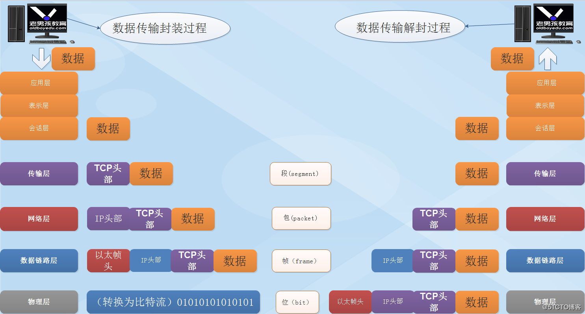

= Dubbo架构设计解析

== OSI网络模型

Dubbo中远程通讯和OSI七层网络协议模型密切相关，甚至可以说，整个Dubbo的分层架构也借鉴了其精髓。系统了解OSI模型，这有利于理解整个Dubbo的RPC具体实现。

简单回顾下7层的作用：

. *物理层*：将二进制比特流转换为电信号、光信号或无线信号，传输到目标主机，到达对端后再转换回二级制比特流；
. *数据链路层*：帧出站封装和入站的拆包处理，完成数据流和二进制流间的转换，利用控制协议，将不可靠、有差错的物理线路转换为可靠的数据链路；

.. 帧内容：head【``固定18字节``，发送者、接受者地址和数据类型各6字节】、data【``最短46字节，最长1500字节``，数据包的具体内容】
.. mac地址：这里的发送者、接受者地址实际上是一串mac地址，12位16进制数表示的烧录在网卡中的二进制位，前六位是厂商编码，后六位是流水线号
.. 局域网互通：在局域网内，彼此互联着的计算机实体采用广播方式通讯，广播后所有机器都能接受到信息，拆包后，若发生字节非目标机器，则丢弃不管；

. *网络层*：[big]#解析# 或 [big]#装入# 数据流中data部分的IP包头（源IP+目标IP），通过路径选择、分段组合、顺序、进/出 [big]#路由# 等控制，
将信息从一个网络设备接入或传送到另一个网络设备。``IP只是一个逻辑地址，MAC才是物理地址。``

.. *ARP协议*：目的是为**数据链路层**获取目标主机的MAC地址~数据链路层的数据必须依靠物理地址传输~，具体请求发送前，机器使用广播方式发送一个含有自身MAC、自身IP、目标IP的数据包出去，该包中还装有一个被称为广播地址的12个F表示的目标MAC，同一局域网的目标机会返回含有自身MAC地址的ARP响应。广播前，如果目标IP不属于本局域网，会被替换成当前所属网关IP。
[NOTE]
ARP高速缓存表：为提升效率，源机器收回ARP响应后，会将``<IP地址,MAC地址>``映射对缓存起来，后续超时内便可直接从缓存中取用。

.. *ARP补充*：[small]#1）ARP无法跨越最靠近的网关；2）链路层数据发送必须含有目标机的MAC地址；3）若当前机器自身不含网关功能，需要**ARP**获取
网关IP，此时称为**代理ARP**，否则由于在同一机器上，无需ARP参与即可完成当前网关IP的替换。#

.. *虚拟IP*：局域网中，其组成机器即便无公网IP，依然可以通过网关设备和外界通讯，每一个物理网卡需要绑定一个局域网IP~动态IP或者静态IP~，而虚拟IP^VIP^虽也由网关设备分配，但却并不绑定于网卡之上，而是动态绑定到主机之上的，从VIP接入的请求最终还是会路由到一个物理网卡被解包执行响应处理。VIP主要用于系统高可用性，如负载均衡、网络容错等。

.. *IP漂移*：HA高可用方案中，为避免单点故障，往往采用主备方案，主机故障，由备机替补。主备间维持着心跳连接，一旦备机发现主机不可用，会广播一个ARP请求出去，若没有ARP响应回来，备机便获得ARP请求中的目标VIP~绑定VIP到备机上~，这一过程即为IP漂移。

.. *环回接口*：其存在目的是允许运行在同一台主机上客户程序和服务器程序通过TCP/IP进行通信，一个传给环回接口的IP数据报不能在任何网络上出现，直接作为IP输入发回给了本机，典型如``127.0.0.1~包括127.X.X.X~``。由于其纯软件性质，数据无需经过实际网卡，因而有着永不宕机的特性。

. *传输层*：用于建立可靠的、保证报文正确传输的端口到端口的通信，屏蔽掉下层具体数据通信细节。端口是该层最重要的组成， [big]#*MAC找到主机，IP确定子网， 端口标识应用程序*#。

.. *端口*：一台机器通常会运行很多个程序，每个程序都是通过称为端口的编号与网卡进行关联。[small]#端口范围0-65535，0-1023为系统占用端口。#
.. *连接管理*：建立、维护和拆除连接；
.. *TCP* vs *UDP* ：
... TCP面向连接（如打电话要先拨号建立连接）；UDP是无连接的，即发送数据之前不需要建立连接
... TCP提供可靠的服务。也就是说，通过TCP连接传送的数据，无差错，不丢失，不重复，且按序到达；UDP尽最大努力交付，即不保证可靠交付。 Tcp通过校验和，重传控制，序号标识，滑动窗口、确认应答实现可靠传输。如丢包时的重发控制，还可以对次序乱掉的分包进行顺序控制。
... UDP具有较好的实时性，工作效率比TCP高，适用于对高速传输和实时性有较高的通信或广播通信。
... 每一条TCP连接只能是点到点的；UDP支持一对一，一对多，多对一和多对多的交互通信
... TCP对系统资源要求较多，UDP对系统资源要求较少。
... *类比*：以快递公司的跟单员做比喻，TCP就像负责人的跟单员，会保证快递送到客户手上，失败会再发一次。UDP则想不负责的跟单员，只管将快递送到客户指定的地方，不管快递是否最终送到客户手上。

. *会话层*：调度担当，组织和协调两个会话进程之间的通信（如连接的建立和断开，会话持续的时间），并对数据交换进行管理。
.. *会话类型*：半双工、单工和全双工3种类型。
.. *远程地址*：会话层使用的地址是便于记忆的类似域名的地址，最终需要转换成MAC地址或网络层的逻辑地址。
.. *协议*：SSL 安全套接字层协议，RPC 远程过程调用协议，LDAP 轻量级目录访问协议；

. *表示层*：处理用户信息的表示问题，如编码、数据格式转换和加密解密。
.. *数据格式处理*：协商和建立数据交换的格式，解决各应用程序之间在数据格式表示上的差异。
.. *数据的编码*：处理字符集和数字的转换。
.. *压缩和解压缩*：为了减少数据的传输量，这一层还负责数据的压缩与恢复。
.. *数据的加密和解密*：可以提高网络的安全性。

. *应用层*：负责直接向用户提供服务，完成用户希望在网络上完成的各种工作。
.. *常见服务*：文件服务、目录服务、文件传输服务（FTP）、远程登录服务（Telnet）、电子邮件服务（E-mail）、打印服务、安全服务、网络管理服务、数据库服务等。

下图是一典型的HTTP请求分层传递原理解析图，直观清晰：

image::../res/imgs/network_framwork_dataflow.jpg[经典HTTP请求分层传递原理解析图]

=== 所属分层

Dubbo在微服务开发中，主要作为分布式RPC通讯框架存在，其网络I/O能力是委托给Netty中第三方中间件完成的，也就是说Netty担纲了网络传输层的的作用，
而Dubbo相对应于会话层和表示层，利用Dubbo构建的分布式服务当然可被认为对应于应用层。