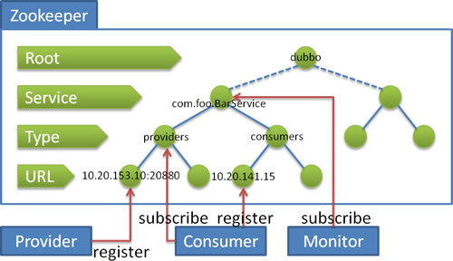
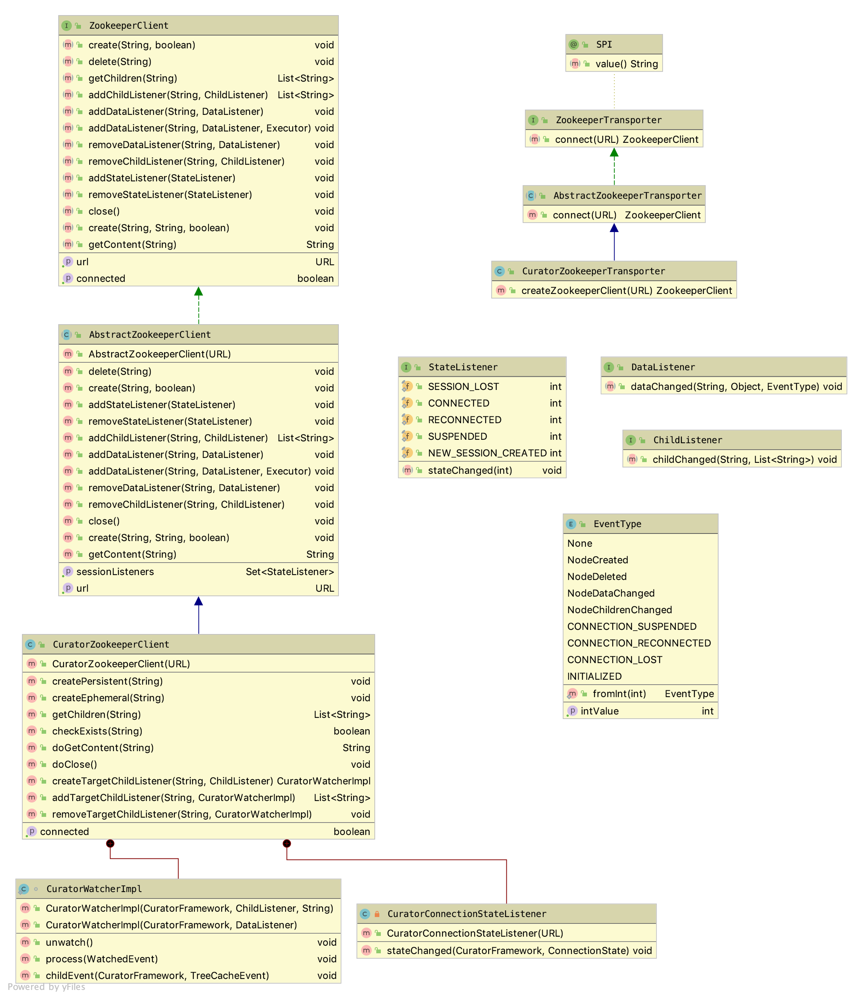

= Zookeeper与Dubbo

ZK是"一种为分布式应用所设计的高可用、高性能且一致的开源协调服务"，呈树形目录结构，因支持变更推送，且工业强度较高，是Dubbo微服务框架中首推的一种注册中心实现方案。

除了作为注册中心，ZK还被当做配置中心、元数据中心，而他们的实现都需要依赖于一个称作``dubbo-remoting-zookeeper``的ZK客户端模块。

== ZK 注册中心

=== 基本特性

ZK注册中心架构示意图如下：
[[dubbo_zk_frm]]

将上述示意图反过来看，可以发现由ZK负责管理的Dubbo节点形如一棵树或者一片森林~无根树、多个group注册到同一ZK集群上~。树的深度为4，其含义从顶向下分别如下：
====
1. *Root* 根目录，通过``<dubbo:registry group="dubbo" />``的__group__来设置ZK的根节点，缺省值是__dubbo__。

2. *Service* 服务接口全名，如``com.foo.BarService``。

3. *Type* 参与构成Dubbo服务的有4大件，他们扮演着不同的行为，可以被视为机器节点^Node^，都有着自身的URL，分别是__Provider__^服务提供者^、
__Consumer__^服务消费者^、_Route_^路由规则^、_Configuration_^覆写规则^。每一个 _Type_ 节点下对应一个列表，维护相应类型的参与URL节点。

4. *URL* 对应__Type__的__URL__。

====
[NOTE]
叶节点对应着具体的能用URL表达的Dubbo的Node节点，树的非叶节点则对应着某种分类，从根节点到叶节点以"/"拼接形成的Path唯一确定了树中的某个节点。

**Path**示例及ZG对应源码中的方法：

. ``[small]#/(dubbo | regUrl["group"])#`` toRootPath()
. ``[small]#[toRootPath()]/#`` toRootDir()
. ``[small]#toRootPath()[/(url["interface"] | url.path)]#`` toServicePath(url)
. ``[small]#toServicePath(url)/(*providers* | consumers | routes | configurations)#`` toCategoryPath(url)、toCategoriesPath(url)
. ``[small]#toCategoryPath(url)/URL.encode(url.toFullString())#`` toUrlPath(url)

[NOTE]
URL数据没有特别指明参数``url["category"]``时，会直接使用默认类别``providers``，参数值是由","号分割的字符串。

另外上述示意图还表述了如下对应组件启动时的流程：

. *Provider*: 向 ``[small]#/dubbo/com.foo.BarService/providers#`` 目录下写入自己的 URL 地址
. *Consumer*: 订阅 ``[small]#/dubbo/com.foo.BarService/providers#`` 目录下的提供者 URL 地址。并向 ``[small]#/dubbo/com.foo.BarService/consumers#`` 目录下写入自己的 URL 地址
. *Monitor*: 订阅 ``[small]#/dubbo/com.foo.BarService#`` 目录下的所有提供者和消费者 URL 地址。

支持以下功能：

. 当提供者出现断电等异常停机时，注册中心能自动删除提供者信息
. 当注册中心重启时，能自动恢复注册数据，以及订阅请求
. 当会话过期时，能自动恢复注册数据，以及订阅请求
. 当设置 ``[small]#<dubbo:registry check="false" />#`` 时，记录失败注册和订阅请求，后台定时重试
. 可通过 ``[small]#<dubbo:registry username="admin" password="1234" />#`` 设置 ZK 登录信息
. 可通过 ``[small]#<dubbo:registry group="dubbo" />#`` 设置 ZK 的根节点，不设置将使用无根树
. 支持 * 号通配符 ``[small]#<dubbo:reference group="*" version="*" />#``，可订阅服务的所有分组和所有版本的提供者

=== 具体实现

Dubbo中ZK注册中心方案由__ZookeeperRegistry__实现，代码比较简单，其继承关系为：

`ZookeeperRegistry ← FailbackRegistry() ← AbstractRegistry(Registry) ← (Node, RegistryService)`

具体如下图所示：

image::res/imgs/zk_registry.png[caption="图 2: ", title="ZookeeperRegistry代码结构图", alt="ZookeeperRegistry代码结构图", width="450", height="200"]

==== 生命周期行为

__ZookeeperRegistry__初始化时会和ZK建立连接，获得__ZookeeperClient__这个线程安全的ZK客户端调用工具，并增加对应的状态监听器，确保ZK重启发生重连行为时及时``recover()``——恢复注册数据和订阅请求；``isConnected()``用于检测当前ZG这个Node是否可用；``close()``用于关ZK连接。
[source,java]
----
public ZookeeperRegistry(URL url, ZookeeperTransporter zookeeperTransporter){
    super(url);
    ...
    zkClient.addStateListener(state -> {
        if (state == StateListener.RECONNECTED) {
            try {
                //没有开启check模式时，该行为会借助定时轮引擎反复重试
                recover();
            } catch (Exception e) {
                logger.error(e.getMessage(), e);
            }
        }
    });
}
@Override
public boolean isAvailable() {
    return zkClient.isConnected();
}

@Override
public void destroy() {
    super.destroy();
    try {
        zkClient.close();
    } catch (Exception e) {
        logger.warn("Failed to close zookeeper client " + getUrl() + ", cause: " + e.getMessage(), e);
    }
}
----
==== 查找匹配的Node
ZG并没有沿用其超类``AbstractRegistry``的lookup行为，直接覆写，由给定URL解析得到其对应的一到多个**Type**节点，汇总他们的子节点^叶节点^， 也即获得一个``List<URL>``，再根据这个list逐个与url进行匹配，最终获得所有匹配的URL节点。
[source,java]
----
@Override
public List<URL> lookup(URL url) {
    if (url == null) {
        throw new IllegalArgumentException("lookup url == null");
    }
    try {
        List<String> providers = new ArrayList<>();
        for (String path : toCategoriesPath(url)) {
            List<String> children = zkClient.getChildren(path);
            if (children != null) {
                providers.addAll(children);
            }
        }
        return toUrlsWithoutEmpty(url, providers);
    } catch (Throwable e) {
        throw new RpcException("Failed to lookup " + url + " from zookeeper " + getUrl() + ", cause: " + e.getMessage(), e);
    }
}

private List<URL> toUrlsWithoutEmpty(URL consumer, List<String> providers) {
    List<URL> urls = new ArrayList<>();
    if (CollectionUtils.isNotEmpty(providers)) {
        for (String provider : providers) {
            provider = URL.decode(provider);
            if (provider.contains(Constants.PROTOCOL_SEPARATOR)) {
                URL url = URL.valueOf(provider);
                if (UrlUtils.isMatch(consumer, url)) {
                    urls.add(url);
                }
            }
        }
    }
    return urls;
}

----

==== 注册与订阅

从``《【二】Dubbo注册中心》``可知，ZK注册中心需要实现如下几个抽象模板方法，下述将分别就他们加以阐述。
[source,java]
----
void doRegister(URL url);

void doUnregister(URL url);

void doSubscribe(URL url, NotifyListener listener);

void doUnsubscribe(URL url, NotifyListener listener);
----

===== `doRegister(URL url)`、`doUnregister(URL url)`
注册和取消注册均是在ZK中调用__ZookeeperClient__对应的方法找到合适的节点位置，在其之下创建或删除一个叶节点，实现比较简单。在创建节点时使用了``DYNAMIC_KEY``获取参数，确定创建节点是动态的还是固态的，对应ZK中的临时节点或持久节点。

[IMPORTANT]
====
[[imp_temp_node]]
zookeeper的持久节点是节点创建后，就一直存在，直到有删除操作来主动清除这个节点，不会因为创建该节点的客户端会话失效而消失。 而临时节点的生命周期和客户端会话绑定。也就是说，如果客户端会话失效，那么这个节点就会自动被清除掉。注意，这里提到的是会话失效，而非连接断开。 另外，在临时节点下面不能创建子节点。

注册中心创建节点时用的都是临时节点，目的正是利用了会话断开节点被自动移除从而引发对应节点变动事件，触发接入注册中心所有其他 Dubbo 服务节点第一时间感知已有节点已经离线，及时做相应响应处理。
====

[source,java]
----
@Override
public void doRegister(URL url) {
    try {
        zkClient.create(toUrlPath(url), url.getParameter(Constants.DYNAMIC_KEY, true));
    } catch (Throwable e) {
        throw new RpcException("Failed to register " + url + " to zookeeper " + getUrl() + ", cause: " + e.getMessage(), e);
    }
}
@Override
public void doUnregister(URL url) {
    try {
        zkClient.delete(toUrlPath(url));
    } catch (Throwable e) {
        throw new RpcException("Failed to unregister " + url + " to zookeeper " + getUrl() + ", cause: " + e.getMessage(), e);
    }
}
----

===== `doSubscribe(URL url, NotifyListener listener)`
想进一步理解其原理，我们先看看下述关于subscribe的定义：
[source,java]
----
/**
 * 订阅符合条件的已注册数据，当有注册数据变更时自动推送.
 *
 * 订阅需处理契约： 
 * 1. 当URL设置了check=false时，订阅失败后不报错，在后台定时重试。 
 * 2. 当URL设置了category=routers，只通知指定分类的数据，多个分类用逗号分隔，并允许星号通配，表示订阅所有分类数据。 
 * 3. 允许以interface,group,version,classifier作为条件查询，如：interface=com.alibaba.foo.BarService&version=1.0.0 
 * 4. 并且查询条件允许星号通配，订阅所有接口的所有分组的所有版本，或：interface=*&group=*&version=*&classifier=* 
 * 5. 当注册中心重启，网络抖动，需自动恢复订阅请求。 
 * 6. 允许URI相同但参数不同的URL并存，不能覆盖。 
 * 7. 必须阻塞订阅过程，等第一次通知完后再返回。 
 *
 * @param url 订阅条件，不允许为空，如：consumer://10.20.153.10/com.alibaba.foo.BarService?version=1.0.0&application=kylin
 * @param listener 变更事件监听器，不允许为空
 */
----
也就是说订阅的目的是为了让被关注的节点在有变化时能及时通知，能感知到被关注者的状态变化，是服务可靠性的一个重要保障。

下述<<sec_listener_hierarchy,CacheListener>>章节已经深入的阐明了这种设计模式，一对一绑定的监听接口由下往上，下一层的驱动着上一层的执行，这样会使得上下层间的关系是松耦合的，底层不用管上层的具体实现，增强了可扩展性。``ChildListener``是 ZK 客户端实现，而``NotifyListener``则是注册中心 ZK 版的实现，前者是为后者提供服务的。换言之是``ZookeeperRegistry``将框架上层调用方对其添加``NotifyListener``监听器转换成了它对 ZK 客户端添加``ChildListener``监听器，因而两个监听器是一对一的强绑定关系，一个``ChildListener``对象只从属于另一个``NotifyListener``对象。另外客户端可以就同一个URL数据所表示的注册中心节点添加多个``ChildListener``监听器，因此ZG声明了如下一个 2 级键值对的容器。

[source,java]
----

//Map中，Key的作用是索引，也即根据Key能找到对应的Value，二者建立关联的目的是在已知Key的情况下，能够找到相应的Value，以便其它业务操作
ConcurrentMap<URL, ConcurrentMap<NotifyListener, ChildListener>> zkListeners

public interface NotifyListener {

    void notify(List<URL> urls);

}

//ZK中的节点呈树形结构，除叶节点外，都拥有一到多个子节点，当子节点的数量或者数据发生变化时
//会触发该回调事件，内容分别是当前节点和子节点所在的"Path部分"
public interface ChildListener {

    void childChanged(String path, List<String> children);

}
----

[NOTE]
====
[sec_note_nest_map]
相关代码比较复杂，涉及多级嵌套Map，类似这种容器在Dubbo等中间件中经常出现，其内容填充基本套路如下：

[source,java]
----
{
    Map<Key2, Value> inerMp = mp.get(Key1_1);

    if (null == inerMp) {
        mp.putIfAbsent(Key1_1, new HashMap<>());
        innerMp = mp.get(Key1_1);
    }

    Value v1 = inerMp.get(Key1_2);

    if (null == v1) {
        inerMp.putIfAbsent(Key1_2, buildValueForV1());
        v1 = inerMp.get(Key1_2);
    }
}
----
[small]#上述假定Map<Key1,Map<Key2,Value>> mp，具体处理时已知入参Key1_1、Key2_1、Value值用buildValueForV1()得到#
====

上文中提到，有两种类型的订阅，Consumer订阅的是某一个或者多个Type节点下的URL子节点，而Monitor订阅的是特定Service下的所有URL节点，在实现上后者是通过前者达成的。代码比较长，依然拆分成更小片段加以深入剖析。

====== 监听特定``service``

对应业务代码如下，实际为方便理解可以先上将源码中的``[TAG_x:start,TAG_x:end]``部分可以挪动到 for 循环之前，也即``TAG_pos``所标识的位置，其基本步骤为：

. 先使用<<sec_note_nest_map,嵌套 map 处理>>所述方式将``NotifyListener``类型的入参``listener``映射成``ChildListener``实例``zkListener``，``zkListener``的目的是在 ZK 目录节点``parentPath``的子节点发生变化时，调用``notify(...)``将变化后的当前所剩子节点全貌``currentChilds``作为参数通过回调``listener``告诉调用方；
. 使用``toCategoriesPath(url)``取得当前客户端所订阅 ZK 目录节点下的所有子节点，也即被订阅节点下的 Type 型节点的全路径；
. 挨个遍历各 Type 节点路径 path：
.. 使用 ZK 客户端 zkClient 在 ZK 注册中心创建一个非临时节点，随即将``zkListener``监听器添加到该节点上，此后所有该 Type 节点下的子节点发生变化，当前客户端都会通过``listener``回调感知到；
.. 将上一步给 path 所在节点添加监听器时返回的所有叶节点数据经``toUrlsWithEmpty(...)``过滤处理后转换获得的 URL 数据列表收集到``urls``容器中；
. 调用``notify(...)``方法，将订阅的所有叶节点数据``urls``通过回调``listener``监听器通知调用方，这样做的目的是客户端在提交订阅请求后就能立马可以异步获得所有感兴趣的页节点数据，比如客户端在引用服务后的一瞬间，便开始拥有完备的分布式网络服务信息，从而对目标微服务发起调用；

[source,java]
----
public void doSubscribe(final URL url, final NotifyListener listener) {
    ...
    List<URL> urls = new ArrayList<>();
    //TAG_pos
    //获取URL匹配的所有Type（providers|consumers|routes|configurations中一种）
    for (String path : toCategoriesPath(url)) {
        //TAG_x:start
        ConcurrentMap<NotifyListener, ChildListener> listeners = zkListeners.get(url);
        if (listeners == null) {
            zkListeners.putIfAbsent(url, new ConcurrentHashMap<>());
            listeners = zkListeners.get(url);
        }
        ChildListener zkListener = listeners.get(listener);
        if (zkListener == null) {
            //Type节点下若有新的节点加入，则调用notify回调NotifyListener
            listeners.putIfAbsent(listener,
                    (parentPath, currentChilds) ->
                            ZookeeperRegistry.this.notify(url, listener,
                                toUrlsWithEmpty(url, parentPath, currentChilds))
            );
            zkListener = listeners.get(listener);
        }
        //TAG_x:end
        zkClient.create(path, false);
        List<String> children = zkClient.addChildListener(path, zkListener);
        if (children != null) {
            urls.addAll(toUrlsWithEmpty(url, path, children));
        }
    }

    notify(url, listener, urls);
    ...
}
----

源码中多处调用的``toUrlsWithEmpty(...)``如下，其目的是当 ZK 客户端回调框架上层的``NotifyListener``监听器时，对注册中心返回的 Type 类节点下的所有子节点做进一步过滤处理，这个复杂的过滤业务逻辑是没法由注册中心本身完成的。我们都清楚尽管一个微服务的所有实例只会注册到和``toServicePath(url)``对应的节点上，但是客户端订阅可以指明更加细致的范围，可以指定``category、enabled、group、version、classifier``这几个中的一到多个参数做范围筛选。

另外Dubbo的 ZK 客户端将一个微服务的实例注册到注册中心时，表示这个实例的节点是一个URL数据的字符串完整表示的叶节点，因此在检查匹配情况时所调用的``isMatch(consumer,url)~<<【二】Dubbo注册中心.adoc#sec_url_isMatch,详见isMatch方法>>~``需要先将字符串转换为URL实例。

然而，很有可能经过当前客户端指定参数过滤后，压根没有匹配到任何叶节点，这时``ZookeeperRegistry``应该明确告知其调用方——返回只有一个设``url.protocol = "empty"``的URL实例的列表，<<./【十六】Dubbo集群 之 目录服务.adoc#sec_invoker_referesh,《Dubbo集群 之 目录服务》一文的服务引用实例刷新流程>>中就有关于利用这一机制的说明，即针对目标微服务的服务发现功能被停用。

[source,java]
----
private List<URL> toUrlsWithEmpty(URL consumer, String path, List<String> providers) {
    List<URL> urls = toUrlsWithoutEmpty(consumer, providers);
    if (urls == null || urls.isEmpty()) {
        int i = path.lastIndexOf(PATH_SEPARATOR);
        String category = i < 0 ? path : path.substring(i + 1);
        //使用入参consumer衍生一个新的URL实例，url.protocol = "empty"，url["category"] = {category}
        URL empty = URLBuilder.from(consumer)
                .setProtocol(EMPTY_PROTOCOL)
                .addParameter(CATEGORY_KEY, category)
                .build();
        urls.add(empty);
    }
    return urls;
}
private List<URL> toUrlsWithoutEmpty(URL consumer, List<String> providers) {
    List<URL> urls = new ArrayList<>();
    if (CollectionUtils.isNotEmpty(providers)) {
        for (String provider : providers) {
            provider = URL.decode(provider);
            if (provider.contains(PROTOCOL_SEPARATOR)) {
                URL url = URL.valueOf(provider);
                if (UrlUtils.isMatch(consumer, url)) {
                    urls.add(url);
                }
            }
        }
    }
    return urls;
}
----

====== 监听所有``service``

有了上一小章节的源码剖析，再来理解本章节中的相关源码就容易很多了。

如果当前客户端指定需要监听任意的 service，也即``url["interface"] = "*"``，实际上具体实现上是针对``toRootPath()~root~``节点下的所有 service 都添加上同一个``NotifyListener``监听器``listener``，这是通过``subscribe(...)``递归调用完成的，也即。

如下具体源码，针对``root``节点添加的``ChildListener``监听器中，其源码的 for 循环的意思是如果一个子节点在``anyServices``容器中不曾出现过，比如新上线了一个微服务，则就该 service 启用订阅操作。

同样，为``root``节点增加监听器的过程中会返回其所有的子节点，此时为这些子节点增加监听器的时机最恰当，前面基于事件回调的``subscribe(...)``只有在有新的 service 节点加入或者被删除一个 service 节点时才会被执行，再者因为它是异步的，这样势必造成延迟。

[source,java]
----
//用于确保不针对同一个节点经由subscribe迭代doSubscribe操作
private final Set<String> anyServices = new ConcurrentHashSet<>();

@Override
public void doSubscribe(final URL url, final NotifyListener listener) {
    ...
    String root = toRootPath();
    ConcurrentMap<NotifyListener, ChildListener> listeners = zkListeners.get(url);
    if (listeners == null) {
        zkListeners.putIfAbsent(url, new ConcurrentHashMap<>());
        listeners = zkListeners.get(url);
    }
    ChildListener zkListener = listeners.get(listener);
    if (zkListener == null) {
        //监听Root之下的Service节点们
        listeners.putIfAbsent(listener, (parentPath, currentChilds) -> {
            for (String child : currentChilds) {
                child = URL.decode(child);
                //防止重复执行doSubscribe操作
                if (!anyServices.contains(child)) {
                    anyServices.add(child);
                    //设置ServiceInterface参数，递归doSubscribe操作，转入下一个主分支
                    subscribe(url.setPath(child).addParameters(Constants.INTERFACE_KEY, child,
                            Constants.CHECK_KEY, String.valueOf(false)), listener);
                }
            }
        });
        zkListener = listeners.get(listener);
    }
    //创建Root根节点，据具体实现，在对应节点存在时则直接略过
    zkClient.create(root, false);
    //将新增加的ChildListener加入到ZK中，以监听节点变化，增加监听器时会返回现存的子节点们（若在树中存在对应Path的节点）
    List<String> services = zkClient.addChildListener(root, zkListener);
    if (CollectionUtils.isNotEmpty(services)) {
        for (String service : services) {
            service = URL.decode(service);
            anyServices.add(service);
            subscribe(url.setPath(service).addParameters(Constants.INTERFACE_KEY, service,
                    Constants.CHECK_KEY, String.valueOf(false)), listener);
        }
    }
    ...
}
----

[NOTE]
====
监听所有 ``service`` 节点，会由客户端传入的 url，为每一个 ``service`` 节点衍生一份对应的URL数据，由设``url.path = {service}、url["interface"] = {service}、url["check"] = false``得到，如下：
[source,java]
----
url.setPath(service).addParameters(
    Constants.INTERFACE_KEY, service,
    Constants.CHECK_KEY, String.valueOf(false)
);
----
====

====== 总体流程

``doSubscribe(...)``方法的总体轮廓如下，不难发现``①``处的代码块最终会递归调用``②``处的代码块。

[source,java]
----
public void doSubscribe(final URL url, final NotifyListener listener) {
    try {
        if (ANY_VALUE.equals(url.getServiceInterface())) {
            ...//①：监听所有``service``
        } else {
            ...//②：监听特定``service``
        }
    } catch (Throwable e) {
        throw new RpcException("Failed to subscribe " + url
            + " to zookeeper " + getUrl() + ", cause: " + e.getMessage(), e);
    }
}
----

汇总所有信息，总体而言就是：

. 当Consumer调用``subscribe()``执行订阅操作时，Dubbo会从URL参数判别出调用端所关注Service和Type类型，由其定位到Type这一级别的节点， 然后增加ZK子节点监听器——ChildListener，确保相关的URL节点在加入或者撤出ZK注册中心时，能够及时回调NotifyListener告知订阅者^Consumer^节点状态变化。

. Root节点上子节点的变化意味着有相应的Service加入或撤出，于Monitor这种需要监听全部节点变化的订阅者，会直接在Root节点上创建一个``ChildListener ``监听器，于每一个新加入的Service节点，Dubbo会为其产生URL~``doSubscribe(...)``的参数~的一个副本，指定其为``INTERFACE_KEY``的值，通过``subscribe(...)``调用 递归调用``doSubscribe(...)``，切换到和Consumer调用``subscribe(...)``一样的订阅操作。[small]#值得注意是，默认情况下只会订阅``Type = Provider``类型的 URL节点，除非在url中设置了``url["category"]``这个参数。#

[IMPORTANT]
====
源码中多次调用了``zkClient.create(somePath, false)``，这个``create``操作只是为了确保 ZK 注册中心中存在对应 path，也即如果其它接入到 ZK 的微服务实例不曾创建对应 path 时，当前客户端便新创建该 path，否则相当于啥也没干。

另外随后调用的``addChildListener(...)``在执行完监听器添加的过程后会返回对应节点上的所有子节点，相当于主动执行了一次数据的拉取处理，而变化的子节点部分则通过结合类如Set、Map这样的能够用于排重的缓存集合在回调事件中获知。
====

===== ``doUnsubscribe(URL url, NotifyListener listener)``

实际上就是将``doSubscribe(...)``方法添加的监听器给移除掉，总体而言比较简单，如下述源码所示：

[source,java]
----
//该方法比较简单，实际上就是根据unsubscribe操作，能够找到对应的ZK节点，移除其对应的ChildListener监听器
@Override
public void doUnsubscribe(URL url, NotifyListener listener) {
    ConcurrentMap<NotifyListener, ChildListener> listeners = zkListeners.get(url);
    if (listeners != null) {
        ChildListener zkListener = listeners.get(listener);
        if (zkListener != null) {
            if (Constants.ANY_VALUE.equals(url.getServiceInterface())) {
                String root = toRootPath();
                zkClient.removeChildListener(root, zkListener);
            } else {
                for (String path : toCategoriesPath(url)) {
                    zkClient.removeChildListener(path, zkListener);
                }
            }
        }
    }
}
----

[NOTE]
====
``toCategoryPath(url)``会获取到形如``/dubbo/com.foo.BarService/providers``的Path，调用``ZookeeperClient.create()``后，ZK会在树中创建对应的分支，如：`dubbo ← com.foo.BarService ← providers`。
====

[[sec_zk_client]]
== ZK 客户端

文初已提及，Zookeeper作为分布式应用中的协调服务服务，可以用作实现Dubbo的注册中心、配置中心、元数据中心。然而就如文章开头部分<<dubbo_zk_frm,Dubbo注册中心Zookeeper示意图>>所展示的那样，ZK只是负责了数据在树形结构中的存取，以其几点发生变化的通知处理而已，依赖于其他的功能实现都是在客户端实现的，也就是说行为和数据是分离的，就如同单相思一般，对方在远端亭亭玉立，屌丝在此岸尽情意淫。

因此Dubbo要利用ZK实现特定功能的话，需要抽离一个接口层，用于桥接远端的ZK服务和本地上层应用的调用，也即兼顾同远端ZK的通讯和为上面应用层提供访问入口，根据Dubbo的基于领域驱动的设计特点，前者被称为``Transporter``，后者被叫做``Client``。对应源码中的实现，有两个最关键的接口``ZookeeperTransporter``和``ZookeeperClient``。

[[img_clz_zk_rm]]

如上类图所示，右上角部分的``ZookeeperTransporter``只定义了一个方法，目的是和ZK服务端建立连接，在此基础上再创建``ZookeeperClient``实例供上层访问，而两个接口最终都是依赖于``apache-curator``这个库~ZK客户端的社区实现~来实现的。

=== ZookeeperTransporter

该接口被声明为了一个扩展点，意即开发者可以做自定义实现，其定义如下，Dubbo会为其生成一个代理类，最终的调用会被委托与``url.getParameter("client", url.getParameter("transporter", "curator"))``所指定名称的对应扩展具类的实例上，如果配置项能取到值，``"client"``和``"transporter"``中则优先使用前者，二者没有的情况下使用默认值``"curator"``。

[source,java]
----
@SPI("curator")
public interface ZookeeperTransporter {

    @Adaptive({Constants.CLIENT_KEY, Constants.TRANSPORTER_KEY})
    ZookeeperClient connect(URL url);

}
----

==== AbstractZookeeperTransporter & CuratorZookeeperTransporter

如下所示，ZK客户端模块中的``Transporter``的实现，只是简单的指定其``createZookeeperClient(url)``方法返回一个``CuratorZookeeperClient``类型的``ZookeeperClient``对象，也就是说Dubbo实际上是将``AbstractZookeeperTransporter``当做了抽象工厂，而``CuratorZookeeperTransporter``是其工厂实现。
[source,java]
----
public class CuratorZookeeperTransporter extends AbstractZookeeperTransporter {
    @Override
    public ZookeeperClient createZookeeperClient(URL url) {
        return new CuratorZookeeperClient(url);
    }
}
----

上述已经论述过ZK客户端模块中为啥有``Transporter``的存在，然而实现上是与之相悖的，只是简单当做了创建工厂，作为缓存用于存取``ZookeeperClient``对象，因为后者同时实现访问远端和为上层提供客户端访问入口。

在配置注册中心时，Dubbo允许为其设置冷备，也即当一个ZK服务实例变得不可用时，切换到另外一个ZK服务实例，利用冗余增强系统的可用性，如``"zookeeper://127.0.0.1:22379/org.apache.dubbo.registry.RegistryService?backup=127.0.0.1:2379,127.0.0.1:32379"``，这例子中同一份``ZookeeperClient``对象会享有3套地址，分别是 `127.0.0.1:22379`、`127.0.0.1:2379`、`127.0.0.1:32379`。同一时刻这几套地址指向同一个可用的ZK服务实例，如果该实例不可用会切换到另外一个实例。

[source,java]
----

private final Map<String, ZookeeperClient> zookeeperClientMap = new ConcurrentHashMap<>();

List<String> getURLBackupAddress(URL url) {
    List<String> addressList = new ArrayList<String>();
    addressList.add(url.getAddress());

    addressList.addAll(url.getParameter(RemotingConstants.BACKUP_KEY, Collections.EMPTY_LIST));
    return addressList;
}

void writeToClientMap(List<String> addressList, ZookeeperClient zookeeperClient) {
    for (String address : addressList) {
        zookeeperClientMap.put(address, zookeeperClient);
    }
}
----

``fetchAndUpdateZookeeperClientCache(addressList)``方法总是返回第一个可用的实例（~在当前客户端由获取到的实例状态~），并将``addressList``列表中的所有注册中心的IP地址均映射到该实例上，也就是说在可用为前提的条件下始终按位置优先取实例。而如果没有取用到一个可用的实例，则返回``null``。

一般而言表征注册中心的URL数据中，其``host``代表是主机，在列表的首位，而backup参数中都顺序放在列表的后面。

[source,java]
----
ZookeeperClient fetchAndUpdateZookeeperClientCache(List<String> addressList) {

    ZookeeperClient zookeeperClient = null;
    for (String address : addressList) {
        if ((zookeeperClient = zookeeperClientMap.get(address)) != null && zookeeperClient.isConnected()) {
            break;
        }
    }
    if (zookeeperClient != null && zookeeperClient.isConnected()) {
        writeToClientMap(addressList, zookeeperClient);
    }
    return zookeeperClient;
}
----

[[zkclient_create]]
在给定注册中心的URL数据，使用``connect(url)``方法获取``ZookeeperClient``实例时，会首先尝试先从本机缓存中获取，如果缓存中没有可用实例，则会在双检锁机制保证线程安全的情况下再调用``createZookeeperClient(url)``建立连接，随后把该连接对应的实例映射给所有主备注册中心的IP地址。

[source,java]
----
public abstract class AbstractZookeeperTransporter implements ZookeeperTransporter {

    @Override
    public ZookeeperClient connect(URL url) {
        ZookeeperClient zookeeperClient;
        List<String> addressList = getURLBackupAddress(url);
        if ((zookeeperClient = fetchAndUpdateZookeeperClientCache(addressList)) != null && zookeeperClient.isConnected()) {
            logger.info("find valid zookeeper client from the cache for address: " + url);
            return zookeeperClient;
        }
        synchronized (zookeeperClientMap) {
            if ((zookeeperClient = fetchAndUpdateZookeeperClientCache(addressList)) != null && zookeeperClient.isConnected()) {
                logger.info("find valid zookeeper client from the cache for address: " + url);
                return zookeeperClient;
            }

            zookeeperClient = createZookeeperClient(url);
            logger.info("No valid zookeeper client found from cache, therefore create a new client for url. " + url);
            writeToClientMap(addressList, zookeeperClient);
        }
        return zookeeperClient;
    }

    protected abstract ZookeeperClient createZookeeperClient(URL url);

}
----

=== ZookeeperClient

本章节的类图已经显示，``ZookeeperClient``定义了大量的方法，均用于和ZK打交道。ZK中的节点以层式树形组织，其节点的路径标识方式和 Unix 文件系统类似，使用斜杆加以分割，客户端可以将其当做一个目录系统看待，可以：① 增删节点；② 针对节点存取数据；③ 获取子节点；④ 增删数据、增删子节点的事件监听器的增删处理；⑤ 增删用于同步ZK实例的状态的监听器；⑥ ZK实例基本状态管理。

[source,java]
----
public interface ZookeeperClient {
//①
    void create(String path, boolean ephemeral);

    void delete(String path);

//②
    void create(String path, String content, boolean ephemeral);

    String getContent(String path);

//③
    List<String> getChildren(String path);

//④
    List<String> addChildListener(String path, ChildListener listener);

    /**
     * @param path:    directory. All of child of path will be listened.
     * @param listener
     */
    void addDataListener(String path, DataListener listener);

    /**
     * @param path:    directory. All of child of path will be listened.
     * @param listener
     * @param executor another thread
     */
    void addDataListener(String path, DataListener listener, Executor executor);

    void removeDataListener(String path, DataListener listener);

    void removeChildListener(String path, ChildListener listener);

//⑤
    void addStateListener(StateListener listener);

    void removeStateListener(StateListener listener);

//⑥
    boolean isConnected();

    void close();

    URL getUrl();
}

----

==== AbstractZookeeperClient & CuratorZookeeperClient

Dubbo在实现 ZK 客户端的时候，刻意设计成可扩展的。针对``ZookeeperClient``的实现也是这样，使用模板设计模式把一些不需要和远端 ZK 服务实例交互的逻辑沉淀到基类``AbstractZookeeperClient``中。

[[sec_czc_instantialize]]
===== ``CuratorZookeeperClient``实例化

<<zkclient_create,``ZookeeperClient``实例的创建>>总是发生在当前客户端检查到没有可用实例时，根据``CuratorZookeeperTransporter``的源码实现，实例创建既是建立连接的过程，而这是其它一切和远端ZK发生通讯行为的前提，因此接下来我们先首先看看基于``Curator``客户端工具的``CuratorZookeeperClient``实例化过程。

如下述源码所示，``CuratorZookeeperClient``实际上是将行为委托给了``CuratorFramework``这个由``Curator``提供的API接口：

. 建立连接之前需要为这个API准备如下环境参数：
* 连接超时，单位毫秒，`url["timeout"]`，默认 5s；
* 会话超时，单位毫秒，`url["zk.session.expire"]`，默认 1m；
* 重试策略，1次，间隔时间 1s；
* 连接字符串，`url[host] + ":" + url[port] + ["," + url[backup]]`；
* 认证口令，`[url.username] + ":" + [url.password]`；
. 准备好参数后，调用``CuratorFrameworkFactory.Builder``的``build()``方法获得``CuratorFramework``实例``client``；
. 为``client``增加服务实例的状态监听器；
. 为``client``调用其``start()``方法，正式启用该对象；
. 为``client``调用其``blockUntilConnected(timeout, TimeUnit.MILLISECONDS)``方法完成最后的连接建立操作；
. 连接建立失败或者超时都会抛出异常处理。

[source,java]
----
public class CuratorZookeeperClient extends AbstractZookeeperClient
        <CuratorZookeeperClient.CuratorWatcherImpl, CuratorZookeeperClient.CuratorWatcherImpl> {

    private static final String ZK_SESSION_EXPIRE_KEY = "zk.session.expire";

    private final CuratorFramework client;

    public CuratorZookeeperClient(URL url) {
        super(url);
        try {
            int timeout = url.getParameter(TIMEOUT_KEY, DEFAULT_CONNECTION_TIMEOUT_MS);
            int sessionExpireMs = url.getParameter(ZK_SESSION_EXPIRE_KEY, DEFAULT_SESSION_TIMEOUT_MS);
            CuratorFrameworkFactory.Builder builder = CuratorFrameworkFactory.builder()
                    .connectString(url.getBackupAddress())
                    .retryPolicy(new RetryNTimes(1, 1000))
                    .connectionTimeoutMs(timeout)
                    .sessionTimeoutMs(sessionExpireMs);

            String authority = url.getAuthority();
            if (authority != null && authority.length() > 0) {
                builder = builder.authorization("digest", authority.getBytes());
            }
            client = builder.build();
            client.getConnectionStateListenable().addListener(
                new CuratorConnectionStateListener(url));
            client.start();
            boolean connected = client.blockUntilConnected(timeout, TimeUnit.MILLISECONDS);
            if (!connected) {
                throw new IllegalStateException("zookeeper not connected");
            }
        } catch (Exception e) {
            throw new IllegalStateException(e.getMessage(), e);
        }
    }
    ...
}
----

源码中关于状态监听的实现将在下述相关章节中剖析。

[[sec_node_addOrDel]]
===== 增删节点

ZK中的节点增删需要有完整的从根节点到叶节点的 path 路径，为避免不必要的网络I/O，``AbstractZookeeperClient``针对需要持久化的节点，会在其创建过程中使用``ConcurrentHashSet``容器记录起来。基于该 Set 容器的节点创建持久节点的过程如下：

. 点创建前先检查容器中是否存在，存在直接返回；
. 不存在的话会先调用``checkExists(path)``方法检验远端ZK服务实例中是否含有该节点：
* 含有则加入容器，并直接返回；
* 不含有，转入下一步；
. 使用 path 创建节点，随后将其加入到容器中；

这个过程中的第 3 步骤之前实际还隐藏了另外一个步骤，就是创建过程中会以递归的方式先创建最后一个``"/"``之前的 path 部分，实现代码相当简洁。

[source,java]
----
public abstract class AbstractZookeeperClient<TargetDataListener, TargetChildListener>
        implements ZookeeperClient {

    private final Set<String>  persistentExistNodePath = new ConcurrentHashSet<>();

        @Override
    public void delete(String path){
        //never mind if ephemeral
        persistentExistNodePath.remove(path);
        deletePath(path);
    }

    @Override
    public void create(String path, boolean ephemeral) {
        if (!ephemeral) {
            if(persistentExistNodePath.contains(path)){
                return;
            }
            if (checkExists(path)) {
                persistentExistNodePath.add(path);
                return;
            }
        }
        int i = path.lastIndexOf('/');
        if (i > 0) {
            create(path.substring(0, i), false);
        }
        if (ephemeral) {
            createEphemeral(path);
        } else {
            createPersistent(path);
            persistentExistNodePath.add(path);
        }
    }

    protected abstract void deletePath(String path);

    protected abstract void createPersistent(String path);

    protected abstract void createEphemeral(String path);

    protected abstract boolean checkExists(String path);

    ...
}
----

流程中刻意抹去了<<imp_temp_node,临时节点>>相关的处理，和持久型节点创建过程不同的时，临时节点的创建只关注整个 ``path``，因为它不需要记录在``persistentExistNodePath``容器中。

流程用到的几个和 ZK 服务打交道，用于操作数据节点的方法，都被声明为抽象的，留在子类实现，如下，可见 `Curator` 使用的流逝编程风格中，大体是先指定 action 行为，再定义该行为发生在哪条 path 路径上，代码十分干净简洁。

[source,java]
----
public class CuratorZookeeperClient extends AbstractZookeeperClient
        <CuratorZookeeperClient.CuratorWatcherImpl, CuratorZookeeperClient.CuratorWatcherImpl> {

    @Override
    protected void deletePath(String path) {
        try {
            client.delete().forPath(path);
        } catch (NoNodeException e) {
        } catch (Exception e) {
            throw new IllegalStateException(e.getMessage(), e);
        }
    }
    @Override
    public void createPersistent(String path) {
        try {
            client.create().forPath(path);
        } catch (NodeExistsException e) {
            logger.warn("ZNode " + path + " already exists.", e);
        } catch (Exception e) {
            throw new IllegalStateException(e.getMessage(), e);
        }
    }

    @Override
    public void createEphemeral(String path) {
        try {
            client.create().withMode(CreateMode.EPHEMERAL).forPath(path);
        } catch (NodeExistsException e) {
            logger.warn("ZNode " + path + " already exists, since we will" +
                    " only try to recreate a node on a session expiration" +
                    ", this duplication might be caused by a delete delay" +
                    " from the zk server, which means the old expired session" +
                    " may still holds this ZNode and the server just hasn't" +
                    " got time to do the deletion. In this case, " +
                    "we can just try to delete and create again.", e);
            deletePath(path);
            createEphemeral(path);
        } catch (Exception e) {
            throw new IllegalStateException(e.getMessage(), e);
        }
    }

    @Override
    public boolean checkExists(String path) {
        try {
            if (client.checkExists().forPath(path) != null) {
                return true;
            }
        } catch (Exception e) {
        }
        return false;
    }
    ...
}
----

``createEphemeral(path)``逻辑中，若 catch 到异常，会先将对应 path 先删除，再调用一次该方法，其原因在日志逻辑中有体现。

===== 节点数据存取

从附带数据的节点做数据的存取操作，其基本流程和上述<<sec_node_addOrDel,增删节点>>没有太大差别，很容易理解，所有代码如下。数据存取前都会先判断对应 path 的节点是否存在，存入时，如果 path 存在则先删除叶节点内容，再创建该节点，附入数据。

[source,java]
----
public abstract class AbstractZookeeperClient<TargetDataListener, TargetChildListener>
        implements ZookeeperClient {
    @Override
    public void create(String path, String content, boolean ephemeral) {
        if (checkExists(path)) {
            delete(path);
        }
        int i = path.lastIndexOf('/');
        if (i > 0) {
            create(path.substring(0, i), false);
        }
        if (ephemeral) {
            createEphemeral(path, content);
        } else {
            createPersistent(path, content);
        }
    }

    @Override
    public String getContent(String path) {
        if (!checkExists(path)) {
            return null;
        }
        return doGetContent(path);
    }

    protected abstract void createPersistent(String path, String data);

    protected abstract void createEphemeral(String path, String data);

    protected abstract String doGetContent(String path);
    ...
}
----

``create(path, content, ephemeral)``方法在 catch 到``NodeExistsException``异常时，表示 path 对应节点存在，则直接设入数据，这表明了父类中的``createPersistent(path, data)``方法不必执行首个 `if` 语句块，但这从最大程度兼容各种 ZK 客户端的实现这一角度讲，这又是很合理的。

[source,java]
----
public class CuratorZookeeperClient extends AbstractZookeeperClient
        <CuratorZookeeperClient.CuratorWatcherImpl, CuratorZookeeperClient.CuratorWatcherImpl> {

    static final Charset CHARSET = Charset.forName("UTF-8");

    @Override
    protected void createPersistent(String path, String data) {
        byte[] dataBytes = data.getBytes(CHARSET);
        try {
            client.create().forPath(path, dataBytes);
        } catch (NodeExistsException e) {
            try {
                client.setData().forPath(path, dataBytes);
            } catch (Exception e1) {
                throw new IllegalStateException(e.getMessage(), e1);
            }
        } catch (Exception e) {
            throw new IllegalStateException(e.getMessage(), e);
        }
    }

    @Override
    protected void createEphemeral(String path, String data) {
        byte[] dataBytes = data.getBytes(CHARSET);
        try {
            client.create().withMode(CreateMode.EPHEMERAL).forPath(path, dataBytes);
        } catch (NodeExistsException e) {
            logger.warn("ZNode " + path + " already exists, since we will" +
                    " only try to recreate a node on a session expiration" +
                    ", this duplication might be caused by a delete delay" +
                    " from the zk server, which means the old expired session" +
                    " may still holds this ZNode and the server just hasn't" +
                    " got time to do the deletion. In this case, " +
                    "we can just try to delete and create again.", e);
            deletePath(path);
            createEphemeral(path, data);
        } catch (Exception e) {
            throw new IllegalStateException(e.getMessage(), e);
        }
    }

    @Override
    public String doGetContent(String path) {
        try {
            byte[] dataBytes = client.getData().forPath(path);
            return (dataBytes == null || dataBytes.length == 0) ? null : new String(dataBytes, CHARSET);
        } catch (NoNodeException e) {
            // ignore NoNode Exception.
        } catch (Exception e) {
            throw new IllegalStateException(e.getMessage(), e);
        }
        return null;
    }

    ...
}
----

===== 子节点获取

``getChildren(path)``是除``isConnected()``方法以外的唯一在子类中直接实现接口方法，实现也很简单。
[source,java]
----
public List<String> getChildren(String path) {
    try {
        return client.getChildren().forPath(path);
    } catch (NoNodeException e) {
        return null;
    } catch (Exception e) {
        throw new IllegalStateException(e.getMessage(), e);
    }
}
----

===== 节点变动监听

超类``AbstractZookeeperClient``声明了两个泛型参数``<TargetDataListener, TargetChildListener>``，分别是用于监听节点数据和子节点变化情况的监听器。<<img_clz_zk_rm,ZK客户端类图>>的右边部分中显示，声明了分别用于监听ZK客户端状态~StateListener~、节点数据~DataListener~、子节点~ChildListener~变化的 3 个监听器，为啥这里还要使用泛型了？

Dubbo是做RPC框架向外提供服务的，不仅需要考虑可扩展型，还得隔离掉它所依赖的第三方组件模块，避免应用代码、Dubbo、第三方组件 3 者耦合在一起。尽管Dubbo中实现 ZK 客户端只使用了 `Curator`，但并不意味着它不会直接使用 ZK 本身或者其他第三方提供的客户端工具，这就需要最大程度的考虑通用性；另外，无论使用什么工具在Dubbo中实现 ZK 客户端，ZK 服务实例的变化都是推送到本地，而非主动拉取，也就是说基于响应的监听模式是必定要采用的，而监听器都是第三方提供的，直接向框架上层暴露这种设计师很糟糕的，不仅失去灵活性，还使得扩展实现变得困难，代码变得复杂而难以管理。

这样，另一个问题又来了，监听器逻辑是一种被动调用行为，并不是调用方自己触发的，那处于上层 ZK 客户端定义的 3 个监听器是谁触发执行的呢？

不难看出，第三方 ZK 客户端的监听器和本地的监听器是一一对应的，前者是由``ZookeeperClient``实现使用其提供的接口注入的，而``ZookeeperClient``对后者能执行更多的控制，因此可以在前者的回调逻辑中调用后者。进一步说，``TargetDataListener``和``TargetChildListener``是面向``ZookeeperClient``实现的，其实现由Dubbo的 ZK 客户端提供，实现逻辑被固化下来了，而``StateListener``、``DataListener``、``ChildListener``则是面向``ZookeeperClient``的使用方的。

啰嗦了这么多后，就不难理解``AbstractZookeeperClient``声明了如下述的两个两级``Map``容器了（~``DataListener``和``ChildListener``监听具体节点的变化而非整个ZK客户端~）：

[source,java]
----
private final ConcurrentMap<String, ConcurrentMap<ChildListener, TargetChildListener>>
    childListeners = new ConcurrentHashMap<>();

private final ConcurrentMap<String, ConcurrentMap<DataListener, TargetDataListener>>
    listeners = new ConcurrentHashMap<>();
----

如下述父类源码实现，每次增删监听器都得深入到``Map``容器第二级，调用方增加一个``ChildListener``或``DataListener``监听器，父类会调用其扩张实现类的方法创建``TargetChildListener``或``TargetDataListener``监听器。代码中将创建和增加当做两个不同的行为，原因是如果容器中若存在对应的监听器则可重用，无需再创建，只需在节点上加入该监听器就可。

[source,java]
----
public abstract class AbstractZookeeperClient<TargetDataListener, TargetChildListener>
        implements ZookeeperClient {

        @Override
    public List<String> addChildListener(String path, final ChildListener listener) {
        ConcurrentMap<ChildListener, TargetChildListener> listeners = childListeners.get(path);
        if (listeners == null) {
            childListeners.putIfAbsent(path, new ConcurrentHashMap<ChildListener, TargetChildListener>());
            listeners = childListeners.get(path);
        }
        TargetChildListener targetListener = listeners.get(listener);
        if (targetListener == null) {
            listeners.putIfAbsent(listener, createTargetChildListener(path, listener));
            targetListener = listeners.get(listener);
        }
        return addTargetChildListener(path, targetListener);
    }

    @Override
    public void addDataListener(String path, DataListener listener) {
        this.addDataListener(path, listener, null);
    }

    @Override
    public void addDataListener(String path, DataListener listener, Executor executor) {
        ConcurrentMap<DataListener, TargetDataListener> dataListenerMap = listeners.get(path);
        if (dataListenerMap == null) {
            listeners.putIfAbsent(path, new ConcurrentHashMap<DataListener, TargetDataListener>());
            dataListenerMap = listeners.get(path);
        }
        TargetDataListener targetListener = dataListenerMap.get(listener);
        if (targetListener == null) {
            dataListenerMap.putIfAbsent(listener, createTargetDataListener(path, listener));
            targetListener = dataListenerMap.get(listener);
        }
        addTargetDataListener(path, targetListener, executor);
    }

    @Override
    public void removeDataListener(String path, DataListener listener ){
        ConcurrentMap<DataListener, TargetDataListener> dataListenerMap = listeners.get(path);
        if (dataListenerMap != null) {
            TargetDataListener targetListener = dataListenerMap.remove(listener);
            if(targetListener != null){
                removeTargetDataListener(path, targetListener);
            }
        }
    }

    @Override
    public void removeChildListener(String path, ChildListener listener) {
        ConcurrentMap<ChildListener, TargetChildListener> listeners = childListeners.get(path);
        if (listeners != null) {
            TargetChildListener targetListener = listeners.remove(listener);
            if (targetListener != null) {
                removeTargetChildListener(path, targetListener);
            }
        }
    }

    protected abstract TargetChildListener createTargetChildListener(String path, ChildListener listener);

    protected abstract List<String> addTargetChildListener(String path, TargetChildListener listener);

    protected abstract TargetDataListener createTargetDataListener(String path, DataListener listener);

    protected abstract void addTargetDataListener(String path, TargetDataListener listener);

    protected abstract void addTargetDataListener(String path, TargetDataListener listener, Executor executor);

    protected abstract void removeTargetDataListener(String path, TargetDataListener listener);

    protected abstract void removeTargetChildListener(String path, TargetChildListener listener);
    ...
}
----

源码的最后还有多达 7 个带子类实现的抽象方法，着实令人晕懵。到子类看其实现，有关于子节点的监听器的增删处理相对简单很多。

实现中关于``Curator``中的``TreeCache``不能直白的理解，可以翻看link:https://www.throwable.club/2018/12/16/zookeeper-curator-usage[Zookeeper客户端Curator使用详解]一文先了解。
____
Zookeeper原生支持通过注册Watcher来进行事件监听，但是开发者需要反复注册(Watcher只能单次注册单次使用)。Cache是Curator中对事件监听的包装，可以看作是对事件监听的本地缓存视图，能够自动为开发者处理反复注册监听。

Path Cache用来监控一个ZNode的子节点。当一个子节点增加、更新、删除时，Path Cache会改变它的状态，会包含最新的子节点，子节点的数据和状态。

Node Cache与Path Cache类似，Node Cache只是监听某一个特定的节点。

Tree Cache可以监控整个子树上的所有节点，类似于PathCache和NodeCache的组合。

[IMPORTANT]
====
.[big]#连接掉线处理#

当连接掉线时，TreeCache将继续保持它在失去连接之前的状态，在连接恢复后，TreeCache将为所有在断开连接期间发生的添加、删除和更新发出正常的子事件。

[[imp_sec_initialized]]
.[big]#初始化时的同步处理~INITIALIZED~#

在启动时，缓存与服务器同步其内部状态，在发现新节点时发布一系列NODE_ADDED事件。一旦缓存被完全同步，INITIALIZED事件就会被发布。此事件之后发布的所有事件都表示实际的服务器端变化。

在重新连接时，缓存将重新将其内部状态与服务器同步，并在其内部状态完全刷新后再次触发INITIALIZED事件。

注意:由于初始化时的填充过程本就是异步的，所以可以在发布INITIALIZED事件之前观察服务器端更改(例如NODE_UPDATED)。
====
____

从下述源码可以看出，Dubbo中的 ZK 客户端实现仅允许一个节点存在一个对应的``TreeCache``对象~path作为映射的key~，但是实现上存在一个bug，如果对应的key存在对应的``TreeCache``对象时，它便会变成游离状态，但是除非被垃圾回收，否则加入到其中的``treeCacheListener``也同时在起作用。

另外可以看出在为``TreeCache``增加数据监听器时，可以另行指定执行监听器的``Executor``。
[source,java]
----
public class CuratorZookeeperClient extends AbstractZookeeperClient
        <CuratorZookeeperClient.CuratorWatcherImpl, CuratorZookeeperClient.CuratorWatcherImpl> {

    private Map<String, TreeCache> treeCacheMap = new ConcurrentHashMap<>();

    @Override
    public CuratorZookeeperClient.CuratorWatcherImpl createTargetChildListener(String path, ChildListener listener) {
        return new CuratorZookeeperClient.CuratorWatcherImpl(client, listener, path);
    }

    @Override
    public List<String> addTargetChildListener(String path, CuratorWatcherImpl listener) {
        try {
            return client.getChildren().usingWatcher(listener).forPath(path);
        } catch (NoNodeException e) {
            return null;
        } catch (Exception e) {
            throw new IllegalStateException(e.getMessage(), e);
        }
    }

    @Override
    public void removeTargetChildListener(String path, CuratorWatcherImpl listener) {
        listener.unwatch();
    }

    @Override
    protected CuratorZookeeperClient.CuratorWatcherImpl createTargetDataListener(String path, DataListener listener) {
        return new CuratorWatcherImpl(client, listener);
    }

    @Override
    protected void addTargetDataListener(String path, CuratorZookeeperClient.CuratorWatcherImpl treeCacheListener) {
        this.addTargetDataListener(path, treeCacheListener, null);
    }

    @Override
    protected void addTargetDataListener(String path, CuratorZookeeperClient.CuratorWatcherImpl treeCacheListener, Executor executor) {
        try {
            TreeCache treeCache = TreeCache.newBuilder(client, path).setCacheData(false).build();
            treeCacheMap.putIfAbsent(path, treeCache);

            if (executor == null) {
                treeCache.getListenable().addListener(treeCacheListener);
            } else {
                treeCache.getListenable().addListener(treeCacheListener, executor);
            }

            treeCache.start();
        } catch (Exception e) {
            throw new IllegalStateException("Add treeCache listener for path:" + path, e);
        }
    }

    @Override
    protected void removeTargetDataListener(String path, CuratorZookeeperClient.CuratorWatcherImpl treeCacheListener) {
        TreeCache treeCache = treeCacheMap.get(path);
        if (treeCache != null) {
            treeCache.getListenable().removeListener(treeCacheListener);
        }
        treeCacheListener.dataListener = null;
    }

    ...
}
----

泛型参数监听器``TargetChildListener``和``TargetDataListener``在子类被实现在同一个类上，但从效果上来讲，这策略并不理想，导致不必要的内存开销，“汝之蜜糖，彼之砒霜”~没那么严重~。由Dubbo为框架上层实现的``ChildListener``或``DataListener``在 Curator 的 ZK 客户端监听器实现作为属性出现，内置事件回调和调用``listener.unwatch()``或``treeCacheListener.dataListener = null``的并不在同一个线程中，因此有并发的问题存在，因而声明了``volatile``可见性修饰符。

``TreeCacheListener``主要响应的节点本身的状态变化，包括其上数据的变动，另外当前连接的状态变化也包括在响应中，Dubbo收集这些变化并回调框架上层实现``dataChanged()``方法。

[source,java]
----
public interface DataListener {

    void dataChanged(String path, Object value, EventType eventType);
}

public enum EventType {
    None(-1),
    NodeCreated(1),
    NodeDeleted(2),
    NodeDataChanged(3),
    NodeChildrenChanged(4),
    CONNECTION_SUSPENDED(11),
    CONNECTION_RECONNECTED(12),
    CONNECTION_LOST(12),
    INITIALIZED(10);

    private final int intValue;
    EventType(int intValue) {
        this.intValue = intValue;
    }

    public int getIntValue() {
        return intValue;
    }
}

static class CuratorWatcherImpl implements TreeCacheListener {

    private volatile DataListener dataListener;

    public CuratorWatcherImpl(CuratorFramework client, DataListener dataListener) {
        this.dataListener = dataListener;
    }
    @Override
    public void childEvent(CuratorFramework client, TreeCacheEvent event) throws Exception {
        if (dataListener != null) {
            if (logger.isDebugEnabled()) {
                logger.debug("listen the zookeeper changed. The changed data:" + event.getData());
            }
            TreeCacheEvent.Type type = event.getType();
            EventType eventType = null;
            String content = null;
            String path = null;
            switch (type) {
                case NODE_ADDED:
                    eventType = EventType.NodeCreated;
                    path = event.getData().getPath();
                    content = event.getData().getData() == null ? "" : new String(event.getData().getData(), CHARSET);
                    break;
                case NODE_UPDATED:
                    eventType = EventType.NodeDataChanged;
                    path = event.getData().getPath();
                    content = event.getData().getData() == null ? "" : new String(event.getData().getData(), CHARSET);
                    break;
                case NODE_REMOVED:
                    path = event.getData().getPath();
                    eventType = EventType.NodeDeleted;
                    break;
                case INITIALIZED:
                    eventType = EventType.INITIALIZED;
                    break;
                case CONNECTION_LOST:
                    eventType = EventType.CONNECTION_LOST;
                    break;
                case CONNECTION_RECONNECTED:
                    eventType = EventType.CONNECTION_RECONNECTED;
                    break;
                case CONNECTION_SUSPENDED:
                    eventType = EventType.CONNECTION_SUSPENDED;
                    break;

            }
            dataListener.dataChanged(path, content, eventType);
        }
    }
}
----

由上述源码可见，`INITIALIZED`、`CONNECTION_LOST`、`CONNECTION_RECONNECTED`、`CONNECTION_SUSPENDED`对应的是 ZK 服务的状态变化，而`NodeCreated`、`NODE_UPDATED`、`NODE_REMOVED`对应的是节点包括数据在内的自身变化。

子节点变化事件类型有``None&^-1^, NodeCreated^1^, NodeDeleted^2^, NodeDataChanged^3^, NodeChildrenChanged^4^`` 5 种，ZK 客户端连入或者从 ZK 服务断开时的响应事件类型为``None``，其余 4 种，均执行``client.getChildren().usingWatcher(this).forPath(path)``，相当于在当前 path 节点重新赋值了监听器，并且取得该节点下的所有子节点。

[source,java]
----
public interface ChildListener {

    void childChanged(String path, List<String> children);

}

static class CuratorWatcherImpl implements CuratorWatcher {

    private CuratorFramework client;
    private volatile ChildListener childListener;
    private String path;

    public CuratorWatcherImpl(CuratorFramework client, ChildListener listener, String path) {
        this.client = client;
        this.childListener = listener;
        this.path = path;
    }

    public void unwatch() {
        this.childListener = null;
    }

    @Override
    public void process(WatchedEvent event) throws Exception {
        if (event.getType() == Watcher.Event.EventType.None) {
            return;
        }

        if (childListener != null) {
            childListener.childChanged(path, client.getChildren().usingWatcher(this).forPath(path));
        }
    }
}
----

===== ZK 服务状态监听

``Curator``客户端实现了到ZK服务实例的连接状态管理，有如下 5 种，Dubbo 的``CuratorZookeeperClient``也对应设置了几个整形的状态值，当ZK状态发生变化回调设置给``Curator``的``ConnectionStateListener``监听器时，后者会附上该状态值触发回调由Dubbo定义的``StateListener``接口。

* `CONNECTED` - `CONNECTED = 1`：和ZK处于连接状态；
* `SUSPENDED` - `SUSPENDED = 3`：连接断开了，和``LOST``的区别是，后者是正式切断的连接；
* `RECONNECTED` - `RECONNECTED = 2` or `NEW_SESSION_CREATED = 4`：曾经转入到``suspended``、``lost``、或 ``read-only`` 状态的连接已重新建立；
* `LOST` - `SESSION_LOST = 0`：``Curator``一旦认为ZK会话超时便设状态为``LOST``：1）ZK告知会话超时；2）Curator关闭了其内部管理的ZK连接实例；3）设置的会话超时因网络分裂而过期；
* `READ_ONLY` - `略`：当因网络设备故障时导致了网络一分为二~网络分裂~，调用方可以使用``CuratorFrameworkFactory.Builder#canBeReadOnly()``标识成只读状态；

在``dubbo-remoting-zookeeper``中定义包括``StateListener``在内的监听器由Dubbo负责在超类``AbstractZookeeperClient``统一做存取维护，其回调是由响应ZK事件的定义在``Curator``中的监听器完成的。

[source,java]
----
public interface StateListener {

    int SESSION_LOST = 0;

    int CONNECTED = 1;

    int RECONNECTED = 2;

    int SUSPENDED = 3;

    int NEW_SESSION_CREATED = 4;

    void stateChanged(int connected);

}

public abstract class AbstractZookeeperClient<TargetDataListener, TargetChildListener>
        implements ZookeeperClient {

    private final Set<StateListener> stateListeners = new CopyOnWriteArraySet<StateListener>();

    @Override
    public void addStateListener(StateListener listener) {
        stateListeners.add(listener);
    }

    @Override
    public void removeStateListener(StateListener listener) {
        stateListeners.remove(listener);
    }

    public Set<StateListener> getSessionListeners() {
        return stateListeners;
    }

    protected void stateChanged(int state) {
        for (StateListener sessionListener : getSessionListeners()) {
            sessionListener.stateChanged(state);
        }
    }

    ...
}
----
方法``stateChanged(state)``轮询回调所有的加入到集合``stateListeners``中的 ZK 客户端状态监听器，从而驱动着相关的业务逻辑。

<<sec_czc_instantialize,``CuratorZookeeperClient``初始化>>时为``Curator``指定了状态监听器——``CuratorConnectionStateListener``，每一次状态的变更都会由它负责间接调用上述``stateChanged(state)``方法。

[source,java]
----
public class CuratorZookeeperClient extends AbstractZookeeperClient
        <CuratorZookeeperClient.CuratorWatcherImpl, CuratorZookeeperClient.CuratorWatcherImpl> {

    private class CuratorConnectionStateListener implements ConnectionStateListener {
        private final long UNKNOWN_SESSION_ID = -1L;

        private long lastSessionId;
        private URL url;

        public CuratorConnectionStateListener(URL url) {
            this.url = url;
        }

        @Override
        public void stateChanged(CuratorFramework client, ConnectionState state) {
            int timeout = url.getParameter(TIMEOUT_KEY, DEFAULT_CONNECTION_TIMEOUT_MS);
            int sessionExpireMs = url.getParameter(ZK_SESSION_EXPIRE_KEY, DEFAULT_SESSION_TIMEOUT_MS);

            long sessionId = UNKNOWN_SESSION_ID;
            try {
                sessionId = client.getZookeeperClient().getZooKeeper().getSessionId();
            } catch (Exception e) {
                logger.warn("Curator client state changed, but failed to get the related zk session instance.");
            }

            if (state == ConnectionState.LOST) {
                logger.warn("Curator zookeeper session " + Long.toHexString(lastSessionId) + " expired.");
                CuratorZookeeperClient.this.stateChanged(StateListener.SESSION_LOST);
            } else if (state == ConnectionState.SUSPENDED) {
                logger.warn("Curator zookeeper connection of session " +
                    Long.toHexString(sessionId) + " timed out. " +
                        "connection timeout value is " + timeout +
                            ", session expire timeout value is " + sessionExpireMs);
                CuratorZookeeperClient.this.stateChanged(StateListener.SUSPENDED);
            } else if (state == ConnectionState.CONNECTED) {
                lastSessionId = sessionId;

                logger.info("Curator zookeeper client instance initiated successfully, session id is "
                    + Long.toHexString(sessionId));

                CuratorZookeeperClient.this.stateChanged(StateListener.CONNECTED);
            } else if (state == ConnectionState.RECONNECTED) {
                if (lastSessionId == sessionId && sessionId != UNKNOWN_SESSION_ID) {
                    logger.warn("Curator zookeeper connection recovered from connection lose, " +
                            "reuse the old session " + Long.toHexString(sessionId));
                    CuratorZookeeperClient.this.stateChanged(StateListener.RECONNECTED);
                } else {
                    logger.warn("New session created after old session lost, " +
                            "old session " + Long.toHexString(lastSessionId)
                            + ", new session " + Long.toHexString(sessionId));
                    lastSessionId = sessionId;
                    CuratorZookeeperClient.this.stateChanged(StateListener.NEW_SESSION_CREATED);
                }
            }
        }

    }
    ...
}
----
除了打印日志实现看起来有点啰嗦，整个代码实现很简洁。每次状态变更回调时，``CuratorConnectionStateListener``均会获取到当前 ZK 服务中当前会话的 `sessionId` 编号，`ConnectionState.CONNECTED` 状态回调时直接将其赋值给 `lastSessionId`，而 `ConnectionState.RECONNECTED`  状态回调中则用其同最近记录的 `lastSessionId` 对比，如果相等，则说明了连接断开后从同一会话中恢复了，否则表示一个新的会话的创建。

== ZK 动态配置中心

《Dubbo 配置管理》一文中已经详述了动态配置相关的内容，本章节只着重剖析 ZK 版的实现。由``DynamicConfiguration``的定义可知，需要提供从 ZK 服务获取配置项或治理规则的功能实现。另外，接口中还定义了针对节点增删``ConfigurationListener``监听器的两个方法，然而这仅仅是定义了一种行为规范而已，其回调处理还得由 ZK 动态配置中心负责。

[[sec_listener_hierarchy]]

=== CacheListener

从前文关于利用 Curator 实现 ZK 客户端的剖析中可知，ZK 服务中的数据或节点变更事件是由对端推送到本地的，紧接着 Curator 接入请求便驱动回调 ZK 客户端实现的监听器~（由Curator内部定义）~ A，A 的回调由进一步引起和 A 一一绑定的由ZK客户端定义提供的监听器~（如``DataListener``）~ B 的调用。延用此方法，动态配置中心提供的 B 实现，可以在回调逻辑中调用``ConfigurationListener``监听器 C，也就是这个过程形成了一条类似``A → B → C``的监听器驱动链条。接下来先看看中间 B 的实现——`CacheListener`。

不同于 A 和 B 的一一绑定关系，B 和 C 是一对多的，映射关系由 path 体现，因此``CacheListener``声明了``Map<String, Set<ConfigurationListener>>``类型的容器来关联 C —— `ConfigurationListener`。

[source,java]
----
public class CacheListener implements DataListener {
    private static final int MIN_PATH_DEPTH = 5;

    private Map<String, Set<ConfigurationListener>> keyListeners = new ConcurrentHashMap<>();

    public void addListener(String key, ConfigurationListener configurationListener) {
        Set<ConfigurationListener> listeners = this.keyListeners.computeIfAbsent(key, k -> new CopyOnWriteArraySet<>());
        listeners.add(configurationListener);
    }

    public void removeListener(String key, ConfigurationListener configurationListener) {
        Set<ConfigurationListener> listeners = this.keyListeners.get(key);
        if (listeners != null) {
            listeners.remove(configurationListener);
        }
    }
    ...
}
----

如下述源码中关于``DataListener``事件回调实现中，``CacheListener``只关注指定深度~（5，配置路径``/{namespace}/config/{group}/{key}``斜杆切分后，分为5段）~下的的如下变化事件：

. `ConfigChangeType.ADDED` | `ConfigChangeType.MODIFIED`，含数据
. `ConfigChangeType.DELETED`，允许附带数据为空

收到这类事件通知时，便组装一个``ConfigChangeEvent``对象回调所有对应当前 path 的``ConfigurationListener``监听器。关于``initializedLatch``，等会会提及。
[source,java]
----
public class CacheListener implements DataListener {
    private static final int MIN_PATH_DEPTH = 5;

    private CountDownLatch initializedLatch;
    private String rootPath;

    public CacheListener(String rootPath, CountDownLatch initializedLatch) {
        this.rootPath = rootPath;
        this.initializedLatch = initializedLatch;
    }

    @Override
    public void dataChanged(String path, Object value, EventType eventType) {
        if (eventType == null) {
            return;
        }

        if (eventType == EventType.INITIALIZED) {
            initializedLatch.countDown();
            return;
        }

        if (path == null || (value == null && eventType != EventType.NodeDeleted)) {
            return;
        }

        if (path.split("/").length >= MIN_PATH_DEPTH) {
            ConfigChangeType changeType;
            switch (eventType) {
                case NodeCreated:
                    changeType = ConfigChangeType.ADDED;
                    break;
                case NodeDeleted:
                    changeType = ConfigChangeType.DELETED;
                    break;
                case NodeDataChanged:
                    changeType = ConfigChangeType.MODIFIED;
                    break;
                default:
                    return;
            }

            //对path做一些简单的处理，转换为以"."作为分隔符的字符串
            String key = pathToKey(path);

            ConfigChangeEvent configChangeEvent = new ConfigChangeEvent(key, (String) value, changeType);
            Set<ConfigurationListener> listeners = keyListeners.get(path);
            if (CollectionUtils.isNotEmpty(listeners)) {
                listeners.forEach(listener -> listener.process(configChangeEvent));
            }
        }
    }
}
----

=== ZookeeperDynamicConfiguration

最后回到``DynamicConfiguration``的实现类``ZookeeperDynamicConfiguration``剖析上来，它是本章节的重点。后者将增删``ConfigurationListener``监听器的实现委托给了``CacheListener``，如下：
[source,java]
----
public class ZookeeperDynamicConfiguration implements DynamicConfiguration {

    @Override
    public void addListener(String key, String group, ConfigurationListener listener) {
        cacheListener.addListener(getPathKey(group, key), listener);
    }

    @Override
    public void removeListener(String key, String group, ConfigurationListener listener) {
        cacheListener.removeListener(getPathKey(group, key), listener);
    }

    private String getPathKey(String group, String key) {
        return rootPath + PATH_SEPARATOR + group + PATH_SEPARATOR + key;
    }

    ...
}
----

实现中用``getPathKey(group, key)``方法构造的``path key``为 ZK 服务中完整目录路径，形如``/{namespace}/config/{group}/{key}``，其中``namespace``的值默认为``"dubbo"``，``rootPath``取值为``"/" + (url["namespace"] | "dubbo") + "/config"``。组成中``{key}``的构成一般会遵守约定俗成的规范，指定配置所属的微服务或应用、配置的功能范畴，或者简单信息，示例如``{service}.configurators, {service}.tagrouters, {group}.dubbo.properties``。

显然``path key``是标识叶节点的一维字符串呈现，当然可以用于从 ZK 服务中获取配置数据。如下，获取治理规则~`getRule(...)`~和一般配置项~`getProperties(...)`~的实现并没有什么区别。

[source,java]
----
public class ZookeeperDynamicConfiguration implements DynamicConfiguration {
    @Override
    public Object getInternalProperty(String key) {
        return zkClient.getContent(key);
    }

    @Override
    public String getRule(String key, String group, long timeout) throws IllegalStateException {
        return (String) getInternalProperty(getPathKey(group, key));
    }

    @Override
    public String getProperties(String key, String group, long timeout) throws IllegalStateException {
        if (StringUtils.isEmpty(group)) {
            group = DEFAULT_GROUP;
        }
        return (String) getInternalProperty(getPathKey(group, key));
    }
    ...
}
----

到这里，构建一个读取 ZK 配置中心数据的客户端``ZookeeperDynamicConfiguration``实例，内部实现分为两个步骤：

. 首先需要使用 Curator 建立一个接入 ZK 服务的连接；
. 然后针对该连接加入``DataListener``数据监听器—— ``CacheListener``；

其构造函数如下，其中使用了一个并发安全的``CountDownLatch``类型的计数器``initializedLatch``，并将其作为构造函数的参数交给了``CacheListener`` CListener，此后便利用``ZookeeperTransporter``这个创建工厂建立到 ZK 服务的连接，获得一个客户端的实例，最后为该实例调用其``addDataListener(...)``方法加入 CListener 监听器。

[source,java]
----
public class ZookeeperDynamicConfiguration implements DynamicConfiguration {
    private static final Logger logger = LoggerFactory.getLogger(ZookeeperDynamicConfiguration.class);

    private Executor executor;
    private String rootPath;
    private final ZookeeperClient zkClient;
    private CountDownLatch initializedLatch;

    private CacheListener cacheListener;
    private URL url;

    ZookeeperDynamicConfiguration(URL url, ZookeeperTransporter zookeeperTransporter) {
        this.url = url;
        rootPath = PATH_SEPARATOR + url.getParameter(CONFIG_NAMESPACE_KEY, DEFAULT_GROUP) + "/config";

        initializedLatch = new CountDownLatch(1);
        this.cacheListener = new CacheListener(rootPath, initializedLatch);
        this.executor = Executors.newFixedThreadPool(1, new NamedThreadFactory(this.getClass().getSimpleName(), true));

        zkClient = zookeeperTransporter.connect(url);

        //监听“/{namespace}|"dubbo"/config”下的所有事件
        zkClient.addDataListener(rootPath, cacheListener, executor);
        try {
            // Wait for connection
            long timeout = url.getParameter("init.timeout", 5000);
            boolean isCountDown = this.initializedLatch.await(timeout, TimeUnit.MILLISECONDS);
            if (!isCountDown) {
                throw new IllegalStateException("Failed to receive INITIALIZED event from zookeeper, pls. check if url "
                        + url + " is correct");
            }
        } catch (InterruptedException e) {
            logger.warn("Failed to build local cache for config center (zookeeper)." + url);
        }
    }
    ...
}
----

对照上述源码，再回到``CacheListener``实现源码中，看看其属性``initializedLatch``的作用。ZK 服务和本地客户端是两个经过网络链路连接的主机进程，万水千山后成功建立连接，并不意味着 Curator 客户端也已就绪——需要同步所关注目录的所有情况~（参考<<imp_sec_initialized,Curator的INITIALIZED事件>>)~，因此为保证此后的配置读取不发生错误，需要将当前线程阻塞。

那 ZK 客户端怎么知道 Zookeeper 动态配置中心什么时候就绪了？实际上上述源码分析中已经有讲过，ZK 服务会在诸如增删节点、节点数据变化、客户端接入或断开时给 Curator 客户端 CC 推送对应的通知，而 CC 在回调 ZK 客户端 ZC 提供的``TreeCacheListener``监听器时，事件类型被 ZC 由``TreeCacheEvent.Type#INITIALIZED``装换为``EventType#INITIALIZED``，ZC 随后用它回调框架上层提供的``DataListener``监听器实现``CacheListener``。

啰嗦了这么多，总之一句话，就绪通知在``CacheListener``这个监听器回调中收到，收到后正处于阻塞状态的 ZK 客户端便可返回，为应用层提供配置存取服务。

另外源码中还设置了超时，超时配置为``(url["init.timeout"] | 5000)``毫秒，连接建立后若超时，便抛异常处理。

[IMPORTANT]
====
``DataListener``监听器监听的是 ZK 服务内目录结构中的一棵子树上的所有发生事件，如动态配置聚焦于整个``"/" + (url["namespace"] | "dubbo") + "/config"``节点~一棵子树~，而由``DataListener``回调驱动的``ConfigurationListener``监听器则针对的是子树中某个叶节点的数据变化事件。
====

---
完结