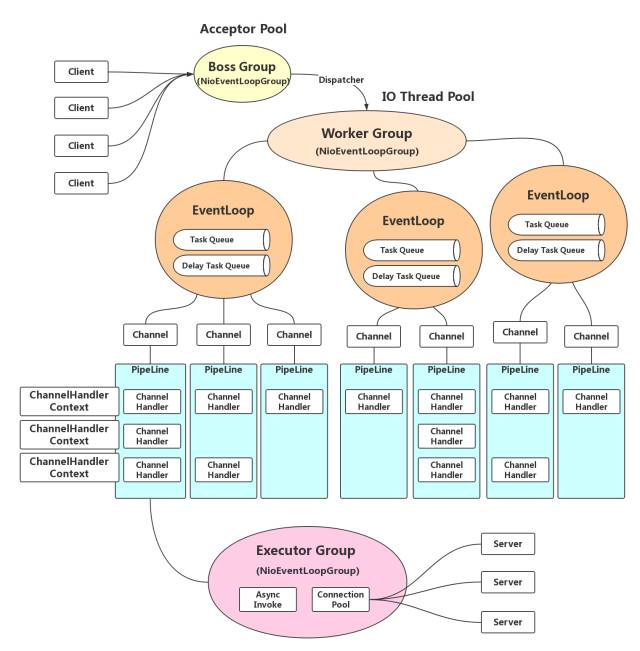
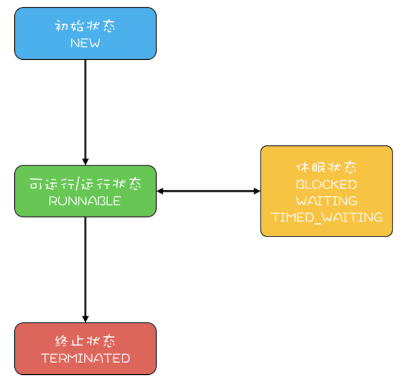

= Dubbo之线程管理

== 模型由来
Java线程和内核线程的1对1的关系使得其产生、销毁、切换都会耗费大量的CPU时间，每一个线程也最少占据1M的内存资源，这些都限制着Java不可能像类似
GoLang这类采用协程机制的编程语言可以任意创建执行任务用的轻量级线程。同时由于受到JVM实现方式的限制，其I/O的实现也还尚未完全逼近操作系统内核的
异步I/O。

[NOTE]
[small]#“*阻塞I/O、非阻塞I/O、I/O复用（select和poll）、信号驱动I/O（SIGIO）、异步I/O*”这5种I/O模型，效率依次递增#。

因而线程和I/O是Java开发中始终不可逃避的两个中心话题，可以说近些年Java生态的发展，始终没有离开对二者进行的优化设计。Netty正是巧妙的使用了
多路复用机制，使得业务线程不必阻塞等待在I/O操作上，单位时间可以获得更大的吞吐量。隔壁JS社区NodeJs异步编程的高速发展更是直接刺激着Vertx全异步
编程框架的诞生，后者则直接是由Netty发展起来的。实际上单独避开I/O谈线程或者反过来都是不妥的，I/O模型只是尽量在设法降低业务线程的阻塞等待耗时，
让其有机会利用这段CPU时间去执行其它任务，反之线程模型则是讲究如何更好地利用好优化的I/O模型，因而二者相辅相成，目标都是在尽最大限度的压榨CPU等
硬件资源，提升系统性能。

== Dubbo方案——**Dispatcher** 派发模型

白话一点说，线程模型需要处理的面对以下几个问题：
====
. I/O速度相比CPU，地上一年，天上一天；
. 线程是一种昂贵的资源，创建和销毁耗费都巨大；
. 线程池中的线程调度也是个比较耗时的过程；
====

Dubbo官网中针对这些不同的场景处理有如下的一段描述：

____

. 如果事件处理的逻辑能迅速完成，并且不会发起新的 IO 请求，比如只是在内存中记个标识，则直接在 IO 线程上处理更快，因为减少了线程池调度。

. 但如果事件处理逻辑较慢，或者需要发起新的 IO 请求，比如需要查询数据库，则必须派发到线程池，否则 IO 线程阻塞，将导致不能接收其它请求。

____

为了解决这些问题，Dubbo提出了如下几种 **Dispatcher** 派发模型
____

. *all* 所有消息都派发到线程池，包括请求，响应，连接事件，断开事件，心跳等。
. *direct* 所有消息都不派发到线程池，全部在 IO 线程上直接执行。
. *message* 只有请求响应消息派发到线程池，其它连接断开事件，心跳等消息，直接在 IO 线程上执行。
. *execution* 只请求消息派发到线程池，不含响应，响应和其它连接断开事件，心跳等消息，直接在 IO 线程上执行。
. *connection* 在 IO 线程上，将连接断开事件放入队列，有序逐个执行，其它消息派发到线程池。
____

同时还提了如下4中类型的**ThreadPool**
____
. *fixed* 固定大小线程池，启动时建立线程，不关闭，一直持有。(缺省)
. *cached* 缓存线程池，空闲一分钟自动删除，需要时重建。
. *limited* 可伸缩线程池，但池中的线程数只会增长不会收缩。只增长不收缩的目的是为了避免收缩时突然来了大流量引起的性能问题。
. *eager* 优先创建Worker线程池。在任务数量大于__corePoolSize__但是小于__maximumPoolSize__时，优先创建Worker来处理任务。当任务数量大于
__maximumPoolSize__时，将任务放入阻塞队列中。阻塞队列充满时抛出RejectedExecutionException。(相比于cached:cached在任务数量超过
__maximumPoolSize__时直接抛出异常而不是将任务放入阻塞队列)
____

== **Dispatcher** 原理

Dubbo本身的大部分职责是负责RPC通讯，I/O处理占据了大量内容。由上文得知从网络I/O切换到业务处理这个过程中，需要平衡好线程和I/O间的关系——1）线程间
切换是个耗时的动作；2）任何时候都不应该造成I/O线程阻塞。

上面反复提及的网络I/O实质是网络Socket通讯，Dubbo将该部分委托给诸如Grizzly、Mina、Netty等的网络I/O中间件，由他们处理具体的网络I/O，Dubbo只负责
响应对应的5种网络I/O事件，分别是[big]##*connected、sent、received、disconnected、caught*##，其中[big]##*sent、received*##分别
对应于RPC的请求和响应，是直接与业务方接入接出相关的。毋庸置疑，为保证吞吐量这些中间件已经采用了优化过的线程模型，也就是使用多路复用I/O，有专门的
线程负责网络连接，由另外的work线程池负责处理读写I/O操作——从 SocketChannel 中读取报文或向 SocketChannel 写入报文。以如下图所示的Netty
服务端为例，bossGroup这个线程池中的NioEventLoop线程是专门负责Accept来自Client发起的请求，连接建立成功后，会为Client生成一个对应的
Channel信息通道NioSocketChannel，并随后将其注册到workerGroup线程池中某个NioEventLoop线程上~一般被称为work线程~，后者会不断的轮询注册
到自身的NioSocketChannel，检测是否有读写事件准备好，若有，调用对应的ChannelHandler进行处理。

image::res/imgs/netty_server_model.png[caption="图 1: ", title="Netty 线程模型", alt="Netty 线程模型", width="850",]

但是上图所表达的这个模型依然是有欠缺的，work线程负责调度执行的ChannelHandler，是执行业务处理的处所，但也肩负着网络I/O的读写处理，于CPU密
集型耗时任务而言，会阻塞work线程，严重影响Netty对Socket的处理速度，导致响应不及时，因而Netty建议另外使用专门的业务线程池异步执行耗时任务。
link:https://www.infoq.cn/article/jd-netty[《京东的 Netty 实践，京麦 TCP 网关长连接容器架构》]一文中提到使用Netty实现TCP网关，除了
上文中提到bossGroup和workerGroup这两个线程池，还多出一个executorGroup线程池。关于他们的用途，文中描述如下：

____
BossGroup用于接收客户端的TCP连接，WorkerGroup用于处理 I/O、执行系统Task和定时任务，ExecutorGroup用于处理网关业务加解密、限流、路由，
及将请求转发给后端的抓取服务等业务操作。
____

自然，在同一套体系下优秀的实践总是得以沿袭和被相互借鉴，**Dispatcher**也是参透了这套精髓，如下图所示~只有work线程这部分是Dubbo源码直接接触的部分~
的link:https://www.cnblogs.com/java-zhao/p/7822766.html[Dubbo线程模型]，work线程会将流程转给Dubbo管理的Client线程池或者Server线程池，
**Dispatcher**决定了业务执行是否有3或者5这个步骤，若没有，对应的业务会直接在work线程中执行。

image::res/imgs/dubbo_thread_model.png[caption="图 3: ", title="Dubbo线程模型", alt="Dubbo线程模型", width="850",]

其线程模型的大概流程如下:
____
====

. 客户端的主线程发出一个请求后获得future，在执行get时进行阻塞等待；
. 服务端使用worker线程（netty通信模型）接收到请求后，将请求提交到server线程池中进行处理
. server线程处理完成之后，将相应结果返回给客户端的worker线程池（netty通信模型），最后，worker线程将响应结果提交到client线程池进行处理
. client线程将响应结果填充到future中，然后唤醒等待的主线程，主线程获取结果，返回给客户端

====
____

由于考虑到线程切换本身也是个耗时操作，**Dispatcher**的几个不同实现方案正是根据不同的应用场景分别提炼的解决方案，可以根据业务需求决定采用
哪种**Dispatcher**实现方案来完成对应的网络I/O事件。

== 具体实现

=== **Dispatcher**实现方式

先看其定义，接口使用Dubbo的SPI机制，默认采用的**all**模式，其两个参数，一个是用于传递处理网络I/O事件的ChannelHandler，另一个是用于传递
参数的URL，而返回参数又是一个ChannelHandler。从上文分析可知，**Dispatcher**做线程派发的对象正是ChannelHandler处理的网络I/O事件，由接
口定义大概可以猜出，其实现是对ChannelHandler做增强处理，使之符合线程派发这个需求目标。

[source,java]
----
@SPI(AllDispatcher.NAME)
public interface Dispatcher {

    /**
     * dispatch the message to threadpool.
     *
     * @param handler
     * @param url
     * @return channel handler
     */
    @Adaptive({Constants.DISPATCHER_KEY, "dispather", "channel.handler"})
    // The last two parameters are reserved for compatibility with the old configuration
    ChannelHandler dispatch(ChannelHandler handler, URL url);

}
//========================
//Dispatcher的子类并没有直接实现线程派发，委托给了对应的ChannelHandlerDelegate实现，
//它仅仅是创建并返回后者的实例。每一种具体实现均完全采用了如下模板
//========================

public class XXXXDispatcher implements Dispatcher {

    public static final String NAME = "message";

    @Override
    public ChannelHandler dispatch(ChannelHandler handler, URL url) {
        return new XXXXChannelHandler(handler, url);
    }

}

/**
 * Direct dispatcher
 */
public class DirectDispatcher implements Dispatcher {

    public static final String NAME = "direct";

    @Override
    public ChannelHandler dispatch(ChannelHandler handler, URL url) {
        //直接返回原handler，不进行包装处理
        return handler;
    }

}
----

再细看如下的类URML图，从下半截可以看出除了__DirectDispatcher__外，**Dispatcher**的其它每一个实现均会创建一种类型的``ChannelHandlerDelegate``，
由类图的上半截得知，整个实现采用了装饰器模式，抽象基类``WrappedChannelHandler``下的每一种装饰器实现均对应了一种线程派发方式。

image::res/imgs/dubbo_dispatcher.png[caption="图 4: ", title="Dubbo Dispatcher UML示意图", alt="Dubbo Dispatcher UML示意图", width="1024",]

所谓线程派发，简言之，是将某个具体行为的方法调用转换为**Runnable**提交到线程池异步执行，由线程池的调度器决定它的执行时机，当前线程的方法执行
栈帧将会立即返回被释放。最简单的示例如下述源码：
[source,java]
----
public class MessageOnlyChannelHandler extends WrappedChannelHandler {

    public MessageOnlyChannelHandler(ChannelHandler handler, URL url) {
        super(handler, url);
    }

    @Override
    public void received(Channel channel, Object message) throws RemotingException {

        //获取父类的任务执行调度器
        ExecutorService executor = getExecutorService();
        try {

            //将具体行为委托给对应的ChannelEventRunnable执行
            executor.execute(new ChannelEventRunnable(channel,
                handler, ChannelState.RECEIVED, message));
        } catch (Throwable t) {
            throw new ExecutionException(message, channel,
                getClass() + " error when process received event .", t);
        }
    }
}
----

==== *WrappedChannelHandler*

WrappedChannelHandler这个抽象基类简化了具体线程派发的实现，将诸如获取任务执行调度器的公共部分都放在基类中，其它的网络I/O事件响应都是简单地调用
所包装ChannelHandler的对应方法，由实现类根据需要覆写为异步执行。如果没有通过SPI机制指定ThreadPool，Dubbo会使用全局的SHARED_EXECUTOR作为
异步任务调度执行器，它持有一个可缓冲的线程池，否则会为每一个Client或者Server创建一个由具体ThreadPool持有的指定类型的线程池。

[NOTE]
可缓冲的线程池，特点是当线程池的大小超过了处理任务所需要的线程时，就会回收部分最近60秒不执行任务的空闲的线程，线程池大小只收到操作系统（或者说JVM）能够创建的最大线程数的限制

[source,java]
----
public class WrappedChannelHandler implements ChannelHandlerDelegate {

    protected static final Logger logger = LoggerFactory.getLogger(WrappedChannelHandler.class);

    protected final ChannelHandler handler;

    protected final URL url;

    public WrappedChannelHandler(ChannelHandler handler, URL url) {
        this.handler = handler;
        this.url = url;

        //通过SPI机制获取Dubbo中的ThreadPool实现，SPI机制使用的全局ConcurrentMap缓存映射关系，
        //完全不用担心会同时存在ThreadPool多个实例
        executor = (ExecutorService) ExtensionLoader.getExtensionLoader(ThreadPool.class)
            .getAdaptiveExtension().getExecutor(url);

        //Server端和Client端使用不同的componentKey缓存当前用到的executor
        //在同一个JVM中，可能会存在Server和Client
        String componentKey = Constants.EXECUTOR_SERVICE_COMPONENT_KEY;
        if (CONSUMER_SIDE.equalsIgnoreCase(url.getParameter(SIDE_KEY))) {
            componentKey = CONSUMER_SIDE;
        }
        //缓存容器，具体用途下文线程池优雅终止会涉及到
        DataStore dataStore = ExtensionLoader.getExtensionLoader(DataStore.class).getDefaultExtension();
        dataStore.put(componentKey, Integer.toString(url.getPort()), executor);
    }

//========================
//executor是用于异步执行任务的调度器，由具体派发实现决定如何调用。
//========================
    protected static final ExecutorService SHARED_EXECUTOR = Executors.newCachedThreadPool(new NamedThreadFactory("DubboSharedHandler", true));

    protected final ExecutorService executor;

    public ExecutorService getExecutor() {
        return executor;
    }

    //如果应用没有配置对应的SPI文件，构造方式使用SPI机制获取的ExecutorService可能会为空
    public ExecutorService getExecutorService() {
        ExecutorService cexecutor = executor;
        if (cexecutor == null || cexecutor.isShutdown()) {
            cexecutor = SHARED_EXECUTOR;
        }
        return cexecutor;
    }

    public void close() {
        try {
            if (executor != null) {
                executor.shutdown();
            }
        } catch (Throwable t) {
            logger.warn("fail to destroy thread pool of server: " + t.getMessage(), t);
        }
    }
//========================
//ChannelHandler不一定被包装过
//========================
    @Override
    public ChannelHandler getHandler() {
        if (handler instanceof ChannelHandlerDelegate) {
            return ((ChannelHandlerDelegate) handler).getHandler();
        } else {
            return handler;
        }
    }

    public URL getUrl() {
        return url;
    }

//========================
//简单调用所包装ChannelHandler的对应方法，由子类根据需要改写为异步执行
//========================
    @Override
    public void connected(Channel channel) throws RemotingException {
        handler.connected(channel);
    }

    @Override
    public void disconnected(Channel channel) throws RemotingException {
        handler.disconnected(channel);
    }

    @Override
    public void sent(Channel channel, Object message) throws RemotingException {
        handler.sent(channel, message);
    }

    @Override
    public void received(Channel channel, Object message) throws RemotingException {
        handler.received(channel, message);
    }

    @Override
    public void caught(Channel channel, Throwable exception) throws RemotingException {
        handler.caught(channel, exception);
    }

}
----

==== *ChannelEventRunnable*

上文中出现的ChannelEventRunnable将ChannelHandler中的所有事件行为均统一到一个Runnable中的，尽管他们的参数有所不同，好处是可以使用统一
的风格触发具体事件执行，线程派发具体实现可以使用统一的Runnable调用。

[source,java]
----
public class ChannelEventRunnable implements Runnable {
    private static final Logger logger = LoggerFactory.getLogger(ChannelEventRunnable.class);

    private final ChannelHandler handler;
    private final Channel channel;
    private final ChannelState state;
    private final Throwable exception;
    private final Object message;

    public ChannelEventRunnable(Channel channel, ChannelHandler handler, ChannelState state) {
        this(channel, handler, state, null);
    }

    public ChannelEventRunnable(Channel channel, ChannelHandler handler, ChannelState state, Object message) {
        this(channel, handler, state, message, null);
    }

    public ChannelEventRunnable(Channel channel, ChannelHandler handler, ChannelState state, Throwable t) {
        this(channel, handler, state, null, t);
    }

    public ChannelEventRunnable(Channel channel, ChannelHandler handler, ChannelState state, Object message, Throwable exception) {
        this.channel = channel;
        this.handler = handler;
        this.state = state;
        this.message = message;
        this.exception = exception;
    }

    @Override
    public void run() {
        if (state == ChannelState.RECEIVED) {
            try {
                handler.received(channel, message);
            } catch (Exception e) {
                logger.warn("ChannelEventRunnable handle " + state + " operation error, channel is " + channel
                        + ", message is " + message, e);
            }
        } else {
            switch (state) {
            case CONNECTED:
                try {
                    handler.connected(channel);
                } catch (Exception e) {
                    logger.warn("ChannelEventRunnable handle " + state + " operation error, channel is " + channel, e);
                }
                break;
            case DISCONNECTED:
                try {
                    handler.disconnected(channel);
                } catch (Exception e) {
                    logger.warn("ChannelEventRunnable handle " + state + " operation error, channel is " + channel, e);
                }
                break;
            case SENT:
                try {
                    handler.sent(channel, message);
                } catch (Exception e) {
                    logger.warn("ChannelEventRunnable handle " + state + " operation error, channel is " + channel
                            + ", message is " + message, e);
                }
                break;
            case CAUGHT:
                try {
                    handler.caught(channel, exception);
                } catch (Exception e) {
                    logger.warn("ChannelEventRunnable handle " + state + " operation error, channel is " + channel
                            + ", message is: " + message + ", exception is " + exception, e);
                }
                break;
            default:
                logger.warn("unknown state: " + state + ", message is " + message);
            }
        }

    }

    //5种网络I/O事件
    public enum ChannelState {
        CONNECTED,
        DISCONNECTED,
        SENT,
        RECEIVED,
        CAUGHT
    }
}

----

=== **Dispatcher**的各种线程派发细节

WrappedChannelHandler的每一个子类代表一种线程派发模型，它们决定了是否对网络I/O事件是否派发到业务线程池去异步执行，对应关系如下：

. *all* `AllChannelHandler` → connected、disconnected、received、caught
. *connection* `ConnectionOrderedChannelHandler` → connected、disconnected、received、caught

. *message* `MessageOnlyChannelHandler` → received
. *execution* `ExecutionChannelHandler` → received

. *direct* 直接返回传入的``ChannelHandler``，也就是在work线程中同步执行所有的的网络I/O回调事件

上述陈列的对应关系看起来让人有些懵，结合上文可知，虽然不同的派发方式对同一种网络I/O事件执行了业务线程派发处理，但是具体实现方式是不同的。

初看起来``received``回调事件是指Channel接收到请求，然而这个理解是不准确的，通讯过程中Client和Server以Channel作为信息发送的通道，本文中的
线程派发过程中，我们可以初略的认为Netty就是那个Channel，Client通过Channel发送请求给Server，随后Channel会告知Server I/O就绪——回调Server
提供的``received``实现，这时Server端接受到的是一个称为Request的请求对象。

如果Channel是双工的，Server通过同一Channel给Client了发送了Request请求，若干ms后，Client处理完Server发给它的请求，会通过Channel回送一
个响应给Server，Server端I/O就绪后，同样Channel也会告知Server I/O就绪，同样也是回调Server提供的``received``实现，只不过这次Server
端接受到的是一个称为Response的响应对象。

以``ExecutionChannelHandler``和``MessageOnlyChannelHandler``为例。

[source,java]
----
public class ExecutionChannelHandler extends WrappedChannelHandler {

    public ExecutionChannelHandler(ChannelHandler handler, URL url) {
        super(handler, url);
    }

    @Override
    public void received(Channel channel, Object message) throws RemotingException {
        ExecutorService executor = getExecutorService();

        //接受到的是来自对端的请求
        if (message instanceof Request) {
            try {
                executor.execute(new ChannelEventRunnable(channel, handler, ChannelState.RECEIVED, message));
            } catch (Throwable t) {

                if (t instanceof RejectedExecutionException) {
                    Request request = (Request) message;

                    if (request.isTwoWay()) {//检测到时双工方式
                        String msg = "Server side(" + url.getIp() + "," + url.getPort()
                                + ") thread pool is exhausted, detail msg:" + t.getMessage();
                        Response response = new Response(request.getId(), request.getVersion());
                        response.setStatus(Response.SERVER_THREADPOOL_EXHAUSTED_ERROR);
                        response.setErrorMessage(msg);

                        //通过channel回传一个Response响应对象
                        channel.send(response);
                        return;
                    }
                }
                throw new ExecutionException(message, channel, getClass() + " error when process received event.", t);
            }
        } else {
            //非Request请求，直接使用I/O线程走流程
            handler.received(channel, message);
        }
    }
}

public class MessageOnlyChannelHandler extends WrappedChannelHandler {

    public MessageOnlyChannelHandler(ChannelHandler handler, URL url) {
        super(handler, url);
    }

    //无论接受到来自对方的是Response响应还是Request请求，均派发到业务线程去执行
    @Override
    public void received(Channel channel, Object message) throws RemotingException {
        ExecutorService executor = getExecutorService();
        try {
            executor.execute(new ChannelEventRunnable(channel, handler, ChannelState.RECEIVED, message));
        } catch (Throwable t) {
            throw new ExecutionException(message, channel, getClass() + " error when process received event .", t);
        }
    }

}
----

*connection* 类型的线程派发模型实现有点特殊，为确保连接和断连能够有序的执行，``ConnectionOrderedChannelHandler``单独维护了一个任务
执行调度器，其队列是LinkedBlockingQueue。如下述源码：

[source,java]
----
public class ConnectionOrderedChannelHandler extends WrappedChannelHandler {

    protected final ThreadPoolExecutor connectionExecutor;
    private final int queuewarninglimit;

    public ConnectionOrderedChannelHandler(ChannelHandler handler, URL url) {
        super(handler, url);
        String threadName = url.getParameter(THREAD_NAME_KEY, DEFAULT_THREAD_NAME);
        connectionExecutor = new ThreadPoolExecutor(1, 1,
                0L, TimeUnit.MILLISECONDS,
                //该任务队列是确保连接和断连事件回调依次执行的关键
                new LinkedBlockingQueue<Runnable>(url.getPositiveParameter(CONNECT_QUEUE_CAPACITY, Integer.MAX_VALUE)),
                new NamedThreadFactory(threadName, true),
                new AbortPolicyWithReport(threadName, url)
        );  // FIXME There's no place to release connectionExecutor!
        queuewarninglimit = url.getParameter(CONNECT_QUEUE_WARNING_SIZE, DEFAULT_CONNECT_QUEUE_WARNING_SIZE);
    }

    @Override
    public void connected(Channel channel) throws RemotingException {
        try {
            checkQueueLength();
            connectionExecutor.execute(new ChannelEventRunnable(channel, handler, ChannelState.CONNECTED));
        } catch (Throwable t) {
            throw new ExecutionException("connect event", channel, getClass() + " error when process connected event .", t);
        }
    }

    @Override
    public void disconnected(Channel channel) throws RemotingException {
        try {
            checkQueueLength();
            connectionExecutor.execute(new ChannelEventRunnable(channel, handler, ChannelState.DISCONNECTED));
        } catch (Throwable t) {
            throw new ExecutionException("disconnected event", channel, getClass() + " error when process disconnected event .", t);
        }
    }
    private void checkQueueLength() {
        if (connectionExecutor.getQueue().size() > queuewarninglimit) {
            logger.warn(new IllegalThreadStateException("connectionordered channel handler `queue size: " + connectionExecutor.getQueue().size() + " exceed the warning limit number :" + queuewarninglimit));
        }
    }
    //其它事件直接分派到业务线程池中，实现和“all模式”一致，此处省略其余细节
    ...
}
----

== **Dispatcher** 应用

=== 产生——端的派发特性支持

上文已经分析过，**Dispatcher**实际上是产生一个``ChannelHandler``的装饰器，由具体的装饰器实现决定是否将Netty等网络I/O框架在回调对应的事件
时是否将流程分派到业务线程执行。如下所示，Client和Server在初始化时会先调用``ChannelHandlers.wrap()``将传入的``ChannelHandler``做装饰
处理，根据配置选用目标``Dispatcher``。

[source,java]
----

public class ChannelHandlers {
    ...

    public static ChannelHandler wrap(ChannelHandler handler, URL url) {
        return ChannelHandlers.getInstance().wrapInternal(handler, url);
    }

    protected ChannelHandler wrapInternal(ChannelHandler handler, URL url) {
        //最外层装饰，支持同时接受多条请求
        return new MultiMessageHandler(
            //中间层装饰，增加心跳处理
            new HeartbeatHandler(
                //最里层装饰，增加线程派发特性
                ExtensionLoader.getExtensionLoader(Dispatcher.class)
                    .getAdaptiveExtension().dispatch(handler, url)));
    }
}

public class NettyServer extends AbstractServer implements Server {

    public NettyServer(URL url, ChannelHandler handler) throws RemotingException {
        super(url, ChannelHandlers.wrap(handler, ExecutorUtil.setThreadName(url, SERVER_THREAD_POOL_NAME)));
    }
    ...
 }

/**
 * 所有Client实现都会继承该类
 */
 public abstract class AbstractClient extends AbstractEndpoint implements Client {
     ...
     protected static ChannelHandler wrapChannelHandler(URL url, ChannelHandler handler) {
         url = ExecutorUtil.setThreadName(url, CLIENT_THREAD_POOL_NAME);
         url = url.addParameterIfAbsent(THREADPOOL_KEY, DEFAULT_CLIENT_THREADPOOL);
         return ChannelHandlers.wrap(handler, url);
     }
 }

public class NettyClient extends AbstractClient {

     public NettyClient(final URL url, final ChannelHandler handler) throws RemotingException {
     	super(url, wrapChannelHandler(url, handler));
     }
     ...
}
----

=== 消亡——端的线程池优雅终止

所谓线程池优雅终止就是在执行close操作之前让正在运行中的业务线程有机会获得资源完成其剩下的工作，而非一招致命。**Dispatcher**的实现始终没有离开
``ExecutorService``的有力支持，其线程池优雅终止实现也是基于这个任务执行调度器，在进一步阐述Dubbo线程池优雅终止的实现方案前，先看看ExecutorService
中有关``shutdown``操作的定义。
[source,java]
----
public interface ExecutorService extends Executor {

    /**
     * Initiates an orderly shutdown in which previously submitted
     * tasks are executed, but no new tasks will be accepted.
     * Invocation has no additional effect if already shut down.
     *
     * 
This method does not wait for previously submitted tasks to
     * complete execution.  Use {@link #awaitTermination awaitTermination}
     * to do that.
     *
     * @throws SecurityException if a security manager exists and
     *         shutting down this ExecutorService may manipulate
     *         threads that the caller is not permitted to modify
     *         because it does not hold {@link
     *         java.lang.RuntimePermission}{@code ("modifyThread")},
     *         or the security manager's {@code checkAccess} method
     *         denies access.
     */
    void shutdown();

    /**
     * Attempts to stop all actively executing tasks, halts the
     * processing of waiting tasks, and returns a list of the tasks
     * that were awaiting execution.
     *
     * 
This method does not wait for actively executing tasks to
     * terminate.  Use {@link #awaitTermination awaitTermination} to
     * do that.
     *
     * 
There are no guarantees beyond best-effort attempts to stop
     * processing actively executing tasks.  For example, typical
     * implementations will cancel via {@link Thread#interrupt}, so any
     * task that fails to respond to interrupts may never terminate.
     *
     * @return list of tasks that never commenced execution
     * @throws SecurityException if a security manager exists and
     *         shutting down this ExecutorService may manipulate
     *         threads that the caller is not permitted to modify
     *         because it does not hold {@link
     *         java.lang.RuntimePermission}{@code ("modifyThread")},
     *         or the security manager's {@code checkAccess} method
     *         denies access.
     */
    List<Runnable> shutdownNow();

    /**
     * Returns {@code true} if this executor has been shut down.
     *
     * @return {@code true} if this executor has been shut down
     */
    boolean isShutdown();

    /**
     * Returns {@code true} if all tasks have completed following shut down.
     * Note that {@code isTerminated} is never {@code true} unless
     * either {@code shutdown} or {@code shutdownNow} was called first.
     *
     * @return {@code true} if all tasks have completed following shut down
     */
    boolean isTerminated();

    /**
     * Blocks until all tasks have completed execution after a shutdown
     * request, or the timeout occurs, or the current thread is
     * interrupted, whichever happens first.
     *
     * @param timeout the maximum time to wait
     * @param unit the time unit of the timeout argument
     * @return {@code true} if this executor terminated and
     *         {@code false} if the timeout elapsed before termination
     * @throws InterruptedException if interrupted while waiting
     */
    boolean awaitTermination(long timeout, TimeUnit unit)
        throws InterruptedException;

    ...

}
----

**Dispatcher**的线程池优雅终止实现正是借助如下3个主要的方法实现的，下述阐述有助于更加准确的理解他们的意图：

. ``void shutdown()`` 顺序关闭先前已经提交的任务，不再接受新任务。调用完方法后，会立即返回，并不会等待所有已经提交的任务完成。

. ``List<Runnable> shutdownNow()``尝试终止所有正在执行的任务，返回正在等待尚未执行任务列表。调用完方法后，会立即返回，并不会等待所有
正在执行的任务终止。

    除尽力尝试停止处理正在执行的任务之外，没有任何保证。 例如，典型的实现将通过Thread.interrupt取消，因此任何无法响应中断的任务都可能永远不会终止。

. ``boolean awaitTermination(long timeout, TimeUnit unit)``阻塞等待ExecutorService，直到如下三个情况中的任何一个出现才返回：

    1）shutdown(now) 后所有的任务执行完成或终止
    2）出现超时
    3）当前线程被 interrupted

如下Java 线程的状态转换图所示Java 线程进入终止状态的前提是线程进入 RUNNABLE 状态，而实际上线程也可能处在休眠状态，也就是说，我们要想终止
一个线程，首先要把线程的状态从休眠状态转换到 RUNNABLE 状态。

Java Thread类提供的``interrupt()`` 方法可以将休眠状态的线程转换到**RUNNABLE**状态，这让线程有机会执行完剩下的任务部分，借助这个特性，
另外加上一个**volatile类型的线程终止的标志位**可以在java使用一个线程通知另外一个线程实现线程池优雅终止。

Dubbo中由``ExecutorUtil``专门负责处理这些close问题。

[source,java]
----
public class ExecutorUtil {
    private static final Logger logger = LoggerFactory.getLogger(ExecutorUtil.class);

    //声明最多只有一个线程的ThreadPoolExecutor，其任务使用阻塞式链表队列，确保有序执行，
    //用于执行ExecutorService的优雅关闭操作，由整个JVM中的所有线程共享
    private static final ThreadPoolExecutor SHUTDOWN_EXECUTOR = new ThreadPoolExecutor(0, 1,
            0L, TimeUnit.MILLISECONDS,
            new LinkedBlockingQueue<Runnable>(100),
            new NamedThreadFactory("Close-ExecutorService-Timer", true));

    /**
    * 检测在调用shutdown(now)后ExecutorService是否已经完成或终止队列中所有的任务
    */
    public static boolean isTerminated(Executor executor) {
        if (executor instanceof ExecutorService) {
            if (((ExecutorService) executor).isTerminated()) {
                return true;
            }
        }
        return false;
    }

    private static void newThreadToCloseExecutor(final ExecutorService es) {
        if (!isTerminated(es)) {//如果ExecutorService未处于终止态
            SHUTDOWN_EXECUTOR.execute(new Runnable() {
                @Override
                public void run() {
                    try {
                        //循环1000次，每隔10毫秒执行一次，确保ExecutorService正在执行的任务能够终止
                        for (int i = 0; i < 1000; i++) {
                            //尝试终止正在执行的任务
                            es.shutdownNow();
                            if (es.awaitTermination(10, TimeUnit.MILLISECONDS)) {
                                //成功等待到所有任务处理完毕
                                break;
                            }
                        }
                    } catch (InterruptedException ex) {
                        //从中断中恢复，将唯一的一个线程归还给SHUTDOWN_EXECUTOR
                        //JVM中其它线程能正常使用它
                        Thread.currentThread().interrupt();
                    } catch (Throwable e) {
                        logger.warn(e.getMessage(), e);
                    }
                    //执行到这里，表示10s之内，正在执行的任务还没有终止，这时便不再做尝试，
                    //但是队列已经不再接受新的任务
                }
            });
        }
    }

    public static void gracefulShutdown(Executor executor, int timeout) {
        //检查是否符合终止条件，只有ExecutorService类型的Executor才符合
        if (!(executor instanceof ExecutorService) || isTerminated(executor)) {
            return;
        }

        final ExecutorService es = (ExecutorService) executor;
        try {
            //该方法仅仅是告知不再接受新任务的提交
            es.shutdown();
        } catch (SecurityException ex2) {
            return;
        } catch (NullPointerException ex2) {
            return;
        }
        try {
            //等待已提交的完成执行完成，
            if (!es.awaitTermination(timeout, TimeUnit.MILLISECONDS)) {//终止前，出现了超时
                //尝试终止正在执行的任务
                es.shutdownNow();
            }

            //如果没有进入方法体，表示ExecutorService在超时前已经完成关闭操作

        } catch (InterruptedException ex) {//处于休眠、阻塞、等待或超时等待的过程中，被interrupted

            //尝试中断正在执行的任务
            es.shutdownNow();
            //捕获异常，再次调用interrupt方法，将中断状态重新设置为true
            //保留当前线程原有的状态
            Thread.currentThread().interrupt();
        }

        //如果ExecutorService仍未完成任务执行至关闭或者中断所有正在执行的任务，
        //便将尝试执行ExecutorService关闭的操作转给SHUTDOWN_EXECUTOR来执行
        if (!isTerminated(es)) {
            newThreadToCloseExecutor(es);
        }
    }

//==================
//非优雅版终止处理，区别是，一上来就会尝试停止正在执行的任务，随后等待所有任务结束，如果超时或者被中断，也会启用
//newThreadToCloseExecutor努力尝试等待到所有任务执行完
//==================
    public static void shutdownNow(Executor executor, final int timeout) {
        if (!(executor instanceof ExecutorService) || isTerminated(executor)) {
            return;
        }
        final ExecutorService es = (ExecutorService) executor;
        try {
            es.shutdownNow();
        } catch (SecurityException ex2) {
            return;
        } catch (NullPointerException ex2) {
            return;
        }
        try {
            es.awaitTermination(timeout, TimeUnit.MILLISECONDS);
        } catch (InterruptedException ex) {
            Thread.currentThread().interrupt();
        }
        if (!isTerminated(es)) {
            newThreadToCloseExecutor(es);
        }
    }

    ...
}
----

线程池优雅终止的步骤总结如下：

. 当前线程调用``shutdown()``告知ExecutorService不再接受新提交的任务；
. 随后尝试等待若干ms直到其完成
.. 如果超时返回，则调用``shutdownNow()``告知ExecutorService尝试终止正在执行的任务；
.. 否则在超时前若当前线程捕获到遭遇被``interrupted``的异常，则再次调用``shutdownNow()``，确保ExecutorService收到“尝试终止正在执行的
任务”的通知，随后调用``Thread.currentThread().interrupt()``恢复当前线程状态；
. 至此，如果ExecutorService还处于未终止状态，则给``SHUTDOWN_EXECUTOR``这个使用单线程专门顺序执行终止处理的``ThreadPoolExecutor``发出一个
任务，由其继续执行终止处理。
. shutdown线程会尝试每隔10毫秒执行组合调用``shutdownNow()``和``awaitTermination()``一次，如果后者检测到正常终止或者超过1000次(总计10s)
这时就不再尝试
. 若shutdown线程执行任务期间遭遇``interrupted``产生的异常，则对其进行恢复，确保当前JVM的其它线程能正常使用``SHUTDOWN_EXECUTOR``这个线程池。

==== 线程池优雅终止的应用

上文中介绍线程派发时，其实现装饰器抽象基类WrappedChannelHandler中有如下一段代码，利用DataSource将Client或Server实例化时获得的ExecutorService
缓存起来，其目的只有一个，就是用于实现端的关闭——资源回收处理~有效的任务运行期都集中于网络I/O事件的处理~。

[source,java]
----
//==============
//DataStore的结构：<component name or id, <data-name, data-value>>
//ConcurrentMap<String, ConcurrentMap<String, Object>>
//可以理解是双键结构的缓存容器，需要使用两级键获取到目标值
//==============
DataStore dataStore = ExtensionLoader.getExtensionLoader(
    DataStore.class).getDefaultExtension();
dataStore.put(componentKey,
    Integer.toString(url.getPort()), executor);
----

在AbstractClient和AbstractServer初始化的最后阶段均存在一段获取该缓存容器中ExecutorService的代码片段，由上文分析可知，这个值是在他们
的具体实现类中装入派发模式时置入的，也就是说，如果没有使用线程派发机制，那么事先就没有置入该值，其值为null。此处的实现方式值得商榷，传入的
ChannelHandler经过了多层装饰，如果使用了线程派发，通过递归回调``ChannelHandlerDelegate.getHandler()``判断是否为``WrappedChannelHandler``
也可以获得该值。

[source,java]
----
public AbstractClient(URL url, ChannelHandler handler) throws RemotingException {
    super(url, handler);
    ...

    executor = (ExecutorService) ExtensionLoader.getExtensionLoader(DataStore.class)
        .getDefaultExtension().get(CONSUMER_SIDE, Integer.toString(url.getPort()));
    ExtensionLoader.getExtensionLoader(DataStore.class)
        .getDefaultExtension().remove(CONSUMER_SIDE, Integer.toString(url.getPort()));
}
public AbstractServer(URL url, ChannelHandler handler) throws RemotingException {
    super(url, handler);
    ...

    //fixme replace this with better method
    DataStore dataStore = ExtensionLoader.
        getExtensionLoader(DataStore.class).getDefaultExtension();
    executor = (ExecutorService) dataStore.get(
        Constants.EXECUTOR_SERVICE_COMPONENT_KEY, Integer.toString(url.getPort()));
}
----

剩下的应用比较简单，但是有一处不得不提的是，如下述代码，在Client执行``close()``的时候有检查executor是否为null，而执行``close(int timeout)``
却没有这种检查，可能对不使用线程派发模式的场景来说，谈不上线程池的优雅终止，也就不会调用到该方法，有待细究代码实现。

[source,java]
----
public abstract class AbstractClient extends AbstractEndpoint implements Client {
    @Override
    public void close() {

        ...
        try {
            if (executor != null) {
                ExecutorUtil.shutdownNow(executor, 100);
            }
        } catch (Throwable e) {
            logger.warn(e.getMessage(), e);
        }
        ...
    }

    @Override
    public void close(int timeout) {
        ExecutorUtil.gracefulShutdown(executor, timeout);
        close();
    }
}
----