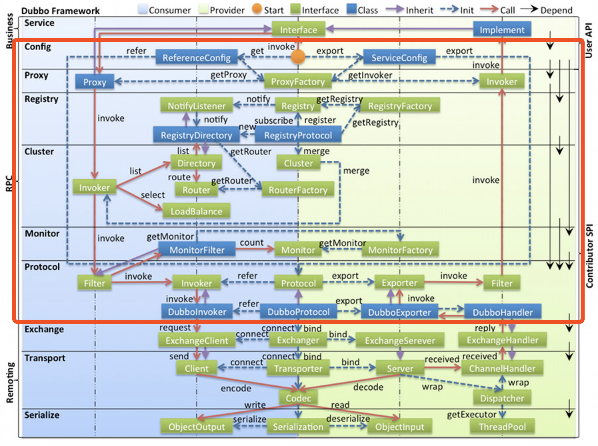

= Dubbo RPC 之 Protocol协议层（一）

此前几乎所有的关于Dubbo实现的剖析文章均有提到，Dubbo是一个RPC通讯框架，直白一点说就是开发人员在进行分布式开发时，可以像调用本地方法一样对远端机器提供的服务发起调用。这个过程中所有关于网络编程的具体细节都被框架给封装了，对上面的应用层屏蔽了细节，如果开发人员不细究底层实现原理，基本会对其无感。Dubbo的RPC框架层担任的正是这个封装过程，将顶端应用层^Business^的本地调用转换为对底端远端层^Remoting^的远程调用，如下图所示，整个RPC框架层被细分成了7层，占据了整个Dubbo实现的很大篇幅，本文主要聚焦于阐述**Protocol**这一层的具体实现。

== 协议层由来

两个实体若要能相互通讯，就必要约定某种共同的交流语言，就像两位不会讲彼此语言的小伙要完成对话，他们可以约定用中文、英文或者其他语言交流，不会所用语言的一方或者两方，要么找个翻译，要么使用Google手机实时翻译。从这个场景中可以看出，在约定了交流语种的前提下，实际参与会话的实体不一定得懂该语种，可以通过第三方代理完成。在软件领域，这个用于完成对话的工具~举例场景中的自然语言~被认为是一种契约。

分布式应用开发中，所涉服务可能由多个团队完成，甚至用的都不是同一种编程语言，为了对付这种情况，Dubbo的RPC体系中专门提炼了一个可以扩展的``Protocol``协议层。众所周知，比如Http是被普遍支持的通讯协议，只要提供支持，跨语种的通讯就能被轻松解决。也就是说Dubbo中的远端请求实际上不限于网络请求，也可以是跨两个JVM的IPC进程间请求，Dubbo的典型特征是“[big]#微内核、可扩展#”，``Protocol``更是将这种风格体现得淋漓尽致，其内置的的支持实现有：

====
* o.a.d.r.p.injvm.`InjvmProtocol`：用于同一个JVM中的客户端和服务端通讯
* o.a.d.r.p.dubbo.`DubboProtocol`：默认实现
* o.a.d.r.p.rmi.`RmiProtocol`：跨JVM的原生远程过程调用
* o.a.d.r.p.http.`HttpProtocol`：HTTP协议支持
* o.a.d.r.p.http.hessian.`HessianProtocol`
====

官网中有关于``Protocol``的介绍相当简洁，如下：
____

RPC 协议扩展，封装远程调用细节。
____

简短一句话说明了其主要职责，从代码的角度看是这么一个过程——“客户端程序拥有一套服务端提供的服务接口^interface^，而接口的具体实现在服务端，RPC将本地的接口调用转换为对服务端的出站请求，而协议层将远端请求有关的具体细节封装起来，当请求抵达服务端后，协议层将对应的入站请求转为对接口的调用，也就是说此时在服务端完成了接口实现的本地调用”。细究之，协议层完成的客户端出站请求封装和服务端入站请求封装是两个互为逆向的过程。

== 关键组件

从上文的表述知道，``Protocol``实际要做的是一个转译操作，完成[big]##应用层中的原生的Java源码方法调用##到[big]##网络层的远端通讯##间的相互转换过程~由通讯双方选定协议支持~。我们都清楚框架始终是某类通用问题的解决方案，这个RPC肯定是面向所有Java能够表达的方法签名的。但尽管方法的签名表示有着万千变化，但从更大的粒度而言，实际上概括起来又只有出参、入参、方法名这3个基本元素~包括出参入参类型~，熟悉Java反射的人不难明白这点，简言之就是任何一个方法签名都可以转换成一个Method对象，更进一步讲这个过程不需要关心方法或者说业务接口的具体细节，剩下的就是如何解决在方法和远端请求~入站和出站~间进行转换的问题，它也是``Protocol``所关注的重点。

综上，Dubbo抽离出如下几个关键组件接口：

. *Invocation* & *Result*: 分别用于封装原生Java代码中方法接口的中入参和出参，包括参数类型，二者组合起来便能表达一次方法调用。

. *Invoker*: Dubbo中每一个``Invoker``实例代表一个服务，而后者对应一个``interface``接口，接口中的所有方法均可以用如下语句表达：

 Result invoke(Invocation invocation) throws RpcException;

. *Protocol*: 支持扩展，框架层中从底往上首次将服务的这个概念引入，类似``Transporter``、``Exchanger``等，处于Dubbo架构的中分线位置，是框架分层的一个概念，根据此前剖析文章不难看出，其实现是横跨客户端和服务端的。
.. 客户端需要根据接口类和其配置总线参数获得一个``Invoker``实例，供上层将原生的Java接口调用转换为远端请求，因此``Protocol``有责任为其提供一个封装了网络层用于向彼端发送网络请求的``ExchangeClient``实例。
.. 服务端则需要完成服务的暴露处理，当来自客户端的``Invoker``的请求抵达时~网络请求~，Dubbo会将来自彼端的请求转换成``Invocation``对象，以便``Protocol``根据其中信息获得一个由Dubbo框架使用动态代理模式实现的``Invoker``实例，随后便可以使用该实例间接完成对业务接口实现的调用，获得响应结果后，经过网络层处理发回给客户端。

== 关键接口定义

在清楚了协议层的具体职责与设计初衷后，以下按照以往惯例，我们的分析仍然聚焦在Dubbo的默认支持实现上，跟上文顺序相反，由简单到复杂，逐步深入，本章节先大概介绍一下各个结合定义，下一章节则着重剖析具体实现。

=== 服务接口入参封装体 `Invocation`

``Invocation``用于封装Java服务接口中的入参，包括了入参类型和方法名称。《Dubbo远程通讯 · 网络传输层》一文中曾经提到一个特性，就是用于实际通讯的通道``Channel``可以像``ThreadLocal``一样拥有自己的上下文本地变量，当前框架层利用它可以存储一些用于框架功能增强或流程控制的参数，它的作用范围是绑定在``Channel``实例上，容易确保线程安全，保持了框架实现的优雅干净。同样``Protocol``协议层的表示每一次接口方法调用的``Invocation``也可以存取其本地变量，被视作附属参数``*attachment*``。

[source,java]
----
public interface Invocation {

//==================================
// 表征接Java接口中的入参，包括了入参类型和方法名称
//==================================
    String getMethodName();

    Class<?>[] getParameterTypes();

    Object[] getArguments();

//==================================
// 用于存取接口调用的本地附属参数
//==================================
    Map<String, String> getAttachments();

    void setAttachment(String key, String value);

    void setAttachmentIfAbsent(String key, String value);

    String getAttachment(String key);

    String getAttachment(String key, String defaultValue);

//==================================
// 获取实现当前Invocation调度的服务接口调度器Invoker
//==================================
    Invoker<?> getInvoker();

}
----

=== 服务接口出参封装体 `Result`

``Result``用于封装服务接口方法调用的结果，也就是出参，在Java中一个方法调用只会返回一个结果对象，``Object``可以代表所有类型的对象，如果业务逻辑处理异常，会抛出``XXXException``，其实它也可以被认为是另外一种形式的出参。虽然两种出参都可以统一为``Object``对象，但一般上框架会分别对待，有利于框架实现。

另外从《Dubbo远程通讯 · 信息交换层》已经知悉，Dubbo为了充分压榨硬件性能、确保很高的吞吐率，在[big]##信息交换层##已经做了同步转异步的处理，因此对应到当前的协议层实现来说，RPC方法调用的返回结果也是需要异步获取的。这种异步实现是通过``CompleteableFuture<T> → CompletionStage<T>``达成的，理论上其和``Result``是一种组合关系，由于二者实例之间的``一对一``的绑定关系，外加资源回收处理的便利性考量，Dubbo使用了接口扩展来绑定这种关系，这样一来``Result``成了一个行为类。

同样，在具体实现细节中，请求操作和等待响应操作实际上是两个相互独立的阶段，二者在时间发生有着严格的先后顺序，同请求阶段一样，它需要存取本地参数，但不应共享，因此接口中也定义了数个存取Result本地附属参数``*attachment*``的方法。

另外为了请求方的操作的便利性，比如说使用默认提供值同步获取结果，在调用方的上下文中以响应式获取结果。

[source,java]
----
public interface Result extends CompletionStage<Result>, Future<Result>, Serializable {

//==================================
// 出参有两种类型，正常结果Object，抛出的异常Exception，处理是否正常需要使用 hasException 提前判断
//==================================
    Object getValue();

    void setValue(Object value);

    Throwable getException();

    void setException(Throwable t);

    boolean hasException();

    /**
     * Recreate.
     * 

     * <code>
     * if (hasException()) {
     * throw getException();
     * } else {
     * return getValue();
     * }
     * </code>
     *
     * @return result.
     * @throws if has exception throw it.
     */
    Object recreate() throws Throwable;

//==================================
// 用于存取接口调用的本地附属参数
//==================================
    Map<String, String> getAttachments();

    void addAttachments(Map<String, String> map);

    void setAttachments(Map<String, String> map);

    String getAttachment(String key);

    String getAttachment(String key, String defaultValue);

    void setAttachment(String key, String value);

//==================================
// 要求即时返回结果，若对方还未完成不会等到地方完成，使用提供的值作为Result结果
//==================================
    /**
     * Returns the specified {@code valueIfAbsent} when not complete, or
     * returns the result value or throws an exception when complete.
     *
     * @see CompletableFuture#getNow(Object)
     */
    Result getNow(Result valueIfAbsent);
//==================================
// 使用响应式编程在回调中获取对端的处理结果，调用方在调用点持有自己的上下文，便于业务处理
// NOTE: 如名称所示，该方法在回调时，Dubbo会确保它拥有和此前原生方法调用时的上下文信息
//==================================
    /**
     * Add a callback which can be triggered when the RPC call finishes.
     * 

     * Just as the method name implies, this method will guarantee the callback
     * being triggered under the same context as when the call was started,
     * see implementation in {@link Result#whenCompleteWithContext(BiConsumer)}
     *
     * @param fn
     * @return
     */
    Result whenCompleteWithContext(BiConsumer<Result, Throwable> fn);

    default CompletableFuture<Result> completionFuture() {
        return toCompletableFuture();
    }
}
----

=== 服务接口调度器 `Invoker`

服务接口调度器，其作用上文已经介绍过，其实例和服务提供者接口定义是一对一的，通过接口类对象绑定，因此其定义中声明了一个``getInterface()``方法。另外一个``Invoker``对象代表了一个微服务，作为微服务它有着自己的生命周期和配置参数~微服务的元数据~，因此接口扩展自``Node``，使用配置总线`URL`处理配置的存取问题。

当然``Invoker``的具体实现上很灵活，就像前面的剖析文章中提到的``ChannelHandler``，以它为起点实现了微服务的许多其它特性。

[source,java]
----
public interface Invoker<T> extends Node {

    /**
     * get service interface.
     *
     * @return service interface.
     */
    Class<T> getInterface();

    /**
     * invoke.
     *
     * @param invocation
     * @return result
     * @throws RpcException
     */
    Result invoke(Invocation invocation) throws RpcException;

}
----

=== 可扩展协议接口 `Protocol`

之所以把``Protocol``这个最为关键的接口放在最后才介绍，单就其官方给定的下面接口文档，在不熟悉实现细节的和设计原理时，理解起来相当费劲。在有了上面的那些铺垫后，再回来理解文档中要表达的意图就比较容易。

[source,java]
----
public interface Protocol {
    /**
     * 暴露远程服务： 
     * 1. 协议在接收请求时，应记录请求来源方地址信息：RpcContext.getContext().setRemoteAddress(); 
     * 2. export()必须是幂等的，也就是暴露同一个URL的Invoker两次，和暴露一次没有区别。 
     * 3. export()传入的Invoker由框架实现并传入，协议不需要关心。 
     *
     * @param <T> 服务的类型
     * @param invoker 服务的执行体
     * @return exporter 暴露服务的引用，用于取消暴露
     * @throws RpcException 当暴露服务出错时抛出，比如端口已占用
     */
    <T> Exporter<T> export(Invoker<T> invoker) throws RpcException;

    /**
     * 引用远程服务： 
     * 1. 当用户调用refer()所返回的Invoker对象的invoke()方法时，协议需相应在远端执行export()的入参Invoker对象的invoke()方法，对应关系是两端的Invoker对象同URL。 
     * 2. refer()返回的Invoker由协议实现，协议通常需要在此Invoker中发送远程请求。 
     * 3. 当url中有设置check=false时，连接失败不能抛出异常，需内部自动恢复。 
     *
     * @param <T> 服务的类型
     * @param type 服务的类型
     * @param url 远程服务的URL地址
     * @return invoker 服务的本地代理
     * @throws RpcException 当连接服务提供方失败时抛出
     */
    <T> Invoker<T> refer(Class<T> type, URL url) throws RpcException;
}
----

== 具体实现剖析

=== `RpcInvocation`

``RpcInvocation``是``Invocation``的实现。总体上实现比较简单，只需要根据接口要求能够表达一次方法的几个基本元素就足够，因此``RpcInvocation``对应定义了如下几个属性：

====
. String `methodName`：实例所代表方法名称。

. Class<?>[] `parameterTypes`：入参类型，数组，和arguments严格一一对应。

. Object[] `arguments`：具体入参数据。

. Map<String, String> `attachments`：附属参数，由于Invocation只对应一次方法调用，并没有存在资源争用的情况，普通Map就足够。

. transient Invoker<?> `invoker`：Invoker调度器引用，后者属行为类，因而被声明为``transient``。
====

上文已经说过，``Invocation``和Java原生程序中的方法调用是一对一的关系，如下构造方法便印证了这一点，从``Method``对象中获取到方法的名称和参数类型。另外由于它代表是一次具体的PRC方法调用而不是一个普通的本地方法调用，因此还需要加入一个无法从``Method``对象中获取的入参``Object[] arguments``。

[source,java]
----
private transient Class<?> returnType;

private transient InvokeMode invokeMode;

public RpcInvocation(String methodName, Class<?>[] parameterTypes,
        Object[] arguments, Map<String, String> attachments, Invoker<?> invoker) {
    this.methodName = methodName;
    this.parameterTypes = parameterTypes == null ? new Class<?>[0] : parameterTypes;
    this.arguments = arguments == null ? new Object[0] : arguments;
    this.attachments = attachments == null ? new HashMap<String, String>() : attachments;
    this.invoker = invoker;
}

public RpcInvocation(Invocation invocation, Invoker<?> invoker) {
    this(invocation.getMethodName(), invocation.getParameterTypes(),
            invocation.getArguments(), new HashMap<String, String>(invocation.getAttachments()),
            invocation.getInvoker());

//==================================
// 将微服务配置元数据信息设到Invocation的本地参数容器中
//==================================
    if (invoker != null) {
        URL url = invoker.getUrl();
        setAttachment(PATH_KEY, url.getPath());
        if (url.hasParameter(INTERFACE_KEY)) {
            setAttachment(INTERFACE_KEY, url.getParameter(INTERFACE_KEY));
        }
        if (url.hasParameter(GROUP_KEY)) {
            setAttachment(GROUP_KEY, url.getParameter(GROUP_KEY));
        }
        if (url.hasParameter(VERSION_KEY)) {
            setAttachment(VERSION_KEY, url.getParameter(VERSION_KEY, "0.0.0"));
        }
        if (url.hasParameter(TIMEOUT_KEY)) {
            setAttachment(TIMEOUT_KEY, url.getParameter(TIMEOUT_KEY));
        }
        if (url.hasParameter(TOKEN_KEY)) {
            setAttachment(TOKEN_KEY, url.getParameter(TOKEN_KEY));
        }
        if (url.hasParameter(APPLICATION_KEY)) {
            setAttachment(APPLICATION_KEY, url.getParameter(APPLICATION_KEY));
        }
    }
}

public RpcInvocation(Method method, Object[] arguments, Map<String, String> attachment) {
    this(method.getName(), method.getParameterTypes(), arguments, attachment, null);
    this.returnType = method.getReturnType();
}
----

上述源码片段中展示了其中一个构造方法中，Dubbo有将在Invoker实例设入的微服务配置元数据作为附属参数设置到Invocation中去，采用冗余手段，以空间换时间，可以快速便捷的拿到相关上下文参数，基于优先原则访问这些值，只有发现对应键值在附属参数不存在时，才绕道Invoker实例的配置总线获取。

另外它还呈现了两个声明为``transient``的变量，前者表达式``Method``对象出参的类型，后者这表示当前执行上下文中``Invocation``以何种方式~sync、async、future~调度的，大部分时候是前者决定了后者的值。

==== 由``Invocation``获取出参

根据``Invocation``这个接口的特性，它是用于表征状态类的，可被持久化，而对应调用方法的出参不是其关注重点。只有``RpcInvocation``加入了持有``Class<?> returnType``属性，为了尽可能获取到``Invocation``对象的出参类型，因此Dubbo在``RpcUtils``对应定义了如下一个方法，深入其细节会发现Invoker实例所表征的服务会将对应接口的名称以``interface``为键值存入到配置总线URL中，Dubbo根据该类名获取到服务的类对象，再由``Invocation``实例中的方法名称和入参类型获取到``Method``实例，以根据它进一步获取到出参类型，出参为void或者不满足源码过滤条件的都视作出参类型为null。

[source,java]
----
public class RpcUtils {

    ...
    public static Class<?> getReturnType(Invocation invocation) {
        try {
            if (invocation != null && invocation.getInvoker() != null
                    && invocation.getInvoker().getUrl() != null
                    && !invocation.getMethodName().startsWith("$")) {

                String service = invocation.getInvoker()
                    .getUrl().getServiceInterface();
                if (StringUtils.isNotEmpty(service)) {
                    Class<?> invokerInterface = invocation
                        .getInvoker().getInterface();
                    Class<?> cls = invokerInterface != null ?
                        ReflectUtils.forName(invokerInterface.getClassLoader(), service)
                            : ReflectUtils.forName(service);

                    Method method = cls.getMethod(invocation.getMethodName(),
                        invocation.getParameterTypes());

                    if (method.getReturnType() == void.class) {
                        return null;
                    }
                    return method.getReturnType();
                }
            }
        } catch (Throwable t) {
            logger.warn(t.getMessage(), t);
        }
        return null;
    }
    ...
}
----

==== 由``Invocation``获取方法调度模式

Dubbo可以根据出参类型和总线、附属参数等知晓当前被调用RPC方法的是被何种模式调度的，总共 3 种调度模式：如果接口方法本身的出参是CompletableFuture类型的则为``FUTURE``模式，如果配置参数设了``async``标识则为``ASYNC``异步模式，否则便是同步``SYNC``同步模式。

在进一步了解具体实现细节前，需要了解下的是Dubbo中有两个以"$"字母打头的特殊方法，分别名为``"$invoke"``和``"$invokeAsync"``，目前只需要了解其接口定义和应用场景，具体实现将在下文中深入阐述：
[source,java]
----
/**
 * Generic service interface
 *
 * @export
 */
public interface GenericService {

    //Method name, e.g. findPerson. If there are overridden methods,
    //parameter info is required, e.g. findPerson(java.lang.String)
    Object $invoke(String method, String[] parameterTypes, Object[] args)
        throws GenericException;

    default CompletableFuture<Object> $invokeAsync(String method,
            String[] parameterTypes, Object[] args) throws GenericException {

        Object object = $invoke(method, parameterTypes, args);
        if (object instanceof CompletableFuture) {
            return (CompletableFuture<Object>) object;
        }

        return CompletableFuture.completedFuture(object);
    }

}
----
____
泛接口调用方式主要用于客户端没有API接口及模型类元的情况，参数及返回值中的所有POJO均用Map表示，通常用于框架集成，比如：实现一个通用的服务测试框架，可通过GenericService调用所有服务实现。
____
也就是说此场景下客户端并不需要维护和同步微服务接口签名（~包括方法、入参、出参以及出入参类型相关的定义~），只需要提供“方法名、入参、出参、出入参类型”这几个元素即可，此时有``methodName ∈ ["$invoke", "$invokeAsync"]``。而以字符串直接提供的方法名会被作为``arguments``中的第一个元素。Dubbo中，微服务的配置也全部在配置总线URL中体现，是可以配置到方法这一级别的，可以设置``url["$invoke.async"] = true``告知Dubbo需要异步调度该泛接口。

[source,java]
----
public class RpcUtils {

    ...

    public static boolean isReturnTypeFuture(Invocation inv) {
        Class<?> clazz;
        if (inv instanceof RpcInvocation) {
            clazz = ((RpcInvocation) inv).getReturnType();
        } else {
            clazz = getReturnType(inv);
        }
        //出参类型为CompletableFuture则为FUTURE模式
        return (clazz != null && CompletableFuture.
            class.isAssignableFrom(clazz)) || isGenericAsync(inv);
    }

    public static boolean isGenericAsync(Invocation inv) {
        return $INVOKE_ASYNC.equals(inv.getMethodName());
    }

    public static InvokeMode getInvokeMode(URL url, Invocation inv) {
        if (isReturnTypeFuture(inv)) {
            return InvokeMode.FUTURE;
        } else if (isAsync(url, inv)) {
            return InvokeMode.ASYNC;
        } else {
            return InvokeMode.SYNC;
        }
    }

    //先从附属参数获取异步设置参数，如果值为false，则配置总线中进一步获取方法参数
    public static boolean isAsync(URL url, Invocation inv) {
        boolean isAsync;
        if (Boolean.TRUE.toString().equals(inv.getAttachment(ASYNC_KEY))) {
            isAsync = true;
        } else {
            isAsync = url.getMethodParameter(getMethodName(inv), ASYNC_KEY, false);
        }
        return isAsync;
    }

    //范接口的方法名称为``$invoke``或``$invokeAsync``，指定方法名称置于入参中第一个位置
    public static String getMethodName(Invocation invocation) {
        if ($INVOKE.equals(invocation.getMethodName())
                && invocation.getArguments() != null
                && invocation.getArguments().length > 0
                && invocation.getArguments()[0] instanceof String) {
            return (String) invocation.getArguments()[0];
        }
        return invocation.getMethodName();
    }

    ...

}

public enum InvokeMode {
    SYNC, ASYNC, FUTURE
}

----

---

=== `Result` 的实现 `AsyncRpcResult`

注：[small]#下文中反复出现的``RpcContext``相当关键，使用Java中ThreadLocal的翻版实现InternalThreadLocal，同一个变量，使用它的多个线程各自拥有一份拷贝，也即所谓的线程本地变量，综合了性能等方面的考虑因素。这一大章节先不细究其实现，只需知道其存在价值和用法即可。#

==== 理论分析

``AsyncRpcResult``是``Result``的接口实现，上文已经交代过，底层采用异步调用方式处理远端请求，也即请求发送出去就返回了，资源已经让渡出去，待服务端完成业务处理再经网络回传响应结果，最后由Dubbo执行反序列化处理，将结果扔进一个Result对象返回给应用层。稍加思考便会产生如是疑问，服务端的响应回来之后，如何获得对应的表示原生请求的``Invocation``对象以及它被调度时的上下文环境信息？为获得结果，我们得继续往下深入。

先看看如下关于``AsyncRpcResult``的文档信息：
____

This class represents an unfinished RPC call, it will hold some context information for this call, for example RpcContext and Invocation, so that when the call finishes and the result returns, it can guarantee all the contexts being recovered as the same as when the call was made before any callback is invoked.

As Result implements CompletionStage, AsyncRpcResult allows you to easily build a async filter chain whose status will be driven entirely by the state of the underlying RPC call.

AsyncRpcResult does not contain any concrete value (except the underlying value bring by CompletableFuture), consider it as a status transfer node. getValue() and getException() are all inherited from Result interface, implementing them are mainly for compatibility consideration. Because many legacy Filter implementation are most possibly to call getValue directly.
____

上文中前段的大意是“``AsyncRpcResult``对象代表了一个未完成的RPC调用，它持有该调用中包括``RpcContext``和``Invocation``在内的上下文信息，因而当完成调用结果返回时，能够保证完好如初地就地恢复请求发出后还未被执行任何回调时的所有上下文信息”。这初步解开了我们上述发现的疑团，当然更加具体还得等接下来深入剖析其实现细节。

[NOTE]
恢复的时机是“[big]#请求发出后还未被执行任何回调时#”，``RpcContext``这个表征执行上下文的对象，可能在回调之前其内容已经发生了改变，原因是这期间同一个线程可能被用于执行其他的RPC调用，因而需要保存方法调度时的``RpcContext``引用，便于在回调前刹那恢复现场信息。

中段则表明“由于``AsyncRpcResult``实现了``CompletionStage``接口，因而可以非常容易地构建一条异步过滤器链，其状态将完全由底层RPC调用的状态驱动”。

最后一段给出的信息则尤为关键，基本意思是``AsyncRpcResult``本不应该持有除``CompletableFuture``携带外的任何具体值，应该把它当做一种状态传输节点。历史原因，为了兼容性实现了 `getValue()` 和 `getException()` 方法，依然还有许多遗留的过滤器使用这两个方法。

==== 实现细节

从上述一个章节介绍知悉，``AsyncRpcResult``最重要的工作便是现场维护，其实现需要的几个如下组成元素：

. `Invocation`：代表原生方法的一次调用，携带了入参、入参类型、以及方法名，不过上文已经说明，它是历史遗留，它的存在更多是兼容性考虑；
. `RpcContext` stored：原生方法被调度时的上下文信息，保留现场；
. `RpcContext` tmp：原生方法被回调时的，所运行线程持有的其原生方法正在执行时的上下文信息；

===== 现场信息保护和恢复

在具体介绍其实现之前，需要先回过头去看看此前``Result``中定义的一个关键回调方法``whenCompleteWithContext``，该方法也正是**异步过滤器链**实现的关键，下文将有所体现。现场信息保护的原理是``AsyncRpcResult``被实例化时，会缓存当时的RPC调用时的``RpcContext``上下文A~原样保留现场信息~，结果返回执行回调时，会再一次获取当前线程~和``Invocation``调度时的线程可能不同~中持有的``RpcContext``上下文B，接着将B缓存到一个``tmpContext``的临时变量中，随后将A的内容恢复到当前线程中，也就是替换掉其现有的内容B，此后才回调类型为``BiConsumer<Result, Throwable>``的入参函数，最后使用``tmpContext``恢复当前线程回调时的上下文信息，也即还原到B。

具体实现源码如下，奇怪的是源码中会有两套配对的``RpcContext``，一个被称之为``context``，另一个为``serverContext``，为啥会这样，得等后面对实现有更深入的了解。

[source,java]
----
public class AsyncRpcResult extends AbstractResult {

    ...
    private RpcContext storedContext;
    private RpcContext storedServerContext;
    private Invocation invocation;

    public AsyncRpcResult(Invocation invocation) {
        this.invocation = invocation;
        this.storedContext = RpcContext.getContext();
        this.storedServerContext = RpcContext.getServerContext();
    }

    public AsyncRpcResult(AsyncRpcResult asyncRpcResult) {
        this.invocation = asyncRpcResult.getInvocation();
        this.storedContext = asyncRpcResult.getStoredContext();
        this.storedServerContext = asyncRpcResult.getStoredServerContext();
    }

    @Override
    public Result whenCompleteWithContext(BiConsumer<Result, Throwable> fn) {
        CompletableFuture<Result> future = this.whenComplete((v, t) -> {
            beforeContext.accept(v, t);
            fn.accept(v, t);
            afterContext.accept(v, t);
        });
//==============================
//下半段代码：订阅当前对象的完成事件，第一时间获取其结果，薪火相传
//==============================
        AsyncRpcResult nextStage = new AsyncRpcResult(this);
        nextStage.subscribeTo(future);
        return nextStage;
    }

    public void subscribeTo(CompletableFuture<?> future) {
        future.whenComplete((obj, t) -> {
            if (t != null) {
                this.completeExceptionally(t);
            } else {
                this.complete((Result) obj);
            }
        });
    }

    /**
     * tmp context to use when the thread switch to Dubbo thread.
     */
    private RpcContext tmpContext;
    private RpcContext tmpServerContext;

    private BiConsumer<Result, Throwable> beforeContext = (appResponse, t) -> {
        tmpContext = RpcContext.getContext();
        tmpServerContext = RpcContext.getServerContext();
        RpcContext.restoreContext(storedContext);
        RpcContext.restoreServerContext(storedServerContext);
    };

    private BiConsumer<Result, Throwable> afterContext = (appResponse, t) -> {
        RpcContext.restoreContext(tmpContext);
        RpcContext.restoreServerContext(tmpServerContext);
    };

    ...
}
----

===== `subscribeTo` & `whenCompleteWithContext`

上述源码中展示了一个比较独特的方法——`subscribeTo(CompletableFuture<?>)`，这段代码理解起来还是比较费劲，接下来的章节慢慢分析之。

为理解方便，我们假设一个现实生活的中的场景，读者给报社下了一份订单——`subscribeTo`，要求订阅时尚杂志，后者在新一期杂志出来后时，总会及时给读者快速邮递最新的杂志。这里读者是订阅方，而报社是被订阅方，下面分析将被直接表示为``读者``和``报社``。

首先暂且将其之前的``whenCompleteWithContext``先放一边。大概意思是入参``future``所代表的这个``CompletableFuture``类型对象动作完成时，会回调其``whenComplete``方法，回调代码块所做的事情就是将其结果设给当前的``AsyncRpcResult``对象，通知其完成。实质也就是``AsyncRpcResult``这个``future``对象的结果值是由另外一个``CompletableFuture``在其完成时才填充的，也即只有后者的完成了其操作，通过回调将其获得的值传递给前者。
前提是入参``future``的返回值也是要求是``Result``类型，这便有构成了一种形如“A ← B”链式操作，B订阅了A，只有B完成其自身的设值操作，才会在其回调将值传递给A，知会A整个链式操作完成，表面上B是依赖A的，但A只有在B完成时，才能完成其闭环操作。

综上，也就是“读者向报社发起``subscribeTo``订单申请，报社完成最新一期的杂志印制工作后，及时邮递给读者，也即在其完成回调事件中完成成果交付，这时候读者便拥有了最新杂志。”

现在回到``whenCompleteWithContext``，聚焦于后半段代码，理解它的关键是要搞清楚对象间关系，其调用``subscribeTo``方法的不是当前``this``对象，而是一个新创建的``nextStage``实例，该实例会被``whenCompleteWithContext``的调用方引用，当前``this``对象完成操作后，会回调其``whenComplete``，将其完成值填充给``nextStage``实例，后者也是一个``CompletableFuture``类型对象，因此可以在其``whenComplete``回调方法得知最终响应结果。

依然我们假设“读者：当前对象，报社：实际``Result``完成方，借阅方：返回的nextStage”，借阅方向读者发起``subscribeTo``，要求其在读完杂志后第一时间给他借阅，读者也发起``subscribeTo``订阅操作，向报社订购杂志，杂志的传递关系很明显：“借阅方 ← 读者 ← 报社”。

到这里就很明显了，在链条上每调用一次``whenCompleteWithContext``实际上就是产生一个借书的借阅方，而每调用一次``subscribeTo``操作，则是增加一个杂志生产方——报社，越往后的越趋向杂志的生产源头。

[NOTE]
``CompletableFuture``的``whenComplete``方法可以回调多次，按顺序依次回调。

==== AppResponse

上文中已提及``AsyncRpcResult``是一个行为类，理论上不应该存储具体的状态值，由于历史原因需维持兼容性，Dubbo将接口``Result``定义的其它接口全部委托给了``AppResponse``，而后者是一个状态类，理论上只需存取状态值即可，同样是因为兼容原因，继承实现了同样实现了``Result``接口。可以这么认为“`public class AsyncRpcResult implements CompletionStage<AppResponse>`”，由于只需要存储状态值，它的实现很简单，同样``AsyncRpcResult``中委托它实现状态值存取的方法实现也会比较简单，唯一值得一看的是下述的``recreate()``方法源码，其它具体请查看Dubbo源码。

[source,java]
----
@Override
public Object recreate() throws Throwable {
    if (exception != null) {
        // fix issue#619
        try {
            // get Throwable class
            Class clazz = exception.getClass();
            while (!clazz.getName().equals(Throwable.class.getName())) {
                clazz = clazz.getSuperclass();
            }
            // get stackTrace value
            Field stackTraceField = clazz.getDeclaredField("stackTrace");
            stackTraceField.setAccessible(true);
            Object stackTrace = stackTraceField.get(exception);
            if (stackTrace == null) {
                exception.setStackTrace(new StackTraceElement[0]);
            }
        } catch (Exception e) {
            // ignore
        }
        throw exception;
    }
    return result;
}
----
有过Java开发经验的都知道，Java抛出的异常信息是带有当前方法所在线程的调用帧信息的，也即``stackTrace``，它的作用是辅助排查问题，随着异常在一直往上抛的过程中，其涉及帧信息也逐个在增加，最终呈现的异常信息会很长。另外如果服务提供端报了大量的 NPE 异常, JVM 为了性能会做优化, 会重新编译, 不再打印异常堆栈，只会抛出预定义的NPE异常java.lang.NullPointerException: null。这样就导致真正的异常信息被隐藏了，因此上述源码对这种情况做进一步处理了，首先找到当前异常对象的Throwable下一级的顶层类，然后获取``stackTrace``帧信息，若值为null，则设值为``new StackTraceElement[0]``，获得效果是“_``只要stackTrace!=null, 就不会用错误的异常栈来赋值给stackTrace, 这样修改后, consumer会跟provider保持一致, 即抛出没有异常栈的异常, 这样就不会误导用户了``_”，具体问题请查看link:https://www.yuque.com/fa902k/id5z6r/sr041v[Dubbo调用端hessian反序列化抛NPE问题研究]。

---

=== `DubboInvoker<T>` → `AbstractInvoker<T>`

有了上述章节的铺垫后，``Invoker``的实现就比较好理解了，下面我们一步步来加以分析。

==== 基础实现

上述已经讲过：1）一个``Invoker``实例实际上对应了Java中的一个服务接口，需要知晓当前实例所对应的接口类名；2）每个微服务都有自身的配置参数，配置使用配置总线URL进行存取，效率上的考虑，Dubbo采用了时空互换，将微服务配置元数据设到了附属参数中；3）微服务被认为是一个``Node``节点，有配置参数，能获取可用状态，可销毁处理。

这些实现都放在基类``AbstractInvoker``中：

[source,java]
----
public abstract class AbstractInvoker<T> implements Invoker<T> {
    ...

    //==============================
    // 时空交换，将微服务的配置总线中配置元数据置入附属参数中
    //==============================
    private final Map<String, String> attachment;

    private static Map<String, String> convertAttachment(URL url, String[] keys) {
        if (ArrayUtils.isEmpty(keys)) {
            return null;
        }
        Map<String, String> attachment = new HashMap<String, String>();
        for (String key : keys) {
            String value = url.getParameter(key);
            if (value != null && value.length() > 0) {
                attachment.put(key, value);
            }
        }
        return attachment;
    }

    //==============================
    // 对应微服务实例的类名信息，唯一标识一个微服务
    //==============================
    private final Class<T> type;

    @Override
    public Class<T> getInterface() {
        return type;
    }

    //==============================
    // 微服务配置总线
    //==============================
    private final URL url;

    @Override
    public URL getUrl() {
        return url;
    }

    //==============================
    // 微服务可用状态，使用volatile，确保在并发多线程的可见性
    //==============================
    private volatile boolean available = true;

    @Override
    public boolean isAvailable() {
        return available;
    }

    protected void setAvailable(boolean available) {
        this.available = available;
    }

    //==============================
    // 微服务被销毁了才认为不可用，使用原子变量确保多线程环境操作的安全性
    //==============================
    private AtomicBoolean destroyed = new AtomicBoolean(false);

    @Override
    public void destroy() {
        if (!destroyed.compareAndSet(false, true)) {
            return;
        }
        setAvailable(false);
    }

    public boolean isDestroyed() {
        return destroyed.get();
    }

    ...
}
----

==== `Result invoke(Invocation)` 实现

``Invoker``的每一种具体实现实际对应了一种协议，本文中讨论的是默认的Dubbo协议支持。Dubbo将其中的一些模板实现代码放在父类``AbstractInvoker<T>``中，而和具体协议相关的实现委托给子类进一步实现，因此申明了如下的抽象方法：

[source,java]
----
protected abstract Result doInvoke(Invocation invocation) throws Throwable;
----

以下着重分析以下模板代码中实现的逻辑，过程也比较简单，步骤如下：

* ① 给代表原生方法调用的``Invocation``实例inv关联其所处运行环境——当前微服务实例；
* ② 按约定给inv的附属数据容器中置入微服务配置元数据；
* ③ 将当前线程运行环境设置的上下文参数加入到inv的附属参数容器中；
* ④ 设置原生方法最终被调度时所采用的模式：Future or Async or Sync；
* ⑤ 给异步模式执行下的inv设置递增的唯一ID编号；
* ⑥ 执行具体协议实现子类提供的``doInvoke()``实现，如果调用期间遇到异常，则返回一个异常完成的``AsyncRpcResult``对象；

[source,java]
----
public abstract class AbstractInvoker<T> implements Invoker<T> {
    ...

    public Result invoke(Invocation inv) throws RpcException {
        //(一) if invoker is destroyed due to address refresh from registry, let's allow the current invoke to proceed
        if (destroyed.get()) {
            logger.warn("Invoker for service " + this + " on consumer " + NetUtils.getLocalHost() + " is destroyed, "
                    + ", dubbo version is " + Version.getVersion() + ", this invoker should not be used any longer");
        }

        //①
        RpcInvocation invocation = (RpcInvocation) inv;
        invocation.setInvoker(this);

        //②
        if (CollectionUtils.isNotEmptyMap(attachment)) {
            invocation.addAttachmentsIfAbsent(attachment);
        }

        //③
        Map<String, String> contextAttachments = RpcContext.getContext().getAttachments();
        if (CollectionUtils.isNotEmptyMap(contextAttachments)) {
            //(二) invocation.addAttachmentsIfAbsent(context){@link RpcInvocatio ...
            invocation.addAttachments(contextAttachments);
        }

        //④
        invocation.setInvokeMode(RpcUtils.getInvokeMode(url, invocation));
        //⑤
        RpcUtils.attachInvocationIdIfAsync(getUrl(), invocation);

        //⑥
        try {
            return doInvoke(invocation);
        } catch (InvocationTargetException e) { // biz exception
            Throwable te = e.getTargetException();
            if (te == null) {
                return AsyncRpcResult.newDefaultAsyncResult(null, e, invocation);
            } else {
                if (te instanceof RpcException) {
                    ((RpcException) te).setCode(RpcException.BIZ_EXCEPTION);
                }
                return AsyncRpcResult.newDefaultAsyncResult(null, te, invocation);
            }
        } catch (RpcException e) {
            if (e.isBiz()) {
                return AsyncRpcResult.newDefaultAsyncResult(null, e, invocation);
            } else {
                throw e;
            }
        } catch (Throwable e) {
            return AsyncRpcResult.newDefaultAsyncResult(null, e, invocation);
        }
    }

    ...
}
----
可以看出涉及过程虽然比较多，但理解起来不算费劲，但有些点需要单独拧出来说道说道的，其一是两处注解说明，其二是使用到的外部工具方法。

===== 特别注释

代码中出现的两处注解后的代码行细究起来有点违反直觉让人费解，在注解的基础上才能和其运行上下文环境联系起来，大致意思分别是：

* (一) 由于注册中心刷新了地址，导致微服务实例被销毁，此时对应的``Invocation``还是允许在这个微服务环境~Invoker实例~下完成调度的。
* (二) 当前``invoke()``方法在Dubbo的重试机制下会被再次调用，此时会有过滤器Filter调用``RpcContext.setAttachment(String, String)``设置上下文参数。如果调用``addAttachmentsIfAbsent``存留的还是旧的上下文参数，可能已经失效，如外发的``traceId``和``spanId``。

===== 所涉外部工具方法

另外出现的两个之前没有涉及的工具方法“`RpcUtils.attachInvocationIdIfAsync()`” 和 “`AsyncRpcResult.newDefaultAsyncResult()`”。

Dubbo中的配置总线使用相当广泛，几乎所有的关键组件都会用到它，一个表征方法调用的Invocation实例也利用到这一特性来决定是否给其设置被调度的唯一ID编号，默认情况下，只有``Async``异步模式才会赋予这个编号，此外就是通过设置"``url[methodName + ".invocationid.autoattach"]``"参数来自动赋值编号。
[source,java]
----
public class RpcUtils {

    ...

    //获取表征方法调用的Invocation的编号
    public static Long getInvocationId(Invocation inv) {
        String id = inv.getAttachment(ID_KEY);
        return id == null ? null : new Long(id);
    }

    /**
     * Idempotent operation: invocation id will be added in async operation by default
     *
     * @param url
     * @param inv
     */
    public static void attachInvocationIdIfAsync(URL url, Invocation inv) {
        if (isAttachInvocationId(url, inv) && getInvocationId(inv) == null
                && inv instanceof RpcInvocation) {

            ((RpcInvocation) inv).setAttachment(ID_KEY,
                String.valueOf(INVOKE_ID.getAndIncrement()));
        }
    }

    //如果和Invocation
    private static boolean isAttachInvocationId(URL url, Invocation invocation) {
        String value = url.getMethodParameter(invocation.getMethodName(),
            AUTO_ATTACH_INVOCATIONID_KEY);
        if (value == null) {
            // add invocationid in async operation by default
            return isAsync(url, invocation);
        } else if (Boolean.TRUE.toString().equalsIgnoreCase(value)) {
            return true;
        } else {
            return false;
        }
    }

    ...
}
----

另外在``AsyncRpcResult``中有一套``newDefaultAsyncResult()``方法是没有提及的，其作用是在结果已知或遇到异常时直接返回一个已经完成的``AsyncRpcResult``实例，有了它才可以确保上文提到的``subscribeTo()``和``whenCompleteWithContext()``等一套复杂的方法调度机制依然可以work的比较好。

[source,java]
----
public class AsyncRpcResult extends AbstractResult {
    ...

    public static AsyncRpcResult newDefaultAsyncResult(Object value,
            Throwable t, Invocation invocation) {
        AsyncRpcResult asyncRpcResult = new AsyncRpcResult(invocation);
        AppResponse appResponse = new AppResponse();
        if (t != null) {
            appResponse.setException(t);
        } else {
            appResponse.setValue(value);
        }
        asyncRpcResult.complete(appResponse);
        return asyncRpcResult;
    }

    ...
}
----

==== `DubboInvoker<T>` 之 `Result doInvoke(Invocation)`

[IMPORTANT]
这里的``DubboInvoker``，其实例所代表的微服务是客户端一方的概念，表示引用服务端暴露的服务。

``DubboInvoker``是协议层中Dubbo协议下的``Invoker``实现，当然主要是完成原生方法调用转换后的RPC方法调用，它在连接池中以轮询方式选用一个``ExchangeClient``实例将请求发送出去，随后返回一个``AsyncRpcResult``实例，在双工模式需要返回响应的情况下，需要等到服务端处理完请求返回响应才完成这个``CompleteableFuture<AsyncRpcResult>``，否则返回的是一个值为null，已经完成处理的值。

===== 状态管理

先来看看其状态管理，在《Dubbo远程通讯 · 信息交换层》一文中，我们已经对``isAvailable()``做过初步的分析，其意义是只要还有一个``ExchangeClient``实例处于``非只读``状态，当前实例所代表的微服务就还可用，前提是微服务还没有执行关闭操作。

[source,java]
----
public class DubboInvoker<T> extends AbstractInvoker<T> {

    private final ExchangeClient[] clients;

    private final Set<Invoker<?>> invokers;
    ...

    @Override
    public boolean isAvailable() {
     if (!super.isAvailable()) {
         return false;
     }
     for (ExchangeClient client : clients) {
         if (client.isConnected() && !client.hasAttribute(
            Constants.CHANNEL_ATTRIBUTE_READONLY_KEY)) {
             //cannot write == not Available ?
             return true;
         }
     }
     return false;
    }
}
----

一个微服务实例在Java应用中，绝大部分情况下会被多个线程并发使用，由于涉及到对共享资源``clients``和``invokers``的处理，因而``destroy``操作需要加锁处理。父类``AbstractInvoker#destroy()``方法定义要求该销毁操作只能执行一次有效操作，子类``DubboInvoker#destroy()``方法利用双检锁来确保这一点：
====
假如当前实例的该方法被A、B两个线程并发地调用了，在``!super.isDestroyed()``情况下，只会有一个线程A能在``TAG_lock``位置上顺利获得锁，线程B等到该锁被释放后也获得了锁，但是由于已经执行过了``destroy``销毁操作，``!super.isDestroyed()``这个条件已经不成立了，因此无论哪个线程，一旦进入临界区，均需执行``super.isDestroyed()``条件检测。
====
[source,java]
----
public class DubboInvoker<T> extends AbstractInvoker<T> {
    private final ReentrantLock destroyLock = new ReentrantLock();

    @Override
    public void destroy() {

        if (super.isDestroyed()) {
            return;
        } else {
            //double check to avoid dup close
            destroyLock.lock();//TAG_lock
            try {
                if (super.isDestroyed()) {
                    return;
                }
                super.destroy();
                if (invokers != null) {
                    invokers.remove(this);
                }
                //==============================
                //挨个关闭所使用到客户端连接池
                //==============================
                for (ExchangeClient client : clients) {
                    try {
                        client.close(ConfigurationUtils.getServerShutdownTimeout());
                    } catch (Throwable t) {
                        logger.warn(t.getMessage(), t);
                    }
                }

            } finally {
                destroyLock.unlock();
            }
        }
    }

    ...
}
----

===== `doInvoke` 执行流程

该章节开头部分已经初步介绍过其执行的基本流程，具体实现上也很简单，使用求魔^%^选定``ExchangeClient``对象后，组合请求发送和响应处理两阶段操作，给调用返回一个``Result``类型的``CompleteableFuture<Result>``实例。

代码中用到的AtomicPositiveInteger是一个线程安全的可用于单调递增地获得一个整数值，用于轮询获取``ExchangeClient``连接实例。

上文中已经花费大量篇幅阐述``AsyncRpcResult``的``subscribeTo``方法执行的原理，这里的应用简单讲就是新生成一个``AsyncRpcResult``对象，用它订阅``ExchangeClient``的``request()``方法返回的``CompletableFuture<Object>``，后者会在其完成回调事件中将结果塞入这个新产生的对象。

[source,java]
----
public class DubboInvoker<T> extends AbstractInvoker<T> {
    ...

    private final AtomicPositiveInteger index = new AtomicPositiveInteger();

    @Override
    protected Result doInvoke(final Invocation invocation) throws Throwable {
        RpcInvocation inv = (RpcInvocation) invocation;
        final String methodName = RpcUtils.getMethodName(invocation);
        inv.setAttachment(PATH_KEY, getUrl().getPath());
        inv.setAttachment(VERSION_KEY, version);

        ExchangeClient currentClient;
        if (clients.length == 1) {
            currentClient = clients[0];
        } else {
            currentClient = clients[index.getAndIncrement() % clients.length];
        }
        try {
            boolean isOneway = RpcUtils.isOneway(getUrl(), invocation);
            int timeout = getUrl().getMethodPositiveParameter(methodName,
                TIMEOUT_KEY, DEFAULT_TIMEOUT);
            if (isOneway) {
                boolean isSent = getUrl().getMethodParameter(methodName, Constants.SENT_KEY, false);
                currentClient.send(inv, isSent);
                return AsyncRpcResult.newDefaultAsyncResult(invocation);
            } else {

                //==============================
                // 构建AsyncRpcResult实例，订阅由request()返回的CompletableFuture<Object>
                //==============================
                AsyncRpcResult asyncRpcResult = new AsyncRpcResult(inv);
                CompletableFuture<Object> responseFuture =
                        currentClient.request(inv, timeout);
                asyncRpcResult.subscribeTo(responseFuture);

                // save for 2.6.x compatibility, for example,
                // TraceFilter in Zipkin uses com.alibaba.xxx.FutureAdapter
                FutureContext.getContext().setCompatibleFuture(responseFuture);
                return asyncRpcResult;
            }
        } catch (TimeoutException e) {
            throw new RpcException(RpcException.TIMEOUT_EXCEPTION,
                "Invoke remote method timeout. method: "
                    + invocation.getMethodName() + ", provider: " + getUrl()
                    + ", cause: " + e.getMessage(), e);
        } catch (RemotingException e) {
            throw new RpcException(RpcException.NETWORK_EXCEPTION,
                "Failed to invoke remote method: "
                    + invocation.getMethodName() + ", provider: "
                    + getUrl() + ", cause: " + e.getMessage(), e);
        }
    }
    ...
}

----

有必要提一下的是，DubboInvoker的构造函数中使用``new String[]{INTERFACE_KEY, GROUP_KEY, TOKEN_KEY, TIMEOUT_KEY}``表示基于Dubbo协议的微服务实例所关注的配置总线中的元数据，分别是“1）唯一标识微服务的接口；2）所属分组；3）运行环境所需的token；4）超时时间”，像``Invocation``实现一样，将他们从配置总线中设置为自身的附属参数，方便取用。

最后，需要看看上述用于判定当前请求是否为单工模式的``RpcUtils#isOneway(url, inv)``方法的实现，如下，默认是双工模式，否则需要显示设定``url[methodName + ".return"] = false``。

[source,java]
----
public class RpcUtils {
    public static boolean isOneway(URL url, Invocation inv) {
        boolean isOneway;
        if (Boolean.FALSE.toString().equals(inv.getAttachment(RETURN_KEY))) {
            isOneway = true;
        } else {
            isOneway = !url.getMethodParameter(getMethodName(inv), RETURN_KEY, true);
        }
        return isOneway;
    }
    ...
}
----

---

篇幅原因，有关DubboProtocol的实现分析被抽调到下一篇文章。