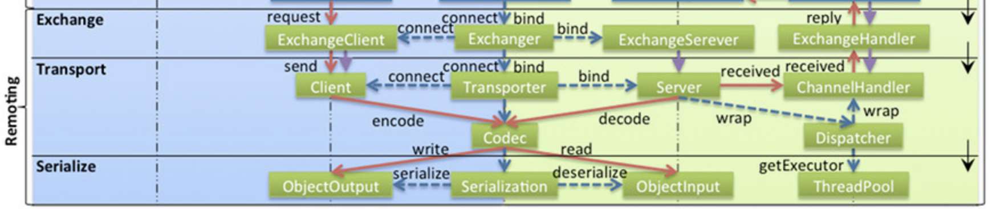
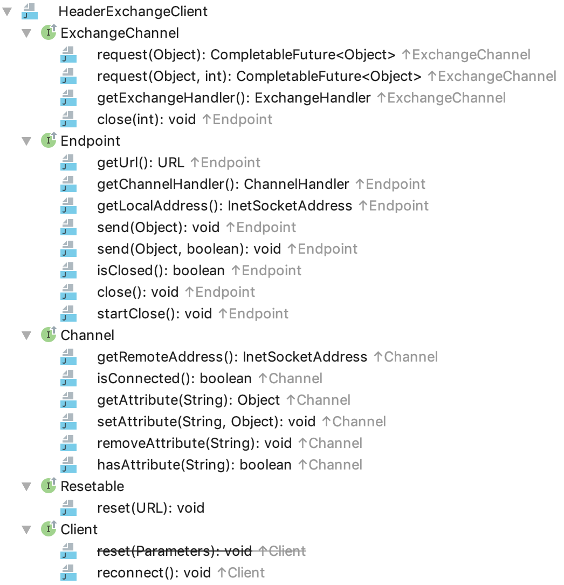

= Dubbo远程通讯 · 信息交换层

____

``请求-响应``是一种面向网络的通讯模式，由一台主机响应另一台主机的特定数据请求，通常，在发送完整的消息之前有一系列这样的交换而这通常是基于在
两个应用程序通过一个通道进行的双向对话。
____

由上述表述可以看出，平常所熟悉的``请求-响应``模式表面上是一问一答的，实际一个应答背后可能对应着多个交互往来，另外其通讯是基于双工通道的。

Dubbo将端到端的网络通讯相关的行为封装网络传输层^**Transporter**^，具体的网络I/O则委托给了类似Netty等的网络通讯中间件，而更关注业务语义的
信息交换行为则抽象成``Exchanger``置于会话层中，官方文档中有如下表述，说明其关注重点是[big]##一问一答##。为了单位时间能够获得更大的吞吐量
避免同步阻塞产生不必要的资源浪费，Dubbo在这一个抽象层中完成了同步转异步的操作。
____

**exchange信息交换层**： 封装 请求响应模式，同步转异步，以 Request, Response 为中心，扩展接口为 Exchanger, ExchangeChannel,
ExchangeClient, ExchangeServer
____

== **Transporter**层基础

=== 实现方式介绍

相对Dubbo的网络传输层，这一层所涉及实现细节及复杂度均小很多，如下UML图所示，上半截的``Endpoint、Channel、Client、Server、ChannelHandler``等均已
在传输层定义和实现，而下半截的``ExchangeChannel、ExchangeClient、ExchangeServer、ExchangeChannelHandler``这几个关键组件则是在当前交换层
定义的，实现方式几乎是沿袭传输层且一一对应的，上一层是对下一层的封装和增强，当前层只聚焦于其业务实现所需，这是分层模式思想的精髓。

image::res/imgs/dubbo_exchange_model.png[caption="图：", title="Dubbo Exchange UML", alt="Dubbo Exchange UML", width="650",]

依然，Client和Channel的一对一绑定关系，Client的行为直接委托给当前连接的Channel实现，因此如下两个``同步转异步``的操作被定义在``ExchangeChannel``
中。

[source,java]
----
public interface ExchangeChannel extends Channel {

    // send request.
    CompletableFuture<Object> request(Object request)
        throws RemotingException;

    // send request.
    CompletableFuture<Object> request(Object request, int timeout)
        throws RemotingException;

}

----

信息交换层和传输层的关系，最直观的表示如下图，入站的请求或响应数据流总是经由交换层转入传输层，出站的响应或请求则反之。

对应Dubbo中的具体实现方式是类的继承关系，如``ExchangeChannel``表达的是交换层的行为，其父类``Channel``表达的是更为底层的传输层行为，因此
该层大多接口定义的方法行为实际上已由其扩展的接口定义，通过一些类型的强制转换手段可以达到同样的效果，当然不能就此认为这些定义多余，从语义上来说
这些定义确保了该层的行为完整性，使之更加符合分层架构的风格，获取该层定义相关对象也更加便利。具体如下述代码：

[source,java]
----

final class HeaderExchangeChannel implements ExchangeChannel {
    ...
    @Override
    public ChannelHandler getChannelHandler() {
        return channel.getChannelHandler();
    }

    @Override
    public ExchangeHandler getExchangeHandler() {
        return (ExchangeHandler) channel.getChannelHandler();
    }
    ...
}

public class HeaderExchangeServer implements ExchangeServer {
    ...
    @Override
    public Collection<ExchangeChannel> getExchangeChannels() {
        Collection<ExchangeChannel> exchangeChannels =
            new ArrayList<ExchangeChannel>();

        Collection<Channel> channels = server.getChannels();
        if (CollectionUtils.isNotEmpty(channels)) {
            for (Channel channel : channels) {
                exchangeChannels.add(
                    HeaderExchangeChannel.getOrAddChannel(channel));
            }
        }
        return exchangeChannels;
    }

    //ExchangeChannel → Channel
    @Override
    @SuppressWarnings({"unchecked", "rawtypes"})
    public Collection<Channel> getChannels() {
        return (Collection) getExchangeChannels();
    }

    //ExchangeChannel → Channel
    @Override
    public Channel getChannel(InetSocketAddress remoteAddress) {
        return getExchangeChannel(remoteAddress);
    }

    @Override
    public ExchangeChannel getExchangeChannel(InetSocketAddress remoteAddress) {
        Channel channel = server.getChannel(remoteAddress);
        return HeaderExchangeChannel.getOrAddChannel(channel);
    }
    ...
}
----

=== *Request* / **Response** 核心模型定义

.*Request* / **Response**
[cols="2,1,1,6a"]
|===
|属性 |Request |Response |作用

|final long *mId*
|✔
|✔
|会话ID，Response的ID来自对应的Request，计算方式：AtomicLong.getAndIncrement()

|String *mVersion*
|✔
|✔
|版本号，实际上是当前所使用的Dubbo环境的Dubbo RPC protocol version，由[big]## `Version.getProtocolVersion()` ##取得

|boolean *mEvent*
|✔
|✔
|心跳、只读 事件标识
[source,java]
----
public static final String HEARTBEAT_EVENT = null, READONLY_EVENT = "R";

public void setEvent(String event) {
    this.mEvent = true;
    this.mData = event;
}

public boolean isHeartbeat() {
    return mEvent && HEARTBEAT_EVENT == mData;
}

public void setHeartbeat(boolean isHeartbeat) {
    if (isHeartbeat) {
        setEvent(HEARTBEAT_EVENT);
    }
}
----

|boolean *mTwoWay*
|✔
|✘
|双向标识，若为true，在一段收到请求后，需要给对方回应一个应答，让对方确认我方已经收到请求，根据当前处理状态发回对应的响应，存在正常、异常、
心跳3种响应

|boolean *mBroken*
|✔
|✘
|请求发送到对方后，由Netty等还原成Request对象，如果对方在解码环节过程中遇到异常，便会设置该标识，由其他handler根据该标识做进一步处理。

|Object *mData*
|✔
|✘
|封装请求内容的数据容器，可以是任何Java类型的对象

====
. ``String HEARTBEAT_EVENT = null``  mData的值为null值时被认为是心跳事件
. ``String READONLY_EVENT = "R"``  mData的值为“R”则说明服务器端整处于正在关闭中的状态，不再执行有关写操作等。
====
|Object *mResult*
|✘
|✔
|封装响应内容的数据容器，可以是任何Java类型的对象

|byte *mStatus*
|✘
|✔
|响应状态，总共有如下10种状态
[source,java]
----
public static final byte OK = 20,//ok.

    CLIENT_TIMEOUT = 30,//client side timeout.

    SERVER_TIMEOUT = 31,//server side timeout.

    CHANNEL_INACTIVE = 35,//channel inactive, directly return the unfinished requests.

    BAD_REQUEST = 40,//request format error.

    BAD_RESPONSE = 50,//response format error.

    SERVICE_NOT_FOUND = 60,//service not found.

    SERVICE_ERROR = 70,//service error.

    SERVER_ERROR = 80,//internal server error.

    CLIENT_ERROR = 90,//internal server error.
----

|String *mErrorMsg*
|✘
|✔
|可读错误响应消息，返回给请求方

|===

=== 周期任务

因Dubbo需要时刻检查当前自身的相关组件的状态，多出出现周期定时任务的身影，本序列文章的开始就介绍了Dubbo的定时轮算法。在Exchanger这个框架层
中有如下三种类型的定时任务：

. *Client 心跳*：Client总是定期的给对方发送心跳事件，维持长联状态；

    通道上最近读操作或写操作距当前时间已经超过一个心跳周期

. *Client 重连*：Client定期检测当前所持Channel通道是否掉线，掉线则重连；

    通道已经处于掉线状态，或者最近读操作已经超过最大允许闲置时间

. *Server 下线处理*：为避免接入Client方由于宕机或断电后后还持有其连接Channel通道产生资源浪费，Server会定期轮询连入Channel的状态，若有一段
时间未发生读写事件，则将其剔除处理——`close()`。

    通道上最近读操作或写操作距当前时间已经超过最大闲置允许时间

本文不在赘述定时轮算法相关原理或机制，简要说明具体应用依据。在<<Dubbo远程通讯 · 网络传输层>>这一文中已经提到，Dubbo实现的通道Channel持有一个
缓存通道本地环境变量的键值对Map，当前层在I/O回调事件发生时，会向其中写入``HeaderExchangeHandler``中的读写时间戳``KEY_READ_TIMESTAMP``和
`KEY_WRITE_TIMESTAMP`，周期定时任务只要根据实现需求执行对应检查处理便可。它们和I/O回调事件的关系如下：

* *KEY_READ_TIMESTAMP*：`connected、received`
* *KEY_WRITE_TIMESTAMP*：`connected、sent`

``disconnected``回调则会清除这些时间戳标识。

注：[small]##另外每次心跳触发的I/O回调事件也会执行同样的读写时间戳的写入操作，当然通道断连后，无需处理``disconnected``回调。##

最近读写时间戳的实现是通过装饰器类``HeartbeatHandler``实现的，机制是通过它在绑定于Client或Server上的Channel的回调网络I/O事件，根据事件
类型对应写入读或者写时间戳。对于``received``回调，如果判别到对方发送的是心跳请求，在对方``isTwoWay()``的特性基础上会发送一个心跳响应回去，
心跳响应则只会简单打印日志。

[source,java]
----
public class HeartbeatHandler extends AbstractChannelHandlerDelegate {

    private static final Logger logger = LoggerFactory.getLogger(HeartbeatHandler.class);

    public static final String KEY_READ_TIMESTAMP = "READ_TIMESTAMP";

    public static final String KEY_WRITE_TIMESTAMP = "WRITE_TIMESTAMP";

    public HeartbeatHandler(ChannelHandler handler) {
        super(handler);
    }

    @Override
    public void connected(Channel channel) throws RemotingException {
        setReadTimestamp(channel);
        setWriteTimestamp(channel);
        handler.connected(channel);
    }

    @Override
    public void disconnected(Channel channel) throws RemotingException {
        clearReadTimestamp(channel);
        clearWriteTimestamp(channel);
        handler.disconnected(channel);
    }

    @Override
    public void sent(Channel channel, Object message) throws RemotingException {
        setWriteTimestamp(channel);
        handler.sent(channel, message);
    }

    @Override
    public void received(Channel channel, Object message) throws RemotingException {
        setReadTimestamp(channel);
        if (isHeartbeatRequest(message)) {
            Request req = (Request) message;
            if (req.isTwoWay()) {
                Response res = new Response(req.getId(), req.getVersion());
                res.setEvent(Response.HEARTBEAT_EVENT);
                channel.send(res);
                if (logger.isInfoEnabled()) {
                    int heartbeat = channel.getUrl().getParameter(Constants.HEARTBEAT_KEY, 0);
                    if (logger.isDebugEnabled()) {
                        logger.debug("Received heartbeat from remote channel " + channel.getRemoteAddress()
                                + ", cause: The channel has no data-transmission exceeds a heartbeat period"
                                + (heartbeat > 0 ? ": " + heartbeat + "ms" : ""));
                    }
                }
            }
            return;
        }
        if (isHeartbeatResponse(message)) {
            if (logger.isDebugEnabled()) {
                logger.debug("Receive heartbeat response in thread " + Thread.currentThread().getName());
            }
            return;
        }
        handler.received(channel, message);
    }

    ...
}
----
[NOTE]
`KEY_READ_TIMESTAMP` 和 `KEY_WRITE_TIMESTAMP` 这两个Channel本地属性除了用在``HeartbeatHandler``，也在``HeaderExchangeHandler``
被用到，为啥会被两个``ChannelHandler``网络I/O事件回调器使用？因为是后者会被所有Dubbo支持的网络I/O中间的支持，但前者则取决于他们是否有能力
支持心跳机制，也即``IdleSensible``，不支持的情况下只会在Client端启用``ReconnectTimerTask``周期定时重连任务。

==== 定时轮应用细节

URL是所有Dubbo的关键组件的配置总线，有关其配置都是需要单独维护和使用的，因此这里的心跳周期时长和闲置时长都是从URL中获取到的。Dubbo中相关时机
计算方式如下：

. Client端每1/3心跳周期时段检测是否需要发送心跳包；
. 每1/3心跳周期时段服务端或客户端检测是否需要关闭连接或执行重连处理。

[small]##闲置超时时长，默认是``3 × 心跳周期``，最少为``2 × 心跳周期``，客户端的和服务端的检测均是按同一个周期执行的，假定服务端结束一个
周期的时间，客户端的恰好刚刚已经开始，如果客户端按小于两个周期时间执行超时计算，则会错过客户端的断连后的重试操作。##

[source,java]
----
//============================
//DEFAULT_HEARTBEAT：1m，默认的心跳周期时长。
//============================
public class UrlUtils {
    public static int getIdleTimeout(URL url) {
        int heartBeat = getHeartbeat(url);
        // idleTimeout should be at least more than twice heartBeat because possible retries of client.
        int idleTimeout = url.getParameter(Constants.HEARTBEAT_TIMEOUT_KEY, heartBeat * 3);
        if (idleTimeout < heartBeat * 2) {
            throw new IllegalStateException("idleTimeout < heartbeatInterval * 2");
        }
        return idleTimeout;
    }

    public static int getHeartbeat(URL url) {
        return url.getParameter(Constants.HEARTBEAT_KEY, Constants.DEFAULT_HEARTBEAT);
    }
}

//============================
//HEARTBEAT_CHECK_TICK：值为3。
//LEAST_HEARTBEAT_DURATION：1000ms，默认的最少间隔周期时长。但最终取决于客户端或服务端配置
//============================
/**
 * Each interval cannot be less than 1000ms.
 */
private long calculateLeastDuration(int time) {
    if (time / HEARTBEAT_CHECK_TICK <= 0) {
        return LEAST_HEARTBEAT_DURATION;
    } else {
        return time / HEARTBEAT_CHECK_TICK;
    }
}

public class HeaderExchangeClient implements ExchangeClient {
...

    private void startHeartBeatTask(URL url) {
        if (!client.canHandleIdle()) {
            AbstractTimerTask.ChannelProvider cp = () ->
                Collections.singletonList(HeaderExchangeClient.this);

            //根据配置总线中解析心跳周期时长
            int heartbeat = getHeartbeat(url);
            long heartbeatTick = calculateLeastDuration(heartbeat);
            this.heartBeatTimerTask = new HeartbeatTimerTask(cp, heartbeatTick, heartbeat);
            IDLE_CHECK_TIMER.newTimeout(heartBeatTimerTask, heartbeatTick, TimeUnit.MILLISECONDS);
        }
    }

    private void startReconnectTask(URL url) {
        if (shouldReconnect(url)) {
            AbstractTimerTask.ChannelProvider cp = () ->
                Collections.singletonList(HeaderExchangeClient.this);

            //根据配置总线中解析计算闲置超时时长
            int idleTimeout = getIdleTimeout(url);
            long heartbeatTimeoutTick = calculateLeastDuration(idleTimeout);
            this.reconnectTimerTask = new ReconnectTimerTask(cp, heartbeatTimeoutTick, idleTimeout);
            IDLE_CHECK_TIMER.newTimeout(reconnectTimerTask, heartbeatTimeoutTick, TimeUnit.MILLISECONDS);
        }
    }

...
}

public class HeaderExchangeServer implements ExchangeServer {
...
    private void startIdleCheckTask(URL url) {
        if (!server.canHandleIdle()) {
            AbstractTimerTask.ChannelProvider cp = () ->
                unmodifiableCollection(HeaderExchangeServer.this.getChannels());

            int idleTimeout = getIdleTimeout(url);
            long idleTimeoutTick = calculateLeastDuration(idleTimeout);
            CloseTimerTask closeTimerTask = new CloseTimerTask(cp, idleTimeoutTick, idleTimeout);
            this.closeTimerTask = closeTimerTask;

            // init task and start timer.
            IDLE_CHECK_TIMER.newTimeout(closeTimerTask, idleTimeoutTick, TimeUnit.MILLISECONDS);
        }
    }
...
}
----

== 具体实现细节

=== ExchangeChannel → HeaderExchangeChannel

*ExchangeChannel* 的实现方式是包装另外一个现成的Channel，除下述方法外，基本所有的行为都是直接委托给这个内嵌的Channel，包括通道本地变量
Attribute的存取、自身和对端的``InetSocketAddress``的获取、连接的状态获取、``getUrl()``等。当两个**HeaderExchangeChannel**实例中内嵌
Channel等同时，这两对象便彼此``equals()``。

==== 初涉同步转异步

网络传输层中已提及，消息的传送是通过绑定到端和端的Channel通道完成的，在此基础上**ExchangeChannel**担负的同步转异步处理的职责，大致原理
是：

. 先实例化一个持有[small]##该Channel通道、当前Request请求对象、超时时间##的``DefaultFuture→CompletableFuture``；
. 由内嵌Channel先完成正常的发送操作；
. 随后还没等到结果返回就给调用方返回``DefaultFuture<Object>``对象

    DefaultFuture类中持有一个全局<Long,DefaultFuture>键值对Map

. 该层中注册``ExchangeChannelHandler``在被回调``received(Channel, Object)``时，会从入站的Response响应解析得到会话ID，由其从Map中获取到
``DefaultFuture``实例对象

. 根据Response的状态选择调用``complete(T)``或``completeExceptionally(Throwable)``最终完成同步转异步的处理。

上述简要说明了同步转异步的过程，具体细节不不止这么复杂，先有个概念，便于渐渐理解``Exchanger``这一框架层的实现。

有关请求发送的实现代码如下，构建``Request``请求对象，将其封装在``DefaultFuture``中返回：

[source,java]
----
@Override
public CompletableFuture<Object> request(Object request) throws RemotingException {
    return request(request, channel.getUrl().
        getPositiveParameter(TIMEOUT_KEY, DEFAULT_TIMEOUT));
}

@Override
public CompletableFuture<Object> request(Object request, int timeout)
        throws RemotingException {

    if (closed) {
        throw new RemotingException(this.getLocalAddress(), null,
            "Failed to send request " + request +
            ", cause: The channel " + this + " is closed!");
    }
    // create request.
    Request req = new Request();
    req.setVersion(Version.getProtocolVersion());

    //告知需要有响应返回
    req.setTwoWay(true);

    //将实际的请求内容包装在Request的mData字段中
    req.setData(request);

    //返回结果前，将Request封装在DefaultFuture中
    DefaultFuture future = DefaultFuture.newFuture(channel, req, timeout);
    try {

        //调用内嵌传输层channel完成请求数据的发送操作，下述调用没有阻塞
        channel.send(req);
    } catch (RemotingException e) {

        //如果遇到异常，则调用CompletableFuture的cancel
        future.cancel();
        throw e;
    }
    return future;
}
----

==== close状态管理

HeaderExchangeChannel中有一个比较特殊的``volatile boolean closed``类型的变量，该状态量和内嵌传输层的Channel通道实例中持有的互不相干，
它的存在仅服务于当前信息交换层，更多是为了给当前通道尚未收到结果的DefaultFuture来个优雅处理，确保它们正常完成或者超时结束后再关闭传输层的
Channel通道。这个实现依赖于DefaultFuture类中持有一个全局<Long, Channel>键值对Map，只要该Map中含有当前持有的传输层Channel，便需优雅close。

[source,java]
----

private volatile boolean closed = false;

@Override
public boolean isClosed() {
    return closed;
}

// graceful close
@Override
public void close(int timeout) {
    if (closed) {
        return;
    }
    closed = true;
    if (timeout > 0) {
        long start = System.currentTimeMillis();
        while (DefaultFuture.hasFuture(channel)
                && System.currentTimeMillis() - start < timeout) {
            try {
                Thread.sleep(10);
            } catch (InterruptedException e) {
                logger.warn(e.getMessage(), e);
            }
        }
    }
    close();
}
----

==== 创建方式

在网络传输层中介绍过因Channel属于一种专属I/O管控资源，需要对NettyChannel进行适当保护，防止被误用，限定其只能在当前包中使用，因而类的作用
域被声明为``default``的，构造函数也被声明为``private``，必须通过能够记录``<io.netty.channel.Channel,NettyChannel>``键值对关系的
``getOrAddChannel``创建。本质是由于NettyChannel的I/O通讯行为实现本非其本身，是委托给作为键的Channel完成的，之间存在一对一的强绑定关系。

同样，``HeaderExchangeChannel``也存在一个类似的同名方法，不同的是它和Dubbo自身声明的``org.apache.dubbo.remoting.Channel``是一种依附
关系，高层对基层的依赖，因此在实现上，其绑定关系是直接使用后者的本地变量存取容器加以表达的。在当前层中的每一种I/O回调事件中，会先调用该方法确保
正处于活态的连入**Channel**绑入了``HeaderExchangeChannel``实例，它是确保``信息交换层``的职责得以体现的关键一环。当然I/O回调的最后无论
如何会调用``removeChannelIfDisconnected``，将已经失活的Channel的绑定关系移除。

[source,java]
----
private final Channel channel;

HeaderExchangeChannel(Channel channel) {
    if (channel == null) {
        throw new IllegalArgumentException("channel == null");
    }
    this.channel = channel;
}

//根据Channel创建需要绑定在其上对应的HeaderExchangeChannel
static HeaderExchangeChannel getOrAddChannel(Channel ch) {
    if (ch == null) {
        return null;
    }
    HeaderExchangeChannel ret = (HeaderExchangeChannel) ch.getAttribute(CHANNEL_KEY);
    if (ret == null) {
        ret = new HeaderExchangeChannel(ch);

        //如果Channel不存于连接激活态中，创建的HeaderExchangeChannel实例便会处于游离态中
        if (ch.isConnected()) {
            ch.setAttribute(CHANNEL_KEY, ret);
        }
    }
    return ret;
}

//根据本地变量容器中的Channel移除对应的HeaderExchangeChannel
static void removeChannelIfDisconnected(Channel ch) {
    if (ch != null && !ch.isConnected()) {
        ch.removeAttribute(CHANNEL_KEY);
    }
}
----

=== HeaderExchangeClient → ExchangeClient

如传输层的NettyClient实现，HeaderExchangeClient也实现了``HeaderExchangeChannel``接口，后者扩展自Channel这个基础接口，也就是说他的行为
同样最终是委托给``HeaderExchangeChannel``完成的。使用实现接口代替组合引用，可以直接利用委托模式给外界提供便利的访问接口，也更加准确的描述了
Client和Channel严格的一一对应关系，后者于前者而言是一种强依赖存在。

在其基础能力已被``HeaderExchangeChannel``实现的基础上，如上文所述Client需要负责：1）维持其绑定Channel通道和对端Server的长连状态；2）
在因自身故障掉线后采取重连处理。因而它的侧重点是定时轮资源的分配、定时任务的创建和取消。定时轮实际上是一个维持了单一线程的周期任务调度器，在Java
中线程是一种宝贵的资源，并非每个Client都能独享一份，因此同一个JVM内所有Client共享一个全局的定时轮实例。

注：[small]##同一Jvm中的所有Server实例也是共享一个定时轮实例，不和Client共用的原因是有些应用使用了Dubbo的客户端访问其他服务资源，但并不对外
提供服务，反过来提供服务的Dubbo应用也不一定会拥有需要访问Dubbo服务的Client实例。##

[source,java]
----
public class HeaderExchangeClient implements ExchangeClient {

    private final Client client;
    private final ExchangeChannel channel;

    //定时轮所有Client共享一份
    private static final HashedWheelTimer IDLE_CHECK_TIMER = new HashedWheelTimer(
            new NamedThreadFactory("dubbo-client-idleCheck", true), 1, TimeUnit.SECONDS, TICKS_PER_WHEEL);

    //保持长连的心跳检测任务和重连任务是每个Client实例都独有的，互不干扰
    private HeartbeatTimerTask heartBeatTimerTask;
    private ReconnectTimerTask reconnectTimerTask;

    public HeaderExchangeClient(Client client, boolean startTimer) {
        Assert.notNull(client, "Client can't be null");
        this.client = client;

        //client实现了Channel接口
        this.channel = new HeaderExchangeChannel(client);

        if (startTimer) {
            //标识启用定时轮的情况下，每个Client实例初始化时启用周期任务执行重连和心跳处理
            URL url = client.getUrl();
            startReconnectTask(url);
            startHeartBeatTask(url);
        }
    }
    @Override
    public CompletableFuture<Object> request(Object request) throws RemotingException {
        //委托给ExchangeChannel完成请求
        return channel.request(request);
    }

    ...

    @Override
    public void close() {
        doClose();
        channel.close();
    }

    @Override
    public void close(int timeout) {
        // Mark the client into the closure process
        startClose();
        doClose();
        channel.close(timeout);
    }

    private void doClose() {
        if (heartBeatTimerTask != null) {
            heartBeatTimerTask.cancel();
        }

        if (reconnectTimerTask != null) {
            reconnectTimerTask.cancel();
        }
    }

    @Override
    public void startClose() {
        channel.startClose();
    }
    ...
}
----

[NOTE]
在HeaderExchangeClient关闭执行资源回收之前，一定得先取消当前正在异步执行的定时任务，其周期性不间断的运行会导致资源的消耗。更糟糕的是通道
Channel已经关闭了，所有上述提到的周期任务都会执行网络I/O处理，必定会抛错，资源消耗相比更加严重。

=== HeaderExchangeServer → ExchangeServer

同``HeaderExchangeClient``一样，``HeaderExchangeServer``并没有直接继承自某个Server的实现~比如NettyServer~，而是使用组合的方式内置一个
``Server``引用，这样做的好处是并没有绑定传输层的某一种具体实现，可以根据需要灵活的组合传输层的具体Server实现，不至于产生类爆炸的现象，保持
了框架的精炼简洁。因而，扩展自Server接口部分的行为大多都委托给了所引用的Server实例。

上文中已经提及``Exchanger框架层``的Server为了避免资源消耗，需要周期性的检测是否有连入Client因为宕机等原因已经掉线，若掉线则将其清除出去，
具体应用和原理已经介绍，这里不再赘述。

和``HeaderExchangeClient``不同的是，Server端是被多个Client接入的，因而其状态维护就变得比较关键：

. 在关闭之前先得检测是否还有处于活动态的；
. 连入Channel通道，处于正在关闭的过程中时，需要及时知会所有接入Client，自己不再接受写操作；
. 一旦启用关闭操作，作为服务提供方，后续便不能再往外向所有连入Client发送除ReadOnly事件的任何信息；

具体如下源码：

[source,java]
----
public class HeaderExchangeServer implements ExchangeServer {

    使用原子变量，确保并发时，第一时间获知当前的关闭状态
    private AtomicBoolean closed = new AtomicBoolean(false);

...

    @Override
    public boolean isClosed() {
        return server.isClosed();
    }

    //只要还有一个活动态的连入Channel通道，便认为Server还处于运行态
    private boolean isRunning() {
        Collection<Channel> channels = getChannels();
        for (Channel channel : channels) {

            /**
             *  If there are any client connections,
             *  our server should be running.
             */

            if (channel.isConnected()) {
                return true;
            }
        }
        return false;
    }

    @Override
    public void close() {
        doClose();
        server.close();
    }

    @Override
    public void close(final int timeout) {
        startClose();
        if (timeout > 0) {
            final long max = (long) timeout;
            final long start = System.currentTimeMillis();

            //只读消息的发送与否取决于Server端的总线配置
            if (getUrl().getParameter(Constants.CHANNEL_SEND_READONLYEVENT_KEY, true)) {
                sendChannelReadOnlyEvent();
            }

            //超时内，只要还有Client没有断连，则继续等待
            while (HeaderExchangeServer.this.isRunning()
                    && System.currentTimeMillis() - start < max) {
                try {
                    Thread.sleep(10);
                } catch (InterruptedException e) {
                    logger.warn(e.getMessage(), e);
                }
            }
        }

        //取消当前闲置检测周期任务
        doClose();
        server.close(timeout);
    }

    //大部分行为都委托给内置的server实例完成
    @Override
    public void startClose() {
        server.startClose();
    }

    private void sendChannelReadOnlyEvent() {

        //构建只读消息请求，不再接受写请求，无需响应
        Request request = new Request();
        request.setEvent(Request.READONLY_EVENT);
        request.setTwoWay(false);
        request.setVersion(Version.getProtocolVersion());

        //获取所有连入的处于已连接状态的通道Channel，挨个发送只读消息
        Collection<Channel> channels = getChannels();
        for (Channel channel : channels) {
            try {
                if (channel.isConnected()) {
                    channel.send(request, getUrl().getParameter(
                        Constants.CHANNEL_READONLYEVENT_SENT_KEY, true));
                }
            } catch (RemotingException e) {
                logger.warn("send cannot write message error.", e);
            }
        }
    }

    //由成功执行原子变量closed改写的线程取消任务
    private void doClose() {
        if (!closed.compareAndSet(false, true)) {
            return;
        }
        cancelCloseTask();
    }

    private void cancelCloseTask() {
        if (closeTimerTask != null) {
            closeTimerTask.cancel();
        }
    }

    @Override
    public void reset(URL url) {
        server.reset(url);
        try {
            //getUrl()获取的是当前Server预制的配置值
            int currHeartbeat = getHeartbeat(getUrl());
            int currIdleTimeout = getIdleTimeout(getUrl());

            //配置总线url中获取的是动态置入的配置
            int heartbeat = getHeartbeat(url);
            int idleTimeout = getIdleTimeout(url);

            //如果重设入参的配置值和当前Server不一致，则先取消当前的闲置检测任务，
            //使用url入参重新刷
            if (currHeartbeat != heartbeat || currIdleTimeout != idleTimeout) {
                cancelCloseTask();
                startIdleCheckTask(url);
            }
        } catch (Throwable t) {
            logger.error(t.getMessage(), t);
        }
    }

    //Server被关闭后，便不能通过连入Channel通道往所有Client发送消息
    @Override
    public void send(Object message, boolean sent) throws RemotingException {
        if (closed.get()) {
            throw new RemotingException(this.getLocalAddress(), null, "Failed to send message " + message
                    + ", cause: The server " + getLocalAddress() + " is closed!");
        }
        server.send(message, sent);
    }

...
----

== 同步转异步实现

Dubbo中的同步转异步是在当前信息交换层中处理的，实现采用了``ChannelHandler``的网络I/O事件回调机制。5个事件中，任务最繁重的当属``sent``和
``received``，也是同步转异步的主战场。上面已经大概介绍了其实现过程，本章节将深入其实现细节。

=== 了解``DefaultFuture``

``DefaultFuture``的底层实现是``CompletableFuture<Object>``，可初步认为后者是一个基于fork-join的异步多线程任务编排框架，有关其运作机制
及实现原理，将会在另外一篇文章独立展开，本章节只介绍其在``DefaultFuture``实现中的应用。

==== 场景分析

端到端的网络通讯行为几乎绝大部分场景都发生在两台主机间，可能相距千里，即便在同一台主机的两个进程间，分属于不同的JVM实例，如果不是收到彼端主动
推送过来的信息，此端没有任何途径感知彼端发生了什么。而网络通讯是个复杂的过程，异常是几乎不可避免的，往往发生了，也就意味着收不到彼端传送过来
的消息了，归纳起来就是需要针对如下几种场景做异常处理：

. 消息已准备好，经此端传输层发往对端的过程中，遇到故障抛出异常；
. 消息经本地传输层发送出去后，网络传输过程中遇到异常；
. 发送消息后，成功抵达对端，彼端响应处理出现异常；
. 彼端成功处理响应，回传响应遇到异常；

于第一种异常，由于属于同一JVM乃至同一线程内，普通的``try-catch``足够应对，第三种异常，Dubbo框架会负责捕获并回传相应的异常响应，也能妥善
应对。其它两种异常属于链路层异常，由于已没法感知到彼端，又不可能无限制的等下去，因此需要配合超时检测机制，一旦超时便在此端做超时响应处理。可
见，超时异常响应是由本机自发构造，这也确保了``CompletableFuture<Object>``不会长时间未被响应回调，客户端能得到及时反馈。

==== 实现缘由

也就是说``DefaultFuture``的业务职能核心是**处理响应**，包括正常响应、异常响应以及本机检测产生的超时响应。实现采用了``DefaultFuture``→
``CompletableFuture<Object>``，至于为什么，下面我们逐步撕开其面纱：

====

. Dubbo将重I/O操作的远程通讯委托给了诸如Netty等第三方中间件，效率、吞吐量、硬件利用率等的综合考量，往往它们会采用基于I/O多路复用机制甚至
异步方式实现，这也就意味着I/O就绪后会基于通知回调方式告知调用方，不会造成其阻塞；
. 基于通知回调方式的编程实际就是响应式编程，因任务编排比较困难或容易造成回调地狱，绝大部分习惯了直线思维的开发人员是没法适应这种编程方式的，
为迎合着绝大部分人，Dubbo使用了同步转异步方案；
. 在《Dubbo远程通讯 · 网络传输层》一文中已经已经提到过，当前Client使用在连的Netty Channel通道发出消息后便即刻返回，后续的响应~包括异常响应~
通过I/O回调才能获知;
. 当然如果配置总线传入了sent参数，便阻塞直到获得对方的响应，同样是效率的考量，Dubbo中这个参数不会被鼓励。当前信息交换框架层，相对而言
所涉代码粒度跨度相当大，一个能适应该场景的非阻塞实现方案不可或缺，最好是能够完美配合Netty的回调方式，还要不影响到传输层work线程的调度方式，
这些要求也就限制了几乎只能使用``CompletableFuture``：

.. 它不要求一定要有执行计算的主体部分，简单实例化后便可交给线程池，且不阻塞调用方；
.. 可通过调用``complete()``或``completeExceptionally()``将直接给result赋值调度完成该``Future``；
.. 正常或异常响应结果可通过``whenComplete()``回调感知到；

. 随之而来的问题是，对于一个通讯往来，调用方调用``Channel.send()``后便即刻返回，同时它需要持有``CompletableFuture``实例获取处理结果，
而该实例结果完成处理是有``ChannelHandler``I/O回调负责，但后者始终是针对Channel做回调处理的，一句话“``ChannelHandler``怎么根据
``Channel``获取到``CompletableFuture``实例”？

. 对应关系通过``<Channel,CompletableFuture>``表示？但是，通过在连的Channel通道发生的通讯往来并非只一个回合~Request→Response~，每一个
回合都需要维护一个的生命周期仅限于该回合的``CompletableFuture``实例，所幸一对``Request→Response``组合中共同持有一个全局单调唯一递增的
编号，因此上述对应关系需通过该ID编号间接关联；

. 回到``Channel``和``CompletableFuture``的对应关系上，很显然，是一对多的，因此依后者来管理这种关系是最合适的，但为什么不使用组合和使用继承
扩展方案，并且只覆写了``cancel()``这么一个方法？

. 使用继承不必实例化多个相关实例~CompletableFuture和及上述关系管理类~，与其生命周期紧密相随的内容更容易被管理，用完便扔，不用手动清理，由
垃圾收集器根据需要负责清理。至于为啥要覆写``cancel()``，API文档中的如下一段话，也许能解释为什么~Dubbo的protocol协议层印证了这一点~，大概
意思是如果其被调用了，那么依赖它的未完成``CompletableFuture``实例会被异常完成处理，如下：

____

If not already completed, completes this CompletableFuture with a CancellationException. Dependent CompletableFutures that
 have not already completed will also complete exceptionally, with a CompletionException caused by this CancellationException.
____

====

==== 源码分析

由上文分析得知，在同步转异步的过程中，``DefaultFuture``的业务职能核心是**处理响应**，需要负责管理协同和Channel的关系，还要启用定时轮算
法检测超时任务。

===== 关系维护

从上述分析中得出其生命周期只限于一个``Request→Response``往来这个过程，``DefaultFuture``是在Request实例诞生时得以构建的，随其消亡。更宏观
方面是，需要使用静态内部变量全局地维护实例``Channel``到``CompletableFuture``的关系，以便``ChannelHandler``执行I/O事件回调时通过前者
获取到后者，当然如上述，这是间接的。尽管``Request``的生命周期可能很短，但是于整个JVM内，二者关系依然时刻可能都是一对多的，请求可以并发地发
送出去。

[source,java]
----
public class DefaultFuture extends CompletableFuture<Object> {

    //dubbo中的请求发送是允许并发的
    private static final Map<Long, Channel> CHANNELS = new ConcurrentHashMap<>();

    private static final Map<Long, DefaultFuture> FUTURES = new ConcurrentHashMap<>();

    // invoke id.
    // 从request中获取，作为属性出现，便于使用
    private final Long id;

    private final Channel channel;

    //Request和当前DefaultFuture是一对一的关系
    private final Request request;

    private DefaultFuture(Channel channel, Request request, int timeout) {
        this.channel = channel;
        this.request = request;
        this.id = request.getId();

        ...

        // put into waiting map.
        FUTURES.put(id, this);
        CHANNELS.put(id, channel);
    }

    public static DefaultFuture getFuture(long id) {
        return FUTURES.get(id);
    }

    //因Future是同Channel一起加入的，因此可以通过Channel是
    //  否在关系对中得出是否存在对应future的结论
    public static boolean hasFuture(Channel channel) {
        return CHANNELS.containsValue(channel);
    }
}
----
===== 消息已发确认

传输层在确认信息成功发送后，会立马回调注册ChannelHandler的``sent(Channel, Object)``方法通知这一消息。DefaultFuture中持有一个内存可见
的volatile型的sent变量，在确认发送后改写该值，以便超时检测任务能及时知晓，有了这一依据超时检测任务便能及时判别异常发生在此端还是彼端了(
[small]##成功发送出去说明通讯链路是正常的，回传瞬间发生链路异常的概率很小，即便发生也同一认为是对端异常##)。``TimeoutCheckTask``由负责
检测超时的线程池分配线程调度，而获取DefaultFuture实例改写该状态值处于Netty视觉的work线程中，因此该标识属于共享资源，需要``volatile``标识。

[source,java]
----
    private volatile long sent;

    public static void sent(Channel channel, Request request) {
        DefaultFuture future = FUTURES.get(request.getId());
        if (future != null) {
            future.doSent();
        }
    }

    private boolean isSent() {
        return sent > 0;
    }

    private void doSent() {
        sent = System.currentTimeMillis();
    }
----

===== 超时检测

依然超时检测离不开时钟轮的支持，同样也是使用全局专用的名为``TIME_OUT_TIMER``单一``Timer``实例，每一个DefaultFuture实例都拥有一个超时检
测任务，任务随DefaultFuture一起实例化。需要注意的这里使用的``TimeoutCheckTask``实例承载的是一次性任务，因此运行完后便不可能再被使用。

[NOTE]
调用Timeout实例的``cancel()``方法会将自身取消，被装入定时轮的``cancelledTimeouts``队列中，待时钟引擎进入下一个滴答时刻将其移除，也就是
任务被取消
[source,java]
----
public class DefaultFuture extends CompletableFuture<Object> {

    //超时检测时间轮，每一个ticket周期为30ms
    public static final Timer TIME_OUT_TIMER = new HashedWheelTimer(
            new NamedThreadFactory("dubbo-future-timeout", true),
            30,
            TimeUnit.MILLISECONDS);

    private final long start = System.currentTimeMillis();

    private final int timeout;

    // 每一个DefaultFuture拥有一个超时检测任务
    private Timeout timeoutCheckTask;

    private DefaultFuture(Channel channel, Request request, int timeout) {
        ...

        //默认设置的超时为1s，超时时间可以直接传入，或者从Channel通道关联配置总线中获取
        this.timeout = timeout > 0 ? timeout : channel.getUrl().getPositiveParameter(TIMEOUT_KEY, DEFAULT_TIMEOUT);

        ...
    }

    private int getTimeout() {
        return timeout;
    }

    /**
     * check time out of the future
     */
    private static void timeoutCheck(DefaultFuture future) {
        TimeoutCheckTask task = new TimeoutCheckTask(future.getId());
        future.timeoutCheckTask = TIME_OUT_TIMER.newTimeout(task, future.getTimeout(), TimeUnit.MILLISECONDS);
    }

    /**
     * init a DefaultFuture
     * 1.init a DefaultFuture
     * 2.timeout check
     *
     * @param channel channel
     * @param request the request
     * @param timeout timeout
     * @return a new DefaultFuture
     */
    public static DefaultFuture newFuture(Channel channel, Request request, int timeout) {
        final DefaultFuture future = new DefaultFuture(channel, request, timeout);
        // timeout check
        timeoutCheck(future);
        return future;
    }

    private String getTimeoutMessage(boolean scan) {
        long nowTimestamp = System.currentTimeMillis();
        return (sent > 0 ? "Waiting server-side response timeout" : "Sending request timeout in client-side")
                + (scan ? " by scan timer" : "") + ". start time: "
                + (new SimpleDateFormat("yyyy-MM-dd HH:mm:ss.SSS").format(new Date(start))) + ", end time: "
                + (new SimpleDateFormat("yyyy-MM-dd HH:mm:ss.SSS").format(new Date())) + ","
                + (sent > 0 ? " client elapsed: " + (sent - start)
                + " ms, server elapsed: " + (nowTimestamp - sent)
                : " elapsed: " + (nowTimestamp - start)) + " ms, timeout: "
                + timeout + " ms, request: " + request + ", channel: " + channel.getLocalAddress()
                + " -> " + channel.getRemoteAddress();
    }

    private static class TimeoutCheckTask implements TimerTask {

        //记录Request的编号ID，间接关联DefaultFuture实例
        // 实际上也可以直接关联
        private final Long requestID;

        TimeoutCheckTask(Long requestID) {
            this.requestID = requestID;
        }

        @Override
        public void run(Timeout timeout) {
            DefaultFuture future = DefaultFuture.getFuture(requestID);
            //当前任务是一次性的，因此如果没有找到对应的future或者future已经完成，
            // 立马返回后会被定时轮移除掉
            if (future == null || future.isDone()) {
                return;
            }

            // 构造异常请求
            // create exception response.
            Response timeoutResponse = new Response(future.getId());
            // set timeout status.
            timeoutResponse.setStatus(future.isSent() ? Response.SERVER_TIMEOUT : Response.CLIENT_TIMEOUT);
            timeoutResponse.setErrorMessage(future.getTimeoutMessage(true));

            //最后一个为true的timeout参数，告知当前是超时检测任务，由于任务已经执行完，无需再执行任务的取消操作
            // handle response.
            DefaultFuture.received(future.getChannel(), timeoutResponse, true);

        }
    }
    ...
}
----

===== 响应处理

此端成功接收到对方的响应说明，一个通讯往来已经完成，相应DefaultFuture也该寿终正寝了，表示``Channel``到``CompletableFuture``的关系也需要
被解除。最后阶段需要构建Response对象，通过父类的``complete()``通知上层调用方正常处理结果，或者调用completeExceptionally通知异常完成。

覆写的``cancel()``方法中构造了一个``Response``对象，表明当前请求也许允许此端异常而被放弃。另外它没有调用``received``方法，而是在调用完
``doReceived``随即将关系解除，由于对应``DefaultFuture``实例已经不在``FUTURES``中，持有的定时任务启动运行后没有机会再次构造Response
重复通知实例持有方。

[source,java]
----
    public static void received(Channel channel, Response response) {
        received(channel, response, false);
    }

    //timeout参数识别是否为超时检测任务中发起的对本方法的调用
    public static void received(Channel channel, Response response, boolean timeout) {
        try {
            DefaultFuture future = FUTURES.remove(response.getId());
            if (future != null) {
                Timeout t = future.timeoutCheckTask;

                //非来自超时检测任务的调用，由于当前任务已经完成，需要将其从定时轮中取消
                if (!timeout) {
                    // decrease Time
                    t.cancel();
                }
                future.doReceived(response);
            } else {
                logger.warn("The timeout response finally returned at "
                        + (new SimpleDateFormat("yyyy-MM-dd HH:mm:ss.SSS").format(new Date()))
                        + ", response " + response
                        + (channel == null ? "" : ", channel: " + channel.getLocalAddress()
                        + " -> " + channel.getRemoteAddress()));
            }
        } finally {
            //CHANNELS中，有可能多个ID关联着一个Channel，移除单个，并不会影响其他的
            CHANNELS.remove(response.getId());
        }
    }

    //通知持有当前``CompletableFuture<Object>``实例的调用方最终处理结果
    private void doReceived(Response res) {
        if (res == null) {
            throw new IllegalStateException("response cannot be null");
        }
        if (res.getStatus() == Response.OK) {
            this.complete(res.getResult());
        } else if (res.getStatus() == Response.CLIENT_TIMEOUT
                || res.getStatus() == Response.SERVER_TIMEOUT) {

            this.completeExceptionally(new TimeoutException(res.getStatus()
                == Response.SERVER_TIMEOUT, channel, res.getErrorMessage()));
        } else {
            this.completeExceptionally(new RemotingException(channel, res.getErrorMessage()));
        }
    }

    //为了避免依赖当前对象的CompletableFuture实例因Cancel而被异常完成，覆写cancel方法
    // 同时覆写也在语义上符合Dubbo的需要
    @Override
    public boolean cancel(boolean mayInterruptIfRunning) {
        Response errorResult = new Response(id);
        errorResult.setStatus(Response.CLIENT_ERROR);
        errorResult.setErrorMessage("request future has been canceled.");
        this.doReceived(errorResult);
        FUTURES.remove(id);
        CHANNELS.remove(id);
        return true;
    }

    public void cancel() {
        this.cancel(true);
    }
----

[NOTE]
上述代码中，分别针对因本地异常主动放弃、本地超时或者彼端超时、任务正常响应构建了``Response``，但在通知``CompletableFuture``实例持有方
时，只有正常响应的``Response``被原样返回，其它两个场景均被解析了成对应的异常，尽管多了一层转换，但好处很明显，统一看待，编码更灵活方便，
保持了架构的干净整洁。

== HeaderExchangeHandler

[IMPORTANT]
当前网络传输层的``HeaderExchangeHandler``并不是该层中``ExchangeHandler``的实现，其接口实现关系为``HeaderExchangeHandler →
ChannelHandlerDelegate → ChannelHandler``，也就是说它是一个普通的网络I/O事件监听器实现，而后者是一个多了两个扩展特性的接口：1）
`[samll]#String telnet(Channel, String)#`；2）`[samll]#CompletableFuture<Object> reply(ExchangeChannel, Object)#`。
前者使用组合的方式将后者作为属性元素纳入，在收到需要响应的入站请求时，会根据请求类型将流程转到后者两个方法中的一个。同时后者的具体实现大部分
集中在更高一级的Protocol协议层，``Request``对象在当前层被屏蔽，取其Object类型的``mData``作为reply的参数。

=== 读写时间戳记录

上文已经提到，为了无论在那种网络I/O中间件下，都能够支持客户端周期性地“检测是否掉线，若掉线则重连”，因此HeaderExchangeHandler在每次I/O回调时
都会执行记录最近读、写时间戳。结合上文“周期任务”，具体实现代码如下：
[source,java]
----
public class HeaderExchangeHandler implements ChannelHandlerDelegate{

    public void connected(Channel channel) throws RemotingException {
        channel.setAttribute(KEY_READ_TIMESTAMP, System.currentTimeMillis());
        channel.setAttribute(KEY_WRITE_TIMESTAMP, System.currentTimeMillis());
        ...
    }

    public void disconnected(Channel channel) throws RemotingException {
        channel.setAttribute(KEY_READ_TIMESTAMP, System.currentTimeMillis());
        channel.setAttribute(KEY_WRITE_TIMESTAMP, System.currentTimeMillis());
        ...
    }

    public void received(Channel channel, Object message) throws RemotingException {
        channel.setAttribute(KEY_READ_TIMESTAMP, System.currentTimeMillis());
        ...
    }

    public void sent(Channel channel, Object message) throws RemotingException {
        channel.setAttribute(KEY_WRITE_TIMESTAMP, System.currentTimeMillis());
        ...
    }
}
----

=== 上层Channel实例创建

另外，从上文中已经知道当前信息交换层和下一层所有几个关键组件均是一一对应关系，基本上该层的组件基于下层的实例使用组合方式创建。特殊点的是，支持异步
外发消息的ExchangeChannel，因其I/O行为是委托给第三方中间件完成的，当前应用在回调中被动完成业务逻辑，因此同``NettyChannel``一样，其实例创建
是由底层驱动更高一级的框架层完成的，“(io.netty).*Channel* → o.a.d.r.transport.*NettyChannel* → o.a.d.r.e.s.header.*HeaderExchangeChannel*”，
显然这个实例化操作只能在5个网络I/O回调方法中完成，由于通道Channel在一个“Request -> Response往来”中，底层基本不会发生变化，因此会在当前框架层的``ChannelHandler``
的回调方法中创建``o.a.d.r.*Channel*``实例，又因需要在每个I/O回调方法执行这一操作，不得不结合Map来确保只创建一个与底层Channel实例对应的该实例。
结合上文介绍过的``getOrAddChannel``和``removeChannelIfDisconnected``，统一视觉看之，实现细节中便有了如下的模板代码：
[source,java]
----
@Override
public void XXX(Channel channel, ...) throws RemotingException {
    ExchangeChannel exchangeChannel = HeaderExchangeChannel
        .getOrAddChannel(channel);

    try {
        handler.XXX(exchangeChannel, ...);
    } finally {
        HeaderExchangeChannel.removeChannelIfDisconnected(channel);
    }
}
----

=== 入站数据处理

入站的数据主要包括彼端发往此端的请求**Request**、响应**Response**、用于服务治理的纯String类型的``telnet``命令，前者又包含心跳请求、单向
请求、双向请求3种类型，如下：

[source,java]
----
    @Override
    public void received(Channel channel, Object message) throws RemotingException {
        channel.setAttribute(KEY_READ_TIMESTAMP, System.currentTimeMillis());
        final ExchangeChannel exchangeChannel = HeaderExchangeChannel.getOrAddChannel(channel);
        try {
            if (message instanceof Request) {
                // handle request.
                Request request = (Request) message;
                if (request.isEvent()) {
                    handlerEvent(channel, request);
                } else {
                    if (request.isTwoWay()) {
                        handleRequest(exchangeChannel, request);
                    } else {
                        //单向Request无需Exchanger层继续处理，交由Transport信息传输层
                        // 做进一步处理
                        handler.received(exchangeChannel, request.getData());
                    }
                }
            } else if (message instanceof Response) {
                handleResponse(channel, (Response) message);
            } else if (message instanceof String) {
                ... //入站telnet命令处理
            } else {
                //非Dubbo实现的入站数据类型
                handler.received(exchangeChannel, message);
            }
        } finally {
            HeaderExchangeChannel.removeChannelIfDisconnected(channel);
        }
    }
----

==== 入站响应处理

上文已提及此端构建完请求使用Channel通道发送出去后就立即返回，调用方持有``DefaultFuture``实例，由Dubbo在网络I/O事件回调方法中通知其响应
已经抵达，也即调用``DefaultFuture.received``完成整个异步操作[small]##(complete `CompletableFuture`)##。

[source,java]
----
static void handleResponse(Channel channel, Response response) throws RemotingException {
    if (response != null && !response.isHeartbeat()) {
        DefaultFuture.received(channel, response);
    }
}
----

==== 入站事件处理
入站的事件分为心跳、只读。这里只需要对后者加以处理，表示服务端正在关闭，告知客户端不再接受写操作，此时其Request请求对象中的mData属性值为“R”。
Client的内置Channel通道中的``CHANNEL_ATTRIBUTE_READONLY_KEY``本地属性值表示对应通往服务端的通道当前是否可正常使用，Dubbo会依据所有
本实例注册的Client中的这些值判别当前实例是否处于活跃态。
[source,java]
----
    void handlerEvent(Channel channel, Request req) throws RemotingException {
        if (req.getData() != null && req.getData().equals(Request.READONLY_EVENT)) {
            channel.setAttribute(Constants.CHANNEL_ATTRIBUTE_READONLY_KEY, Boolean.TRUE);
        }
    }

public class DubboInvoker<T> extends AbstractInvoker<T>{

    public boolean isAvailable() {
        if (!super.isAvailable()) {
            return false;
        }

        //当所有client均不能执行写操作时，便认为DubboInvoker实例不可用
        for (ExchangeClient client : clients) {
            if (client.isConnected() && !client.hasAttribute(Constants.CHANNEL_ATTRIBUTE_READONLY_KEY)) {
                //cannot write == not Available ?
                return true;
            }
        }
        return false;
    }
}
----

==== 入站telnet命令处理

Dubbo支持使用telnet命令对服务端进行治理，但Client客户端是不支持的，因此入站数据为String类型时，需要判别当前是否为客户端。telnet命令支持
也是在Exchanger信息交换层完成的，`public interface ExchangeHandler extends ChannelHandler, TelnetHandler`。
[source,java]
----
    private static boolean isClientSide(Channel channel) {
        InetSocketAddress address = channel.getRemoteAddress();
        URL url = channel.getUrl();
        return url.getPort() == address.getPort() &&
                NetUtils.filterLocalHost(url.getIp())
                        .equals(NetUtils.filterLocalHost(address.getAddress().getHostAddress()));
    }
    @Override
    public void received(Channel channel, Object message) throws RemotingException {
    {
        ...
        if (isClientSide(channel)) {
            Exception e = new Exception("Dubbo client can not supported string message: "
                    + message + " in channel: " + channel + ", url: " + channel.getUrl());
            logger.error(e.getMessage(), e);
        } else {
            String echo = handler.telnet(channel, (String) message);
            if (echo != null && echo.length() > 0) {
                //处理完telnet命令请求后，发回处理结果
                channel.send(echo);
            }
        }
        ...
    }

----

==== 初涉响应的同步转异步处理

上文中已经介绍过Dubbo中``DefaultFuture``是实现``“同步 → 异步”``的转换的关键支撑，主要是在网络I/O事件回调中根据当下响应状况构建响应
``Response``，而``HeaderExchangeChannel``则用于构建异步请求``Request``，同时获得一个``DefaultFuture``实例，便于调用方使用回调
获取到结果。然而对于如何将彼端发到此端的请求做异步处理，避免因上级业务层繁重的任务处理导致阻塞却未有涉及，显然入站请求的处理的切入点还是``
ChannelHandler.received(Channel, Object)``，这正是``HeaderExchangeHandler``的主要职责之一，当然仅限于收到的正常且需要发回响应
的``Request``。具体实现如下：

[source,java]
----
void handleRequest(final ExchangeChannel channel, Request req) throws RemotingException {
    ...
    //获取彼端的请求体
    Object msg = req.getData();
    try {

        //调用传入的ExchangeHandler实现的reply方法做响应处理
        CompletionStage<Object> future = handler.reply(channel, msg);

        //上级应用层完成结果处理后，根据响应情况，构建正常或异常响应
        future.whenComplete((appResult, t) -> {
            try {
                if (t == null) {
                    res.setStatus(Response.OK);
                    res.setResult(appResult);
                } else {
                    res.setStatus(Response.SERVICE_ERROR);
                    res.setErrorMessage(StringUtils.toString(t));
                }

                //在回调中使用底层通道Channel实现（NettyChannel）发回响应
                channel.send(res);
            } catch (RemotingException e) {
                logger.warn("Send result to consumer failed, channel is " + channel + ", msg is " + e);
            } finally {
                // HeaderExchangeChannel.removeChannelIfDisconnected(channel);
            }
        });
    } catch (Throwable e) {

        //若上级应用层处理遇到异常，直接构建失败响应发送给彼端
        res.setStatus(Response.SERVICE_ERROR);
        res.setErrorMessage(StringUtils.toString(e));
        channel.send(res);
    }
}
----

==== 解码失败的入站请求及异常响应

网络交换过程中，始终存在一个二进制码流到Java实例数据转换的过程，也就是需要有编解码操作的存在，交换层负责将传输层的入站请求解码封装成``Request``
对象。如果解码失败，并不会直接采用抛错形式告知上级的调用方，而依然是封装成``Request``对象，设置``mBroken``为true，因此在``received``后
仅仅需要通过Channel通道发回异常响应便可。

同样，还有一种是由I/O中间件底层监视发现并驱动异常回调caught的情况，单向请求或者心跳事件都会被忽略。
[source,java]
----
void handleRequest(final ExchangeChannel channel, Request req)
        throws RemotingException {

    Response res = new Response(req.getId(), req.getVersion());
    if (req.isBroken()) {
        Object data = req.getData();

        String msg;
        if (data == null) {
            msg = null;
        } else if (data instanceof Throwable) {
            msg = StringUtils.toString((Throwable) data);
        } else {
            msg = data.toString();
        }
        res.setErrorMessage("Fail to decode request due to: " + msg);
        res.setStatus(Response.BAD_REQUEST);

        channel.send(res);
        return;
    }
    ...
}

@Override
public void caught(Channel channel, Throwable exception) throws RemotingException {
    if (exception instanceof ExecutionException) {
        ExecutionException e = (ExecutionException) exception;
        Object msg = e.getRequest();
        if (msg instanceof Request) {
            Request req = (Request) msg;
            if (req.isTwoWay() && !req.isHeartbeat()) {
                Response res = new Response(req.getId(), req.getVersion());
                res.setStatus(Response.SERVER_ERROR);
                res.setErrorMessage(StringUtils.toString(e));
                channel.send(res);
                return;
            }
        }
    }
    ExchangeChannel exchangeChannel = HeaderExchangeChannel.getOrAddChannel(channel);
    try {
        handler.caught(exchangeChannel, exception);
    } finally {
        HeaderExchangeChannel.removeChannelIfDisconnected(channel);
    }
}
----

==== 出站处理

同样，出站的数据也包括了请求和响应，在同步转异步的实现中，``DefaultFuture``需要判别请求是否已经发送出去，以便超时检测出现超时时能告知调用
方超时是发生在此端还是彼端，这个操作时在``sent``网络I/O事件回调中完成的。

[source,java]
----
@Override
public void sent(Channel channel, Object message) throws RemotingException {
    //截获传入handler引发的异常
    Throwable exception = null;
    try {
        channel.setAttribute(KEY_WRITE_TIMESTAMP, System.currentTimeMillis());
        ExchangeChannel exchangeChannel = HeaderExchangeChannel.getOrAddChannel(channel);
        try {
            handler.sent(exchangeChannel, message);
        } finally {
            HeaderExchangeChannel.removeChannelIfDisconnected(channel);
        }
    } catch (Throwable t) {
        exception = t;
    }
    if (message instanceof Request) {
        Request request = (Request) message;
        DefaultFuture.sent(channel, request);
    }

    //将异常统一转换为RemotingException继续往上抛
    if (exception != null) {
        if (exception instanceof RuntimeException) {
            throw (RuntimeException) exception;
        } else if (exception instanceof RemotingException) {
            throw (RemotingException) exception;
        } else {
            throw new RemotingException(channel.getLocalAddress(),
                    channel.getRemoteAddress(),
                    exception.getMessage(), exception);
        }
    }
}
----

== `ExchangeHandler`

在上一章节中已经介绍过，当前网络传输层的核心职责是完成同步转异步的处理，异步发送到对方的请求表现在``ExchangeChannel``扩展通道接口上，是一
种主动行为，而异步发送响应给对方则表现在``ExchangeHandler``这个接口上，``ChannelHandler``的实现``HeaderExchangeHandler``在收到彼端
请求后，根据是否需要响应解析出Object类型的``mData``作为参数后将具体的应答业务操作委托给``ExchangeHandler``。

``ExchangeHandler``接口定义如下：
[source,java]
----
public interface ExchangeHandler extends ChannelHandler, TelnetHandler {

    /**
     * reply.
     *
     * @param channel
     * @param request
     * @return response
     * @throws RemotingException
     */
    CompletableFuture<Object> reply(ExchangeChannel channel, Object request) throws RemotingException;

}

@SPI
public interface TelnetHandler {

    /**
     * telnet.
     *
     * @param channel
     * @param message
     */
    String telnet(Channel channel, String message) throws RemotingException;

}
----

=== `Replier` & ``ReplierDispatcher``

``ExchangeHandler``实际上是为信息交换层提供了一个供上传直接调用的``reply(ExchangeChannel, Object)``方法，它屏蔽了本层的实现细节，连
``Request/Response``的存在也不会让其意识到。从``ExchangeHandler``来看，可以针对任意类型的request~类型为Object~做应答处理，也就是说
于使用同一个``o.a.d.r.Channel``通道进行信息交换的``Client ↔ Server``对而言，以面向对象编程的视觉来看，实际上隐含了``reply(ExchangeChannel, Object)``
方法可以应对各种不同数据类型的``request``入参的，也即可泛型化。因而Dubbo定义了如下的接口：
[source,java]
----
public interface Replier<T> {

    /**
     * reply.
     *
     * @param channel
     * @param request
     * @return response
     * @throws RemotingException
     */
    Object reply(ExchangeChannel channel, T request)
            throws RemotingException;

}
----
从上述``reply()``方法可以看出，方法签名已经发生了变化，出参不再是``CompletableFuture<Object>``，也即当前层的异步被转换成了上层的同步。

为了应对这种**泛型化**，[big]#_派发器_# 模型又再一次被搬上舞台，利用它来解决根据入参类型提供不同版本的``Replier``接口实现问题，框架层的
抽象层次更高，类结构更清晰，也化解了上层需要大量使用``IF-ELSE``的粗笨编码形式。

**泛型化**必然涉及到类型的处理，即需要提供``Class类型``到``Replier``接口实现的映射关系 [small]#Map<Class<?>, Replier<?>>#，由于
``Client ↔ Server``的信息交换是并发的，因而Dubbo使用了支持并发的``ConcurrentHashMap``作为其键值对容器，键值对关系不是强制需要的，
可以提供默认通用版本的实现，像最初，都当做Object对待。

[source,java]
----
public class ReplierDispatcher implements Replier<Object> {

    private final Replier<?> defaultReplier;

    private final Map<Class<?>, Replier<?>> repliers = new ConcurrentHashMap<Class<?>, Replier<?>>();

    public ReplierDispatcher() {
        this(null, null);
    }

    public ReplierDispatcher(Replier<?> defaultReplier) {
        this(defaultReplier, null);
    }

    public ReplierDispatcher(Replier<?> defaultReplier, Map<Class<?>, Replier<?>> repliers) {
        this.defaultReplier = defaultReplier;
        if (repliers != null && repliers.size() > 0) {
            this.repliers.putAll(repliers);
        }
    }

    public <T> ReplierDispatcher addReplier(Class<T> type, Replier<T> replier) {
        repliers.put(type, replier);
        return this;
    }

    public <T> ReplierDispatcher removeReplier(Class<T> type) {
        repliers.remove(type);
        return this;
    }

    private Replier<?> getReplier(Class<?> type) {
        for (Map.Entry<Class<?>, Replier<?>> entry : repliers.entrySet()) {
            if (entry.getKey().isAssignableFrom(type)) {
                return entry.getValue();
            }
        }
        if (defaultReplier != null) {
            return defaultReplier;
        }
        throw new IllegalStateException("Replier not found, Unsupported message object: " + type);
    }

    @Override
    @SuppressWarnings({"unchecked", "rawtypes"})
    public Object reply(ExchangeChannel channel, Object request) throws RemotingException {
        return ((Replier) getReplier(request.getClass())).reply(channel, request);
    }

}

----

[NOTE]
`ReplierDispatcher` 派发器只需要对一个Request做一次Response应答处理，是严格的一一对应关系，因此它不像本文涉及到的其它几个派发器，它是
单选的。

== 通道监听者派发器 `ExchangeHandlerDispatcher`

同传输层一样，信息交换层同样存在一个派发器``ExchangeHandlerDispatcher``，它是``ExchangeHandler``的装饰器实现，当然也是''ChannelHandler''
和''TelnetHandler''的装饰器实现，原因是``interface ExchangeHandler extends ChannelHandler, TelnetHandler``，因此它将5个基础
网络I/O事件回调委托给了更下层的``ChannelHandlerDispatcher``，因而具体实现上就会对应存在如下的模板方法：
[source,java]
----
@Override
public void XXX(Channel channel, ...) {
    handlerDispatcher.XXX(channel, ...);
}
----
更进一步而言，该派发器``ExchangeHandlerDispatcher``实际上是组合了``ChannelHandlerDispatcher``派发器，不止如此，它还组合了派发器
``ReplierDispatcher``和``TelnetHandler``~``TelnetHandler``只有一种形式的存在，无需增加一个派发器实现~。

[source,java]
----
public class ExchangeHandlerDispatcher implements ExchangeHandler {

    private final ReplierDispatcher replierDispatcher;

    private final ChannelHandlerDispatcher handlerDispatcher;

    private final TelnetHandler telnetHandler;

//===========================
// 几个构造函数中，维telnetHandler一直无需变化
//===========================
    public ExchangeHandlerDispatcher() {
        replierDispatcher = new ReplierDispatcher();
        handlerDispatcher = new ChannelHandlerDispatcher();
        telnetHandler = new TelnetHandlerAdapter();
    }

    public ExchangeHandlerDispatcher(Replier<?> replier) {
        replierDispatcher = new ReplierDispatcher(replier);
        handlerDispatcher = new ChannelHandlerDispatcher();
        telnetHandler = new TelnetHandlerAdapter();
    }

    public ExchangeHandlerDispatcher(ChannelHandler... handlers) {
        replierDispatcher = new ReplierDispatcher();
        handlerDispatcher = new ChannelHandlerDispatcher(handlers);
        telnetHandler = new TelnetHandlerAdapter();
    }

    public ExchangeHandlerDispatcher(Replier<?> replier, ChannelHandler... handlers) {
        replierDispatcher = new ReplierDispatcher(replier);
        handlerDispatcher = new ChannelHandlerDispatcher(handlers);
        telnetHandler = new TelnetHandlerAdapter();
    }

//===========================
// 直接提供方法调用handlerDispatcher增删ChannelHandler实现
//===========================
    public ExchangeHandlerDispatcher addChannelHandler(ChannelHandler handler) {
        handlerDispatcher.addChannelHandler(handler);
        return this;
    }

    public ExchangeHandlerDispatcher removeChannelHandler(ChannelHandler handler) {
        handlerDispatcher.removeChannelHandler(handler);
        return this;
    }

//===========================
// 直接提供方法调用replierDispatcher增删Replier接口实现
//===========================

    public <T> ExchangeHandlerDispatcher addReplier(Class<T> type, Replier<T> replier) {
        replierDispatcher.addReplier(type, replier);
        return this;
    }

    public <T> ExchangeHandlerDispatcher removeReplier(Class<T> type) {
        replierDispatcher.removeReplier(type);
        return this;
    }

    ...// 其它5个类似模板方法的I/O事件回调

    @Override
    @SuppressWarnings({"unchecked", "rawtypes"})
    public CompletableFuture<Object> reply(ExchangeChannel channel, Object request) throws RemotingException {
        return CompletableFuture.completedFuture(((Replier) replierDispatcher).reply(channel, request));
    }

    @Override
    public String telnet(Channel channel, String message) throws RemotingException {
        return telnetHandler.telnet(channel, message);
    }

}
----

[NOTE]
`ExchangeHandlerDispatcher` 作为装饰器就是一个接口实现，它不是必须的，如果没有提供，自然就不需要运行包括``ReplierDispatcher``在内的
成套逻辑。

---
完结

