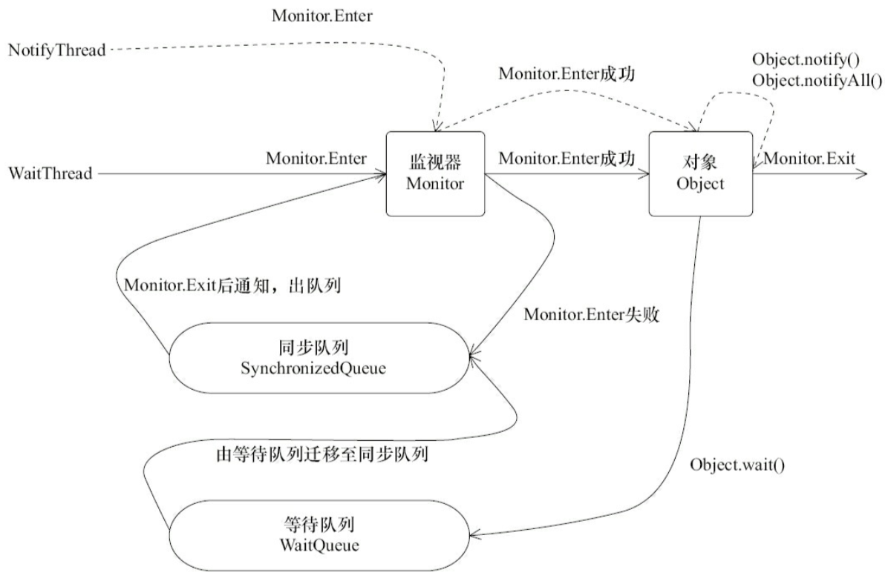

= Dubbo RPC 之 Protocol协议层（三）

在《Dubbo RPC 之 Protocol协议层（二）》中已经深入地阐述了拦截链的运行机制了，本文将着重讲讲其应用。在一些技术类的文章中，特别是公众号，总会把微服务中的一些技术点吹的神乎其神， 读者总是感觉一愣一愣的，由于机制的讲解和具体实现往往存在着很大的鸿沟，难免会让人疑团重重，产生强烈的焦虑感。本序列文章一方面全盘剖析一个微服务 框架底层到底是如何实现，另外一方面也是旨在帮助由单体式架构迁移到微服务这一领域的开发者全方位了解微服务、了解分布式开发，因此每次涉及的重要技术细节，行文风格总有打破砂锅问到底的味道。

本文将由易及难，逐个阐述基于拦截链中过滤器实现支持的功能。

== 服务实例之``ClassLoader``保持

《Dubbo类管理 与 ClassLoader》一文中曾提及：仰赖于不同的``ClassLoader``对象加载签名完全一样的类时，JVM并不会认为他们是同一个类，因而可以 通过给当前``Thread``设置``contextClassLoader``对所加载的类做版本隔离管理。

Dubbo在拦截链中实现了``ClassLoaderFilter``过滤器，其实现相对而言比较简单，首先调用``Thread.currentThread().getContextClassLoader()``将其缓存起来，记为A，然后获取入参``invoker``微服务实例服务接口所使用的类加载器，记为B，将B设置给当前线程，待``invoker.invoke(invocation)``执行完后，将当前线程的类加载器恢复为A。

注：[big]#在拦截链中，晚于当前节点的所有``Filter``对象和入参``invoker``所表示的微服务实例都将使用B这个加载器进行类的加载处理。#

[source,java]
----
/**
 * Set the current execution thread class loader to service interface's class loader.
 */
@Activate(group = CommonConstants.PROVIDER, order = -30000)
public class ClassLoaderFilter implements Filter {

    @Override
    public Result invoke(Invoker<?> invoker, Invocation invocation) throws RpcException {
        ClassLoader ocl = Thread.currentThread().getContextClassLoader();
        Thread.currentThread().setContextClassLoader(invoker.getInterface().getClassLoader());
        try {
            return invoker.invoke(invocation);
        } finally {
            Thread.currentThread().setContextClassLoader(ocl);
        }
    }

}
----

== 服务监控

Dubbo的框架分层中，有一层称为监控层的，薄薄的一片，很简洁，实际实现代码也没有多少内容，放在本文阐述主要是因为它也是使用``Filter``拦截链机制实现的。而它能作为一个抽象层被单独划分在框架图示中，也足矣说明其重要性，微服务框架中，服务治理占据着比较大的比分，必须依赖于监控得出的各项统计数据，包括服务的调用次数、调用时间等，该数据需要定时周期地发送到监控中心服务器。

image::./res/imgs/dubbo_framework_monitor.png[Dubbo监控层]

在进一步阐述其实现前，先普及下预先认知：
====
``Filter``是一个扩展点，其具类``MonitorFilter``是单例模式的，围绕着跨网络请求的实际RPC方法调用有事先执行的``前置逻辑``~先于invoker.invoke(invocation)~和事后执行的``后置逻辑``~``Filter.Listener``接口回调~。
====

Dubbo中的服务监控的基本实现方案是以RPC方法为单位~由**Statistics[application,service,method,group,version,client,server]**共同决定~，先基于拦截链机制使用``MonitorFilter``采集每次RPC方法调用的数据，将其装载在服务总线中发送给``Monitor``，后者会将一个周期内的所有接受到的数据汇总起来发送给监听服务器。

注：[small]#本章节中的下述中的所有讨论都是基于假设：服务实例是需要统计监控数据的~其配置总线中已经含有``"monitor"``配置项~#。

=== MonitorFilter

拦截链中的``MonitorFilter``负责的是单次数据的采集，针对每次服务调用，其基本实现方式是：

. 在``MonitorFilter``的前置逻辑中执行：
.. 给表征当前RPC方法调用的``Invocation``实例本地参数容器中置入``<"monitor_filter_start_time",System.currentTimeMillis()>``；
.. 使用``invoker.getInterface().getName() + "." + invocation.getMethodName()``从记录微服务方法当前并发次数的``ConcurrentMap<String, AtomicInteger>``容器中获得对应计数器``my_counter``，执行``+1``操作；
. 在基于通知回调方式执行后置逻辑中执行：
.. 无论是在``onResponse()``还是``onError()``回调中，都获取``my_counter``执行``-1``操作；
.. 采集包括``my_counter``在内的所有如下数据(分3组)：
... 配置总线URL基础组成~Dubbo中的复合数据使用配置总线携带传递，需满足关键构成~：
* protocol: ``"count"``
* host: ``NetUtils.getLocalHost()``
* port: ``0|invoker.url.getPort()``
* path: invoker.getInterface().getName() + "/" + RpcUtils.getMethodName(invocation)

... ``Statistics``键~用于唯一确定一个RPC方法的组合数据~：
* `<"application",invoker.url["application"]>`
* **service: **`<"interface",invoker.getInterface().getName()>`
* `<"method",RpcUtils.getMethodName(invocation)>`
* `<"group",invoker.url["group"]>`
* `<"version",invoker.url["version"]>`
* *client | server*: `<"consumer",RpcContext.getContext().getRemoteHost()>`|`<"provider",invoker.url.getAddress()>`

... 统计项~监控层需要的各项统计数据~：
* `<"concurrent",my_counter>`
* `<"success"|"failure",1>`
* `<"elapsed",System.currentTimeMillis() - invocation.url["monitor_filter_start_time"]>`
* `<"input",invocation.url["input"]>`
* `<"output",invocation.url["output"]>`
.. 使用采取数据构建配置总线URL实例，形如：`count://host/interface?application=foo&method=foo&provider=10.20.153.11:20880&success=12&failure=2&elapsed=135423423`
. 获取``Monitor``实例，将得到的URL实例传递给它；

注：[small]#input和output指的是入站接收到的或出站发送出去的数据比特量#

==== 源码实现注意点

=== Monitor

``Monitor``负责数据的收集处理，并将单位间隔时间的每个RPC方法的所有调用汇总并发送给监控服务器。

==== 数据汇总
汇总数据的计算方式是每次``Monitor``收到数据后，针对接受到的由配置总线URL携带的数据进行如下操作：

. 取出用于构建``Statistics``实例A的组成数据~``Statistics``键~；
. 使用实例A获得对应RPC方法的既有监控数据项（统计数据装在``ConcurrentMap<Statistics,AtomicReference<long[]>>``类型的``statisticsMap``容器中）；
. 进行如下数据汇总处理~记为``SummaryData``~：
* `<"success", + url["success"]>`
* `<"failure", + url["failure"]>`
* `<"input", + url["input"]>`
* `<"output", + url["output"]>`
* `<"elapsed", + url["elapsed"]>`
* `<"concurrent", (+ url["elapsed"])/2>`
* `<"max.input", max(,url["input"])>`
* `<"max.output", max(,url["output"])>`
* `<"max.elapsed", max(,url["elapsed"])>`
* `<"max.concurrent", max(,url["concurrent"])>`

==== 实现源码剖析

下述从更加宏观的粒度按特性分组梳理下整个``DubboMonitor``的实现结构。

===== 监控数据的周期推送

Monitor周期性的发送监控数据给监控服务器，其实现原理是使用``ScheduledExecutorService``大概每1分钟，遍历``statisticsMap``容器中的汇总的所有RPC方法的统计数据，逐个做如下处理：

注：[small]#遍历元素：``Map.Entry<Statistics, AtomicReference<long[]>> entry``，值是一个含有10个元素的数组，和``SummaryData``一一对应#

. 获取统计数据``SummaryData``，按照既有键值对模式构建URL实例``urlData``；
. 使用监控微服务``MonitorService``的引用实例，使用``urlData``唤起对RPC方法``collect()``的调用；
. 对``entry``中的``AtomicReference<long[]>``类型值做清零处理；

[source,java]
----
public class DubboMonitor implements Monitor {
    private final ScheduledExecutorService scheduledExecutorService =
        Executors.newScheduledThreadPool(3,
            new NamedThreadFactory("DubboMonitorSendTimer", true));

    private final ScheduledFuture<?> sendFuture;

    public DubboMonitor(Invoker<MonitorService> monitorInvoker, MonitorService monitorService) {
        this.monitorInvoker = monitorInvoker;
        this.monitorService = monitorService;
        this.monitorInterval = monitorInvoker.getUrl().getPositiveParameter("interval", 60000);
        // collect timer for collecting statistics data
        sendFuture = scheduledExecutorService.scheduleWithFixedDelay(() -> {
            try {
                // collect data
                send();
            } catch (Throwable t) {
                logger.error("Unexpected error occur at send statistic, cause: " + t.getMessage(), t);
            }
        }, monitorInterval, monitorInterval, TimeUnit.MILLISECONDS);
    }

    @Override
    public void destroy() {
        try {
            ExecutorUtil.cancelScheduledFuture(sendFuture);
        } catch (Throwable t) {
            logger.error("Unexpected error occur at cancel sender timer, cause: " + t.getMessage(), t);
        }
        monitorInvoker.destroy();
    }
    ...
}
----

===== 针对``entry``值的设置和清零处理

Dubbo微服务中，RPC方法调用是一种高并发场景，因而其监控数据的统计也需要做对应支持，否则汇总出来的数据会存在gap，失之毫厘，谬以千里，为保证准确性Dubbo实现中使用了``AtomicReference``，利用其CAS机制做设值和清零处理。如下述代码~含部分伪代码~所示：

[source,java]
----
private final ConcurrentMap<Statistics, AtomicReference<long[]>> statisticsMap = new ConcurrentHashMap();

public void send() {
    ...
    for (Map.Entry<Statistics, AtomicReference<long[]>> entry : statisticsMap.entrySet()) {
        ...//使用collect()方法汇总的数据构建URL配置总线实例，
        //将汇总数据通过monitorService服务引用实例发送给监控服务器
        monitorService.collect(url);
        // get statistics data
        Statistics statistics = entry.getKey();
        AtomicReference<long[]> reference = entry.getValue();
        //发送汇总数据后的清零处理
        // reset
        long[] current;
        long[] update = new long[LENGTH];
        do {
            current = reference.get();
            if (current == null) {
                update[0,5] = 0;
            } else {
                update[0,5] = current[0,5] - url[***];
            }
        } while (!reference.compareAndSet(current, update));
        ...
    }
    ...
}

public void collect(URL url) {
    ...
    //汇总设值处理
    // use CompareAndSet to sum
    long[] current;
    long[] update = new long[LENGTH];
    do {
        current = reference.get();
        if (current == null) {
            update = success;
        } else {
            update = (current + url[***]) | max(current,url[***]);
        }
    } while (!reference.compareAndSet(current, update));
    ...
}
----
上述源码中的清零处理中的``else块``理解起来比较费劲，背后的原因是``send()``和``collect(URL url)``在并发环境下执行，尽管可以认为``send()``是串行执行的，但是``collect(URL url)``并发量很大，和它存在资源争用的问题。比如在``send()``方法调用完向监控服务发送数据的RPC方法后，get到``entry``值，将清零后的值放在``update``临时变量中，随后打算设回到``entry``，但是``compareAndSet(current, update)``返回false，也就是此前瞬间有个过程``collect(URL url)``改变了它的值，如果此时再次CAS简单的清零处理，那么后面这个汇总步骤就相当于丢失了。

===== ``Monitor``和``MonitorService``

文中已经提到``Monitor``监控统计的数据最终会调用RPC接口发送到监控服务器，这个跨机器的接口使用``MonitorService``表示，而实际上Monitor也实现自该接口，也就是说``Monitor``的实现``DubboMonitor``可以认为是前者的代理，如下述源码所示：

[source,java]
----
public interface Monitor extends Node, MonitorService {

}

public interface MonitorService {
    .../其它组成SummaryData需要使用的常量键

    void collect(URL statistics);

    List<URL> lookup(URL query);

}

public class DubboMonitor implements Monitor{

    private final Invoker<MonitorService> monitorInvoker;

    private final MonitorService monitorService;

    ...

    @Override
    public List<URL> lookup(URL query) {
        return monitorService.lookup(query);
    }

    @Override
    public URL getUrl() {
        return monitorInvoker.getUrl();
    }

    @Override
    public boolean isAvailable() {
        return monitorInvoker.isAvailable();
    }

    @Override
    public void destroy() {
        ...
        monitorInvoker.destroy();
    }
}
----

== 并发量控制

瞬间大量涌入的RPC请求势必造成服务Provider短时间处于高负荷承载状态，原本正常范围能顺利处理的请求迟迟没法响应，更糟糕的是可能会因为机器反应不过来而导致宕机风险，因此对于某些CPU密集型或者I/O密集型任务，需要做相应的并发配置。

Dubbo可以针对微服务的服务实例和引用实例分别做并发数配置，其配置可以是方法级别的，如下：
[source,xml]
----

<!--服务端配置方式-->
<dubbo:service interface="com.foo.BarService" executes="10">
    <dubbo:method name="sayHello" executes="5" />
    <dubbo:method name="echo"/>
</dubbo:service>

<!--客户端配置方式-->
<dubbo:reference interface="com.foo.BarService" actives="10">
    <dubbo:method name="sayHello" actives="5" />
    <dubbo:method name="echo"/>
</dubbo:service>

----

上述配置，在服务导出或者服务引入的时候会被转换成配置总线URL中对应的项，方法级别的会加上前缀，形如``methodName+ "." + configItem``，只有加上了如上配置，就会自动激活用于并发控制的Filter扩展点具类———`ExecuteLimitFilter` 或 `ActiveLimitFilter`。因服务端和客户端要采集的数据项是一致的，思路基本也一致，因而大部分公共逻辑都被抽离到``RpcStatus``这个类加以处理。

[source,java]
----
@Activate(group = CommonConstants.PROVIDER, value = EXECUTES_KEY)
public class ExecuteLimitFilter extends ListenableFilter {...}

@Activate(group = CONSUMER, value = ACTIVES_KEY)
public class ActiveLimitFilter extends ListenableFilter {...}
----

=== RpcStatus

正如其名字所示，``RpcStatus``是用于记录一个微服务RPC方法当前状态的行为类，自微服务的服务实例或引用实例启动开始就开始记录，在运行的任何时候使用它都能获取到一个目标RPC方法的当前状态。若已配置，`ExecuteLimitFilter` 或 `ActiveLimitFilter`在微服务导出或者引入时随拦截链生成而激活，后续的每一次RPC方法被调用或调用时都会改变与之相绑定的``RpcStatus``的状态值。

``RpcStatus``采集的当前状态值包括如下几项，所有这些变量都原子的~RPC方法在并发环境下被调用~，实例化开始时就经过初始化的，并且声明为final的：

* *并发数*：`AtomicInteger active`
* *调用总数*：`AtomicLong total`
* *失败总数*：`AtomicInteger failed`
* *总计耗时*：`AtomicLong totalElapsed`
* *失败总计耗时*：`AtomicLong failedElapsed`
* *最大耗时*：`AtomicLong maxElapsed`
* *最大失败耗时*：`AtomicLong failedMaxElapsed`
* *最大成功耗时*：`AtomicLong succeededMaxElapsed`

下述数据是可以依赖上述变量获取的，这些推导类方法属于``RpcStatus``实例本身：

* *平均TPS*：`getAverageTps()：totalElapsed < 1000 ? total : total ÷ (totalElapsed ÷ 1000)`
* *成功总数*：`getSucceeded()：total - failed`
* *成功总计耗时*：`getSucceededElapsed()：totalElapsed - failedElapsed`
* *平均成功耗时*：`getSucceededAverageElapsed()：getSucceededElapsed() / getSucceeded()`
* *平均失败耗时*：`getFailedAverageElapsed()：failedElapsed / failed`
* *平均耗时*：`getAverageElapsed()：totalElapsed / total`

上述提过``RpcStatus``统计的状态可以是方法级别的，也可以是服务级别的，并且每一个配置了并发数参数的服务或者方法都需要隐式绑定的一个``RpcStatus``实例，因此声明如下两个静态变量，用于映射关系并缓存这些实例的容器：
[source,java]
----
private static final ConcurrentMap<String, RpcStatus> SERVICE_STATISTICS
    = new ConcurrentHashMap<>();

private static final ConcurrentMap<String, ConcurrentMap<String, RpcStatus>> METHOD_STATISTICS
    = new ConcurrentHashMap<>();

//声明为私有
private RpcStatus() {}

public static RpcStatus getStatus(URL url) {
    String uri = url.toIdentityString();
    RpcStatus status = SERVICE_STATISTICS.get(uri);
    if (status == null) {
        SERVICE_STATISTICS.putIfAbsent(uri, new RpcStatus());
        status = SERVICE_STATISTICS.get(uri);
    }
    return status;
}

public static void removeStatus(URL url) {
    String uri = url.toIdentityString();
    SERVICE_STATISTICS.remove(uri);
}

public static RpcStatus getStatus(URL url, String methodName) {
    String uri = url.toIdentityString();
    ConcurrentMap<String, RpcStatus> map = METHOD_STATISTICS.get(uri);
    if (map == null) {
        METHOD_STATISTICS.putIfAbsent(uri, new ConcurrentHashMap<String, RpcStatus>());
        map = METHOD_STATISTICS.get(uri);
    }
    RpcStatus status = map.get(methodName);
    if (status == null) {
        map.putIfAbsent(methodName, new RpcStatus());
        status = map.get(methodName);
    }
    return status;
}

public static void removeStatus(URL url, String methodName) {
    String uri = url.toIdentityString();
    ConcurrentMap<String, RpcStatus> map = METHOD_STATISTICS.get(uri);
    if (map != null) {
        map.remove(methodName);
    }
}
----
其中用于用于隐式绑定服务和服务的方法的二级Key键分别是：

* 一级Key键~服务级，由url.toIdentityString()取得~：``[protocol + "://" + [username[":" + password] + "@"]][host[":" + port]]["/" + path]``

* 二级Key键~方法级~：`(url.toIdentityString() + ) methodName`

无论是用于服务端还是客户端的状态统计，基本思路都是一致的，在进入Filter的前置逻辑中先执行检验当前RPC方法调用是否操作最大并发数的限制，如果超过就会被拒绝。``RpcStatus``类提供了相应的静态方法，超过``active``值返回false，拒绝逻辑由调用它的Filter负责，如下：
[source,java]
----
public static void beginCount(URL url, String methodName) {
    beginCount(url, methodName, Integer.MAX_VALUE);
}

public static boolean beginCount(URL url, String methodName, int max) {
    max = (max <= 0) ? Integer.MAX_VALUE : max;
    RpcStatus appStatus = getStatus(url);
    RpcStatus methodStatus = getStatus(url, methodName);
    if (methodStatus.active.get() == Integer.MAX_VALUE) {
        return false;
    }
    if (methodStatus.active.incrementAndGet() > max) {//TagX
        methodStatus.active.decrementAndGet();
        return false;
    } else {
        appStatus.active.incrementAndGet();
        return true;
    }
}
----

上述``TagX``标识的前的逻辑判断及其后的代码块中，先执行``incrementAndGet()``，在发现超过限制后，随后立马又执行``decrementAndGet()``。为啥不直接取得值同``max``对比？文中我们一直强调，RPC方法是在并发环境下执行的，因为这个原因``RpcStatus``把所有的用于统计状态的属性都定义成了原子变量，假设同一瞬间，有两个方法都进入了TagX前的判断逻辑，发现都满足要求，也就是并没有超过并发量，这时就都会执行``else{...}``逻辑块，也即都执行了``incrementAndGet()``，这样就会出现最终并发量会比实际配置要大的情况。

绝大部分的统计只能在Filter的响应逻辑中通过回调异步执行，因而本章节使用到的两个``Filter``扩展自``ListenableFilter``。有关执行统计的逻辑并不复杂，如下所示：
[source,java]
----
public static void endCount(URL url, String methodName, long elapsed, boolean succeeded) {
    endCount(getStatus(url), elapsed, succeeded);
    endCount(getStatus(url, methodName), elapsed, succeeded);
}

private static void endCount(RpcStatus status, long elapsed, boolean succeeded) {
    status.active.decrementAndGet();
    status.total.incrementAndGet();
    status.totalElapsed.addAndGet(elapsed);
    if (status.maxElapsed.get() < elapsed) {
        status.maxElapsed.set(elapsed);
    }
    if (succeeded) {
        if (status.succeededMaxElapsed.get() < elapsed) {
            status.succeededMaxElapsed.set(elapsed);
        }
    } else {
        status.failed.incrementAndGet();
        status.failedElapsed.addAndGet(elapsed);
        if (status.failedMaxElapsed.get() < elapsed) {
            status.failedMaxElapsed.set(elapsed);
        }
    }
}
----

=== ExecuteLimitFilter

详解完``RpcStatus``后，理解``ExecuteLimitFilter``的实现就很简单了。首先看看基于响应的回调逻辑，父类``ListenableFilter``要求子类提供``Filter``中定义的``Listener``回调接口实现，``ExecuteLimitListener``即为实现。``Filter``前置逻辑中记录了RPC方法被调用的时间，其值以``"execugtelimit_filter_start_time"``为标识记录在RPC方法参数``invocation``对象的参数容器中。

[source,java]
----
@Activate(group = CommonConstants.PROVIDER, value = EXECUTES_KEY)
public class ExecuteLimitFilter extends ListenableFilter {

    private static final String EXECUTELIMIT_FILTER_START_TIME = "execugtelimit_filter_start_time";

    public ExecuteLimitFilter() {
        super.listener = new ExecuteLimitListener();
    }
    ...
    static class ExecuteLimitListener implements Listener {
        @Override
        public void onResponse(Result appResponse, Invoker<?> invoker, Invocation invocation) {
            RpcStatus.endCount(invoker.getUrl(), invocation.getMethodName(),
                getElapsed(invocation), true);
        }

        @Override
        public void onError(Throwable t, Invoker<?> invoker, Invocation invocation) {
            if (t instanceof RpcException) {
                RpcException rpcException = (RpcException)t;
                if (rpcException.isLimitExceed()) {
                    return;
                }
            }
            RpcStatus.endCount(invoker.getUrl(), invocation.getMethodName(),
                getElapsed(invocation), false);
        }

        private long getElapsed(Invocation invocation) {
            String beginTime = invocation.getAttachment(EXECUTELIMIT_FILTER_START_TIME);
            return StringUtils.isNotEmpty(beginTime) ?
                System.currentTimeMillis() - Long.parseLong(beginTime) : 0;
        }
    }
}
----

``ExecuteLimitListener``异常响应回调逻辑处理中，对因超过并发量抛出的异常直接忽略处理。服务端对接入请求检测超过并发量时就会直接抛异常，这类型的异常``RpcStatus``不做统计。

[source,java]
----
public Result invoke(Invoker<?> invoker, Invocation invocation) throws RpcException {
    URL url = invoker.getUrl();
    String methodName = invocation.getMethodName();
    int max = url.getMethodParameter(methodName, EXECUTES_KEY, 0);
    if (!RpcStatus.beginCount(url, methodName, max)) {
        throw new RpcException(RpcException.LIMIT_EXCEEDED_EXCEPTION,
                "Failed to invoke method " + invocation.getMethodName() + " in provider " +
                        url + ", cause: The service using threads greater than <dubbo:service executes=\"" + max +
                        "\" /> limited.");
    }

    invocation.setAttachment(EXECUTELIMIT_FILTER_START_TIME, String.valueOf(System.currentTimeMillis()));
    try {
        return invoker.invoke(invocation);
    } catch (Throwable t) {
        if (t instanceof RuntimeException) {
            throw (RuntimeException) t;
        } else {
            throw new RpcException("unexpected exception when ExecuteLimitFilter", t);
        }
    }
}
----

在剖析拦截链相关的章节中已经提到，``Filter``构成一条拦截链，先挨个执行前置逻辑，到最后才执行真正的RPC方法调用，执行完后反向顺序挨个执行这些``Filter``的后置逻辑，链上的任意点抛出异常都会结束这个流程。一个``Filter``如果提供了``Filter.Listener``实现，那么链上发生的任何异常都会通过回调其``onError()``方法告知。

=== ActiveLimitFilter

相比服务端，客户端的``ActiveLimitFilter``实现比较复杂点，当前并发数已超额的情况下，不能直接对客户端程序提交的RPC请求做拒绝处理，应该尽可能地在超时之前让其有机会执行——等并发数下降第一时间获得计算资源。超额说明隐式绑定于当前RPC方法的``RpcStatus``对象在多线程环境下是一个争用资源，因而可以结合锁机制让当前RPC方法获得执行机会。

在进一步剖析的``ActiveLimitFilter``实现前，我们先看看如下图所示的Java锁中的``等待-通知``机制。

____
. 每个互斥锁，也即图中的由对象持有的Monitor监视器，都持有两个队列，分别是同步队列和等待队列；
. 同一时刻，只允许一个线程进入``synchronized``保护的临界区，若已有线程进入临界区，其他线程只能进入同步队列等待；
. 在临界区的线程WaitThread，发现某些条件不满足，调用``wait()``方法，释放持有的互斥锁，进入等待队列；
. 同步队列中的其他线程NotifyThread获得锁并进入临界区，当线程WaitThread要求的条件满足时，它通过``notify()/notifyAll()``发出通知；
. 处于等待队列中的线程WaitThread转移到同步队列，如果竞争获得锁则从``wait()``返回重新回到临界区执行剩下的逻辑代码；

[NOTE]
====
. ``sleep``不会释放互斥锁；
. 执行``notify()/notifyAll()``并不会释放互斥锁，在``synchronized``代码块结束后才真正的释放互斥锁；
. ``notify()/notifyAll()``执行后会将线程从等待队列移入到同步队列，前者挑选一个，后者则取得所有，被移动的线程状态由``WAITING``变成``BLOCKED``；
====
____

回到正题，当``ActiveLimitFilter``发现当前RPC方法在所属服务引用实例上已经超过了配置并发数，便开始执行如下逻辑：

. 基于配置项``invoker.url[methodName + "." + "timeout"]``获取超时时间``timeout``
. 将剩下超时时间设为``remain = timeout``，并记录当前时间start
. 尝试使用``synchronized``获取到对应的``rpcStatus``锁，没有获取到则在此位置阻塞，否则在其临界区执行如下循环逻辑：
.. 若检测到当前并没有超过并发数，则释放锁退出当前临界区；
.. 调用``rpcStatus.wait(remain)``释放锁进入条件队列；
.. 超时或者因通知重新获得锁后，计算剩下的超时时间``remain = timeout - System.currentTimeMillis() + start;``;
.. 如果``remain <= 0``则抛错处理，否则进入下一次循环；

[source,java]
----
@Override
public Result invoke(Invoker<?> invoker, Invocation invocation) throws RpcException {
    ...
    if (!RpcStatus.beginCount(url, methodName, max)) {
        long timeout = invoker.getUrl().getMethodParameter(invocation.getMethodName(), TIMEOUT_KEY, 0);
        long start = System.currentTimeMillis();
        long remain = timeout;
        synchronized (rpcStatus) {
            while (!RpcStatus.beginCount(url, methodName, max)) {
                try {
                    rpcStatus.wait(remain);
                } catch (InterruptedException e) {
                    // ignore
                }
                long elapsed = System.currentTimeMillis() - start;
                remain = timeout - elapsed;
                if (remain <= 0) {
                    throw new RpcException(RpcException.LIMIT_EXCEEDED_EXCEPTION,
                            "Waiting concurrent invoke timeout in client-side for service:  "
                             +...+ ". max concurrent invoke limit: " + max);
                }
            }
        }
    }
    ...
}
----

上述代码中，使用``synchronized + wait``组合在某个线程X中等待条件的出现，根据语法规则，需要由``synchronized + notify|notifyAll``组合在另外一个线程Y条件满足时通知X，那究竟谁是Y？我们已经清楚，RPC方法执行完后会通过异步回调``ActiveLimitListener``的``onResponse``和``onError``方法告知执行结果，而他们是由``CompletableFuture``新产生的线程负责执行的，这个执行回调的线程也即我们要找的Y，具体可以参看《Dubbo RPC 之 Protocol协议层（一）》中的讲述``subscribeTo` & `whenCompleteWithContext``这一章节。

如下，定义了``notifyFinish()``，该方法直接获取``rpcStatus``锁执行``notifyAll()``通知。从并发数控制这一场景来讲，当一个RPC请求XReq发现超额时，肯定是当前针对同一个RPC方法的正在运行的请求已经满额，XReq随后便会执行加锁处理，并且紧接着大概率调用了``wait()``让自己进入等待队列，因而先获得锁的线程在处理完请求后，不管三七二十一先获取锁，随后便``notifyAll()``通知所有处于WAITING状态的线程转移到BLOCKING等锁状态。能够获取锁要么说明在同步队列竞争获锁成功，要么说明本身并不超额没有竞争就获得锁，也就是说这里可以采用双检机制结合前文提到``TagX``方式进行效率优化，虽然当前逻辑处于异步的回调中，但它却决定了后续其它RPC请求是否能更快得到处理。

[source,java]
----
static class ActiveLimitListener implements Listener {
    @Override
    public void onResponse(Result appResponse, Invoker<?> invoker, Invocation invocation) {
        ...
        int max = invoker.getUrl().getMethodParameter(methodName, ACTIVES_KEY, 0);
        notifyFinish(RpcStatus.getStatus(url, methodName), max);
    }

    @Override
    public void onError(Throwable t, Invoker<?> invoker, Invocation invocation) {
        ...
        int max = invoker.getUrl().getMethodParameter(methodName, ACTIVES_KEY, 0);
        notifyFinish(RpcStatus.getStatus(url, methodName), max);
    }

    private void notifyFinish(final RpcStatus rpcStatus, int max) {
        if (max > 0) {
            synchronized (rpcStatus) {
                rpcStatus.notifyAll();
            }
        }
    }
}
----