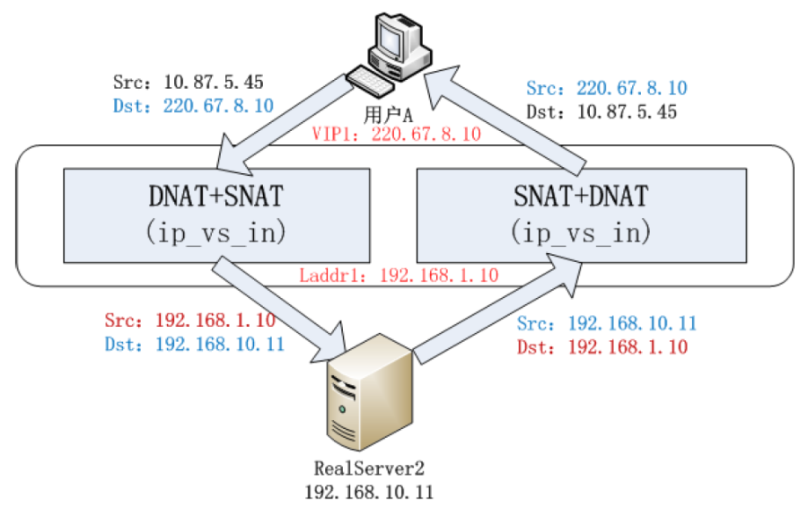
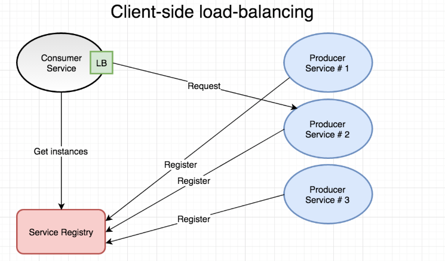
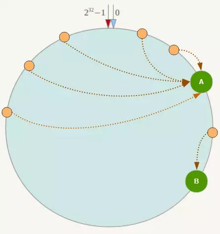
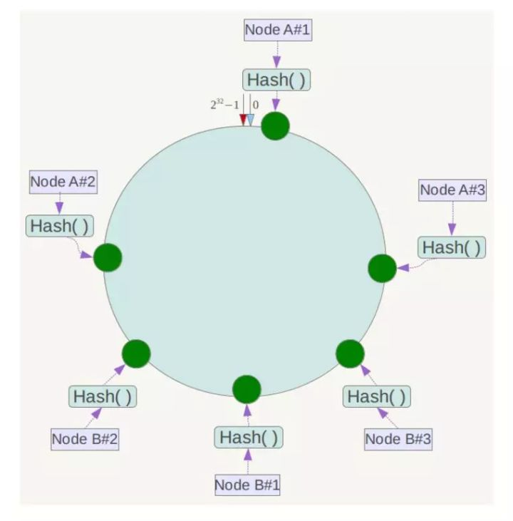

= 【十一】Dubbo集群 之 负载均衡

____
In computing, load balancing improves the distribution of workloads across multiple computing resources, such as computers, a computer cluster, network links, central processing units, or disk drives. Load balancing aims to optimize resource use, maximize throughput, minimize response time, and avoid overload of any single resource. Using multiple components with load balancing instead of a single component may increase reliability and availability through redundancy.
____

上述来自于维基百科中关于“负载均衡”的介绍，大致意思是：

____
在计算机应用中，负载均衡可改善跨多个计算资源（例如计算机，计算机集群，网络链接，中央处理单元或磁盘驱动器）的工作负载分配。它旨在优化资源使用，最大化吞吐量，最小化响应时间并避免任何单个资源的过载。负载均衡利用冗余方式使用多个组件而不是单个组件提高可靠性和可用性。
____

== 负载均衡和微服务

在微服务开发领域，可以认为：1）不同微服务的实例发生通讯时，其RPC调用过程中会产生的一序列复杂的、业务无关的处理逻辑，既是分布式处理；2）为应对单一服务实例负载过重，或者异常导致的服务不可用，同一个微服务存在多个实例，在这多个实例中挑选一个以响应当前请求，这里涉及的一堆复杂处理逻辑，便对应可以认为是集群处理。本文所讨论的负载均衡应对的正是集群处理中的解决同一微服务多实例负载分配的问题，解决服务实例存在的单点故障问题。

[big]#负载均衡，令人容易本能地认为将任务均匀分配#。实际上任务的分配的考虑因素可能是负载、性能~吞吐量、响应时间~、业务特性等，例如同一个服务可能在北京和深圳都有部署实例，其它依赖他们的微服务在负载均衡的作用下会就近路由到其中一个实例上。

技术发展日新月异，负载均衡方案也随之发生着变化，从传统服务端模式到现代微服务模式，其实现方式也经历了多次变革，在进一步了解Dubbo微服务的负载均衡前，我们先大体回顾下各种方案，主要是理解他们的大致实现原理。

[IMPORTANT]
====
[small]#尽管多样，但由于始终和OSI网络通讯模型紧密相关，因而可以对应被划分在不同的层上。#

下文提到的``NAT、DR、TUN 和 FULLNAT``这4种模式由于需要使用到端口信息，对应着OSI网络模型中的传输层，因而习惯上被统称为4层负载均衡，显然微服务中采用的``客户端 和 服务端``模式相应地被划分为7层负载均衡。
====

== 传统服务端模式

注：[small]#本章节主要参考link:https://cloud.tencent.com/developer/article/1031624[大型网站架构系列：负载均衡详解]、link:http://blog.sina.com.cn/s/blog_620c47630102v2iz.html[吴佳明(普空)：LVS在大规模网络环境中的应用 ] 和 link:https://yizhi.ren/2019/05/03/lvs[LVS的原理-工作模式]。#

负载均衡最常使用的场景是从多个服务器提供单个Internet服务。例如流行的网站、大型Internet中继聊天网络、高带宽文件传输站点、网络新闻服务器、域名系统服务器和数据库。传统负载均衡的经典模式如下图所示：

image::./res/imgs/web_dis_load_balance.png[经典负载均衡架构]

其中的负载均衡设备根据负载均衡策略将接入的用户请求分发到集群的某一台机器上，同一应用部署到多个机器上便组成了集群。

====
____
. `DS`：director server，即负载均衡器，根据一定的负载均衡算法将流量分发到后端的真实服务器上；
. `RS`：real server 真实的提供服务的server，可被DS划分到一个或多个负载均衡组；
. `VIP`：VS的IP，client请求服务的DIP（destination IP address），定义在DS上，client或其网关需要有其路由；
____

* `CIP` & `DIP` & `RIP`：分别代表客户端client的IP、DS的IP、RS的IP；
* ``VIP``用于对外提供服务，采用的是公网IP，而``DIP``是负载均衡器的IP，虽和``VIP``属于同一主机，但一般是当前局域网IP。

====

=== DNS负载均衡

在DNS域名服务器中将集群中所有机器IP配置为指向同一域名，由DNS根据用户请求中内含特征将请求就近转发给其中一个实例。

image::./res/imgs/web_dis_load_balance_dns.png[DNS负载均衡]

该模式由于掌控权控制在域名服务商手里，扩展性受到限制。

=== (NAT模式)IP负载均衡

用户请求接入后，``DS``在系统内核中``<Src:CIP,Dst:VIP>``根据负载均衡算法选用到的``RS``修改为``<Src:CIP,Dst:RIP>``^DNAT^，封装成新的IP请求报文后发送给``RS``，``RS``处理完请求将响应返回给``DS``，``DS``将收到的IP响应报文``<Src:RIP,Dst:CIP>``修改为``<Src:VIP,Dst:CIP>``^SNAT^，最后返回给client。

image::./res/imgs/web_dis_load_balance_ip.png[IP负载均衡]

[NOTE]
====
1）``RS``的网关必须设置为``DS``；2）需要开启``IP-Forward``支持``DS``修改源IP并转发数据包；

``IP-Forward``：当主机拥有多于一块的网卡时，其中一块收到数据包，根据数据包的目的ip地址将数据包发往本机另一块网卡，该网卡根据路由表继续发送数据包。
====

这一模式还存在另外一种形式：``DS``在接入请求后，将IP请求报文修改为``<Src:VIP,Dst:RIP>``，也即对数据包的目标IP地址进行修改的同时，将数据包的源地址设置为自身，也即源地址转换。

缺点是集群的最大吞吐量受制于负载均衡服务器的带宽。

=== (DR模式)链路层负载均衡

``RS``集群和``DS``~不作为网关出现~处于同一物理网络中的，Client发送一个``<Src:CIP,Dst:VIP>``IP请求报文，当``DS``接受请求后挑中某个``RS``作为目标机，并将其当前报文中的MAC地址设成``R_MAC``，随后发送一个ARP广播出去，私有``loopback``环回接口绑定了VIP的所有``RS``接受到请求后，只有MAC地址为``R_MAC``的``RS``服务器会响应请求。

image::./res/imgs/web_dis_load_balance_dr.png[DR负载均衡]

[NOTE]
====
. ``RS``集群中所有机器将``VIP``绑定在``loopback``环回接口上的原因有三：1）``DS``在转发请求时并没有修改目标IP地址，而报文接受方需要同时匹配目标IP和目标MAC地址，否则丢包处理，因此``RS``主机需要绑定``VIP``；2）在同一个网段中是不能存在IP冲突的，即便是虚拟IP，但``loopback``环回接口绑定的IP地址是本机私有的，不在网络上共享，因而不会产生冲突；3）当前物理网络中，只存在一个IP为``VIP``的主机，因此client使用``VIP``构建报文后能准确匹配到目标``DS``主机。

. 在局域网中的所有机器都是通过广播的形式进行通讯的，其中一台机器发送的消息会被所有其他机器接受到，后者会将报文中的目标地址~包括IP信息和MAC地址~和自身的比对，如果一致就接受并做响应处理，否则略过。

. 网络通讯发生的前提是知晓彼此MAC地址，当局域网中的客户端机器不知道目标机器的MAC地址时，可以在通讯正式发生之前将其设为12个F的广播地址，目标机器收到广播后会返回自身MAC地址信息，这一过程是受ARP协议支持的。DR负载均衡模式中，由于``DS``已经明确指明了目标机的MAC地址，目标IP地址VIP也和本机绑定在环回接口的私有IP一致，因而不会有ARP协议参与响应。

====

该模式中，``DS``无需处理响应和``Ip-Forward``数据转发，因而它不会像IP负载均衡模式中那样成为瓶颈。

=== (TUN模式)IP tunnel负载均衡

接受到报文后，``DS``依然执行负载算法挑选出``RS``；在报文转发给``RS``前会先对其进行IP封包~形成IPIP包~，报文内容为``[<Src:DIP,Dst:RIP>,<Src:CIP,Dst:VIP>,...]``，随后报文被发给``RS``；``RS``收到报文后，剥离掉IP隧道包头，发现还原得到IP报文``[<Src:CIP,Dst:VIP>,...]``中的目标IP~也即VIP~和绑定在自身环回接口上的一致，因而接受报文并处理响应，最后使用该环回接口经实体网卡将数据发送给client~由解IP包获得源IP地址CIP确定的客户机~。

image::./res/imgs/web_dis_load_balance_iptun.png[多级全局式负载均衡]

[NOTE]
====
IP隧道：报文发送方在IP头的外部再包裹一个IP头，接收方先解析出第一个IP头，然后再按照正常流程处理剩下的的IP数据包。
====

该模式中，每个数据包都要新增IP报头，如果收到的数据包已经达到以太网帧最大长度1.5K，会因为IP报头没法添入而引发异常。

=== (FULLNAT模式)IP负载均衡

``NAT、DR、TUN``这3种模式要么配置复杂，要么限定只能使用于同一局域网，因而淘宝在``NAT``模式的基础上提出了FULLNAT模式。

用户请求接入后，``DS``在系统内核中``<Src:CIP,Dst:VIP>``根据负载均衡算法选用到的``RS``修改为``<Src:DIP,Dst:RIP>``，封装成新的IP请求报文后发送给``RS``，``RS``处理完请求将响应返回给``DS``，``DS``将收到的IP响应报文``<Src:RIP,Dst:DIP>``修改为``<Src:VIP,Dst:CIP>``，最后返回给client。

不同于``NAT``模式的是，``NAT``模式中``DS``对入站报文和出站报文分别做DNAT和SNAT处理，如下图：

image::./res/imgs/web_dis_load_balance_net.png[DNAT+SNAT]

而FULLNAT模式对入出站报文均做FULLNAT~DNAT+SNAT~处理，在公网VIP和局域网DIP间转换，如下图：

____

``FULLNAT模式``的问题是：RS无法获得CIP，淘宝提出TOA概念，主要原理是“将client address放到了TCP Option里面带给后端RS，RS收到后保存在socket的结构体里并通过toa内核模块hook了getname函数，这样当用户调用getname获取远端地址时，返回的是保存在socket的TCPOption的IP。”
____

``FULLNAT模式``主要的思想是把网关和其下机器的通信，改为了普通的网络通信，从而解决了跨局域网通讯的问题，大大提高了运维部署的便利性。

``RS``的增减可能会影响到客户端连接不能固定落到某同一个``RS``主机上，要求DS使用一致性算法来调度客户端的连接。

=== 混合型负载均衡

==== 多级全局式

由于多个服务器群内硬件设备、各自的规模、提供的服务等的差异，可以考虑给每个服务器群采用最合适的负载均衡方式，然后再将这多个服务器集群组成一个规模更大的服务器集群，在前面再增加一个全局负载均衡服务器，以一个整体向外界提供服务，从而达到最佳的性能。

image::./res/imgs/web_dis_load_balance_mix_global.png[多级全局式负载均衡]

==== 动静分离式

流媒体特别发达的今天，类似新闻、图片社交类的网站，其富文本交互会涉及到大量的静态资源，它们可能占比不算特别大，但访问很频繁，变化却不那么频繁。于提供这类服务的服务器集群而言，可以采用动静分离模式，在负载均衡服务器前再增设一台反向代理服务器，将静态资源交由它处理，该模式下的反向代理服务器可以起到缓存和动态请求分发的作用，当静态资源已有缓存时，可直接返回。

image::./res/imgs/web_dis_load_balance_mix_proxy.png[动静分离式负载均衡]

== 现代微服务模式

微服务开发中，传统服务模式使用的负载均衡模式基本不再适用，即便使用同一原理，也得对应重新适配。

=== 客户端模式

微服务架构模式中，离不开服务注册中心的支持，也正是因为有了它的加持，大多数微服务框架会采用基于客户端模式的负载均衡实现。基本原理是：

. 服务提供者Provider的实例启动时会将其服务名称、地址等基本信息上报到注册中心Registry，形成该Provider的一个服务实例列表；
. 在服务消费者Consumer提供服务逻辑名通过Registry对Provider进行引用时，Registry会返回一个含有1到多个其引用实例的列表RefList；
. Consumer将RefList缓存在本地，当发起RPC调用时，会采用负载均衡算法从RefList中筛选一个Provider的服务实例~已经获取到用于通讯的地址信息(IP，主机名，端口号)~作为最终被调用对象；
. Provider和Consumer同Registry始终保持着长连接，当Provider的某个服务实例宕机或下线时，该实例对应会被从Registry移除，同时Consumer也第一时间感知到这种变化，对应更新本地针对Provider的RefList。

这种模式的优点是没有负载均衡服务器存在所产生的中心瓶颈，缺点是具有较高的内部复杂性，也会加重网络流量负载。

=== 服务端模式

实际上上述所有提到的所有传统服务端模式的负载均衡方案都可以概括为服务端模式，而本章所述的服务端模式是在微服务开发下使用的负载均衡方案，实现方式非常不同。如下图所示，同上述客户端模式对比，服务消费者Consumer和服务提供者Provider中间横亘着一
个依赖于注册中心Registry的负载均衡器LB。

image::./res/imgs/web_dis_load_balance_micro_server.png[微服务服务端负载均衡]

此种模式下，在Consumer提供Provider的服务逻辑名发起RPC调用时，会先经LB先从Registry查询获得Provider的服务引用实例列表RefList，再由LB使用负载均衡算法从RefList中筛选出一个引用实例，最后才能最终完成RPC调用。由于LB所处的位置让它同时具备了反向代理的作用，因而可以内置包括服务发现机制、SSL认证等功能，而这正是承载着实现微服务边车模式的容器的职责所在，也就是说负载均衡器通常是内置在部署微服务的容器中的。

== 负载均衡算法

服务集群中已知存在若干可用``RS``，负载均衡器接入请求后，会负责选中一台``RS``主机处理请求，选中的这个过程涉及的正是负责均衡调度算法。具体采用何种算法则需要考量整个集群的特性，尽最大可能地提升整个集群的处理能力。

常见的负载均衡算法有``轮询、随机、最少链接、源地址散列、加权``，该章节介绍部分来自link:https://www.cnblogs.com/itfly8/p/5043452.html[大型网站架构系列：负载均衡详解（2）]。

=== 轮询

____
将所有请求，依次分发到每台服务器上，适合服务器硬件同相同的场景。

优点：服务器请求数目相同；

缺点：服务器压力不一样，不适合服务器配置不同的情况；
____

=== 随机

____
请求随机分配到各个服务器。

优点：使用简单；

缺点：不适合机器配置不同的场景；
____

=== 最少链接

____
将请求分配到连接数最少的服务器（目前处理请求最少的服务器）。

优点：根据服务器当前的请求处理情况，动态分配；

缺点：算法实现相对复杂，需要监控服务器请求连接数；
____

=== 源地址散列

____
根据IP地址进行Hash计算，得到IP地址。

优点：将来自同一IP地址的请求，同一会话期内，转发到相同的服务器；实现会话粘滞。

缺点：目标服务器宕机后，会话会丢失；
____

=== 加权

____
在轮询，随机，最少链接，Hash’等算法的基础上，通过加权的方式，进行负载服务器分配。

优点：根据权重，调节转发服务器的请求数目；

缺点：使用相对复杂；
____

== Dubbo负载均衡实现

Dubbo中的负载均衡采取7层客户端模式，实现的算法有``轮询、随机、最少链接、源地址散列``这4种。

=== 总体方案

Dubbo微服务中的负载目的是从同一微服务的多个实例中挑选一个微服务引用实例^Invoker^执行当前RPC方法。Invoker是RPC方法调用的执行体，仅包含了服务级别的配置数据，要实现负载均衡中的粘滞还得有更多方法级别的数据——Invocation类型的入参。Dubbo的负载均衡是一个扩展点，定义及生成代码如下：
[source,java]
----
@SPI(RandomLoadBalance.NAME)
public interface LoadBalance {

    @Adaptive("loadbalance")
    <T> Invoker<T> select(List<Invoker<T>> invokers, URL referUrl, Invocation invocation) throws RpcException;

}

//==============================================
//对应生成代码
//==============================================
public class LoadBalance$Adaptive implements LoadBalance {
    public Invoker select(List invokers, URL referUrl, Invocation invocation) throws RpcException {
        if (referUrl == null) throw new IllegalArgumentException("url == null");
        URL url = referUrl;
        if (invocation == null) throw new IllegalArgumentException("invocation == null");
        String methodName = invocation.getMethodName();
        String extName = url.getMethodParameter(methodName, "loadbalance", "random");
        if (extName == null)
            throw new IllegalStateException("Failed to get extension (LoadBalance) name from url ("
                    + url.toString() + ") use keys([loadbalance])");
        LoadBalance extension = (LoadBalance) ExtensionLoader.getExtensionLoader(
                LoadBalance.class).getExtension(extName);
        return extension.select(invokers, referUrl, invocation);
    }

}
----

上述生成代码中，说明引用服务时传入的配置总参``URL referUrl``中如果含有配置项``methodName + "." + "loadbalance"``，则采用名称与其值所对应的负载均衡算法~扩展点具类~，否则则使用随机算法~由``"random"``指定~。

Dubbo也特地对于无需执行负载均衡算法的场景做了统一处理，定义了如下抽象类，子类相应实现``doSelect()``抽象方法即可：

[source,java]
----
public abstract class AbstractLoadBalance implements LoadBalance {
    ...
    @Override
    public <T> Invoker<T> select(List<Invoker<T>> invokers, URL url, Invocation invocation) {
        if (CollectionUtils.isEmpty(invokers)) {
            return null;
        }
        if (invokers.size() == 1) {
            return invokers.get(0);
        }
        return doSelect(invokers, url, invocation);
    }

    protected abstract <T> Invoker<T> doSelect(
        List<Invoker<T>> invokers, URL url, Invocation invocation);
}
----

=== 算法实现

JVM是按需延迟执行类加载的，虚拟机成功启动后，需要经过一段预热时间，性能才能达到最优。于Dubbo微服务而言也是同一个道理，同一微服务的不同实例，其导出时机并不相同，已经过了预热阶段的实例可以承担更多的流量，而还在预热阶段的实例正处于性能爬升时期，应慢慢释放其流量分摊能力，因此抽象父类``AbstractLoadBalance``中还专门为此定义了一个用于根据预热和启动时间计算出某个实例应分摊流量的权重。

[NOTE]
已过预热阶段的所有实例的默认权重为100，可以根据实例所处环境~I/O、CPU等能力因素~单独配置其权重。

====
预热阶段流量分摊：

* 权重计算公式：`配置权重 × (实例启动耗时 ÷ 实例预热配时)`
* 权重取值范围：`[1 , 配置权重]`

所涉计算因子：

. 配置权重：`invoker.url[invocation.methodName + "." + "weight"] | 100`
. 实例导出时间：`exportTime = invoker.url["timestamp"]`
. 实例启动耗时：`System.currentTimeMillis() - exportTime`
. 实例预热配时：`invoker.url["warmup"] | 10 * 60 * 1000`
====

流量权重计算实现源码如下：
[source,java]
----
public abstract class AbstractLoadBalance implements LoadBalance {
    ...
    static int calculateWarmupWeight(int uptime, int warmup, int weight) {
        int ww = (int) ( uptime / ((float) warmup / weight));
        return ww < 1 ? 1 : (Math.min(ww, weight));
    }
    int getWeight(Invoker<?> invoker, Invocation invocation) {
        int weight = invoker.getUrl().getMethodParameter(invocation.getMethodName(), WEIGHT_KEY, DEFAULT_WEIGHT);
        if (weight > 0) {
            long timestamp = invoker.getUrl().getParameter(TIMESTAMP_KEY, 0L);
            if (timestamp > 0L) {
                long uptime = System.currentTimeMillis() - timestamp;
                if (uptime < 0) {
                    return 1;
                }
                int warmup = invoker.getUrl().getParameter(WARMUP_KEY, DEFAULT_WARMUP);
                if (uptime > 0 && uptime < warmup) {
                    weight = calculateWarmupWeight((int)uptime, warmup, weight);
                }
            }
        }
        return Math.max(weight, 0);
    }
}
----

==== 随机~`加权随机`~

熟悉概率学的话就比较清楚，在指定区间产生随机数，样本足够大的话，总体而言随机数分布会比较均匀。当所有实例的权重都一样，可以认为由其组成的整数区间中~所有元素装入到列表，列表索引依顺序构成的整数序列~，每一个元素参与均分获得一个单位的子区间，因而直接用元素总数取随机数获得索引位置是成立的，也即可以使用``ThreadLocalRandom.current()``取索引``nextInt(number of invokers)``可以获得当前随机数的所对应的实例。

权重不等的情况下，可以想象成总区间被放大了，对应产生衍生列表，比如``arr1[A:2,B:3,C:1]≈arr1'[A,A',B,B',B',C]``，权重取总，在以总值取随机数，不难理解B被取到的概率更高。也就是说可以先使用``w1 + w2 + ... + wn``获得权重总和得到``total``，再依其取随机数——`rd = nextInt(total)`，最后便可以依据``rd``来获取到当前随机取到的实例。

接下来如何判断``rd``对应的是列表中的哪个索引值呢？``rd``是在被放大的区间中生成的，以它为索引值找到它对应位置的元素~若干相同元素由同一个衍生~，由该元素~或为其衍生元素，比如``B'``~在原列表中找到的对应位置即为想要取得的索引值。当然，这只是便于理解的一种想象，继续深入观察下衍生列表``arr'``，假设``rd=4``，该位置的元素为第二个``B'``，而它前面有两个``A``~``A'``由``A``衍生~，还有两个``B``，这时会发现都列表的元素挨个迭代，取权重~整数~累加，直到累加值大于``rd``为止，此时所在迭代元素即为想要随机取到的实例。转为表达式也即``w1 + w2 + ... + wx > rd``，它等价于``rd - w1 - w2 - ... - wx < 0``，其中``wx``是首个表达式的元素。这时理解下述实现源码就不难了，如下：

[source,java]
----
public class RandomLoadBalance extends AbstractLoadBalance {

    public static final String NAME = "random";

    @Override
    protected <T> Invoker<T> doSelect(List<Invoker<T>> invokers, URL url, Invocation invocation) {
        int length = invokers.size();
        boolean sameWeight = true;
        int[] weights = new int[length];
        int firstWeight = getWeight(invokers.get(0), invocation);
        weights[0] = firstWeight;
        int totalWeight = firstWeight;
        for (int i = 1; i < length; i++) {
            int weight = getWeight(invokers.get(i), invocation);
            weights[i] = weight;
            totalWeight += weight;

            //所有后续的权重和首个权重对比，首个不等就能确认整个列表权重不等
            if (sameWeight && weight != firstWeight) {
                sameWeight = false;
            }
        }

        if (totalWeight > 0 && !sameWeight) {
            //在扩展区间取随机数
            int offset = ThreadLocalRandom.current().nextInt(totalWeight);
            for (int i = 0; i < length; i++) {
                //挨个迭代元素，直到offset - weights[i] < 0
                offset -= weights[i];
                if (offset < 0) {
                    return invokers.get(i);
                }
            }
        }
        // If all invokers have the same weight value or totalWeight=0, return evenly.
        return invokers.get(ThreadLocalRandom.current().nextInt(length));
    }

}
----

[NOTE]
====
*随机数*：随机数的产生取决于种子和算法，这意味着相同算法的情况下，种子的强度决定了随机数的随机性：

* Random的种子是System.currentTimeMillis()，所以它的随机数在理论上和实际中都是线性可预测的；
* SecureRandom比较适合安全性要求高的场景，它会例如如键盘输入时间、CPU时钟、内存使用状态、硬盘空闲空间、IO延时进程数量、线程数量等信息来得到一个近似随机的种子，强度高以致实际中几乎没法预测。

Random是基于CAS实现线程安全的，因此不适合在高并发的多线程容易产生资源争用的环境下使用，而ThreadLocalRandom是线程本地，内部实现也没有使用CAS，因而效率高。

生成新的随机数需要首先根据老的种子生成新的种子，然后使用新的种子来计算得到新的随机数，因此在并发情况下，Random的种子容易成为被争用资源而导致大量线程自旋重试而效率低下。

[big]#RPC方法调用时一个高并发场景，因此Dubbo将Random改为了ThreadLocalRandom。#
====

==== 轮询~`平滑加权轮询`~

轮询算法中，Dubbo选用了平滑加权版，一能根据节点的性能选择分摊多少流量，二能确保避免普通加权轮询算法导致的持续将流量分配给权重更大的节点，让各节点按自己的能力较为均匀地参与服务。

===== 算法解析
该算法最初来源于``nginx``，分如下两步：

====
. 为每个节点加上它的权重值；
. 选择最大的节点``selected``减去总的权重值；
. 返回选中节点``selected``；
====

算法本身看起来很简单，但是没法比较直观地加以理解，大致意思是“每次选用节点，所有节点都有机会累加自己的权重，然而当前权重最大的那个会以权重总值快速衰减下去，这样使得初始权重小者有机会超过初始权重大者进而得以被选中”。

以{a:5, b:1, c:2}三个节点举例，其选择过程如下表：
[cols="1,3,1,3"]
|===
|轮数 |选择前的当前权重 |选择节点 |选择后的当前权重

|1
|{5,1,2}
|a
|{-3,1,2}

|2
|{2,2,4}
|c
|{2,2,-4}

|3
|{7,3,-2}
|a
|{-1,3,-2}

|4
|{4,4,0}
|a
|{-4,4,0}

|5
|{1,5,2}
|b
|{1,-3,2}

|6
|{6,-2,4}
|a
|{-2,-2,4}

|7
|{3,-1,6}
|c
|{3,-1,-2}

|8
|{8,0,0}
|a
|{0,0,0}

|===

上表表示，a、b、c选择的次数符合5:1:2，而且权重大的不会被连续被选。8轮选择后，当前值又回到{0, 0, 0}，以上序列一直循环，始终是平滑的，有关算法的证明请参考link:https://tenfy.cn/2018/11/12/smooth-weighted-round-robin/[nginx平滑的基于权重轮询算法分析]。

===== 代码实现

不同于``加权随机``，``加权轮询``算法需要记住RPC方法被一个服务实例调用的历史记录，轮流地让各个实例为同一个RPC方法提供服务，权重大者获得更多次调用机会。``LoadBalance``是一个扩展点，和其它扩展点一样，其实现具类都是单例的。因而就当前应用而言，它是针对所有引用服务的，每一个都会有一到多个实例，加上RPC方法被并发调用的特性等都确定了需要两级的并发类型的Map容器缓存引用服务的实例，如下：
[source,java]
----
ConcurrentMap<String, ConcurrentMap<String, WeightedRoundRobin>>
    methodWeightMap = new ConcurrentHashMap<>();
----

显然上述涉及了两级Key，而能唯一确认``二级Key``的部分是``host[":" + port]``，如下：

. 一级Key：`group + "/" + interfaceName + ":" + version + "." + invocation[methodName]`

. 二级Key：`[protocol + "://" + [username[":" + password] + "@"]][host[":" + port]]["/" + path]`

二级Map容器中装入的节点代表了一个服务引用实例，而定义的``methodWeightMap``缓存中的二级map装入的值类型为``WeightedRoundRobin``，定义如下源码：

[source,java]
----
protected static class WeightedRoundRobin {
    private int weight;
    private AtomicLong current = new AtomicLong(0);
    private long lastUpdate;
    public int getWeight() {
        return weight;
    }
    public void setWeight(int weight) {
        this.weight = weight;
        current.set(0);
    }
    public long increaseCurrent() {
        return current.addAndGet(weight);
    }
    public void sel(int total) {
        current.addAndGet(-1 * total);
    }
    public long getLastUpdate() {
        return lastUpdate;
    }
    public void setLastUpdate(long lastUpdate) {
        this.lastUpdate = lastUpdate;
    }
}
----

上述源码表示，``WeightedRoundRobin``除了记录对应微服务引用实例配置权重，还定义了处理平滑算法的自身权值行为，并且使用了原子变量保证其多线程环境下的计算安全。

微服务始终处于分布式环境下，服务实例随时都有可能上下线，于Dubbo负载均衡调用而言，就是对同一个服务的调用，入参``invokers``列表中的元素比先前增加或减少了，新增的可以及时感知到，而减少的则需要借助超时机制在加锁环境下移除掉过期不在线的服务引用实例，这也是``WeightedRoundRobin``定义``lastUpdate``属性及其``setter``和``getter``的原因，如下代码所示：
[source,java]
----
public class RoundRobinLoadBalance extends AbstractLoadBalance {
    private static final int RECYCLE_PERIOD = 60000;

    private AtomicBoolean updateLock = new AtomicBoolean();

    protected <T> Invoker<T> doSelect(List<Invoker<T>> invokers, URL url, Invocation invocation) {
        //获取二级Map容器，Key：`group + "/" + interfaceName + ":" + version + "." + invocation[methodName]`
        String key = invokers.get(0).getUrl().getServiceKey() + "." + invocation.getMethodName();
        ConcurrentMap<String, WeightedRoundRobin> map = methodWeightMap.get(key);
        if (map == null) {
            methodWeightMap.putIfAbsent(key, new ConcurrentHashMap<String, WeightedRoundRobin>());
            map = methodWeightMap.get(key);
        }
        ...//算法实现
        //失效引用实例处理，在最后返回结果时执行
        if (!updateLock.get() && invokers.size() != map.size()) {
            if (updateLock.compareAndSet(false, true)) {
                try {
                    // copy -> modify -> update reference
                    ConcurrentMap<String, WeightedRoundRobin> newMap = new ConcurrentHashMap<>(map);
                    newMap.entrySet().removeIf(item -> now - item.getValue().getLastUpdate() > RECYCLE_PERIOD);
                    methodWeightMap.put(key, newMap);
                } finally {
                    updateLock.set(false);
                }
            }
        }
        ...
    }
    ...
}
----

仔细研读上述代码，有3点值得一提的：

. 执行``methodWeightMap``缓存更新时的其中一个条件是入参``invokers``列表元素个数和服务引用实例~属于执行当前RPC方法调用的微服务~二级缓存的要一致，因为新增的从``invokers``入参可以及时发现，因而那种列表中同时出现新增或减少的也会导致``invokers.size() != map.size()``条件成立。

. ``RoundRobinLoadBalance``使用了类型的原子变量``AtomicBoolean``作为锁，目的是为了减少锁的自旋带来的性能损耗，``compareAndSet()``尝试一次执行不成功，便直接略过，说明其它线程已经获得了该锁正在执行目标逻辑，于当前微服务的实例缓存而言，当前时刻该逻辑只需执行一次，无论哪个线程获得机会执行都可以。然而``updateLock``这个锁于``RoundRobinLoadBalance``单例而言它是全局的，每个服务都对应一个装其引用实例的``ConcurrentMap<String, WeightedRoundRobin>``容器，``updateLock``作用在所有这些二级容器上，如果另有一个高频RPC调用存在，其所属服务实例频繁上下线，那么当前逻辑可能长时间没法及时获得机会执行，不过这种场景不常见，概率较低，即时发生也只是多浪费点缓存空间而已。

. 尽管``ConcurrentMap<String, WeightedRoundRobin>``是线程安全的，但代码中还是采用了``copy -> modify -> update reference``这种更新模式，这样做的好处将加锁块的逻辑限定在当前块，可以做到容器正在更新的过程对外不可见。

最后剩下的是算法实现部分，算法有关原理请参考上一子章节，代码如下：

[source,java]
----
protected <T> Invoker<T> doSelect(List<Invoker<T>> invokers, URL url, Invocation invocation) {
    ...//获取二级Map容器
    int totalWeight = 0;
    long maxCurrent = Long.MIN_VALUE;
    long now = System.currentTimeMillis();
    Invoker<T> selectedInvoker = null;
    WeightedRoundRobin selectedWRR = null;
    for (Invoker<T> invoker : invokers) {
        //[protocol + "://" + [username[":" + password] + "@"]][host[":" + port]]["/" + path]
        String identifyString = invoker.getUrl().toIdentityString();
        WeightedRoundRobin weightedRoundRobin = map.get(identifyString);
        int weight = getWeight(invoker, invocation);

        if (weightedRoundRobin == null) {
            weightedRoundRobin = new WeightedRoundRobin();
            weightedRoundRobin.setWeight(weight);
            map.putIfAbsent(identifyString, weightedRoundRobin);
        }
        //在预热阶段权重可能发生变化，需要更新
        if (weight != weightedRoundRobin.getWeight()) {
            //weight changed
            weightedRoundRobin.setWeight(weight);
        }
        long cur = weightedRoundRobin.increaseCurrent();
        weightedRoundRobin.setLastUpdate(now);
        if (cur > maxCurrent) {
            maxCurrent = cur;
            selectedInvoker = invoker;
            selectedWRR = weightedRoundRobin;
        }
        totalWeight += weight;
    }

    ...//失效引用实例处理

    if (selectedInvoker != null) {
        selectedWRR.sel(totalWeight);
        return selectedInvoker;
    }
    // should not happen here
    return invokers.get(0);
}
----

==== 最少链接~`最少活跃调用数`~

一个微服务的若干实例皆在提供服务时，于接入客户端而言，一个实例，发往其中的并发请求越少，意味着被快速得到处理的可能性就越高。Dubbo微服务在注册中心的支持下，客户端持有连入微服务实例的更多相关信息，几乎是实时同步的，因而又进一步促成了使用客户端负载均衡模式的Dubbo将最小活跃数策略作为默认实现之一。

显然，``最小活跃数``或``最少活跃调用数``是服务实例的一种实时状态，需要实时跟踪记录，为支持这一特性，Dubbo在协议层中已经基于拦截链机制提供了Filter实现，具体参考《Dubbo RPC 之 Protocol协议层（三）》一文中``并发量控制``这一章节。需要的状态值记录在``ConcurrentMap<String, ConcurrentMap<String, RpcStatus>>``类型的``METHOD_STATISTICS``容器中，``RpcStatus``是用于汇总一个RPC方法在一个特定服务实例的历史处理情况的。

源码实现总体上来说比较简单，大致逻辑是：1）每次接入一个RPC请求后，依次遍历给定的对应微服务的所有服务实例，在``RpcStatus.getStatus(referUrl, methodName).getActive()``的支持下，对比计算得出所有满足``最少活跃调用数``要求的实例；2）如果满足要求的个数为1，直接返回这个实例；否则，采用上述提到的``加权随机``挑选一个。

[source,java]
----
public class LeastActiveLoadBalance extends AbstractLoadBalance {

    public static final String NAME = "leastactive";

    @Override
    protected <T> Invoker<T> doSelect(List<Invoker<T>> invokers, URL url, Invocation invocation) {
        int length = invokers.size();
        int leastActive = -1;
        int leastCount = 0;
        int[] leastIndexes = new int[length];
        int[] weights = new int[length];
        int totalWeight = 0;
        int firstWeight = 0;
        boolean sameWeight = true;

        for (int i = 0; i < length; i++) {
            Invoker<T> invoker = invokers.get(i);
            int active = RpcStatus.getStatus(invoker.getUrl(), invocation.getMethodName()).getActive();
            //计算加权值，在预热阶段会变化
            int afterWarmup = getWeight(invoker, invocation);
            weights[i] = afterWarmup;
            if (leastActive == -1 || active < leastActive) {//①
                leastActive = active;
                leastCount = 1;
                leastIndexes[0] = i;
                totalWeight = afterWarmup;
                firstWeight = afterWarmup;
                sameWeight = true;
            } else if (active == leastActive) {//②
                leastIndexes[leastCount++] = i;
                totalWeight += afterWarmup;
                if (sameWeight && i > 0
                        && afterWarmup != firstWeight) {
                    sameWeight = false;
                }
            }
        }
        if (leastCount == 1) {
            return invokers.get(leastIndexes[0]);
        }
        if (!sameWeight && totalWeight > 0) {
            int offsetWeight = ThreadLocalRandom.current().nextInt(totalWeight);
            for (int i = 0; i < leastCount; i++) {
                int leastIndex = leastIndexes[i];
                offsetWeight -= weights[leastIndex];
                if (offsetWeight < 0) {
                    return invokers.get(leastIndex);
                }
            }
        }
        return invokers.get(leastIndexes[ThreadLocalRandom.current().nextInt(leastCount)]);
    }
}

----

上述源码如下几处有亮点的地方，它们都利用临时空间记录了中间过程值，增加了效率：

. 在循环迭代的过程中，始终关注最终状态值~代码块②~，一旦被破坏，则重新开始累计~代码块①~；
. ``totalWeight``、``firstWeight``、``sameWeight``的处理；

==== 源地址散列~`一致性hash算法`~

分布式盛行前，人们习惯使用大型机运行他们的应用，对外提供服务。此时的服务器几乎承载着所有跟应用相关的后台进程，顶多搭配一些负载均衡策略将几套应用打包对外提供用户界面。大型机造价不菲，一般规模的公司几乎没法承担，就连大型互联公司也为之头疼，阿里在2009年就已经开启了去IOE的征程，如今已经成绩斐然，被业界纷纷效仿。

分布式已盛行的时代，开发者们习惯于将多台普通机器组合一起，采用一些冗余、分工、容错等技术手段将应用打散成更小的单元，然后整体向外提供服务。例如一台普通运行着MySQL的机器能承载的数据规模是千万级别，但应用面向的是十亿级别的，这时就会利用分工机制，让若干个这样部署在不同机器上的MySQL实例共同协作，以满足需求（[small]#实际生产环境中，往往是超过80%的数据集中在低于20%的数据表中，一般同时采用采用分表分库方案解决#）；使用普通的设备虽然大幅降低了资金的耗费，但也往往意味着更高概率的单机故障，因此前面这个案例中人们还往往为每个MySQL实例提供它专属的备机，也即做主从热备处理。

MySQL分表分库案例中，涉及到一个特别典型的问题，就是如何根据ID无需挨个分表查找、快速定位其所属分表，学过算法的都清楚，hash显然是最高效的一种查询方案，其算法复杂度为``O(1``)。业界通常使用``一致性hash算法``确保同一ID标识的记录只会定位到同一个库的同一张分表中去，因它同其他hash算法相比有着无可比拟的优势。实际上该算法最初应用在分布式缓存中，它有着能避免一般hash算法在某个节点不可用时导致的雪崩效应的能力。缓存有个特点就是一个节点奔溃，其他节点可以替它完成工作~没有命中则到数据库中查询，将查到的数据填入缓存~，大多数微服务的服务实例也有着这个特点，因此Dubbo将其作为它负载均衡扩展点的一种实现。

===== 算法介绍

该章节参考link:https://www.cnblogs.com/lpfuture/p/5796398.html[一致性哈希算法原理]和link:https://zhuanlan.zhihu.com/p/34985026[什么是一致性Hash算法？]。

``一致性hash算法``将整个哈希值空间组织成一个虚拟圆环，其上顺时钟依序编号分布着2^32^个点~0和2^32^位置的两个点重合~，我们将其称为``Hash环``。对所有参与服务的节点根据其唯一性标识~服务器的IP或主机名~进行hash确定它们所在``Hash环``的位置，称它们为``服务节点``。接入客户端查询请求后，提取key按相同函数Hash得到``Hash环``上的点，由该点出发顺时针找到的第一个``服务节点``即为要找的目标。如下图，假设有``A、B、C、D`` 4个``服务节点``，接入了4个请求，Key分别为``Object A、Object B、Object C、Object D``，hash处理示意图如下：

image::./res/imgs/web_dis_load_balance_hash.jpg[一致性Hash算法]

[big]#该算法有着良好的容错性和可扩展性。#

``Hash环``中如果有一个``服务节点``不幸宕机，受影响的仅仅是该节点到前一节点所组成的哈希值空间，这个空间的接受的请求会被定位到后一节点上，如下，假设C掉线：

image::./res/imgs/web_dis_load_balance_hash_node_down.jpg[一致性Hash算法——服务节点掉线]

相应的在``Hash环``动态地填入一个``服务节点``，受影响的只是该新增节点到其前一个``服务节点``的所组成的哈希值空间，如下，假设X``服务节点``上线：

image::./res/imgs/web_dis_load_balance_hash_node_up.jpg[一致性Hash算法——服务节点上线]

====== 数据倾斜

``一致性Hash算法``在服务节点太少时，容易因为节点分部不均匀而造成数据倾斜问题，例如只有两个节点，其环分布如下：

为解决数据倾斜问题，引入了虚拟节点机制，通过给每个``服务节点``编号，如``“Node A#1”、“Node A#2”、“Node A#3”``，计算多个hash值空间，如下所示：

在实际应用中，通常将虚拟节点数设置为32甚至更大，因此即使很少的服务节点也能做到相对均匀的数据分布。

===== 源码实现

扩展点具类``ConsistentHashLoadBalance``的实现分为两部分，1）一致性Hash算法选择器``ConsistentHashSelector``实现；2）获取``ConsistentHashSelector``实例，用其挑选执行当前RPC方法的服务实例。

同其他算法实现不一样的是，``ConsistentHashSelector``将算法实现部分以内部静态类的方式包装起来了，好处是在服务实例列表没有发生变化的情况下，可以反复利用，使用空间换时间，提升了微服务的执行效率，因而声明了针对算法实现的缓存容器``ConcurrentMap<String, ConsistentHashSelector<?>> selectors``。

Dubbo中的负载均衡目的是从一个微服务的多个服务实例中挑选一个用于执行当前RPC方法，一个微服务可以存在多个方法，也就是说服务实例是针对方法级别的，而非服务级别的，因而使用``group + "/" + interfaceName + ":" + version + "." + invocation[methodName]``作为``selectors``的Key键。

[source,java]
----
public class ConsistentHashLoadBalance extends AbstractLoadBalance {

    private final ConcurrentMap<String, ConsistentHashSelector<?>> selectors = new ConcurrentHashMap<>();

    protected <T> Invoker<T> doSelect(List<Invoker<T>> invokers, URL url, Invocation invocation) {
        String methodName = RpcUtils.getMethodName(invocation);
        String key = invokers.get(0).getUrl().getServiceKey() + "." + methodName;
        int identityHashCode = System.identityHashCode(invokers);
        ConsistentHashSelector<T> selector = (ConsistentHashSelector<T>) selectors.get(key);
        if (selector == null || selector.identityHashCode != identityHashCode) {
            selectors.put(key, new ConsistentHashSelector<T>(invokers, methodName, identityHashCode));
            selector = (ConsistentHashSelector<T>) selectors.get(key);
        }
        return selector.select(invocation);
    }
    ...
}
----

因``identityHashCode()``不管对象是否重写了``hashCode()``方法，都会返回对象的``hash code``，上述代码中使用``System.identityHashCode(invokers)``作为服务实例列表是否发生变化的检测依据，只要发生变化，就会重新生成服务实例选择器``ConsistentHashSelector``。

下述将展开算法的具体实现部分的剖析，按照惯例，我们将源码打散，和上述算法对应起来，一个点一个点地逐个击破。

``一致性hash算法``的实现是以hash为基础的，上述提到的``Hash环``内的值的计算实际分为两步，先使用MD5计算得到16个字节的``byte[]``，被切分为4段~由低位到高位~，再利用该数组取其中一段得到4个字节计算得到一个32位的二进制数字，刚好是一个long类型数字。实现源码如下：
[source,java]
----
private byte[] md5(String value) {
    MessageDigest md5;
    try {
        md5 = MessageDigest.getInstance("MD5");
    } catch (NoSuchAlgorithmException e) {
        throw new IllegalStateException(e.getMessage(), e);
    }
    md5.reset();
    byte[] bytes = value.getBytes(StandardCharsets.UTF_8);
    md5.update(bytes);
    return md5.digest();
}

//获取number指定的一段4个字节（每字节8位），首先取得的字节形成结果整数的高位
private long hash(byte[] digest, int number) {
    return (((long) (digest[3 + number * 4] & 0xFF) << 24)
            | ((long) (digest[2 + number * 4] & 0xFF) << 16)
            | ((long) (digest[1 + number * 4] & 0xFF) << 8)
            | (digest[number * 4] & 0xFF))
            & 0xFFFFFFFFL;
}
----
注：[small]#`实际上上述方案潜藏着bug，散列方案并不完美，两个不同的数据内容，散列得到的整数可能刚好一样。`#

一个RPC调用请求接入后，需要使用同一个hash算法对提取到的Key执行hash求值，以确定其到底被那个``服务节点``所调用，RPC方法表征的是一个原生的Java方法调用，使用``invocation.getArguments()``能提取到Key。

如果使用``一致性hash算法``作为负载均衡器，Dubbo要求得另外在微服务引用实例的配置总线中加入配置项``invocation[methodName]+"."+"hash.arguments"``，值为以","分割的参数索引位置，顺序随意。

[source,java]
----
public static final String HASH_ARGUMENTS = "hash.arguments";

private final int[] argumentIndex;

ConsistentHashSelector(List<Invoker<T>> invokers,
        String methodName, int identityHashCode) {
    ...
    String[] index = COMMA_SPLIT_PATTERN.split(
        url.getMethodParameter(methodName, HASH_ARGUMENTS, "0"));

    argumentIndex = new int[index.length];
    for (int i = 0; i < index.length; i++) {
        argumentIndex[i] = Integer.parseInt(index[i]);
    }
    ...
}

public Invoker<T> select(Invocation invocation) {
    String key = toKey(invocation.getArguments());
    byte[] digest = md5(key);
    return selectForKey(hash(digest, 0));
}

private String toKey(Object[] args) {
    StringBuilder buf = new StringBuilder();
    for (int i : argumentIndex) {
        if (i >= 0 && i < args.length) {
            buf.append(args[i]);
        }
    }
    return buf.toString();
}
----

[NOTE]
选用``一致性hash算法``的一个重要原因是实现粘滞，也就是说让满足某些特征的数据尽量被分派在同一个实例上运行，或者说针对同一RPC方法的前后两次不同的调用，如果某些参数一样，那么它就应该落在同一个实例上。Dubbo的实现给予了开发充分的自由去决策配置所使用哪些参数作为特征依据。

最后还剩下一个问题，就是如何将服务实例散列到``Hash环``上，包括虚拟节点的处理。如果没有特殊配置的话，Dubbo会为每个服务实例产生160个虚拟几点，也可就配置项``invoker.url[invocation[methodName]+"."+"hash.nodes"]``设置值，在映射``Hash环``目标位置时，使用``invoker.url[host][":" + invoker.url[port]] + index``取hash的方式，和上述RPC方法取hash不同的是，这次使用``md5``计算得到的16个字节全部被派上了用场，因而多了``replicaNumber / 4``和最里头的一层循环处理。

包括虚拟节点在内的所有``服务节点``在``Hash环``上表示为一个0到2^32^的整数，需要对应关联服务实例，也即``<Long, Invoker<T>>``，另外最好能兼顾实现根据请求数据提取的Key找到对应``服务节点``，Java中满足这些要求的理想的容器是``TreeMap``，如下：
[source,java]
----
public static final String HASH_NODES = "hash.nodes";

private static final class ConsistentHashSelector<T> {

    private final TreeMap<Long, Invoker<T>> virtualInvokers;

    private final int replicaNumber;

    private final int identityHashCode;

    ConsistentHashSelector(List<Invoker<T>> invokers, String methodName, int identityHashCode) {
        this.virtualInvokers = new TreeMap<Long, Invoker<T>>();
        this.identityHashCode = identityHashCode;
        URL url = invokers.get(0).getUrl();
        this.replicaNumber = url.getMethodParameter(methodName, HASH_NODES, 160);
        ...//特征参数索引处理
        for (Invoker<T> invoker : invokers) {
            String address = invoker.getUrl().getAddress();
            for (int i = 0; i < replicaNumber / 4; i++) {
                byte[] digest = md5(address + i);
                for (int h = 0; h < 4; h++) {
                    long m = hash(digest, h);
                    virtualInvokers.put(m, invoker);
                }
            }
        }
    }
    private Invoker<T> selectForKey(long hash) {
        Map.Entry<Long, Invoker<T>> entry = virtualInvokers.ceilingEntry(hash);
        if (entry == null) {
            entry = virtualInvokers.firstEntry();
        }
        return entry.getValue();
    }
    ...
}
----

``TreeMap``使用红黑树实现，插入到其中的元素是按Key键排序的，支持Key键做升序访问。它实现了``NavigableMap → SortedMap``接口，具有了针对给定搜索目标返回最接近匹配项的导航方法。方法 ``lowerEntry()、floorEntry()、ceilingEntry() 和 higherEntry()`` 分别返回与小于、小于等于、大于等于、大于给定键的键关联的 Map.Entry 对象，如果不存在这样的键，则返回 null。

另外``selectForKey()``方法中在``ceilingEntry()``方法没有找到满足要求的节点~结果为null~时，调用了``virtualInvokers.firstEntry()``返回第一个节点，这正是``Hash环``闭环形成的位置~0和2^32^重合的点~。

---

完结