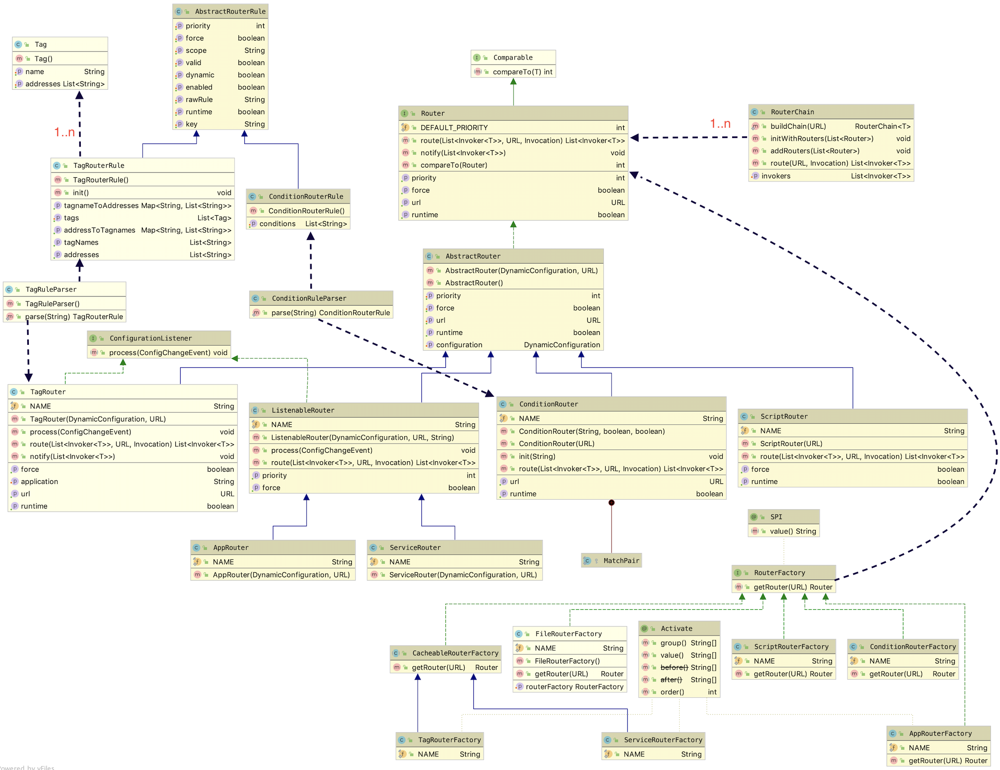
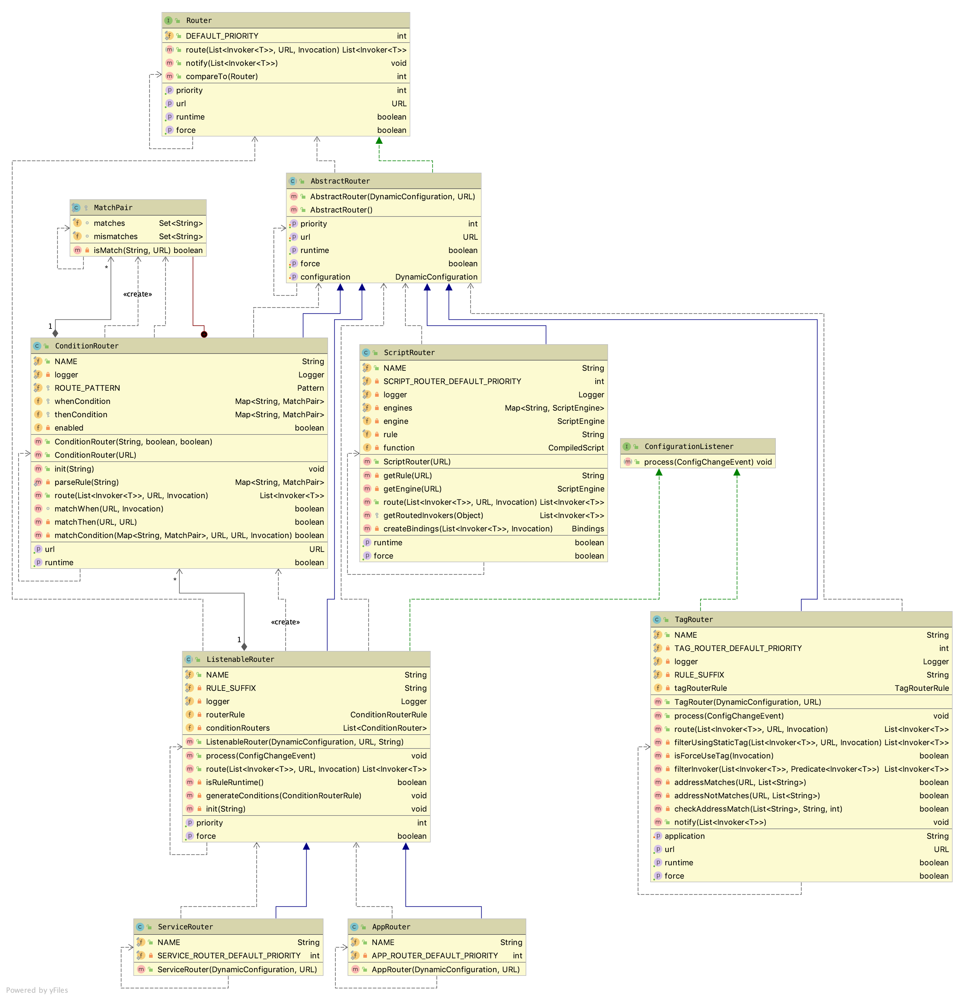

= 【十二】Dubbo集群 之 路由

上一篇文章中，我们详细剖析了Dubbo中的负载均衡实现。其实微服务框架中，从服务实例集群中挑选一个实例提交RPC请求是一个目标逐步缩小的过程，比如在负载均衡得到最终的实例前，会先经过路由从一个更大的集合中（~包含了当前应用中特定被引用微服务的所有可用实例~）过滤得到子集。

来看看Dubbo官方关于其link:http://dubbo.apache.org/zh-cn/docs/user/demos/routing-rule.html[路由]的介绍：

____
路由规则在发起一次RPC调用前起到过滤目标服务器地址的作用，过滤后的地址列表，将作为消费端最终发起RPC调用的备选地址。

* *条件路由*：支持以服务或Consumer应用为粒度配置路由规则。
* *标签路由*：以Provider应用为粒度配置路由规则。
____

关于如何实现由配置文件(包括``*.yml``)解析得到的路由规则，以及由路由规则如果从所有给定集合中匹配出目标子集，都不是本文的重点，一个技术点如何实现是本序列文章坚持的初衷，首先看看Router实现的大体方式，下图是整个Router实现的类框架图：

从上图中可以看出，实现类大体分为3部分：

. 路由规则解析：实际上分为解析器和由其解析得到的规则；
. 路由器：主要包括条件路由和标签路由；
. 路由器创建工厂：每种工厂实现会创建一种类型的路由器，同时也是一个扩展点，有些具类是自激活的，比如``AppRouterFactory、ServiceRouterFactory、TagRouterFactory``以及未在图中体现的``MockRouterFactory``；

== 路由器创建工厂

从上文的类框架图中看，这是最简单的一部分，借助了工厂方法模式创建相应的路由器实现。这一设计模式有个缺陷是一个产品的实现会对应多出一个抽象工厂的实现，尽管Dubbo中到处都有设计模式的身影，但于导致类爆炸的模式的引入是相当谨慎的。稍微深入``RouterFactory``的多个实现的话，发现其7个实现中有几个实现相对于其他的有些不同之处，工厂方法存在的目的正是利用工厂实现类隐藏一个具体产品实现类的创建细节。

=== Router实例获取

[NOTE]
``RouterFactory``本身是一个扩展点，也就是说它的每一个实现类都是单例的。

整个路由模块中``RouterFactory``的作用比较重要，作为扩展点，其实例决定了如何创建一个``Router``实例，如下是其定义：

[source,java]
----
/**
 * Note Router has a different behaviour since 2.7.0, for each type of Router, there will only has one Router instance for each service.
 */
@SPI
public interface RouterFactory {

    /**
     * Since 2.7.0, most of the time, we will not use @Adaptive feature, so it's kept only for compatibility.
     *
     * @param url url
     * @return router instance
     */
    @Adaptive("protocol")
    Router getRouter(URL url);
}
----

上述源码中保留了部分注释，1）自``v2.7.0``后，每个服务只有一个Router实例，详见下文解释；2）在``v2.7.0``后也不再使用自适配模式获取``RouterFactory``的实例。

路由器实现最重要的是由配置数据得到路由规则，用特定的规则过滤得到一个微服务引用实例的目标子集，其中路由配置数据的格式多样，可以是*.yml、*.js、*.xml、*.json甚至是来源于配置中心的二进制数据，具体取决于实现，而这些数据最终都是通过配置总线URL传入的。

很显然，``RouterFactory``存在的价值便是创建``Router``的实例，也就是说使用``Router``的接口是``RouterFactory``，我们继续深入究竟如何获得一个实例。

``RouterFactory``的创建方式有两种方式，如下所示，``RouterChain``获取的所有自激活的实例，而``RegistryDirectory``则使用了Dubbo中SPI扩展中的自适配模式获取实例，生成的扩展点具类~``RouterFactory``的代理实现~会试图根据``url.protocol``从SPI配置文件中获取到所匹配的目标扩展点具类，将相应行为委托给该目标类。

* `_RouterChain_`

[source,java]
----
public List<RouterFactory> extensionFactories = ExtensionLoader.getExtensionLoader(RouterFactory.class).getActivateExtension(url, (String[]) null);
----

* `_RegistryDirectory_`

[source,java]
----
public RouterFactory ROUTER_FACTORY = ExtensionLoader.getExtensionLoader(RouterFactory.class).getAdaptiveExtension();
----

==== `_RouterChain_`

基本上可以说``Router``的使用止于``RouterChain``，后者利用它向外提供如下方法，为一个RPC方法调用返回所有能匹配到微服务引用实例，其中配置总线``url``含有匹配目标微服务的特征信息，``invocation``则表征了一个PRC方法的包括类型在内的所有入参数据。

[source,java]
----
public List<Invoker<T>> route(URL url, Invocation invocation) {
    List<Invoker<T>> finalInvokers = invokers;
    for (Router router : routers) {
        finalInvokers = router.route(finalInvokers, url, invocation);
    }
    return finalInvokers;
}
----
[NOTE]
``RouterChain#route(...)``方法的执行逻辑是，针对当前被引用微服务的可用实例全集，先缓存在临时容器``finalInvokers``中，然后遍历所有路由器，逐个路由过滤``finalInvokers``，每一次迭代均会将所获子集赋值给``finalInvokers``，最后得到目标集合。

那``RouterChain``中的所有微服务引用实例又是谁提供的呢？初步接触微服务时，培训教材或者框架指导都会告知开发者，服务提供者在启动的时候会将自身注册到注册中心，对，这些实例来源于注册中心，只不过是过程没那么直接。既然不是自身产生，肯定还得提供由外界设值的方法，如下：
[source,java]
----
// full list of addresses from registry, classified by method name.
private List<Invoker<T>> invokers = Collections.emptyList();

/**
 * Notify router chain of the initial addresses from registry at the first time.
 * Notify whenever addresses in registry change.
 */
public void setInvokers(List<Invoker<T>> invokers) {
    this.invokers = (invokers == null ? Collections.emptyList() : invokers);
    routers.forEach(router -> router.notify(this.invokers));
}
----

``v2.7.0``之前回为每一个表征微服务引用实例的URL产生一个``Router``实例，而之后的版本是随``RouterFactory``的具类都是单例的，在一个应用中``Router``实现也是单例的。

新版的``Router``实例在当前JVM中首次调用``buildChain()``就产生了，后续再次调用不会再产生新的实例，虽然查看源码，过程没那么显然。仔细研读``RouterChain``会发现它本身并不是单例的，是服务级别的，一种类型的被引用微服务会对应产生一个它的实例（~由标注了``@Activate``注解的``RouterFactory``具类生成~），它们被认为是内置``Router``实例。

老版的``Router``实例是由服务目录``Directory``提供的，每一次可用服务列表发生变动的时需要全部更新。

综上，为兼容，``RouterChain``中提供两个盛装``Router``实例的``List``容器，并且给前一个添加了``volatile``修饰，每次更新时会加上所有内置``Router``实例。

[source,java]
----

public class RouterChain<T> {
    private volatile List<Router> routers = Collections.emptyList();

    private List<Router> builtinRouters = Collections.emptyList();

    public static <T> RouterChain<T> buildChain(URL url) {
        return new RouterChain<>(url);
    }

    private RouterChain(URL url) {
        List<RouterFactory> extensionFactories = ExtensionLoader.getExtensionLoader(RouterFactory.class)
                .getActivateExtension(url, (String[]) null);

        List<Router> routers = extensionFactories.stream()
                .map(factory -> factory.getRouter(url))
                .collect(Collectors.toList());

        initWithRouters(routers);
    }

    public void initWithRouters(List<Router> builtinRouters) {
        this.builtinRouters = builtinRouters;
        this.routers = new ArrayList<>(builtinRouters);
        this.sort();
    }

    public void addRouters(List<Router> routers) {
        List<Router> newRouters = new ArrayList<>();
        newRouters.addAll(builtinRouters);
        newRouters.addAll(routers);
        CollectionUtils.sort(newRouters);
        this.routers = newRouters;
    }

    private void sort() {
        Collections.sort(routers);
    }
    ...
}
----

=== ``RouterFactory``工厂实现

image::./res/imgs/dubbo_router_factory.png[Dubbo集群中Router的类框架]

上图中体现了有两组几乎一模一样的工厂类实现，分别是：1）ScriptRouterFactory 和 ConditionRouterFactory；2）ServiceRouterFactory 和 TagRouterFactory。相比前面一组，后面一组支持运行时配置更新且是无条件激活的。具体如下源码：

[source,java]
----
public class ScriptRouterFactory implements RouterFactory {

    public static final String NAME = "script";

    @Override
    public Router getRouter(URL url) {
        return new ScriptRouter(url);
    }

}

public class ConditionRouterFactory implements RouterFactory {

    public static final String NAME = "condition";

    @Override
    public Router getRouter(URL url) {
        return new ConditionRouter(url);
    }

}

@Activate(order = 300)
public class ServiceRouterFactory extends CacheableRouterFactory {

    public static final String NAME = "service";

    @Override
    protected Router createRouter(URL url) {
        return new ServiceRouter(DynamicConfiguration.getDynamicConfiguration(), url);
    }

}

@Activate(order = 100)
public class TagRouterFactory extends CacheableRouterFactory {

    public static final String NAME = "tag";

    @Override
    protected Router createRouter(URL url) {
        return new TagRouter(DynamicConfiguration.getDynamicConfiguration(), url);
    }
}

----

着重点还是放在后面这一组扩展继承了``CacheableRouterFactory``的，Dubbo要求如果在v2.7.0以上做自定义路由器实现，需要扩展继承它，否则直接实现``RouterFactory``。同前一组实现不同的是，其基类中加入了缓存，每一个能由``'{group}/{interfaceName}:{version}'``唯一标识的被引用微服务实例在首次获取到Router实例后，便会将其缓存以便同一被引用微服务的其它实例重用，更深一层的目的是节约规则解析时间，提升效率。

[source,java]
----
public abstract class CacheableRouterFactory implements RouterFactory {
    private ConcurrentMap<String, Router> routerMap = new ConcurrentHashMap<>();

    @Override
    public Router getRouter(URL url) {
        routerMap.computeIfAbsent(url.getServiceKey(), k -> createRouter(url));
        return routerMap.get(url.getServiceKey());
    }

    protected abstract Router createRouter(URL url);
}
----

应用级别的路由器工程类实现稍微特别点，考虑到如下两个原因，``AppRouterFactory``使用了volatile关键词确保只创建一个``AppRouter``实例：

. 工厂实现类的实例化也是在多线程环境下进行；
. ``AppRouterFactory``使用了类似Zookeeper和Etcd等的支持键值存取的中间件作为配置存取中心，一个应用只能存在一个用于同该中心交互的实例，否则会无辜浪费计算资源；

源码实现本身很简单，如下：

[source,java]
----
@Activate(order = 200)
public class AppRouterFactory implements RouterFactory {
    public static final String NAME = "app";

    private volatile Router router;

    @Override
    public Router getRouter(URL url) {
        if (router != null) {
            return router;
        }
        synchronized (this) {
            if (router == null) {
                router = createRouter(url);
            }
        }
        return router;
    }

    private Router createRouter(URL url) {
        return new AppRouter(DynamicConfiguration.getDynamicConfiguration(), url);
    }
}
----

== 路由器实现

搞清楚了``Router``本身是如何产生的，以及和外界关系后，终于轮到本文的最重要的部分了，路由器实现。这里涉及大量匹配细节，并不是我们需要关心的，本章节将从更加宏观的角度加以剖析，避免落入尘海，关注重点将会更倾向于同整个集群的关系。

=== ``Router``接口定义

从上文中得知，``Router``的作用就是为特定被引用微服务的所有实例（~由配置中心针对被引用微服务同步得到~）根据当前路由配置筛选出一个目标子集。接口定义如下：

[source,java]
----
public interface Router extends Comparable<Router> {

    int DEFAULT_PRIORITY = Integer.MAX_VALUE;

    URL getUrl();

    //referUrl，表征被引用微服务的配置总线数据
    <T> List<Invoker<T>> route(List<Invoker<T>> invokers, URL referUrl, Invocation invocation) throws RpcException;

    default <T> void notify(List<Invoker<T>> invokers) {

    }

    boolean isRuntime();

    boolean isForce();

    int getPriority();

    @Override
    default int compareTo(Router o) {
        if (o == null) {
            throw new IllegalArgumentException();
        }
        return Integer.compare(this.getPriority(), o.getPriority());
    }
}

----

上述需要特别提及的有如下几处地方：

. `boolean isForce()`：用于确定在没有匹配到目标引用实例时，当前``route(...)``执行结果是否生效，默认配置为false，返回入参传入的服务引用实例集合，否则会返回一个空的结果集；

. `int getPriority()`：为同一个服务提供路由功能的所有Router实例具有优先级，``RouterChain``实现中，无论是初始化内置的``Routers``，还是为兼容``v2.7.0``以前版本的``addRouters(List<Router> routers)``，均使用依赖优先级的排序；

. ``<T> void notify(List<Invoker<T>> invokers)``：``RouterChain``中出现过``routers.forEach(router -> router.notify(this.invokers))``这一句源码，目的是如果微服务引用实例列表有更新，得通知所有相关``Router``做出相应处理。

=== 配置相关

上文关于``RouterFactory``源码实现剖析中，``AppRouter``、``ServiceRouter``和``TagRouter``的实例创建都使用到了下述代码片段：

[source,java]
----
DynamicConfiguration.getDynamicConfiguration()
----

仔细翻看它们的基类``AbstractRouter``，发现除了需要提供``Router``必要的``url~URL~、force~boolean~和priority~int~``外，还有一个必须在构造函数中就提供值的``configuration``~``DynamicConfiguration``类型~属性。顾名思义，这和动态配置有关，``DynamicConfiguration``定义在``dubbo-configcenter``包中，也就是说``AppRouter``、``ServiceRouter``和``TagRouter``都和依赖于配置中心，微服务开发中，像路由规则这种跨实例共享的配置数据被鼓励使用配置中心做存取操作。而处于配置中心的配置项数据发生变化，相关联节点必须要及时感知到，这是保证服务可靠性的前提，因而它们都直接或间接地实现了也定义在``dubbo-configcenter``包中的``ConfigurationListener``接口。基本实现方式是若配置变更事件是删除，则直接删除此前解析得到的规则，否则重新解析覆盖原有规则。接口定义如下：

[source,java]
----
//Config listener, will get notified when the config it listens on changes.
public interface ConfigurationListener {

    //Listener call back method. Listener gets notified by this method once there's any change happens on the config the listener listens on.
    void process(ConfigChangeEvent event);
}

----

其中``ConfigChangeEvent``是一个含有3个属性类，包括配置项~key~和配置值~value~，以及事件类型``ConfigChangeType``~{ADDED、MODIFIED、DELETED}~。

[IMPORTANT]
Dubbo中一个应用的路由规则是以应用或服务级别整体存入到配置中心的，取也是整块的，也就是整取整存式的。

另外一方面，路由器的数据源，也即微服务引用实例这些数据来源于注册中心，``Router``实现本身也要及时感知实例列表的变化。因此我们看到上述``Router``接口中定义了``notify()``方法，``TagRouter``实现了该方法。

[NOTE]
注册中心和配置中心只是一种逻辑概念，有时候他们可以共享同一个服务，比如使用一个Zookeeper服务集群，只是根据不能的功能使用不同节点数据。[small]#有关配置中心和注册中心的实现并非本文主题，将在相关实现剖析文章中体现。#

=== ListenableRouter~``AppRouter``&``ServiceRouter``~

``AppRouter``和``ServiceRouter``只有很少的一点代码，路由的实现在基类``ListenableRouter``中，如下：

[source,java]
----
public class AppRouter extends ListenableRouter {
    public static final String NAME = "APP_ROUTER";
    /**
     * AppRouter should after ServiceRouter
     */
    private static final int APP_ROUTER_DEFAULT_PRIORITY = 150;

    public AppRouter(DynamicConfiguration configuration, URL url) {
        super(configuration, url, url.getParameter(CommonConstants.APPLICATION_KEY));
        this.priority = APP_ROUTER_DEFAULT_PRIORITY;
    }
}

public class ServiceRouter extends ListenableRouter {
    public static final String NAME = "SERVICE_ROUTER";
    /**
     * ServiceRouter should before AppRouter
     */
    private static final int SERVICE_ROUTER_DEFAULT_PRIORITY = 140;

    public ServiceRouter(DynamicConfiguration configuration, URL url) {
        super(configuration, url, DynamicConfiguration.getRuleKey(url));
        this.priority = SERVICE_ROUTER_DEFAULT_PRIORITY;
    }
}
----

从上文已经得知``ListenableRouter``除了需要实现路由微服务引用实例的子集这一主体功能外，还需要及时响应来自配置中心的配置修改事件，确保所使用子集的实时有效。然而前者是委托给``ConditionRouter``实现的，也就是说条件路由支持的粒度可以是应用级别的也可以是服务级别的。

Java面向对象编程中一提及监听器，熟悉设计模式的同学，总会第一时间在脑海中浮现``观察者模式``。其实现的基础是被观察主题``Subject``提供了回调接口``Callback``，实现了``Callback``的观察者``Observer``需要将自身注册加入到``Subject``的``observers``集合中，有新的事件发生时，``Subject``会从``observers``将元素挨个取出，执行其``Callback``回调。

因此``ListenableRouter``在初始化的第一时间调用``addListener()``方法便完成自身的注册处理，具体如下源码：
[source,java]
----
public abstract class ListenableRouter extends AbstractRouter implements ConfigurationListener {
    private static final String RULE_SUFFIX = ".condition-router";

    public ListenableRouter(DynamicConfiguration configuration, URL url, String ruleKey) {
        super(configuration, url);
        this.force = false;
        this.init(ruleKey);
    }
    ...

    private synchronized void init(String ruleKey) {
        if (StringUtils.isEmpty(ruleKey)) {
            return;
        }
        String routerKey = ruleKey + RULE_SUFFIX;
        configuration.addListener(routerKey, this);
        String rule = configuration.getRule(routerKey, DynamicConfiguration.DEFAULT_GROUP);
        if (StringUtils.isNotEmpty(rule)) {
            this.process(new ConfigChangeEvent(routerKey, rule));
        }
    }
}
----
上述``init()``方法中，``Router``向注册中心完成自身的注册后，立马又使用``routerKey``从中获取到所有的路由配置数据，然后回调了自身实现的``ConfigurationListener``接口，目的是确保及时完成``conditionRouters``设值处理，保证主体逻辑的可用。

接口实现逻辑处理如下，如上文所言，配置中心如果将相应的路由规则配置数据删除了，本地相应需要将所有解析得到的路由规则及所有微服务引用实例的列表都清空，直接后果后续RPC请求进入后，找不到可用的引用实例，这种极端情况一般不多见，配置全覆盖式导入的实现方式可能采取的先删后增策略。

[source,java]
----
public abstract class ListenableRouter extends
        AbstractRouter implements ConfigurationListener {
    private List<ConditionRouter> conditionRouters = Collections.emptyList();
    private ConditionRouterRule routerRule;
    @Override
    public synchronized void process(ConfigChangeEvent event) {
        if (logger.isInfoEnabled()) {
            logger.info("Notification of condition rule, change type is: "
                + event.getChangeType() + ", raw rule is:\n " + event.getValue());
        }

        if (event.getChangeType().equals(ConfigChangeType.DELETED)) {
            routerRule = null;
            conditionRouters = Collections.emptyList();
        } else {
            try {
                routerRule = ConditionRuleParser.parse(event.getValue());
                generateConditions(routerRule);
            } catch (Exception e) {
                logger.error("Failed to parse the raw condition rule and it will"
                    +" not take effect, please check " +
                    "if the condition rule matches with the template, the raw rule is:\n "
                    + event.getValue(), e);
            }
        }
    }

    private void generateConditions(ConditionRouterRule rule) {
        if (rule != null && rule.isValid()) {
            this.conditionRouters = rule.getConditions()
                    .stream()
                    .map(condition -> new ConditionRouter(
                        condition, rule.isForce(), rule.isEnabled()))
                    .collect(Collectors.toList());
        }
    }
    ...
}
----

``init()``方法和所实现接口``process()``方法均加了``synchronized``~对象锁~修饰符。上文中我们已经阐述过``AppRouter``和``ServiceRouter``等效于是单例的~以非常间接的方式实现~，而路由功能是在并发场景下使用的，因而``process()``加了当前对象级别的锁不难理解。至于``init()``为啥要加锁还得深入编译器的优化，一个对象的初始化实际上分为如下两步，也就是JVM有可能完成第一步操作后，对象于外界已经可见了。

. ``memory = allocate();`` //1.分配对象的内存空间
. ``ctorInstance(memory);`` //2.初始化对象

假设``init()``方法并未加锁，刚好在其执行完``addListener()``，CPU时间已经让渡出去了，恰好配置中心负责通知回调的线程抢到了CPU资源，由于回调的``process()``方法均加了对象锁，锁只要没有释放，当前``init()``就会被阻塞不能继续往下执行，等锁被释放后，``init()``方法返回后在获得锁又重新执行一回``process()``。进一步假设前面那个回调是``ConfigChangeType.DELETED``，这时回过头来发现``init()``方法执行的从配置中心拉取配置数据解析得到路由规则这个这个任务等于是白做了。而``init()``加锁后就等于把这本该接连发生的操作给串行化了，不会有这样的并发问题出现。

[IMPORTANT]
====
``AppRouter``和``ServiceRouter``实现上稍微有点不同的是在配置中心的Key的取值：

. ``ServiceRouter``：`{interface}[":" + version][":" + group] + ".condition-router"`
. ``AppRouter``：`{application} + ".condition-router"`
====

---

未完待续