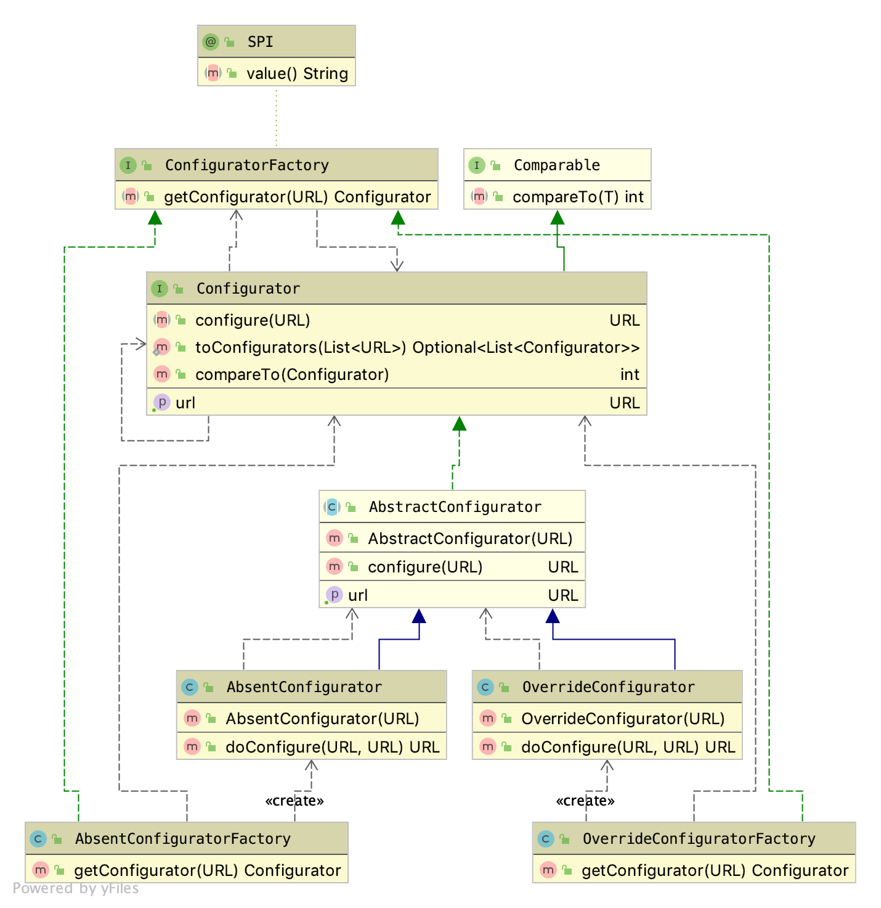
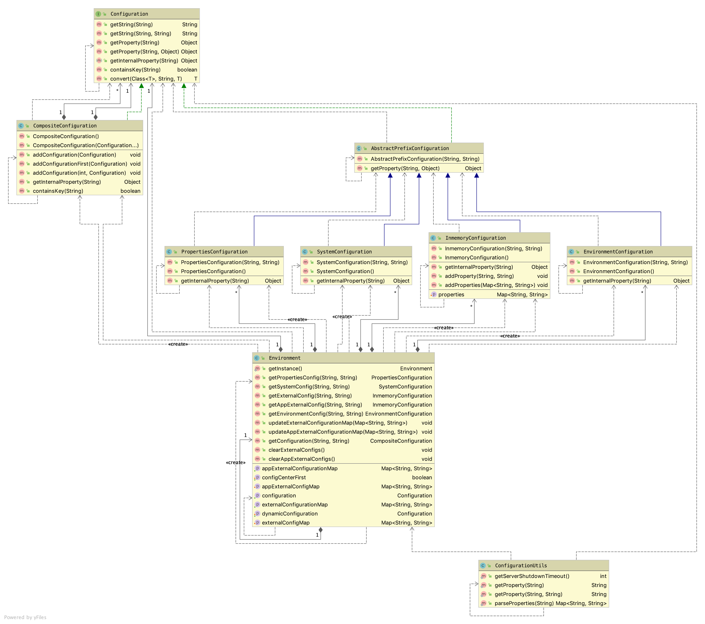
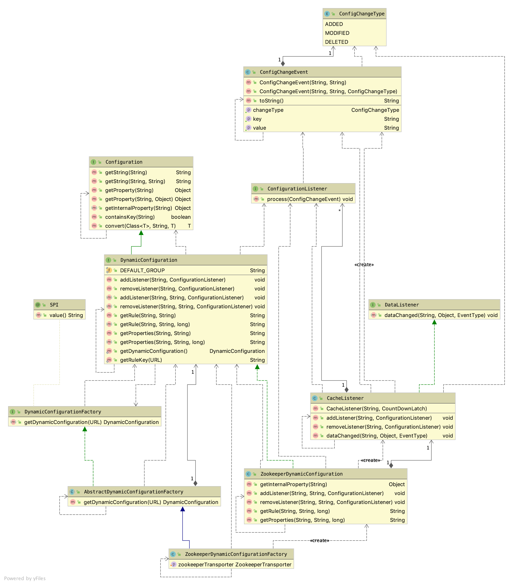

= Dubbo 配置管理

应用开发中，配置管理的重要性不明而喻。微服务架构模式中，由于组成应用的微服务粒度很小，一个微服务会以集群的方式部署多个实例，彼此之间存在着复杂的协同或调用关系，服务实例甚至以不同的方式部署在不同机房的不同机器上，所有这些都说明在各个微服务进程中单独做配置管理是非常不科学的，因此业界提出使用配置中心做统一维护管理。

有过微服务开发经验的人都知道，不可能所有的配置都放到配置中心的，一般会根据实际需要将那些和环境配套的、需要在线做服务治理的配置项提到配置中心，也就是说配置分为本地和外部两种，就一个服务实例而言本地配置和配置项默认值组成了外部配置的超集，Dubbo将外部配置看做是动态配置。

Dubbo中的配置中心实现是一个扩展点，已经提供了包括``Redis、Sofa、Nacos、Etcd3、Consul、Zookeeper、Default、Multiple、Multicast``多个实现，本文将结合``Zookeeper``等少数几个剖析Dubbo中的配置中心实现。

[NOTE]
Dubbo中的注册中心和配置中心一般是实现在一起的，比如用的是同一``Zookeeper``集群，只是使用的数据节点不一样而已。

== 配置覆写

Dubbo微服务治理中，运维人员可以经配置中心向微服务发出配置覆写请求，如下述示例代码：
[source,java]
----
RegistryFactory registryFactory = ExtensionLoader.getExtensionLoader(
        RegistryFactory.class).getAdaptiveExtension();

Registry registry = registryFactory.getRegistry(URL.valueOf("zookeeper://10.20.153.10:2181"));

registry.register(URL.valueOf("override://0.0.0.0/com.foo.BarService?" +
            "category=configurators&dynamic=false&application=foo&timeout=1000"));
----

示例中的意思是，先获取到一个``RegistryFactory``创建工厂，由后者获得指定``Zookeeper``配置中心``ZK``的``Registry``本地客户端，调用``register()``方法写入覆写规则（~将所匹配微服务的``timeout``设为1000~），由``ZK实例``负责改写配置，并将信息同步给接入到``ZK实例``的相应微服务。关于覆写规则，具体如下述Dubbo官方给的描述：

____
`override://` 表示数据采用覆盖方式，支持 `override` 和 `absent`，可扩展，*必填*。

`0.0.0.0` 表示对所有 IP 地址生效，如果只想覆盖某个 IP 的数据，请填入具体 IP，*必填*。

`com.foo.BarService` 表示只对指定服务生效，*必填*。

[big]#`category=configurators` 表示该数据为动态配置类型，*必填*。#

`dynamic=false` 表示该数据为持久数据，当注册方退出时，数据依然保存在注册中心，*必填*。

`enabled=true` 覆盖规则是否生效，可不填，缺省生效。

`application=foo` 表示只对指定应用生效，可不填，表示对所有应用生效。

`timeout=1000` 表示将满足以上条件的 timeout 参数的值覆盖为 1000。如果想覆盖其它参数，直接加在 override 的 URL 参数上。
____

假如我们使用``override://10.20.153.10/com.foo.BarService?category=configurators&dynamic=false``作为匹配的目标微服务的条件，加入对应的参数就能实现如下对应的操作目的：

* `disbaled=true`：*禁用提供者*（[small]#通常用于临时踢除某台提供者机器，相似的，禁止消费者访问请使用路由规则#）
* `weight=200`：*调整权重*（[small]#通常用于容量评估，缺省权重为 100#）
* `loadbalance=leastactive`：*调整负载均衡策略*（[small]#缺省负载均衡策略为 random#）
* `application=foo&mock=force:return+null`：*服务降级*（[small]#通常用于临时屏蔽某个出错的非关键服务#）

=== 覆写规则处理

如下图所示的类图，覆写规则的处理实现被安排在``dubbo-cluster``模块中。

从《Dubbo注册中心》这篇文章中我们得知，无论是``Consumer``还是``Provider``，他们只是一个概念上的存在，帮助我们识别一份``URL``数据所代表的含义。覆写规则实质是Dubbo根据所给定``override://``或``absent://``类型的``URL``数据对表征``Provider``的``URL``数据的改写处理，Dubbo中将实现这个改写的行为类命名为``Configurator``。

在设计上，Dubbo认为``Configurator``应该是一个扩展点，然而由于于每份``Provider``都需要它的实现类的一个实例~每个实现类一个实例~，SPI的扩展点的单例模式与这个需求是相悖的，因此利用SPI机制声明一个单例的用于创建``Configurator``的工厂类——``ConfiguratorFactory``，每一种工厂实现尽管本身是单例的，但却可以随时根据需要创建``Configurator``实例。上文已经知道Dubbo中提供了两种覆写表征``Provider``的``URL``数据的方式， `override` 和 `absent`，这样上述类图中左半边的部分所表示的含义也就是很清楚了。

==== 源码实现

如下述``ConfiguratorFactory``扩展点的定义，使用Dubbo的SPI机制生成的代理类调用``getConfigurator(url)``方法时，它会根据url入参中的``protocol``部分配置的名称获取到某个``ConfiguratorFactory``实现类的实例，将当前调用委托给同名方法。

[source,java]
----
@SPI
public interface ConfiguratorFactory {

    /**
     * get the configurator instance.
     *
     * @param url - configurator url.
     * @return configurator instance.
     */
    @Adaptive("protocol")
    Configurator getConfigurator(URL url);
}

public class AbsentConfiguratorFactory implements ConfiguratorFactory {

    @Override
    public Configurator getConfigurator(URL url) {
        return new AbsentConfigurator(url);
    }

}

public class OverrideConfiguratorFactory implements ConfiguratorFactory {

    @Override
    public Configurator getConfigurator(URL url) {
        return new OverrideConfigurator(url);
    }
}
----

上述用到的``override://0.0.0.0/com.foo.BarService...``示例中，使用SPI获取的适配类调用``getConfigurator(url)``方法，内部调用实际上后面被委托给了``OverrideConfiguratorFactory``的实例~单例~，由其携带入参``url``创建一个``Configurator``对象。到这里，接下来再理解``Configurator``接口中定义的``toConfigurators()``方法就轻松多了。

先看看``Configurator``的接口方法定义，如下，它的每一个实例都会持有一份覆写规则，客户端可以调用``configure(url)``刷新得到新的URL数据。

[source,java]
----
public interface Configurator extends Comparable<Configurator> {

    //用于定义覆盖Provider的规则
    URL getUrl();

    //将入参所指Provider使用当前Configurator所配规则覆盖，返回新的URL数据
    URL configure(URL url);

    ...//default方法
}
----

另外``Configurator``接口中还定义了两个方法的完整接口定义如下。其中``toConfigurators()``将入参所有的覆写规则进行汇总处理，其中有任何一个将protocol设置为empty都会导致所有清空所有的覆写规则，列表中若某个URL元素的参数在移除掉掉``anyhost``这一项后没有其他参数，则会清空此前的覆写规则，最后将汇总得到的``Configurator``实例按照host~优先~或者priority排序。显然，``toConfigurators(urls)``方法存在的目的是，将``所有历史覆写规则汇总，用于配置中心给Provider重新计算URL配置数据``。

[source,java]
----
/**
 *
 Convert override urls to map for use when re-refer. Send all rules every time, the urls will be reassembled and calculated
 *
 * URL contract:
 * <ol>
 * <li>override://0.0.0.0/...( or override://ip:port...?anyhost=true)&para1=value1... means global rules
 * (all of the providers take effect)</li>
 * <li>override://ip:port...?anyhost=false Special rules (only for a certain provider)</li>
 * <li>override:// rule is not supported... ,needs to be calculated by registry itself</li>
 * <li>override://0.0.0.0/ without parameters means clearing the override</li>
 * </ol>
 *
 * @param urls URL list to convert
 * @return converted configurator list
 */
static Optional<List<Configurator>> toConfigurators(List<URL> urls) {
    if (CollectionUtils.isEmpty(urls)) {
        return Optional.empty();
    }

    ConfiguratorFactory configuratorFactory =
        ExtensionLoader.getExtensionLoader(ConfiguratorFactory.class)
            .getAdaptiveExtension();

    List<Configurator> configurators = new ArrayList<>(urls.size());
    for (URL url : urls) {
        if (EMPTY_PROTOCOL.equals(url.getProtocol())) {
            configurators.clear();
            break;
        }
        Map<String, String> override = new HashMap<>(url.getParameters());
        //The anyhost parameter of override may be added automatically, it can't change the judgement of changing url
        override.remove(ANYHOST_KEY);
        if (override.size() == 0) {
            configurators.clear();
            continue;
        }
        configurators.add(configuratorFactory.getConfigurator(url));
    }
    Collections.sort(configurators);
    return Optional.of(configurators);
}

/**
 * Sort by host, then by priority
 * 1. the url with a specific host ip should have higher priority than 0.0.0.0
 * 2. if two url has the same host, compare by priority value；
 */
@Override
default int compareTo(Configurator o) {
    if (o == null) {
        return -1;
    }

    int ipCompare = getUrl().getHost().compareTo(o.getUrl().getHost());
    // host is the same, sort by priority
    if (ipCompare == 0) {
        int i = getUrl().getParameter(PRIORITY_KEY, 0);
        int j = o.getUrl().getParameter(PRIORITY_KEY, 0);
        return Integer.compare(i, j);
    } else {
        return ipCompare;
    }
}
----

最后我们来看看``AbstractConfigurator``类的实现，基本步骤如下：

. 首先排除掉不会出现覆写的情况：
* 覆写规则``configuratorUrl``：
.. 设置了``enabled=false``；
.. 没有设置``host``
* 入参中``url``：
.. 值为 null；
.. ``getHost()``的值为 null；
. 根据覆写规则使用的版本~是否包含于``configVersion``这个配置~执行相应逻辑：
* `≥ 2.7.0`：
.. 若``url``和``configuratorUrl``配置的``side``参数均为``consumer``，且``configuratorUrl``配置了``port=0``：
** 返回``configureIfMatch(NetUtils.getLocalHost(), url)``；
.. 若``url``和``configuratorUrl``配置的``side``参数均为``provider``，且二者配置了一样的``port``值：
** 返回configureIfMatch(url.getHost(), url);
* `< 2.7.0`：
.. 返回configureDeprecated(url);
. 返回原``url``数据；

[source,java]
----
public URL configure(URL url) {
    // If override url is not enabled or is invalid, just return.
    if (!configuratorUrl.getParameter(ENABLED_KEY, true) ||
            configuratorUrl.getHost() == null || url == null || url.getHost() == null) {
        return url;
    }
    /**
     * This if branch is created since 2.7.0.
     */
    String apiVersion = configuratorUrl.getParameter(CONFIG_VERSION_KEY);
    if (StringUtils.isNotEmpty(apiVersion)) {
        String currentSide = url.getParameter(SIDE_KEY);
        String configuratorSide = configuratorUrl.getParameter(SIDE_KEY);

        if (currentSide.equals(configuratorSide) && CONSUMER.equals(configuratorSide)
                && 0 == configuratorUrl.getPort()) {
            url = configureIfMatch(NetUtils.getLocalHost(), url);

        } else if (currentSide.equals(configuratorSide) &&
                PROVIDER.equals(configuratorSide) && url.getPort() == configuratorUrl.getPort()) {
            url = configureIfMatch(url.getHost(), url);
        }
    }
    /**
     * This else branch is deprecated and is left only to keep compatibility with versions before 2.7.0
     */
    else {
        url = configureDeprecated(url);
    }
    return url;
}
----

下述继续看看``configureIfMatch(host, url)``做了什么操作？从下述源码可以看出：

只有满足下述条件才会被执行覆写处理 ^and^：

. ``host == "0.0.0.0"`` 或者 ``host.equals(configuratorUrl.getHost())``；
. ``configuratorUrl``中的``providerAddresses``配置 ^or^：
* 没有该配置；
* 值为``"0.0.0.0"``通配符；
* 值包含了``url``的 address 值，也即 ``host[":" + port]``；
. ``configuratorUrl``启用排除符的配置项，并没有包含在``url``中，比如前者中含有``~key1=kylin``，而后者并不包含``key1=kylin``；

[source,java]
----
private URL configureIfMatch(String host, URL url) {
    if (ANYHOST_VALUE.equals(configuratorUrl.getHost()) || host.equals(configuratorUrl.getHost())) {
        // TODO, to support wildcards
        String providers = configuratorUrl.getParameter(OVERRIDE_PROVIDERS_KEY);
        if (StringUtils.isEmpty(providers) || providers.contains(url.getAddress()) || providers.contains(ANYHOST_VALUE)) {
            String configApplication = configuratorUrl.getParameter(APPLICATION_KEY,
                    configuratorUrl.getUsername());
            String currentApplication = url.getParameter(APPLICATION_KEY, url.getUsername());
            if (configApplication == null || ANY_VALUE.equals(configApplication)
                    || configApplication.equals(currentApplication)) {
                Set<String> conditionKeys = new HashSet<String>();
                conditionKeys.add(CATEGORY_KEY);
                conditionKeys.add(Constants.CHECK_KEY);
                conditionKeys.add(DYNAMIC_KEY);
                conditionKeys.add(ENABLED_KEY);
                conditionKeys.add(GROUP_KEY);
                conditionKeys.add(VERSION_KEY);
                conditionKeys.add(APPLICATION_KEY);
                conditionKeys.add(SIDE_KEY);
                conditionKeys.add(CONFIG_VERSION_KEY);
                conditionKeys.add(COMPATIBLE_CONFIG_KEY);
                for (Map.Entry<String, String> entry : configuratorUrl.getParameters().entrySet()) {
                    String key = entry.getKey();
                    String value = entry.getValue();
                    if (key.startsWith("~") || APPLICATION_KEY.equals(key) || SIDE_KEY.equals(key)) {
                        conditionKeys.add(key);
                        if (value != null && !ANY_VALUE.equals(value)
                                && !value.equals(url.getParameter(key.startsWith("~") ? key.substring(1) : key))) {
                            return url;
                        }
                    }
                }
                return doConfigure(url, configuratorUrl.removeParameters(conditionKeys));
            }
        }
    }
    return url;
}
----

从上述源码中可以看出，覆写中移除了一些常见配置项，包括``category、check、dynamic、enabled、group、version、application、side、configVersion、compatible_config``，另外加了排除符"~"前缀的配置项也被移除了。

相对而言，在``< 2.7.0``版本的实现看似简单些，如下：
[source,java]
----
private URL configureDeprecated(URL url) {
    if (configuratorUrl.getPort() != 0) {
        if (url.getPort() == configuratorUrl.getPort()) {
            //当覆盖规则里头配置了port，且url和该值相等时
            return configureIfMatch(url.getHost(), url);
        }
    } else {
        if (url.getParameter(SIDE_KEY, PROVIDER).equals(CONSUMER)) {
            //若url中指定了side=consumer
            return configureIfMatch(NetUtils.getLocalHost(), url);
        } else if (url.getParameter(SIDE_KEY, CONSUMER).equals(PROVIDER)) {
            //若url中指定了side=provider
            return configureIfMatch(ANYHOST_VALUE, url);
        }
    }
    return url;
}
----

[IMPORTANT]
====
当看到``NetUtils.getLocalHost()``这一截代码时，读者可能会有些费解卡壳，因为我们的源码是在一个微观的粒度去剖析的，放回到宏观，就比较容易理解了。

Dubbo微服务中，配置中心和``Provider|Consumer``是完全解耦的，``Provider``和``Consumer``也是通过它解耦了。

当运维人员向配置中心 Reg 发送一个治理请求后，Reg 仅仅是发生了一个节点（~树形结构中的一条数据~）的数据变化而已，而这种变化是它会通知给使用长连接接入的``Provider|Consumer``，后者使用本地``Registry``客户端回调相应的方法，执行规则覆写处理。

因此看到针对``side=consumer``这种配置覆写场景中，将入参 url 值的 host 改写为自身的本地IP地址。这个IP地址也是它用于注册到配置中心的那个，``ANYHOST_VALUE.equals(configuratorUrl.getHost()) || host.equals(configuratorUrl.getHost())``这一条件又保证了只有匹配覆写规则的那个Consumer才能执行该操作。
====

最后轮到``Configurator``的两个实现上场了，他们只有一行代码的区别，``Override``模式直接使用覆写规则中的参数覆写，而``Absent``模式仅仅在原 url 数据没有覆写规则中的参数时才加入。
[source,java]
----

public class AbsentConfigurator extends AbstractConfigurator {

    public AbsentConfigurator(URL url) {
        super(url);
    }

    @Override
    public URL doConfigure(URL currentUrl, URL configUrl) {
        return currentUrl.addParametersIfAbsent(configUrl.getParameters());
    }

}

public class OverrideConfigurator extends AbstractConfigurator {

    public OverrideConfigurator(URL url) {
        super(url);
    }

    @Override
    public URL doConfigure(URL currentUrl, URL configUrl) {
        return currentUrl.addParameters(configUrl.getParameters());
    }

}
----

== 外部配置到URL数据的转换

我们都清楚，Dubbo中的配置数据绝大部分是使用配置总线URL做维护、传递和内存本地存取处理的，而处于注册中心的数据是以节点的形式存储存在树形结构中，因而其下发到本地或本地从中拉取的数据，需要执行特定的转换处理才能最终转换为URL形式的数据。

如下述类图所示，Dubbo在``dubbo-cluster``模块中定义了实现配置转换的``ConfigParser``类，将从线上获取的配置数据转换为一序列的URL数据。

image::res/imgs/dubbo_config_download.png[Dubbo 配置下发处理,300,align=center]

幸运的是线上的数据获取下来组成的文本是符合YAML规范的，因此可以经过它的转换变成本地的结构化数据，再由它转换为URL数据。下面看看其具体实现，源码比较长，依然打散视之。

首先，将获取的原生数据转换为本地结构化数据，如下，指定自定义的数据类型，告知Yaml如何转换，由其加载成对应类型的数据：

[source,java]
----
private static <T> T parseObject(String rawConfig) {
    Constructor constructor = new Constructor(ConfiguratorConfig.class);
    TypeDescription itemDescription = new TypeDescription(ConfiguratorConfig.class);
    itemDescription.addPropertyParameters("items", ConfigItem.class);
    constructor.addTypeDescription(itemDescription);

    Yaml yaml = new Yaml(constructor);
    return yaml.load(rawConfig);
}
----

然后，根据获取到``ConfiguratorConfig``类型的数据中的``scope``值，判定配置是作用在应用级别还是微服务级别，根据级别模式对其所有``ConfigItem``类型数据项转换成URL类型的数据，汇集成列表返回：
[source,java]
----
public static List<URL> parseConfigurators(String rawConfig) {
    List<URL> urls = new ArrayList<>();
    ConfiguratorConfig configuratorConfig = parseObject(rawConfig);

    String scope = configuratorConfig.getScope();
    List<ConfigItem> items = configuratorConfig.getConfigs();

    if (ConfiguratorConfig.SCOPE_APPLICATION.equals(scope)) {
        items.forEach(item -> urls.addAll(appItemToUrls(item, configuratorConfig)));
    } else {
        // service scope by default.
        items.forEach(item -> urls.addAll(serviceItemToUrls(item, configuratorConfig)));
    }
    return urls;
}
----

=== 到URL数据的转换

==== 共同支持函数

从上述定义的数据结构``ConfiguratorConfig``和``ConfigItem``来看，虽然数据分为两个不同级别的处理，但是数据的组成形式是一样的，具体处理时会有诸多共同之处。

配置项中的``address``若被设置为空值，则转换为匹配任意 Provider 或者 Consumer 的通配IP地址 ``0.0.0.0``。
[source,java]
----
private static List<String> parseAddresses(ConfigItem item) {
    List<String> addresses = item.getAddresses();
    if (addresses == null) {
        addresses = new ArrayList<>();
    }
    if (addresses.size() == 0) {
        addresses.add(ANYHOST_VALUE);
    }
    return addresses;
}
----

设置URL数据的的``enabled``参数，如果``ConfigItem``类型的数据中的``type``值为 null 或者等于``general``，则从上一级取值，否则在当前数据项中取值。
[source,java]
----
private static void parseEnabled(ConfigItem item, ConfiguratorConfig config, StringBuilder urlBuilder) {
    urlBuilder.append("&enabled=");
    if (item.getType() == null || ConfigItem.GENERAL_TYPE.equals(item.getType())) {
        urlBuilder.append(config.getEnabled());
    } else {
        urlBuilder.append(item.getEnabled());
    }
}

----
将ConfigItem类型的数据转换成URL中形如
``category=dynamicconfigurators[&side={side}][&key~1~=val~1~&key~2~=val~2~&...&key~n~=val~n~][&providerAddresses=addr~1~,addr~2~,...,addr~n~]``的组成。
[source,java]
----
private static String toParameterString(ConfigItem item) {
    StringBuilder sb = new StringBuilder();
    sb.append("category=");
    sb.append(DYNAMIC_CONFIGURATORS_CATEGORY);
    if (item.getSide() != null) {
        sb.append("&side=");
        sb.append(item.getSide());
    }
    Map<String, String> parameters = item.getParameters();
    if (CollectionUtils.isEmptyMap(parameters)) {
        throw new IllegalStateException("Invalid configurator rule, please specify at least one parameter " +
                "you want to change in the rule.");
    }

    parameters.forEach((k, v) -> {
        sb.append("&");
        sb.append(k);
        sb.append("=");
        sb.append(v);
    });

    if (CollectionUtils.isNotEmpty(item.getProviderAddresses())) {
        sb.append("&");
        sb.append(OVERRIDE_PROVIDERS_KEY);
        sb.append("=");
        sb.append(CollectionUtils.join(item.getProviderAddresses(), ","));
    }

    return sb.toString();
}
----

将形如``[{group}/]{interfaceName}[:{version}]``的``serviceKey``转换成URL中形如``{interfaceName}?[group={group}&][version={version}&]``的组成。

[source,java]
----
private static String appendService(String serviceKey) {
    StringBuilder sb = new StringBuilder();
    if (StringUtils.isEmpty(serviceKey)) {
        throw new IllegalStateException("service field in configuration is null.");
    }

    String interfaceName = serviceKey;
    int i = interfaceName.indexOf("/");
    if (i > 0) {
        sb.append("group=");
        sb.append(interfaceName, 0, i);
        sb.append("&");

        interfaceName = interfaceName.substring(i + 1);
    }
    int j = interfaceName.indexOf(":");
    if (j > 0) {
        sb.append("version=");
        sb.append(interfaceName.substring(j + 1));
        sb.append("&");
        interfaceName = interfaceName.substring(0, j);
    }
    sb.insert(0, interfaceName + "?");

    return sb.toString();
}
----

==== 应用级别

先获取所有的匹配目标``Consumer``或者``Provider``的 address 数据，遍历，挨个取``serviceKey``集合``services``，若为空，在返回列表``urls``中增加一项URL数据``override://{addr}/*``，否则内部再遍历``services``，给``urls``中加入URL数据，形如:

``override://{addr}/{interfaceName}?
 [group={group}&][version={version}&]
 category=dynamicconfigurators[&side={side}]
 [&key~1~=val~1~&key~2~=val~2~&...&key~n~=val~n~]
 [&providerAddresses=addr~1~,addr~2~,...,addr~n~]
 &application={app}&enabled={enabled}
 &category=appdynamicconfigurators&configVersion={configVersion}``

[source,java]
----
private static List<URL> appItemToUrls(ConfigItem item, ConfiguratorConfig config) {
    List<URL> urls = new ArrayList<>();
    List<String> addresses = parseAddresses(item);
    for (String addr : addresses) {
        StringBuilder urlBuilder = new StringBuilder();
        urlBuilder.append("override://").append(addr).append("/");
        List<String> services = item.getServices();
        if (services == null) {
            services = new ArrayList<>();
        }
        if (services.size() == 0) {
            services.add("*");
        }
        for (String s : services) {
            urlBuilder.append(appendService(s));
            urlBuilder.append(toParameterString(item));

            urlBuilder.append("&application=").append(config.getKey());

            parseEnabled(item, config, urlBuilder);

            urlBuilder.append("&category=").append(APP_DYNAMIC_CONFIGURATORS_CATEGORY);
            urlBuilder.append("&configVersion=").append(config.getConfigVersion());

            urls.add(URL.valueOf(urlBuilder.toString()));
        }
    }
    return urls;
}
----

==== 微服务级别

先获取所有的匹配目标Consumer或者Provider的 address 数据，遍历，给urls中加入URL数据（如果``ConfigItem``数据的``applications``不为空，则内部多一层循环），形如:

``override://{addr}/{interfaceName}?
 [group={group}&][version={version}&]
 category=dynamicconfigurators[&side={side}]
 [&key~1~=val~1~&key~2~=val~2~&...&key~n~=val~n~]
 [&providerAddresses=addr~1~,addr~2~,...,addr~n~]
 &enabled={enabled}
 &category=dynamicconfigurators&configVersion={configVersion}
 [&application={app}]``
[source,java]
----
private static List<URL> serviceItemToUrls(ConfigItem item, ConfiguratorConfig config) {
    List<URL> urls = new ArrayList<>();
    List<String> addresses = parseAddresses(item);

    addresses.forEach(addr -> {
        StringBuilder urlBuilder = new StringBuilder();
        urlBuilder.append("override://").append(addr).append("/");

        urlBuilder.append(appendService(config.getKey()));
        urlBuilder.append(toParameterString(item));

        parseEnabled(item, config, urlBuilder);

        urlBuilder.append("&category=").append(DYNAMIC_CONFIGURATORS_CATEGORY);
        urlBuilder.append("&configVersion=").append(config.getConfigVersion());

        List<String> apps = item.getApplications();
        if (apps != null && apps.size() > 0) {
            apps.forEach(app -> urls.add(URL.valueOf(urlBuilder.append("&application=").append(app).toString())));
        } else {
            urls.add(URL.valueOf(urlBuilder.toString()));
        }
    });

    return urls;
}
----

== 本地配置

宏观上讲，Dubbo中的本地配置实际上包含了多个部分，比如构成工程骨架的元数据、业务逻辑用到的配置项、当前JVM运行的环境参数、微服务治理中的应用本地默认设置等。

本章节涉及的范围只是它的一个子集，如上述类图所示，包括：

. `系统配置`——`SystemConfiguration`：当前JVM的系统配置，这里的系统特指JVM虚拟机，特定于应用本身；
. `环境配置`——`EnvironmentConfiguration`：当前JVM所在的操作系统的环境配置内容，不受应用支配；
. `属性配置`——`PropertiesConfiguration`：用于业务逻辑控制的配置参数，一般配置在``*.properties``文件中；
. `内存配置`——`InmemoryConfiguration`：微服务应用运行时产生的配置项数据，应用关闭后就消失不见了；

类图中可以看出，所有这些配置读取实现最终会通过``Enviroment``类统一体检接口界面。

=== 源码剖析

==== `Configuration` 接口

``Configuration``接口是Dubbo中所有配置项读取用户接口，包括动态配置中使用到的用户接口``DynamicConfiguration``也扩展自它，实际需要实现的只有``getInternalProperty(key)``这么一个方法，如下所示：

[source,java]
----
public interface Configuration {

    //返回的配置数据类型为Object
    Object getInternalProperty(String key);

    ...//其它default方法
}
----

另外接口中实现了很多依赖于``getInternalProperty(key)``工具方法，便利 Dubbo 的应用开发。

``getProperty(...)``方法取到的是一个 Object 对象，调用方还需要做相应的数据类型转换处理。

[source,java]
----

default Object getProperty(String key) {
    return getProperty(key, null);
}

default Object getProperty(String key, Object defaultValue) {
    Object value = getInternalProperty(key);
    return value != null ? value : defaultValue;
}

default boolean containsKey(String key) {
    return getProperty(key) != null;
}
----

``getString(...)``方法取到的是一个 String 字符串，内部实现已经使用``convert()``方法完成了类型的转换处理，调用方无需做数据类型转换处理。由于一般而言，配置数据的都是 String 类型，``convert()``方法中先使用``(String) getProperty(key)``获取到一个字符串值，再完成到其它基本类型的转换，否则可以直接使用它完成到其它目标类型的处理，其中``we only process String properties for now``注解也提示了这点。

[source,java]
----
default String getString(String key) {
    return convert(String.class, key, null);
}

default String getString(String key, String defaultValue) {
    return convert(String.class, key, defaultValue);
}

default <T> T convert(Class<T> cls, String key, T defaultValue) {
    // we only process String properties for now
    String value = (String) getProperty(key);

    if (value == null) {
        return defaultValue;
    }

    Object obj = value;
    if (cls.isInstance(value)) {
        return cls.cast(value);
    }

    if (Boolean.class.equals(cls) || Boolean.TYPE.equals(cls)) {
        obj = Boolean.valueOf(value);
    } else if (Number.class.isAssignableFrom(cls) || cls.isPrimitive()) {
        if (Integer.class.equals(cls) || Integer.TYPE.equals(cls)) {
            obj = Integer.valueOf(value);
        } else if (Long.class.equals(cls) || Long.TYPE.equals(cls)) {
            obj = Long.valueOf(value);
        } else if (Byte.class.equals(cls) || Byte.TYPE.equals(cls)) {
            obj = Byte.valueOf(value);
        } else if (Short.class.equals(cls) || Short.TYPE.equals(cls)) {
            obj = Short.valueOf(value);
        } else if (Float.class.equals(cls) || Float.TYPE.equals(cls)) {
            obj = Float.valueOf(value);
        } else if (Double.class.equals(cls) || Double.TYPE.equals(cls)) {
            obj = Double.valueOf(value);
        }
    } else if (cls.isEnum()) {
        obj = Enum.valueOf(cls.asSubclass(Enum.class), value);
    }

    return cls.cast(obj);
}

----

==== `AbstractPrefixConfiguration` 超类

Dubbo允许所有的本地配置实现都加上一个前缀，增加可识别性，其好处很明显，配置项数据比较多时，便于开发运维人员快速在脑海分门别类的对应起来，减轻大脑负。

前缀由两部分组成，分别是 ``id`` 和 ``prefix``，加入程序中取配置的项是``key``，则内部对应的配置项实际是``[{prefix} + "."][{id} + "."]{key}``。

[source,java]
----
public abstract class AbstractPrefixConfiguration implements Configuration {
    protected String id;
    protected String prefix;

    public AbstractPrefixConfiguration(String prefix, String id) {
        if (StringUtils.isNotEmpty(prefix) && !prefix.endsWith(".")) {
            this.prefix = prefix + ".";
        } else {
            this.prefix = prefix;
        }
        this.id = id;
    }

    @Override
    public Object getProperty(String key, Object defaultValue) {
        Object value = null;
        if (StringUtils.isNotEmpty(prefix)) {
            if (StringUtils.isNotEmpty(id)) {
                value = getInternalProperty(prefix + id + "." + key);
            }
            if (value == null) {
                value = getInternalProperty(prefix + key);
            }
        } else {
            value = getInternalProperty(key);
        }
        return value != null ? value : defaultValue;
    }
}
----

==== `SystemConfiguration`
____
_``System.getProperty(key)``返回的是JVM进程的变量值_
____

[source,java]
----
public class SystemConfiguration extends AbstractPrefixConfiguration {

    public SystemConfiguration(String prefix, String id) {
        super(prefix, id);
    }

    public SystemConfiguration() {
        this(null, null);
    }

    @Override
    public Object getInternalProperty(String key) {
        return System.getProperty(key);
    }

}
----

==== `EnvironmentConfiguration`
____
_``System.getenv(key)``返回的是系统环境变量的值。_
____

该实现中，如果使用入参 key 取到的值为空，则尝试将 key 中的 "." 替换为 "_"，转为形如``DUBBO_[A-Z]{1,}_[A-Z]{1,}_..._[A-Z]{1,}``的键，再重新获取配置数据。

[source,java]
----
public class EnvironmentConfiguration extends AbstractPrefixConfiguration {

    public EnvironmentConfiguration(String prefix, String id) {
        super(prefix, id);
    }

    public EnvironmentConfiguration() {
        this(null, null);
    }

    @Override
    public Object getInternalProperty(String key) {
        String value = System.getenv(key);
        if (StringUtils.isEmpty(value)) {
            value = System.getenv(StringUtils.toOSStyleKey(key));
        }
        return value;
    }

}

public final class StringUtils {
    ...
    public static String toOSStyleKey(String key) {

        //DOT_REGEX = "\\.";
        //UNDERLINE_SEPARATOR = "_";

        key = key.toUpperCase().replaceAll(DOT_REGEX, UNDERLINE_SEPARATOR);
        if (!key.startsWith("DUBBO_")) {
            key = "DUBBO_" + key;
        }
        return key;
    }
    ...
}
----

==== `PropertiesConfiguration`

该类的实现使用了``ConfigUtils.getProperty(key)``方法，由其负责加载工程中的``*.properties``文件。

[source,java]
----
public class PropertiesConfiguration extends AbstractPrefixConfiguration {
    private static final Logger logger = LoggerFactory.getLogger(PropertiesConfiguration.class);

    public PropertiesConfiguration(String prefix, String id) {
        super(prefix, id);
    }

    public PropertiesConfiguration() {
        this(null, null);
    }

    @Override
    public Object getInternalProperty(String key) {
        return ConfigUtils.getProperty(key);
    }
}
----

==== `InmemoryConfiguration`

Dubbo声明了一个``LinkedHashMap<String, String>``做内存配置的容器，用于存取键值对。

[source,java]
----
public class InmemoryConfiguration extends AbstractPrefixConfiguration {

    // stores the configuration key-value pairs
    private Map<String, String> store = new LinkedHashMap<>();

    public InmemoryConfiguration(String prefix, String id) {
        super(prefix, id);
    }

    public InmemoryConfiguration() {
        this(null, null);
    }

    @Override
    public Object getInternalProperty(String key) {
        return store.get(key);
    }

    /**
     * Add one property into the store, the previous value will be replaced if the key exists
     */
    public void addProperty(String key, String value) {
        store.put(key, value);
    }

    /**
     * Add a set of properties into the store
     */
    public void addProperties(Map<String, String> properties) {
        if (properties != null) {
            this.store.putAll(properties);
        }
    }

    /**
     * set store
     */
    public void setProperties(Map<String, String> properties) {
        if (properties != null) {
            this.store = properties;
        }
    }
}
----

==== `Environment`

正如上文所言上述所有``Configuration``的实现，最终都是通过``Enviroment``类对外提供统一的用户界面。从上文的剖析已知他们都扩展自超类``AbstractPrefixConfiguration``，支持``[{prefix} + "."][{id} + "."]{key}``前缀，便于分组管理配置信息，一个分组对应它的一个实例。这些实例需要使用``Map``做缓存管理，其Key的计算方式如下，``key``的值为``([{prefix}][{id}]["."] | "dubbo")``：
[source,java]
----
private static String toKey(String prefix, String id) {
    StringBuilder sb = new StringBuilder();
    if (StringUtils.isNotEmpty(prefix)) {
        sb.append(prefix);
    }
    if (StringUtils.isNotEmpty(id)) {
        sb.append(id);
    }

    if (sb.length() > 0 && sb.charAt(sb.length() - 1) != '.') {
        sb.append(".");
    }

    if (sb.length() > 0) {
        return sb.toString();
    }
    return CommonConstants.DUBBO;
}
----

所有``AbstractPrefixConfiguration``类型的配置实例都管理在``ConcurrentHashMap<String, *>``中，传入``prefix``和``id``便能方便地获取到缓存中的实例或者新建并加入到其中的实例，因而也可以将``Enviroment``看做是``AbstractPrefixConfiguration``类的创建工厂，其实现如下：

[source,java]
----
//①PropertiesConfiguration
private Map<String, PropertiesConfiguration> propertiesConfigs = new ConcurrentHashMap<>();
public PropertiesConfiguration getPropertiesConfig(String prefix, String id) {
    return propertiesConfigs.computeIfAbsent(toKey(prefix, id), k -> new PropertiesConfiguration(prefix, id));
}

//②SystemConfiguration
private Map<String, SystemConfiguration> systemConfigs = new ConcurrentHashMap<>();
public SystemConfiguration getSystemConfig(String prefix, String id) {
    return systemConfigs.computeIfAbsent(toKey(prefix, id), k -> new SystemConfiguration(prefix, id));
}

//③EnvironmentConfiguration
private Map<String, EnvironmentConfiguration> environmentConfigs = new ConcurrentHashMap<>();
public EnvironmentConfiguration getEnvironmentConfig(String prefix, String id) {
    return environmentConfigs.computeIfAbsent(toKey(prefix, id), k -> new EnvironmentConfiguration(prefix, id));
}

//④InmemoryConfiguration → externalConfigurationMap
private Map<String, InmemoryConfiguration> externalConfigs = new ConcurrentHashMap<>();
private Map<String, String> externalConfigurationMap = new HashMap<>();
public InmemoryConfiguration getExternalConfig(String prefix, String id) {
    return externalConfigs.computeIfAbsent(toKey(prefix, id), k -> {
        InmemoryConfiguration configuration = new InmemoryConfiguration(prefix, id);
        configuration.setProperties(externalConfigurationMap);
        return configuration;
    });
}
public void setExternalConfigMap(Map<String, String> externalConfiguration) {
    this.externalConfigurationMap = externalConfiguration;
}
public Map<String, String> getExternalConfigurationMap() {
    return externalConfigurationMap;
}
public void updateExternalConfigurationMap(Map<String, String> externalMap) {
    this.externalConfigurationMap.putAll(externalMap);
}

//⑤InmemoryConfiguration → appExternalConfigurationMap
private Map<String, InmemoryConfiguration> appExternalConfigs = new ConcurrentHashMap<>();
private Map<String, String> appExternalConfigurationMap = new HashMap<>();
public InmemoryConfiguration getAppExternalConfig(String prefix, String id) {
    return appExternalConfigs.computeIfAbsent(toKey(prefix, id), k -> {
        InmemoryConfiguration configuration = new InmemoryConfiguration(prefix, id);
        configuration.setProperties(appExternalConfigurationMap);
        return configuration;
    });
}
public void setAppExternalConfigMap(Map<String, String> appExternalConfiguration) {
    this.appExternalConfigurationMap = appExternalConfiguration;
}
}
public Map<String, String> getAppExternalConfigurationMap() {
    return appExternalConfigurationMap;
}
public void updateAppExternalConfigurationMap(Map<String, String> externalMap) {
    this.appExternalConfigurationMap.putAll(externalMap);
}
----
上面的源码最后两次使用的``InmemoryConfiguration``中，其配置容器并没有使用类中定义的``LinkedHashMap``，而是采用了由外部创建的``HashMap``实例。

下一个章节中会提到的``DynamicConfiguration``动态配置接口类，一个微服务或应用中只会存在一个实例，``Environment``也可以作为它的持有器，如下：

[source,java]
----
private Configuration dynamicConfiguration;

public Optional<Configuration> getDynamicConfiguration() {
    return Optional.ofNullable(dynamicConfiguration);
}

public void setDynamicConfiguration(Configuration dynamicConfiguration) {
    this.dynamicConfiguration = dynamicConfiguration;
}
----

== 动态配置

如图所示，Dubbo将动态配置设计成一个扩展的点，参考上文中关于SPI机制下的工程模式可知，实际意图的扩展点是``DynamicConfiguration``，具体实现机制这里不再赘述。

和``DynamicConfiguration``密切相关的另一个接口是``ConfigurationListener``。动态配置中，由配置中心负责维护配置数据，当数据发生变更时，它会下发相关通知，由实现方负责响应这种变化，类似同步本地配置内容，其接口定义如下：
[source,java]
----
public interface ConfigurationListener {

    void process(ConfigChangeEvent event);
}
----

类图中清晰可见，配置变化的类型有3种，新增、更新和删除。

=== DynamicConfiguration

如下述源码所示，根据框架内部使用的场景它定义如下几个方法，定义的接口方法包括3方面：

. 从配置中心获取治理规则或者配置项数据，支持超时和分组；
. 针对特定配置或者治理规则增加或者删除监听器，也支持分组；

[source,java]
----
public interface DynamicConfiguration extends Configuration {

    void addListener(String key, String group, ConfigurationListener listener);

    void removeListener(String key, String group, ConfigurationListener listener);

    String getRule(String key, String group, long timeout) throws IllegalStateException;

    String getProperties(String key, String group, long timeout) throws IllegalStateException;
}
----

另外接口中还增加了一些``default``方法：1）增删监听器时将分组设置为默认的``dubbo``；2）将超时设置为-1，获取配置或治理规则时一直等待；

[source,java]
----
String DEFAULT_GROUP = "dubbo";

default void addListener(String key, ConfigurationListener listener) {
    addListener(key, DEFAULT_GROUP, listener);
}

default void removeListener(String key, ConfigurationListener listener) {
    removeListener(key, DEFAULT_GROUP, listener);
}

default String getRule(String key, String group) {
    return getRule(key, group, -1L);
}

default String getProperties(String key, String group) throws IllegalStateException {
    return getProperties(key, group, -1L);
}
----

另外``DynamicConfiguration``接口中还提供了一个``getDynamicConfiguration()``静态方法，它会首先尝试从``Environment``获取缓存在其中的``DynamicConfiguration``实例，若为null，则使用SPI机制获得``DynamicConfigurationFactory``工厂，并获取目标实例。

[source,java]
----
static DynamicConfiguration getDynamicConfiguration() {
    Optional<Configuration> optional = Environment.getInstance().getDynamicConfiguration();
    return (DynamicConfiguration) optional.orElseGet(() -> getExtensionLoader(DynamicConfigurationFactory.class)
            .getDefaultExtension()
            .getDynamicConfiguration(null));
}

 /**
 * The format is '{interfaceName}:[version]:[group]'
 *
 * @return
 */
 static String getRuleKey(URL url) {
    return url.getColonSeparatedKey();
}
----

=== `Zookeeper` 配置中心实现

该章节的实现剖析请移步《【三】Zookeeper与Dubbo》，Zookeeper相关实现全部汇集在该文。

---

完结