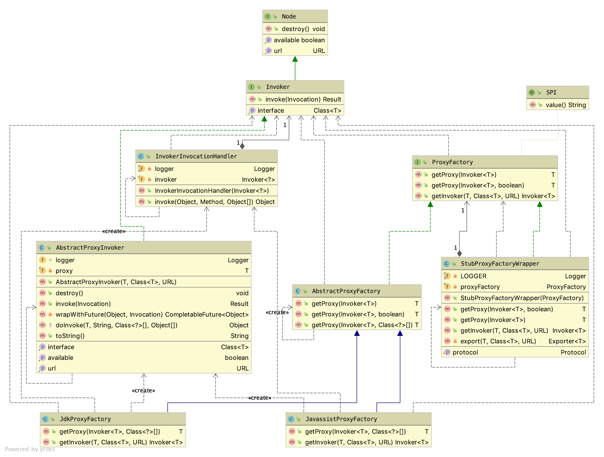

= Dubbo服务代理

RPC框架存在的主要价值是解耦服务，让开发者能够几乎无感地调用远端服务器提供的接口实现，所有复杂的中间环节都被框架隐藏起来了。一个RPC远程调用过程，涉及的微服务接口，在客户端出站前和服务端入站后的大部分时间，都会被表达成一个``Invoker<T>``对象，而这个表达过程正是由框架代理层所担纲（~《Dubbo微服务导入导出》一文中也多次表示原始``Invoker<T>``对象——``originInvoker``是由代理层生成的~）。

== 基础

了解原理和剖析源码是一枚硬币的两面，互为照应，无论以哪面作为学习研究的起点，都需要以另一面作为线索或者依据，只有这样，才能透彻地理解和掌握一个技术点的内核机制。因此接下来，我会带大家以上帝视觉从更加宏观的角度初步涉猎反面的大致原理和正面的源码类图结构。

=== 原理

如下框架示意图可以作为理解Dubbo中关键参与组件的切入点，``┈>``初始化流程和`` → ``调用流程会领着我们一览其大致运行机制。

image::./res/imgs/dubbo-framework-invoker.jpg[Dubbo之Invoker,align=center]

架构图由中分线分成左边服务消费方~C端~和右边服务提供方~P端~，细节这里不做具体阐述，和本文密切相关的的初始化流程和调用流程如下表。

.**Invoker** / **Proxy**
[cols="1,9"]
|===
|流程类型 |流程

.2+|C端 ``┈>``
|``iProxy``： ┈> ReferenceConfig ┈~getProxy~┈> ProxyFactory ┈> Proxy
|``iRemoting``： ┈> ReferenceConfig ┈~refer~┈> DubboProtocol ┈~refer~┈> DubboInvoker & ExchangeClient

|C端 `` → ``
|Proxy —~invoke~→ DubboInvoker —~request~→ ExchangeClient

.2+|P端 ``┈>``
|``iProxy``： ┈> ServiceConfig ┈~getInvoker~┈> ProxyFactory ┈> Implement'sProxyInvoker
|``iRemoting``： ┈> ServiceConfig ┈~export~┈> DubboProtocol ┈~export~┈> DubboExporter & DubboHandler (←ExchangeHandler ∈ ExchangeServer)

|P端 `` → ``
|DubboHandler —~received~→ DubboExporter —~invoke~→ Implement'sProxyInvoker  —~call~→ Implement
|===

[NOTE]
====
[small]#类的继承或接口实现关系：`Implement'sProxyInvoker | DubboInvoker → Invoker`、`Implement | Proxy → Interface`、`ExchangeClient → Client`、`DubboProtocol → Protocol`、`DubboExporter → Exporter`、`DubboHandler → ExchangeHandler → ChannelHandler`。#
====

可以看出无论是C端还是P端均有着两条泾渭分明、起始于配置层的初始化流程，其中一条结束于调用代理处，另外一条则结束于底层通讯处，我们假定前者为``iProxy``，后者为``iRemoting``，显然他们是存在着间接调用关系的，C端对应``iProxy → iRmoting``，而P端则反过来为``iRemoting → iProxy``。

这时关于代理层的运作机制就已经颇为明晰了：

* 在C端的作用是框架在利用配置层进行微服务引用的过程中，会由代理层为服务端定义的接口生成一个``proxy``代理实现，由它将本地方法调用中涉及的包括方法名、入参极其类型转换为``DubboInvoker#invoke(invocation)``方法的调用入参——一个``RpcInvocation``类的对象；

* 在P端，则会将服务方提供的接口实现实例化成一个``Invoker``对象，利用Java的反射机制将``Invoker#invoke(invocation)``方法中的入参转换为对服务接口相应方法的调用；

[[sec_proxy_cls_diagram]]
=== 类图

代理层实现是以扩展点``ProxyFactory``为中心展开，如下类图，扩展点实现``JdkProxyFactory``和``JavassitProxyFactory``都继承自抽象类``AbstractProxyFactory``，而它们都被``StubProxyFactoryWrapper``包装了。``ProxyFactory``扩展点具类会利用抽象类``AbstractProxyInvoker``以匿名内部类的形式产生``originInvoker``。右边的``StubProxyFactoryWrapper``则利用了Dubbo的SPI机制中的自动包装AOP特性，在动态代理的基础上利用静态代理实现了本地存根特性。

核心接口``ProxyFactory``处于框架的中分线位置，既用于客户端（C端），也被用于服务端（P端），对应分别提供了``getProxy(...)``和``getInvoker(...)``，接口定义如下：

[source,java]
----
@SPI("javassist")
public interface ProxyFactory {

    @Adaptive({PROXY_KEY})
    <T> T getProxy(Invoker<T> invoker) throws RpcException;

    @Adaptive({PROXY_KEY})
    <T> T getProxy(Invoker<T> invoker, boolean generic) throws RpcException;

    @Adaptive({PROXY_KEY})
    <T> Invoker<T> getInvoker(T proxy, Class<T> type, URL url) throws RpcException;

}
----

扩展点声明中，使用注解明确了默认使用``JavassistProxyFactory``这个实现，除非另行指定``url["proxy"] = "jdk"``。

== 具体实现剖析

一个微服务接口，代理层会为其在消费端生成由上面应用层调用的``proxy``代理实现，而在服务端则产生``AbstractProxyInvoker<T>``的匿名内部类的实例，供RPC框架底层调用其业务实现，暂且将它们分别看做是``C端代理``和``P端代理``。

=== C端代理实现

Java实现的框架中，大部分时候都会涉及动态代理，利用运行时代码或字节码生成技术为目标业务类或接口产生一个代理对象，以便在其方法调用的前后织入某些特性功能，或过滤、或增强，或拦截，抑或转置。其中转置的意思是“~将符合某些特性的被代理对象的功能屏蔽掉，转给其他业务类完成并返回结果~”。当然这只是比较常规的操作，因微服务接口的具体实现不在客户端本地，方法调用的信息会被全部转换成``Invocation``类对象，因而Dubbo中的代理使用就相当灵活，代理除了实现服务接口外，还会按需实现一些框架定义的接口，甚至是指定自定义的其它接口。

上述类图中已经反映了Dubbo为``ProxyFactory``提供了JDK和Javassist两个版本的实现，代理实现中涉及到的公共逻辑都被置于抽象基类``AbstractProxyFactory``中，如下：

[source,java]
----
public abstract class AbstractProxyFactory implements ProxyFactory {

    @Override
    public <T> T getProxy(Invoker<T> invoker) throws RpcException {
        return getProxy(invoker, false);
    }

    @Override
    public <T> T getProxy(Invoker<T> invoker, boolean generic) throws RpcException {
        Class<?>[] interfaces = null;
        String config = invoker.getUrl().getParameter(INTERFACES);
        if (config != null && config.length() > 0) {
            String[] types = COMMA_SPLIT_PATTERN.split(config);
            if (types != null && types.length > 0) {
                interfaces = new Class<?>[types.length + 2];
                interfaces[0] = invoker.getInterface();
                interfaces[1] = EchoService.class;
                for (int i = 0; i < types.length; i++) {
                    interfaces[i + 2] = ReflectUtils.forName(types[i]);
                }
            }
        }
        if (interfaces == null) {
            interfaces = new Class<?>[]{invoker.getInterface(), EchoService.class};
        }

        if (!GenericService.class.isAssignableFrom(invoker.getInterface()) && generic) {
            int len = interfaces.length;
            Class<?>[] temp = interfaces;
            interfaces = new Class<?>[len + 1];
            System.arraycopy(temp, 0, interfaces, 0, len);
            interfaces[len] = com.alibaba.dubbo.rpc.service.GenericService.class;
        }

        return getProxy(invoker, interfaces);
    }

    public abstract <T> T getProxy(Invoker<T> invoker, Class<?>[] types);
}

----

从上述源码可以看出，``ProxyFactory``会为代理类中添加上以下接口的方法：

* `invoker.getInterface()`
* `org.apache.dubbo.rpc.service.EchoService`
* ``url["interfaces"]``，可选
* ``org.apache.dubbo.rpc.service.GenericService``，可选，``generic = true``的情况下

``GenericService``接口的定义如下，关于``GenericService``接口在《Dubbo RPC 之 Protocol协议层（一）》中有提及。``EchoService``接口是用于实现回声测试，由框架默认实现，定义如下：

[source,java]
----
public interface EchoService {

    Object $echo(Object message);

}
----

有关于C端代理的实现，JDK和Javassist这两个版本都显得过于简洁，如下：
[source,java]
----
public class JdkProxyFactory extends AbstractProxyFactory {

    @Override
    public <T> T getProxy(Invoker<T> invoker, Class<?>[] interfaces) {
        return (T) Proxy.newProxyInstance(Thread.currentThread().getContextClassLoader(),
            interfaces, new InvokerInvocationHandler(invoker));
    }
    ...
}

public class JavassistProxyFactory extends AbstractProxyFactory {

    @Override
    public <T> T getProxy(Invoker<T> invoker, Class<?>[] interfaces) {
        return (T) Proxy.getProxy(interfaces).newInstance(new InvokerInvocationHandler(invoker));
    }
    ...
}
----

可见``InvokerInvocationHandler``是被两个版本的实现公共使用的，如下源码，代理对象``proxy``经过它将接口方法调用通过``invoker.invoke(new RpcInvocation(method, args)).recreate()``委托给了微服务引用实例``invoker``，除了``toString()、hashCode()、equals(Object)``这几个方法，其它的都是跨机器进程的RPC远程调用：
[source,java]
----
public class InvokerInvocationHandler implements InvocationHandler {
    private static final Logger logger = LoggerFactory.getLogger(InvokerInvocationHandler.class);
    private final Invoker<?> invoker;

    public InvokerInvocationHandler(Invoker<?> handler) {
        this.invoker = handler;
    }

    @Override
    public Object invoke(Object proxy, Method method, Object[] args) throws Throwable {
        String methodName = method.getName();
        Class<?>[] parameterTypes = method.getParameterTypes();
        if (method.getDeclaringClass() == Object.class) {
            return method.invoke(invoker, args);
        }
        if ("toString".equals(methodName) && parameterTypes.length == 0) {
            return invoker.toString();
        }
        if ("hashCode".equals(methodName) && parameterTypes.length == 0) {
            return invoker.hashCode();
        }
        if ("equals".equals(methodName) && parameterTypes.length == 1) {
            return invoker.equals(args[0]);
        }

        return invoker.invoke(new RpcInvocation(method, args)).recreate();
    }
}
----

看起来很简单，是不是？然而，到这里，脑袋中可能总觉得有些地方还是模糊不清的，也许更加直白和可接受的方式是给一个具体的实例，`so, show me demo`。如下源码是给服务方定义的接口``DemoService``生成的代理类，其中全局共有静态属性``methods``是一个``Method``类型的数组，装有``EchoService、DemoService``这两个接口的方法定义信息，当前代理对象的行为委托是通过``InvocationHandler handler``完成的。

[source,java]
----
public class proxy0 implements ClassGenerator.DC, EchoService, DemoService {
    // 方法数组
    public static Method[] methods;
    private InvocationHandler handler;

    public proxy0(InvocationHandler invocationHandler) {
        this.handler = invocationHandler;
    }

    public proxy0() {
    }

    public String sayHello(String string) {
        // 将参数存储到 Object 数组中
        Object[] arrobject = new Object[]{string};
        // 调用 InvocationHandler 实现类的 invoke 方法得到调用结果
        Object object = this.handler.invoke(this, methods[0], arrobject);
        // 返回调用结果
        return (String)object;
    }

    /** 回声测试方法 */
    public Object $echo(Object object) {
        Object[] arrobject = new Object[]{object};
        Object object2 = this.handler.invoke(this, methods[1], arrobject);
        return object2;
    }
}
----

==== ``JavassistProxyFactory``

===== 本地存根实现

一个扩展点实现，若存在一个构造函数，其入参类型和该具类所实现的扩展点一样，则被认作是一个Wrapper类，用于支持Dubbo的AOP特性。<<sec_proxy_cls_diagram,类图>>章节中已经提到代理层的本地存根 Stub 正是利用AOP实现的，关于 Stub，官方文档有着准确详述的描述，如下：
____
远程服务后，客户端通常只剩下接口，而实现全在服务器端，但提供方有些时候想在客户端也执行部分逻辑，比如：做 ThreadLocal 缓存，提前验证参数，调用失败后伪造容错数据等等，此时就需要在 API 中带上 Stub，客户端生成 Proxy 实例，会把 Proxy 通过构造函数传给 Stub，然后把 Stub 暴露给用户，Stub 可以决定要不要去调 Proxy。
____

从描述可知，本地存根的基本思路是，开发者在客户端为微服务接口在本地定义一个 Stub 静态代理，接口方法实现时，会根据业务需要，使用本地实现的代码逻辑包裹``Proxy``的远程RPC调用。假定给定的微服务接口类型为 IServ，由于 Stub 有了如下三个显性要求，因此本地存根可以非常方便的利用反射机制实现：

* 必须实现自 IServ；
* 有一个唯一入参为 IServ 的构造函数；
* 若设``url[("stub" | "local")] = ("true" | "default")``，类名必须是 IServ 的全名加上``"Stub"``或``"Local"``后缀，否则类名要明确配置在``url[("stub" | "local")]``中；

下面是两种形式的存根配置，相较于第一种，第二种显然有着更大的灵活性：
[source,xml]
----
<!--①-->
<dubbo:service interface="com.foo.BarService" stub="true" />
<!--②-->
<dubbo:service interface="com.foo.BarService" stub="com.foo.impl.MyBarService" />
----

``getProxy(invoker)``源码如下所示，方法使用了逻辑后置实现方式，非泛化调用的情况下：

. 首先由被代理的``proxyFactory``获得``proxy``，由存根配置获取到存根实现的类元信息，并确保它实现了微服务的接口；
. 然后利用反射搜寻存根实现中唯一入参为接口类型的构造函数，将``proxy``作为入参调用该构造函数，随即将创建的实例赋值给``proxy``；
. 最后，按理到此处整个流程应该结束了，但如``Tag_stub``标记处所示，还有一个存根服务的导出处理，详见下一章节；

[source,java]
----
public class StubProxyFactoryWrapper implements ProxyFactory {
    public <T> T getProxy(Invoker<T> invoker) throws RpcException {
        T proxy = proxyFactory.getProxy(invoker);
        if (GenericService.class != invoker.getInterface()) {
            URL url = invoker.getUrl();
            String stub = url.getParameter(STUB_KEY, url.getParameter(LOCAL_KEY));
            if (ConfigUtils.isNotEmpty(stub)) {
                Class<?> serviceType = invoker.getInterface();
                if (ConfigUtils.isDefault(stub)) {
                    if (url.hasParameter(STUB_KEY)) {
                        stub = serviceType.getName() + "Stub";
                    } else {
                        stub = serviceType.getName() + "Local";
                    }
                }
                try {
                    Class<?> stubClass = ReflectUtils.forName(stub);
                    if (!serviceType.isAssignableFrom(stubClass)) {
                        throw new IllegalStateException("The stub implementation class "
                            + stubClass.getName() + " not implement interface "
                            + serviceType.getName());
                    }
                    try {
                        Constructor<?> constructor = ReflectUtils.findConstructor(
                            stubClass, serviceType);
                        proxy = (T) constructor.newInstance(new Object[]{proxy});

                        ...//Tag_stub：export stub service

                    } catch (NoSuchMethodException e) {
                        throw new IllegalStateException("No such constructor \"public "
                            + stubClass.getSimpleName() + "(" + serviceType.getName()
                            + ")\" in stub implementation class " + stubClass.getName(), e);
                    }
                } catch (Throwable t) {
                    LOGGER.error("Failed to create stub implementation class " + stub
                        + " in consumer " + NetUtils.getLocalHost() + " use dubbo version "
                        + Version.getVersion() + ", cause: " + t.getMessage(), t);
                }
            }
        }
        return proxy;
    }
    ...
}
----

===== 本地存根服务导出

并非所有存根包裹流程都会涉及存根服务的导出处理，只有当明确指定了``url["dubbo.stub.event"] = true``参数，也即本地存根实现需要提供除服务接口以外的其它 public 方法时，才有必要。导出的存根服务和普通服务是存在差异的，Dubbo通过URL配置总线识别这种差异，识别参数总共 3 个，分别是``url["dubbo.stub.event"]``、``url["isserver"]``、``url["dubbo.stub.event.methods"]``，对应的值分别为``true、false、allStubProxyPublicMethods``。如下述代码所示，``StubProxyFactoryWrapper``提供了一个``export(...)``方法，其中用于本地导出存根服务的``protocol``是一个扩展点，会经由SPI完成其自动注入，默认为``DubboProtocol``，可以使用``url.protocol``指定其它实现。

[source,java]
----
//export stub service
public <T> T getProxy(Invoker<T> invoker) throws RpcException {
    ...
    URLBuilder urlBuilder = URLBuilder.from(url);
    if (url.getParameter(STUB_EVENT_KEY, DEFAULT_STUB_EVENT)) {
        urlBuilder.addParameter(STUB_EVENT_METHODS_KEY, StringUtils.join(
            Wrapper.getWrapper(proxy.getClass()).
                getDeclaredMethodNames(), ","));
        urlBuilder.addParameter(IS_SERVER_KEY, Boolean.FALSE.toString());
        try {
            export(proxy, (Class) invoker.getInterface(),
                urlBuilder.build());
        } catch (Exception e) {
            LOGGER.error("export a stub service error.", e);
        }
    }
    ...
}

private Protocol protocol;

public void setProtocol(Protocol protocol) {
    this.protocol = protocol;
}

private <T> Exporter<T> export(T instance, Class<T> type, URL url) {
    return protocol.export(proxyFactory.getInvoker(instance, type, url));
}
----

关于存根服务导出时的涉及相关细节请参考《Dubbo RPC 之 Protocol协议层》一文中有关章节。

=== P端代理实现

P端的主要职责是将来源于客户端的RPC请求转为对本地服务接口实现的方法调用，同时将P端的业务请求响应统一成异步模式，按定义处理结果需经由``Result``承载并返回（~``Result``是一个可异步完成的``CompletionStage<Result>``类对象~）。

总体逻辑实现由``AbstractProxyInvoker<T>``完成，为方便阐述，下述对应分为两个子章节：

==== RPC请求转本地方法调用

如下述源码，入站的RPC请求体会被表达成一个调用``Invoker<T>#invoke(invocation)``方法的``Invocation``入参对象，针对特定微服务，指定它被调用的方法，并携带了该方法所需的入参及入参类型。

[source,java]
----
public interface Invoker<T> extends Node {

    // get service interface.
    Class<T> getInterface();

    Result invoke(Invocation invocation) throws RpcException;
}
----

然而，一个理想的RPC框架，其跨进程的RPC方法调用，无论是从服务端还是消费端来看，于应用开发者而言都是无感的，也就是说，方法的定义形式和业务逻辑的实现过程均不应受到影响。

通常源码程序中，方法的调用是显示定义的，入参及入参类型必须和定义必须严格一一匹配，否则编译不会通过。然而服务端响应RPC请求是一个自下往上的方法调用过程，调用由RPC框架发起的，没法也不应该在源码程序中指定。多亏了Java中的反射机制，就一个目标对象，入参及入参类型已知的情况下，只需要知道被调用方法的字符串名称，便可正常地发起调用，只是若和定义不匹配时，会在运行时抛出错误，这种不匹配在编译时Java是无力发觉的。

另外一个Java方法，最多有两个出参，对应正常返回和异常返回，可以分别用``Object``和``Throwable``泛指。

综上，``AbstractProxyInvoker<T>``中定义了如下抽象方法``doInvoke(...)``，以便实现类提供``JDK``和``Javassist``两种反射实现：

[source,java]
----
protected abstract Object doInvoke(T proxy, String methodName,
    Class<?>[] parameterTypes, Object[] arguments) throws Throwable;
----

===== 本地调用实现

``doInvoke(...)``方法的实现于 jdk 版，相对比较简单，借助Java的反射机制，简短一段代码就搞定，如下：
[source,java]
----
public class JdkProxyFactory extends AbstractProxyFactory {
    ...
    @Override
    public <T> Invoker<T> getInvoker(T proxy, Class<T> type, URL url) {
        return new AbstractProxyInvoker<T>(proxy, type, url) {
            protected Object doInvoke(T proxy, String methodName,
                                      Class<?>[] parameterTypes,
                                      Object[] arguments) throws Throwable {
                Method method = proxy.getClass().getMethod(methodName, parameterTypes);
                return method.invoke(proxy, arguments);
            }
        };
    }
}
----
然而，javassist 版本的实现如下，看是源码也不多，但由于需要借助``Wrapper``完成，``Wrapper``逻辑实现还是不是很好理解，后续有机会专门介绍。

[source,java]
----
public class JavassistProxyFactory extends AbstractProxyFactory {
    ...
    @Override
    public <T> Invoker<T> getInvoker(T proxy, Class<T> type, URL url) {
        final Wrapper wrapper = Wrapper.getWrapper(
            proxy.getClass().getName().indexOf('$') < 0 ? proxy.getClass() : type);
        return new AbstractProxyInvoker<T>(proxy, type, url) {
            protected Object doInvoke(T proxy, String methodName,
                                      Class<?>[] parameterTypes,
                                      Object[] arguments) throws Throwable {
                return wrapper.invokeMethod(proxy, methodName, parameterTypes, arguments);
            }
        };
    }

}
----

==== 本地方法调用结果的异步化

我们都清楚原生方法调用大多数情况下都是同步的，如果涉及IO阻塞操作，会造成长时间的等待，这样势必大幅降低了吞吐量。于跨进程的RPC调用而言，由于天然就涉及网络IO，情况只会更糟，会有数量级的降低，因而Dubbo框架会对RPC调用过程的相关环节尽可能最大程度地异步化，即便是发生在服务端的最后一个本地方法调用环节。当然这里所述的异步化是仅就主流程而言，

在Java中，绝大部分异步实现均依托于``CompletableFuture``。如果原生方法定义的出参是它的一个实例，则无需另行处理；否则便用原生调用得到``value``值产生一个它的已完成状态实例，这种情况相当于服务端业务实现并没有异步化；最后一种便是后端开发人员使用类似于``Servlet 3.0``中的异步接口``AsyncContext``启用了``RpcContext.startAsync()``，下文接下来将开辟新的章节重点介绍它。

[source,java]
----
private CompletableFuture<Object> wrapWithFuture (Object value, Invocation invocation) {
    if (RpcContext.getContext().isAsyncStarted()) {
        return ((AsyncContextImpl)(RpcContext.getContext().getAsyncContext())).getInternalFuture();
    } else if (value instanceof CompletableFuture) {
        return (CompletableFuture<Object>) value;
    }
    return CompletableFuture.completedFuture(value);
}
----

从``Invoker<T>#invoke(invocation)``方法的定义可以看出，上述``doInvoke(...)``方法的``Object``出参类型数据最终需要相应转换为``Result``类型的对象。可见，RPC请求到本地原生方法调用的转换处理步骤很简洁：

. 调用``doInvoke(...)``方法，由子类完成本地原生方法调用，执行结果缓存在``value``；
. 调用``wrapWithFuture(...)``方法，将``Object``类型的``value``封装成一个``CompletableFuture<Object>``对象，记为``future``；
. 实例化一个``AsyncRpcResult``对象，记为``asyncRpcResult``，作为本地原生方法调用结果的承载体，也是当前方法的返回值；
. 在``future.whenComplete(...)``异步响应回调中，为``asyncRpcResult``填充结果，告知处理完成（关于``AsyncRpcResult``和``AppResponse``，详见《Dubbo RPC 之 Protocol协议层》一文）。

[source,java]
----
@Override
public Result invoke(Invocation invocation) throws RpcException {
    try {
        Object value = doInvoke(proxy, invocation.getMethodName(),
            invocation.getParameterTypes(), invocation.getArguments());
        CompletableFuture<Object> future = wrapWithFuture(value, invocation);
        AsyncRpcResult asyncRpcResult = new AsyncRpcResult(invocation);
        future.whenComplete((obj, t) -> {
            AppResponse result = new AppResponse();
            if (t != null) {
                if (t instanceof CompletionException) {
                    result.setException(t.getCause());
                } else {
                    result.setException(t);
                }
            } else {
                result.setValue(obj);
            }
            asyncRpcResult.complete(result);
        });
        return asyncRpcResult;
    } catch (InvocationTargetException e) {
        if (RpcContext.getContext().isAsyncStarted() && !RpcContext.getContext().stopAsync()) {
            logger.error("Provider async started, but got an exception from " +
                "the original method, cannot write the exception back to consumer " +
                 "because an async result may have returned the new thread.", e);
        }
        return AsyncRpcResult.newDefaultAsyncResult(null, e.getTargetException(), invocation);
    } catch (Throwable e) {
        throw new RpcException("Failed to invoke remote proxy method "
            + invocation.getMethodName() + " to " + getUrl() + ", cause: " + e.getMessage(), e);
    }
}
----

=== P端``AsyncContext``异步方案

于单个服务接口实现来说，如果其业务执行需要阻塞，无论如何是需要有线程来执行的，异步并不会带来资源的节省或者RPC响应性能的提升。但放眼于整个服务进程，由于另行切换到用户线程中执行，可以避免因为长时间占用或阻塞Dubbo线程池中的线程而影响其他服务线程的执行，综合来讲会提升整体吞吐量。

==== P端异步编程

在基于Dubbo的RPC编程中，我们通常使用如下方式实现P端的异步化：

[source,java]
----
public interface AsyncService {
    CompletableFuture<String> sayHello(String name);
}
public class AsyncServiceImpl implements AsyncService {
    @Override
    public CompletableFuture<String> sayHello(String name) {
        RpcContext savedContext = RpcContext.getContext();
        // 建议为supplyAsync提供自定义线程池，避免使用JDK公用线程池
        return CompletableFuture.supplyAsync(() -> {
            System.out.println(savedContext.getAttachment("consumer-key1"));
            try {
                Thread.sleep(5000);
            } catch (InterruptedException e) {
                e.printStackTrace();
            }
            return "async response from provider.";
        });
    }
}
----

上述这个方案有个缺点，就是规定了接口定义中的出参必须是``CompletableFuture<?>``，那我们还有其他方法吗？别急，Dubbo已经为我们想得很周全，它提供了一个类似``Serverlet 3.0``的异步接口``AsyncContext``，即便方法出参没有声明成``CompletableFuture<?>``，也能实现P端异步化，如下示例：
[source,java]
----
public interface AsyncService {
    String sayHello(String name);
}
public class AsyncServiceImpl implements AsyncService {
    public String sayHello(String name) {
        final AsyncContext asyncContext = RpcContext.startAsync();
        new Thread(() -> {
            // 如果要使用上下文，则必须要放在第一句执行
            asyncContext.signalContextSwitch();
            try {
                Thread.sleep(500);
            } catch (InterruptedException e) {
                e.printStackTrace();
            }
            // 写回响应
            asyncContext.write("Hello " + name + ", response from provider.");
        }).start();
        return null;
    }
}
----

上述两个异步编程方案的服务暴露是完全一样的，如下：
[source,java]
----
<bean id="asyncService"
    class="org.apache.dubbo.samples.governance.impl.AsyncServiceImpl"/>

<dubbo:service interface="org.apache.dubbo.samples.governance.api.AsyncService"
    ref="asyncService"/>
----

==== ``AsyncContext``实现

从上面的第二异步方案示例中可以看出，接口实现返回值``null``并不是真实的业务响应结果，业务逻辑实现在另行开辟的线程中执行的 ，其处理结果是经由``AsyncContext#write(value)``返回给调用方的。结合上文``wrapWithFuture(...)``方法可以推断，``AsyncContext``实质是，将当前RPC请求所需配套的``CompletableFuture``实例``future``缓存在线程本地上下文中，而其业务方法执行结果正是由``write``写入的。

当然，具体实现中，并没有将当前PRC调用所需的``CompletableFuture``实例直接捆绑到``RpcContext``上，如下源码，它声明了一个被认作是异步上下文的``asyncContext``属性，该上下文需要显示调用``startAsync()``方法才会开启，因而又得另行配合一个判定是否已开启的``isAsyncStarted()``方法。

[source,java]
----
public class RpcContext {
    ...
    private AsyncContext asyncContext;

    public static AsyncContext startAsync() throws IllegalStateException {
        RpcContext currentContext = getContext();
        if (currentContext.asyncContext == null) {
            currentContext.asyncContext = new AsyncContextImpl();
        }
        currentContext.asyncContext.start();
        return currentContext.asyncContext;
    }

    public boolean isAsyncStarted() {
        if (this.asyncContext == null) {
            return false;
        }
        return asyncContext.isAsyncStarted();
    }

    public boolean stopAsync() {
        return asyncContext.stop();
    }

    public AsyncContext getAsyncContext() {
        return asyncContext;
    }
}
----

接下来先看看如下``AsyncContext``接口，定义了相关管理行为，从几个方法名称可以看出其使用方式，得先调用``start()``方法开启异步上下文，业务处理完后，调用``write(value)``写入结果，最后调用``stop()``做回收处理。

[source,java]
----
public interface AsyncContext {

    void write(Object value);

    boolean isAsyncStarted();

    boolean stop();

    void start();

    void signalContextSwitch();
}
----

关于``signalContextSwitch()``，其作用就是重放在``startAsync()``时刻缓存的Dubbo线程本地现场数据，确保当前用户线程能获得其启动前一时刻的相关环境信息。这场景和编程中经常用到闭包有点类似，对应Java中的是匿名内部类，我们经常使用它实现回调接口，比如响应一个鼠标事件，响应处理是晚于匿名内部类的实例生成时刻的，通常响应阶段需要保留生成时刻的变量值，也即意味着相应的变量具备不可变性，比如声明为``final``的基本类型变量，或者是通过拷贝方式生成一个``final``型的引用类型变量，并确保此后它不会被改变。

``RpcContext#startAsync()``驱动了``AsyncContext``实现``AsyncContextImpl``的实例化，而后者在其构造函数中执行保留现场处理，而根据``AsyncContext``的使用方式，``startAsync()``唤起时用户线程还没有启动，还在Dubbo线程中。Dubbo利用了类似Java原生的``ThreadLocal``机制做PRC相关操作的线程本地上下文变量的存取处理，如下源码所示，``RpcContext.get~[~Server~]~Context() ↔ RpcContext.restore~[~Server~]~Context(storedContext)``是一对现场数据的保留和重放操作：

[source,java]
----
public class AsyncContextImpl implements AsyncContext {

    private RpcContext storedContext;
    private RpcContext storedServerContext;

    public AsyncContextImpl() {
        this.storedContext = RpcContext.getContext();
        this.storedServerContext = RpcContext.getServerContext();
    }

    @Override
    public void signalContextSwitch() {
        RpcContext.restoreContext(storedContext);
        RpcContext.restoreServerContext(storedServerContext);
    }
    ...
}
----

``AsyncContextImpl``整体上显得相当干练，在``start()``启动时，为P端``AbstractProxyInvoker``构建``CompletableFuture<Object>``实例，记为``future``，而``write(value)``则将用户线程执行的结果写入``future``。

[source,java]
----
public class AsyncContextImpl implements AsyncContext {
    private CompletableFuture<Object> future;

    @Override
    public void start() {
        if (this.started.compareAndSet(false, true)) {
            this.future = new CompletableFuture<>();
        }
    }

    @Override
    public void write(Object value) {
        if (isAsyncStarted() && stop()) {
            if (value instanceof Throwable) {
                Throwable bizExe = (Throwable) value;
                future.completeExceptionally(bizExe);
            } else {
                future.complete(value);
            }
        } else {
            throw new IllegalStateException("The async response has probably been wrote "
                +"back by another thread, or the asyncContext has been closed.");
        }
    }

    public CompletableFuture<Object> getInternalFuture() {
        return future;
    }

    ...
}
----

另外，为了确保开发人员线程安全地正确使用``AsyncContext``，只会执行一个完整的``start() → write(value)``的流程，特意使用了``AtomicBoolean``类型的原子变量``started``和``stopped``。由于``start()``和``stop()``即便执行多次，也都只会有一次执行是有效的，因此上述``write(value)``方法实现的首行源码便是先确保已启用``AsyncContext``，紧接着执行``stop()``停用``AsyncContext``，接下来的源码才在前两个操作都成功的情况下才执行``future``的完成操作。

[source,java]
----
public class AsyncContextImpl implements AsyncContext {
    private final AtomicBoolean started = new AtomicBoolean(false);
    private final AtomicBoolean stopped = new AtomicBoolean(false);

    @Override
    public boolean isAsyncStarted() {
        return started.get();
    }

    @Override
    public boolean stop() {
        return stopped.compareAndSet(false, true);
    }
    ...
}
----

---

完结

