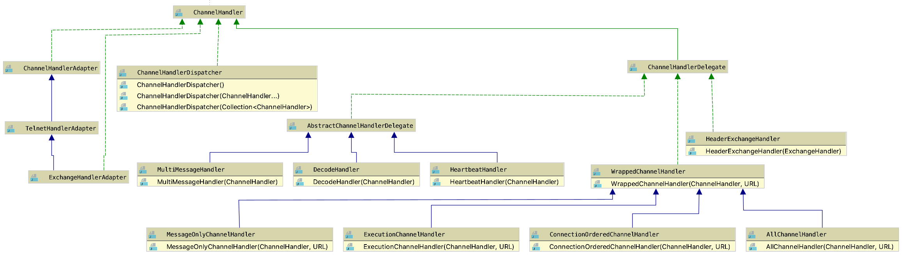
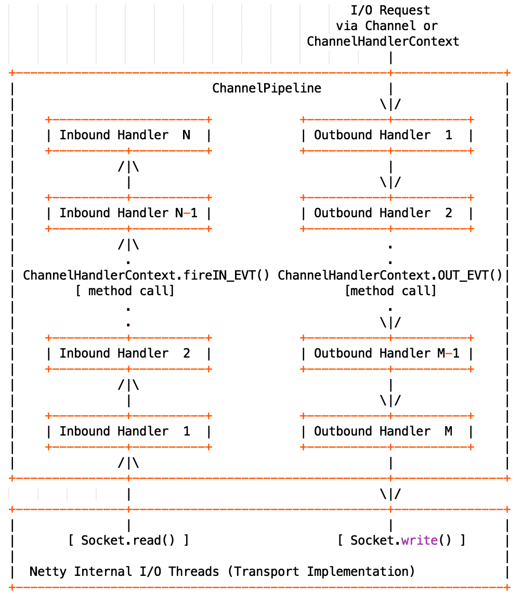
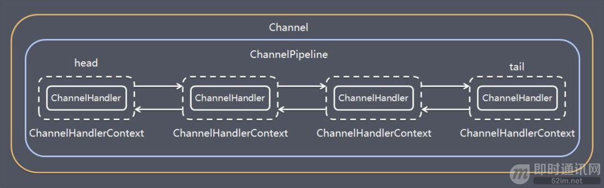
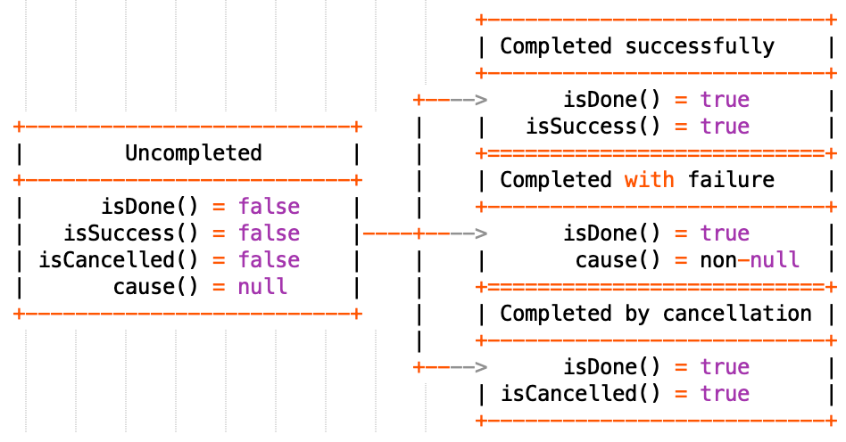

= Dubbo远程通讯 · 网络传输层

真实世界一件很简单的事情，映射到计算机中，由于涉及太多细节，最后实现阶段往往会觉得非常复杂，因此善于抽象出合适的模型以近似表达真实世界的事物是一种非常厉害的能力。作为RPC框架的Dubbo，就有很多这样的闪光点，比如前面提到的URL配置总线，本文将要涉及的远程通讯实现算一个。

== 概念点

在面向对象编程中，我们经常发现一种情况，功能差异特别大的两种实体，却在某方面有着很大的共性，而这共性方面刚好又恰恰是我们需要关注的，为了便于程序处理，我们会将这种共性抽象出来，但这也导致理解上的不便，Dubbo中的Endpoint^端^正是这样一种存在。

作为分布式系统构建的集成件，Dubbo的远程通讯采取的是传统CS架构，在Wiki上有如下一段描述：

____
Client–server model is a distributed application structure that partitions tasks or workloads between the providers of a resource or service, called servers, and service requesters, called clients.[1] Often clients and servers communicate over a computer network on separate hardware, but both client and server may reside in the same system.
A server host runs one or more server programs which share their resources with clients. A client does not share any of its resources, but requests a server's content or service function. Clients therefore initiate communication sessions with servers which await incoming requests. Examples of computer applications that use the client–server model are Email, network printing, and the World Wide Web.
____

大概意思是"CS模式是一种分布式应用架构，提供资源或服务的为Server，而发出请求的是Client，他们一起协作参与完成任务^或：工作负载^。通常Server和Client能够通过彼此独立的硬件进行计算机网络通讯。Server中运行着一或多个程序，其资源由多个接入Client共享，而Client间却彼此独立，只能请求Server端的内容或者调起其功能。*_因此由Client端启动与等待接入请求的Server端的通讯会话_。* 电子邮件，网络打印和万维网都属于这种架构模式"。

=== Endpoint——端

*Endpoint*，是一个抽象概念，可以认为它是一个能够发生网络通讯的节点，端之间可以进行双向网络通讯，基于此衍生出
**通道（Channel）、客户端（Client）、服务端（Server）**三个概念，当然也可能如上述所说，端是由这3者倒推抽象得到的。

端具有如下特征：

. 它的身份由**URL配置总线**中的__URL__所表示，这个URL只是用于在Dubbo唯一标识这个端，并携带端所特有参数，供设置、读取；
. 能够发生通讯的前提是具有真实的物理网络地址，由``InetSocketAddress``表示，表示为``ip:port``或``host:port``；
. 端能够主动发起消息传递操作，也可以将自己从Dubbo管辖的集群下线；
. 具有感知通讯事件的能力

如下述接口所示：
[source,java]
----
public interface Endpoint {

    URL getUrl();

    ChannelHandler getChannelHandler();

    InetSocketAddress getLocalAddress();

    void send(Object message) throws RemotingException;

//======================
//sent，过去分词，用于控制同步还是异步发送消息的，true值表示消息已经成功发出，实际对于同步IO来说，无论如何当前方法都是需要阻塞到IO已经完成的
//其值不会有任何影响，而对于支持异步IO的中间件，比如Netty，true值，则会直接等到消息已经成功发出，才会返回，否则为异步执行，方法立即返回，
//这时IO还没执行完甚至是还没有启动执行
//======================
    void send(Object message, boolean sent) throws RemotingException;

    void close();

    //Graceful close the channel.
    void close(int timeout);

    void startClose();

    //检查端是否已关闭
    boolean isClosed();
}
----
=== Channel——通道

**Channel**是**Client**和**Server**的信号传输通道，消息发送端会往通道输入消息，而接收端会从通道读消息。并且接收端发现通道没有消息，就去做其他事情了，不会造成阻塞。所以channel可以读也可以写，并且可以异步读写。可以这么认为，Channel就是一个消息管道，Client是消费方，一有需要就试着从通道取内容，而Server是提供方，按需要将消息断断续续^或：源源不断^装入通道，当然这过程也可以反过来。不同的是Client只能绑定一个Channel，而Server则能绑定多个，因此对应到Client和Server是一对多的关系。理论上二者同Channel间的关系都是聚合。

Dubbo中的**Channel**具有如下特征：

. 可以向Channel写入或者从中读取上下文本地属性
. 从Channel的一侧能够获取到另一侧的物理网络地址
. 能够检测当前Channel的双端是否还处于连接状态

接口定义源码如下：
[source,java]
----
public interface Channel extends Endpoint {

    InetSocketAddress getRemoteAddress();

    boolean isConnected();

//======================
//attribute并不会经通道被发往对端，只是随Channel一起被绑定的属性值
//通讯过程虽然很短暂，但瞬间跨越大量方法栈帧（函数调用）
//能够就其绑定Channel本地值是非常必要的，便于跨帧获得上下文值，有点类似于线程本地变量容器ThreadLocal
//======================
    boolean hasAttribute(String key);

    Object getAttribute(String key);

    void setAttribute(String key, Object value);

    void removeAttribute(String key);
}
----

=== Client\Server——客户端\服务端

**Client**和**Server**分别是CS模式中的客户端和服务端，属于传输层，更多的体现的是语义上的差别，并不区分请求和应答职责，二者拥有的都是发送能力。但客户端拥有体现其特有职责的重连能力，连接肯定都是由客户端发起，它一般是在连接超时时由心跳任务发起。客户端没有显式的连接以及断连语义，在客户端被初始化出来时就默认开启并建立与服务端连接，且通过定时任务维护通道的连接状态。因此客户端和服务端除了重连以外都只有close和send两个影响网络输出的动作。

Dubbo中Client的实现使用继承而非聚合处理和Channel的关系，每次连入一个Client，Server端均会产生一个与之绑定的Channel，这些Channel信息会维护在一个聚合容器中，可以根据Client的网络物理地址获取到。

另外Client和Server均实现了``Resetable``和 `IdleSensible` 接口，前者用于重试本地上下文参数，而后者则是在检测到空闲连接时，能够做出相应处理，Server端关闭连接，而Client端则发送心跳到服务端。

接口定义源码如下：
[source,java]
----
public interface Client extends Endpoint, Channel, Resetable, IdleSensible {

    void reconnect() throws RemotingException;

}

public interface Server extends Endpoint, Resetable, IdleSensible {

    boolean isBound();

    Collection<Channel> getChannels();

    Channel getChannel(InetSocketAddress remoteAddress);
}

public interface Resetable {

    void reset(URL url);

}

/**
 * Indicate whether the implementation (for both server and client) has the ability to sense and handle idle connection.
 * If the server has the ability to handle idle connection, it should close the connection when it happens, and if
 * the client has the ability to handle idle connection, it should send the heartbeat to the server.
 */
public interface IdleSensible {
    /**
     * Whether the implementation can sense and handle the idle connection. By default it's false, the implementation
     * relies on dedicated timer to take care of idle connection.
     *
     * @return whether has the ability to handle idle connection
     */
    default boolean canHandleIdle() {
        return false;
    }
}

----

=== ChannelHandler

Dubbo网络通讯中，Channel是Client和Server之间的信号传输器，过程中端间的存在着[big]##*连接、发送消息、接收消息、断连、异常捕获*##这些行为，对应存在着[big]##*connected、sent、received、disconnected、caught*##这5个网络事件。利用事件点进行功能扩展和增强正是很多编程框架和中间件的必备武功，我们知道Dubbo的端之间发生的基于socket的网络通讯，但是dubbo本身并不负责通讯IO的处理，这种行为由被委托Netty等第三方网络通讯组件负责，Dubbo将这些基本能力抽象，形成对外的统一扩展接口~插件化~，再由**ChannelHandler**在合适的事件点按照场景进行扩展增强处理。白话一点说，其具体实现是对第三方网络通讯组件进行适配，后者在I/O就绪后回调其提供的5个网络事件处理函数。

[NOTE]
网络行为触发产生对应的事件，而事件也可以反过来触发新的网络行为。eg: **HeartbeatHandler**在收到接受到请求后~**received**事件~，首先会确认是否为心跳请求，若是，则会通过接受消息的那个Channel发回一个心跳相应，进而触发了对端的**received**事件。

**ChannelHandler**采用装饰者模式方式实现，其接口定义如下：

[source,java]
----
@SPI
public interface ChannelHandler {

    void connected(Channel channel) throws RemotingException;

    void disconnected(Channel channel) throws RemotingException;

    void sent(Channel channel, Object message) throws RemotingException;

    void received(Channel channel, Object message) throws RemotingException;

    void caught(Channel channel, Throwable exception) throws RemotingException;
}
----

理解**ChannelHandler**的实现是理解整个Dubbo远程通讯的一个关键点，由于其设计使用了装饰者模式，理解起来没有那么直观，具体请参考《Dubbo与设计模式》一文中的**装饰者模式**这一小章节便于后续理顺其实现逻辑，**ChannelHandler**的大体类UML图如下。

上图中WrapChannelHandler是实现Dubbo线程派发的关键部分，具体请参考《Dubbo之线程管理》一文 。

=== 基础能力实现

如下UML生成图所示，无论是服务端、客户端，还是桥接二者的通道实现，都继承实现自AbstractPeer，后者分别实现了EndPoint和ChannelHandler两个接口，这表明在Dubbo中的服务端、客户端和通道具有Endpoint的特性，同时还能感知并响应网络通讯事件。而其下的AbstractPoin则定义了服务端和客户端重设参数的能力，AbstractChannel作为通道基类则显得过分简单。

image::res/imgs/dubbo_endpoint_base.png[caption="图：", title="Dubbo的端实现", alt="Dubbo的端实现", width="850",]

[NOTE]
图中所表示的同时会出现在``NettyChannel``、`NettyServer`、``NettyClient``中的容易混淆的两个方法：**Endpoint**定义的 ``send()``和**ChannelHandler**定义的``sent()``。前者用于通过Channel通道主动向对方发送消息，而后者则是在已发送消息后告知处理结果用的，属于I/O响应事件回调。

==== AbstractPeer

AbstractPeer提炼抽象了通讯对端的公共能力，它具有响应通讯事件的能力^实现``ChannelHandler``接口^，但这种能力是委托给所引用的``ChannelHandler``达成的。AbstractPeer中声明了两个volatile类型的表示端是否处于关闭状态的变量，该状态下，是禁止再向对端发送消息或者接受来自对端的消息的，也无法向对端发起连接请求。其实现关闭的方式也很简单，只需对应改变状态值。注意：[big]#这里所说的关闭操作实际上关闭的是所绑定对应的**Channel**#。

[source,java]
----

public abstract class AbstractPeer implements Endpoint, ChannelHandler {

//======================
//端在本机JVM中会被多个线程共用，因此需要使用volatile变量让所有线程在第一时间知道其是否处于可用状态
//======================

    // closing closed means the process is being closed and close is finished
    private volatile boolean closing;

    private volatile boolean closed;

    @Override
    public boolean isClosed() {
        return closed;
    }

    public boolean isClosing() {
        return closing && !closed;
    }

    @Override
    public void close() {
        closed = true;
    }

    @Override
    public void close(int timeout) {
        close();
    }

    //通讯端关闭需持续一段时间，等最终完成关闭会调用close()方法
    @Override
    public void startClose() {
        if (isClosed()) {
            return;
        }
        closing = true;
    }

//======================
//发送通讯行为的事件在已关闭状态是禁用的
//======================
    @Override
    public void connected(Channel ch) throws RemotingException {
        if (closed) {
            return;
        }
        handler.connected(ch);
    }
    @Override
    public void sent(Channel ch, Object msg) throws RemotingException {
        if (closed) {
            return;
        }
        handler.sent(ch, msg);
    }

    @Override
    public void received(Channel ch, Object msg) throws RemotingException {
        if (closed) {
            return;
        }
        handler.received(ch, msg);
    }

//======================
//感知断链和异常事件
//======================
    @Override
    public void disconnected(Channel ch) throws RemotingException {
        handler.disconnected(ch);
    }

    @Override
    public void caught(Channel ch, Throwable ex) throws RemotingException {
        handler.caught(ch, ex);
    }
}
----

==== AbstractEnpoint

Dubbo中，参数的传递的信使始终是Url，负责通讯的端需要有合适的Codec2编解码器对对传输的数据进行编码解码。
[source,java]
----
public abstract class AbstractEndpoint extends AbstractPeer implements Resetable {

//======================
//该类中定义了如下3个参数，职责也主要是通过信使判断是否需要对他们进行重设
//分别对应的参数Key为：codec、timeout、connect.timeout
//其默认值分别对应telnet、1s、3s
//======================
    private Codec2 codec;

    private int timeout;

    private int connectTimeout;

    //构建初期Dubbo会根据传入的url设值，没有明确指定的情况下使用默认参数
    public AbstractEndpoint(URL url, ChannelHandler handler) {
        super(url, handler);
        this.codec = getChannelCodec(url);
        this.timeout = url.getPositiveParameter(TIMEOUT_KEY, DEFAULT_TIMEOUT);
        this.connectTimeout = url.getPositiveParameter(Constants.CONNECT_TIMEOUT_KEY, Constants.DEFAULT_CONNECT_TIMEOUT);
    }

    //使用Dubbo自身的SPI机制根据参数获取当前JVM中对应的Codec2实现
    protected static Codec2 getChannelCodec(URL url) {
        String codecName = url.getParameter(Constants.CODEC_KEY, "telnet");
        if (ExtensionLoader.getExtensionLoader(Codec2.class).hasExtension(codecName)) {
            return ExtensionLoader.getExtensionLoader(Codec2.class).getExtension(codecName);
        } else {
            return new CodecAdapter(ExtensionLoader.getExtensionLoader(Codec.class)
                    .getExtension(codecName));
        }
    }

    @Override
    public void reset(URL url) {
        if (isClosed()) {
            throw new IllegalStateException("Failed to reset parameters "
                    + url + ", cause: Channel closed. channel: " + getLocalAddress());
        }
        if (url.hasParameter(TIMEOUT_KEY)) {
            int t = url.getParameter(TIMEOUT_KEY, 0);
            if (t > 0) {
                this.timeout = t;
            }
        }
        if (url.hasParameter(Constants.CONNECT_TIMEOUT_KEY)) {
            int t = url.getParameter(Constants.CONNECT_TIMEOUT_KEY, 0);
            if (t > 0) {
                this.connectTimeout = t;
            }
        }
        if (url.hasParameter(Constants.CODEC_KEY)) {
            this.codec = getChannelCodec(url);
        }
    }

}
----

==== AbstractChannel

前文已经提到，Channel是客户端和服务端通讯的信号通道，有着多对一的绑定关系。*AbstractChannel* 作为抽象基类单独提炼出来，也仅仅是完成最基础的一部分特性，如下所示，但另外一方面而言，这个看起来可有可无的存在实际是又是必要的，类似Netty等的I/O框架都有直接定义名为Channel的接口，这和Dubbo定义的Channel接口虽然不冲突，但在同一个类中出现，难免产生混淆。

[source,java]
----
public abstract class AbstractChannel extends AbstractPeer implements Channel {

    public AbstractChannel(URL url, ChannelHandler handler) {
        super(url, handler);
    }

//子类实现该具体方法时一般要调用super.send()操作，确保正确继承父类定义的行为
    @Override
    public void send(Object message, boolean sent) throws RemotingException {
        if (isClosed()) {
            throw new RemotingException(this, "Failed to send message "
                    + (message == null ? "" : message.getClass().getName()) + ":" + message
                    + ", cause: Channel closed. channel: " + getLocalAddress() + " -> " + getRemoteAddress());
        }
    }
//该toString()方法仅仅用于告知通讯的双方IP地址
    @Override
    public String toString() {
        return getLocalAddress() + " -> " + getRemoteAddress();
    }
}
----

==== NettyChannel

顾名思义，NettyChannel的通道特性是委托给Netty实现的，调用其定义的Channel接口，也就是说二者存在的一一对应关系。微服务架构中，一个Client客户端往往需要连接多个其它第三方的Server服务端，也即同一个JVM中存在着多份这样的关系，因此NettyChannel中定义了如下一个线程安全的Map容器~简单缓存实现~，注意它是全局的静态私有变量：
[source,java]
----
private static final ConcurrentMap<Channel, NettyChannel>
    CHANNEL_MAP = new ConcurrentHashMap<Channel, NettyChannel>()
----
为了更好的管理这种映射关系，NettyChannel的构造函数被设计成了私有的，需要调用对应的``getOrAddChannel()``静态方法获得实例，同时静态方法只能在本Package中使用，这说明直接接触Netty的部分也被局限在一个小的范围，模块化边界更加清晰。
[source,java]
----
private NettyChannel(Channel channel, URL url, ChannelHandler handler) {
    super(url, handler);
    if (channel == null) {
        throw new IllegalArgumentException("netty channel == null;");
    }
    this.channel = channel;
}

//======================
//只有active状态的channel才会被装入到缓存，同时该状态下，是不允许脱离缓存，避免处于游离状态
//======================
static NettyChannel getOrAddChannel(Channel ch, URL url, ChannelHandler handler) {
    if (ch == null) {
        return null;
    }
    //根据Netty之Channel查找现存映射关系，若存在直接返回
    NettyChannel ret = CHANNEL_MAP.get(ch);
    if (ret == null) {

        NettyChannel nettyChannel = new NettyChannel(ch, url, handler);

        if (ch.isActive()) {//只有Channel处于激活有效状态，才执行下述代码

            //getOrAddChannel是一全局静态方法，存在并发问题，虽然上述发现并不存在对应关系
            //但此后依然可能加入了其映射关系，因此需要使用现场安全的putIfAbsent
            //如果存在直接返回原有NettyChannel值，否则返回新加入的值nettyChannel

            ret = CHANNEL_MAP.putIfAbsent(ch, nettyChannel);
        }

        //此前并不存在对应映射关系，直接返回新创建的值nettyChannel
        if (ret == null) {
            ret = nettyChannel;
        }
    }
    return ret;
}
static void removeChannelIfDisconnected(Channel ch) {
    if (ch != null && !ch.isActive()) {
        CHANNEL_MAP.remove(ch);
    }
}
----
[IMPORTANT]
上述容易被人忽视的地方是，CHANNEL_MAP实际上在任意时刻只会为同一个Client缓存一份``<Channel, NettyChannel>``的键值关系，每一次调用``getOrAddChannel(Channel, URL, ChannelHandler)``都会传入当前Client所持有的最新channel变量^volatile类型^。

上文中提到Channel需要实现自己的本地属性存取函数，目的是为了跨函数栈帧获取到Dubbo通道本地的上下文值，具体实现如下：
[source,java]
----
private final Map<String, Object> attributes =
    new ConcurrentHashMap<String, Object>();

@Override
public boolean hasAttribute(String key) {
    return attributes.containsKey(key);
}

@Override
public Object getAttribute(String key) {
    return attributes.get(key);
}

@Override
public void setAttribute(String key, Object value) {
    // The null value is unallowed in the ConcurrentHashMap.
    if (value == null) {
        attributes.remove(key);
    } else {
        attributes.put(key, value);
    }
}

@Override
public void removeAttribute(String key) {
    attributes.remove(key);
}
----
通道使用完需要执行一些打扫战争的清理工作，依次执行如下4个动作：

. 调用父类定义的``close()``方法，改变对应的volatile类型的状态值；
. 如果channel~Netty定义的那个~已处于InActive状态，则从ConcurrentMap缓存中移除；
. 清理所有Channel本地缓存的属性值；
. 调用Netty的Channel的Close方法，将其通道功能关闭

[source,java]
----
public void close() {

    super.close();

    removeChannelIfDisconnected(channel);

    attributes.clear();

    channel.close();
}
----
最后便是通道的消息发送功能的实现，Netty支持异步I/O，因此可以通过参数告知是同步发送消息还是异步
[source,java]
----
public void send(Object message, boolean sent) throws RemotingException {
    // whether the channel is closed
    super.send(message, sent);

    boolean success = true;
    int timeout = 0;
    try {
        //通道消息写入最后必须执行flush操作，否则对端会一直处于IO等待状态
        ChannelFuture future = channel.writeAndFlush(message);
        if (sent) {
            // wait timeout ms
            timeout = getUrl().getPositiveParameter(TIMEOUT_KEY, DEFAULT_TIMEOUT);
            //如果在规定时间还未完成，便返回
            success = future.await(timeout);
        }
        //future的特性是不仅缓存结果值，还会缓存异常（如果存在的话）
        Throwable cause = future.cause();
        if (cause != null) {
            throw cause;
        }
    } catch (Throwable e) {
        throw new RemotingException(this, "Failed to send message " + message + " to " + getRemoteAddress() + ", cause: " + e.getMessage(), e);
    }
    if (!success) {
        throw new RemotingException(this, "Failed to send message " + message + " to " + getRemoteAddress()
                + "in timeout(" + timeout + "ms) limit");
    }
}

----

==== AbstractClient → NettyClient

AbstractClient采用模板模式定义实现了I/O通讯的中公共的行为，如下具体行为则由具体实现类针对特定I/O框架做进一步实现。

[source,java]
----
protected abstract void doOpen() throws Throwable;

protected abstract void doClose() throws Throwable;

protected abstract void doConnect() throws Throwable;

protected abstract void doDisConnect() throws Throwable;

protected abstract Channel getChannel();
----

上述的``getChannel()``方法是其它所有操作的基础，这和Dubbo中Consumer能和多个Server发生通讯有关。一个Consumer可以和多个Server保持通讯往来，同时一个Server绝大部分情况是会和多个Consumer发生联系的，Dubbo会为一个Consumer创建了多份Client，每一份Client仅仅关联唯一指定的Server，Client和Server使用通道建立连接和发生通讯，其间具有多对一的关系。另外Client和Channel是一对一的组合关系，因此Client的大部分生命周期行为都被委托给Channel实现。

也就是说从Client的视觉来说，它和Server的关系是一对一的，但是Channel的生命周期于Client来说是短暂的，通过仔细阅读代码发现，Dubbo实际上最多只保持一个Channel处于开启状态，新的连接进来，老的就被close掉，并从NettyChannel定义的私有、全局静态且线程安全的变量CHANNEL_MAP中剔除，此外Dubbo利用了并发中的一些诸如volatile、ReentrantLock、ConcurrentMap的技巧来保证线程安全。

[NOTE]
由Netty创建的Channel每次连接会创建一份新的，Dubbo自己维护的NettyChannel与其生命周期基本是一样的，这还得回到Netty的hash值计算方式来，由源码可以看出，其Hash值的计算的唯一根据是Netty所创建的那份Channel。
[source,java]
----
/**
 * netty client bootstrap
 */
private static final NioEventLoopGroup nioEventLoopGroup =
    new NioEventLoopGroup(Constants.DEFAULT_IO_THREADS,
        new DefaultThreadFactory("NettyClientWorker", true));

private Bootstrap bootstrap;

//======================
//channel被申明成了volatile，每一次调用doConnect()发生新的连接都会替换该值
//======================
/**
 * current channel. Each successful invocation of {@link NettyClient#doConnect()} will
 * replace this with new channel and close old channel.
 * <b>volatile, please copy reference to use.</b>
 */
private volatile Channel channel;

@Override
protected org.apache.dubbo.remoting.Channel getChannel() {
    Channel c = channel;
    if (c == null || !c.isActive()) {
        return null;
    }

    //调用下述方法，确保任何时刻都能获得client当前最新创建的Netty之Channel
    return NettyChannel.getOrAddChannel(c, getUrl(), this);
}

//======================
//client完成连接这个动作实际上是完成Client到Server通道的建立
//======================
@Override
protected void doConnect() throws Throwable {
    long start = System.currentTimeMillis();
    ChannelFuture future = bootstrap.connect(getConnectAddress());
    try {
        //等待连接完成
        boolean ret = future.awaitUninterruptibly(getConnectTimeout(), MILLISECONDS);

        if (ret && future.isSuccess()) {
            //在指定时间内成功获取到连接通道

            Channel newChannel = future.channel();
            try {
                //新的通道建立，老的那份就会被移除

                // Close old channel
                // copy reference
                Channel oldChannel = NettyClient.this.channel;
                if (oldChannel != null) {
                    try {
                        if (logger.isInfoEnabled()) {
                            logger.info("Close old netty channel " + oldChannel + " on create new netty channel " + newChannel);
                        }
                        oldChannel.close();
                    } finally {
                        //将此前的channel自从CHANNEL_MAP中移除
                        NettyChannel.removeChannelIfDisconnected(oldChannel);
                    }
                }
            } finally {

                if (NettyClient.this.isClosed()) {
                    //Channel虽然成功获得连接，但等待连接这段时间内客户端已经关闭，这时新建立的通道也需要关闭

                    try {
                        if (logger.isInfoEnabled()) {
                            logger.info("Close new netty channel " + newChannel + ", because the client closed.");
                        }
                        newChannel.close();
                    } finally {
                        NettyClient.this.channel = null;
                        NettyChannel.removeChannelIfDisconnected(newChannel);
                    }
                } else {

                    //NettyClient中的这份channel变量是volatile类型的，更新对其它线程可见
                    NettyClient.this.channel = newChannel;
                }
            }
        } else if (future.cause() != null) {
            throw new RemotingException(this, "client(url: " + getUrl() + ") failed to connect to server "
                    + getRemoteAddress() + ", error message is:" + future.cause().getMessage(), future.cause());
        } else {
            throw new RemotingException(this, "client(url: " + getUrl() + ") failed to connect to server "
                    + getRemoteAddress() + " client-side timeout "
                    + getConnectTimeout() + "ms (elapsed: " + (System.currentTimeMillis() - start) + "ms) from netty client "
                    + NetUtils.getLocalHost() + " using dubbo version " + Version.getVersion());
        }
    } finally {
        // just add new valid channel to NettyChannel's cache
        if (!isConnected()) {
            //future.cancel(true);
        }
    }
}

@Override
public int hashCode() {
    final int prime = 31;
    int result = 1;
    result = prime * result + ((channel == null) ? 0 : channel.hashCode());
    return result;
}

@Override
public boolean equals(Object obj) {
    if (this == obj) {
        return true;
    }
    if (obj == null) {
        return false;
    }
    if (getClass() != obj.getClass()) {
        return false;
    }
    NettyChannel other = (NettyChannel) obj;
    if (channel == null) {
        if (other.channel != null) {
            return false;
        }
    } else if (!channel.equals(other.channel)) {
        return false;
    }
    return true;
}
----

===== 重入锁下的连接管理
一般而言，一个Dubbo应用程序，除了作为Consumer消费其它Server提供的服务外，也会作为Server向外提供服务。假设存在一种这样的场景，某个Dubbo应用在凌晨期间会启动定时任务从其它Server同步数据，而白天则对外直接提供服务，作为Consumer的角色仅限于凌晨这段时间。这时其对应的Client被实例化后会一直持续到任务同步完成后，然后结束其持续了数十分钟乃至几个小时的生命周期，尽管如此，它的生命周期依然会比每次发生数据传输时才建立的Channel通道的长得多。在这相对比较漫长的生涯过程中，由于宿主应用是运行在多线程环境中的，这个只连接指定Server的Client会被作为一种共享资源产生竞态条件，因而加锁操作是必须的，避免连接、断连、重连这几个操作被重复执行。

[source,java]
----
//======================
//这里锁被声明为可重入的
//======================
private final Lock connectLock = new ReentrantLock();

protected void connect() throws RemotingException {

    //执行业务前先获得锁
    connectLock.lock();

    try {

        //如果当前线程已经完成了到channel的连接绑定，则返回
        if (isConnected()) {
            return;
        }

        //委托具体实现类的实例完成连接操作
        doConnect();

        //上述操作之后，还没有获得连接，则报告异常信息
        if (!isConnected()) {
            throw new RemotingException(this, "Failed connect to server " + getRemoteAddress() + " from " + getClass().getSimpleName() + " "
                    + NetUtils.getLocalHost() + " using dubbo version " + Version.getVersion()
                    + ", cause: Connect wait timeout: " + getConnectTimeout() + "ms.");

        } else {
            if (logger.isInfoEnabled()) {
                logger.info("Succeed connect to server " + getRemoteAddress() + " from " + getClass().getSimpleName() + " "
                        + NetUtils.getLocalHost() + " using dubbo version " + Version.getVersion()
                        + ", channel is " + this.getChannel());
            }
        }

    } catch (RemotingException e) {
        throw e;

    } catch (Throwable e) {
        throw new RemotingException(this, "Failed connect to server " + getRemoteAddress() + " from " + getClass().getSimpleName() + " "
                + NetUtils.getLocalHost() + " using dubbo version " + Version.getVersion()
                + ", cause: " + e.getMessage(), e);

    } finally {
        //finally模块中释放锁
        connectLock.unlock();
    }
}

//======================
//断连时，先获得连接通道，关闭之，后续执行doDisConnect，委托具体实现类完成其他断连相关扫尾工作
//======================
public void disconnect() {
    connectLock.lock();
    try {
        try {
            Channel channel = getChannel();
            if (channel != null) {
                channel.close();
            }
        } catch (Throwable e) {
            logger.warn(e.getMessage(), e);
        }
        try {
            doDisConnect();
        } catch (Throwable e) {
            logger.warn(e.getMessage(), e);
        }
    } finally {
        connectLock.unlock();
    }
}

//======================
//重连只有在当前连接丢失的情况下才能再次进行，每次重连之前需要先执行disconnect操作，将此前的现场信息清除掉
//======================
@Override
public void reconnect() throws RemotingException {
    if (!isConnected()) {
        connectLock.lock();
        try {
            if (!isConnected()) {
                disconnect();
                connect();
            }
        } finally {
            connectLock.unlock();
        }
    }
}
----
[NOTE]
====
可重入锁也即如果一个线程已经获得锁，再次尝试获取锁时会即刻被放行，锁计数值+1，嵌套调用的方法以与获取锁相反的顺序逐个释放锁，锁计数值依次-1，当计数值为0时，当前线程完成锁的释放，使得其它线程有机会获取到锁。重入锁避免了同一线程再次获取锁时会出现死锁或者获锁造成的等待时间消耗。

[big]#*通常锁会和申明为volatile的变量结合使用，由其可见性保证当前线程能第一时间获知其值的变化。*#
====

====== 获取channel发送消息

分布式的参与主机需要在网络的作用下才能发送通讯，这些主机所处环境甚至是异构的，掉线是一很普遍的事，因而使用通道发送消息之前要检测当前连接是否已经断开，Dubbo允许配置Client在断连后进行重连，相关参数为“send.reconnect”。

[source,java]
----
private final boolean needReconnect;

public AbstractClient(URL url, ChannelHandler handler) throws RemotingException {
    super(url, handler);
    //send.reconnect参数告知在发送消息时是否需要做重连处理
    needReconnect = url.getParameter(Constants.SEND_RECONNECT_KEY, false);
    ...
}

@Override
public void send(Object message, boolean sent) throws RemotingException {
    if (needReconnect && !isConnected()) {
        connect();
    }

    //确保处于连接状态下再发送请求
    Channel channel = getChannel();
    //TODO Can the value returned by getChannel() be null? need improvement.
    if (channel == null || !channel.isConnected()) {
        throw new RemotingException(this, "message can not send, because channel is closed . url:" + getUrl());
    }
    channel.send(message, sent);
}
----
====== 资源竞争中的重连操作

在《定时轮算法及其实现》一文中的应用案例中有提到，Dubbo会专门分配一个线程利用定时轮周期性地完成重连操作，完成业务操作的关键代码正是这里提到的``reconnect()``，如下述源码所示，如果检测到绑定Channel已经断连，或最近一次Channel的读取时间是否“`> idleTimeout`”，则执行重连操作。
[source,java]
----
/**
 * ReconnectTimerTask
 */
public class ReconnectTimerTask extends AbstractTimerTask {

    private static final Logger logger = LoggerFactory.getLogger(ReconnectTimerTask.class);

    private final int idleTimeout;

    public ReconnectTimerTask(ChannelProvider channelProvider, Long heartbeatTimeoutTick, int idleTimeout) {
        super(channelProvider, heartbeatTimeoutTick);
        this.idleTimeout = idleTimeout;
    }

    @Override
    protected void doTask(Channel channel) {
        try {
            Long lastRead = lastRead(channel);
            Long now = now();

            // Rely on reconnect timer to reconnect when AbstractClient.doConnect fails to init the connection
            if (!channel.isConnected()) {
                try {
                    logger.info("Initial connection to " + channel);
                    //Client继承实现了Channel接口，具体行为实现委托给了所引用的Channel
                    ((Client) channel).reconnect();
                } catch (Exception e) {
                    logger.error("Fail to connect to " + channel, e);
                }
            // check pong at client
            } else if (lastRead != null && now - lastRead > idleTimeout) {
                logger.warn("Reconnect to channel " + channel + ", because heartbeat read idle time out: "
                        + idleTimeout + "ms");
                try {
                    ((Client) channel).reconnect();
                } catch (Exception e) {
                    logger.error(channel + "reconnect failed during idle time.", e);
                }
            }
        } catch (Throwable t) {
            logger.warn("Exception when reconnect to remote channel " + channel.getRemoteAddress(), t);
        }
    }
}
public class HeaderExchangeClient implements ExchangeClient → (Client, ExchangeChannel) {
    //执行周期任务的时间轮引擎
    private static final HashedWheelTimer IDLE_CHECK_TIMER = new HashedWheelTimer(
            new NamedThreadFactory("dubbo-client-idleCheck", true), 1, TimeUnit.SECONDS, TICKS_PER_WHEEL);
    ...
    private void startReconnectTask(URL url) {
        if (shouldReconnect(url)) {
            AbstractTimerTask.ChannelProvider cp = () -> Collections.singletonList(HeaderExchangeClient.this);
            int idleTimeout = getIdleTimeout(url);
            long heartbeatTimeoutTick = calculateLeastDuration(idleTimeout);
            this.reconnectTimerTask = new ReconnectTimerTask(cp, heartbeatTimeoutTick, idleTimeout);
            //提交周期任务
            IDLE_CHECK_TIMER.newTimeout(reconnectTimerTask, heartbeatTimeoutTick, TimeUnit.MILLISECONDS);
        }
    }
    ...
}
----

===== 委托绑定Channel实现的行为
AbstractClient实现了Client接口，而后者又融合了Endpoint、Channel、Resetable、IdleSensible这4个接口，如下述源码所示的特性实际上是委托给当前绑定的激活态Channel达成的，也就是包括Client本地属性存取在内的操作实际上是由绑定Channel完成的。
[source,java]
----
public Object getAttribute(String key) {
    Channel channel = getChannel();
    if (channel == null) {
        return null;
    }
    return channel.getAttribute(key);
}

public void setAttribute(String key, Object value) {
    Channel channel = getChannel();
    if (channel == null) {
        return;
    }
    channel.setAttribute(key, value);
}

public void removeAttribute(String key) {
    Channel channel = getChannel();
    if (channel == null) {
        return;
    }
    channel.removeAttribute(key);
}

public boolean hasAttribute(String key) {
    Channel channel = getChannel();
    if (channel == null) {
        return false;
    }
    return channel.hasAttribute(key);
}

@Override
public InetSocketAddress getRemoteAddress() {
    Channel channel = getChannel();
    if (channel == null) {
        return getUrl().toInetSocketAddress();
    }
    return channel.getRemoteAddress();
}

@Override
public InetSocketAddress getLocalAddress() {
    Channel channel = getChannel();
    if (channel == null) {
        return InetSocketAddress.createUnresolved(NetUtils.getLocalHost(), 0);
    }
    return channel.getLocalAddress();
}

@Override
public boolean isConnected() {
    Channel channel = getChannel();
    if (channel == null) {
        return false;
    }
    return channel.isConnected();
}

----

===== Client的诞生和消亡

所涉及内容和Dubbo线程派发模型有着莫大的关系，线程池随Client产生而生产，随Client关闭而销毁，有关细节请参考《Dubbo之线程管理》，下述简要看看其实现。

====== close

Close的基本步骤如下，如果调用``close(int timeout)``则会先调用线程池优雅终止方法``ExecutorUtil.gracefulShutdown()``：

. 调用父类``AbstractPeer.close()``标记``closed``为true；
. 调用``ExecutorUtil.shutdownNow(executor, 100)``确保使用到的线程池被释放，相关执行任务被正常终止；
. 调用``AbstractClient.disconnect()``关闭当前用于通信的Channel；
. 调用``AbstractClientXXXImpl.doClose()``执行一些收尾工作；
[source,java]
----
@Override
public void close() {

    try {
        super.close();
    } catch (Throwable e) {
        logger.warn(e.getMessage(), e);
    }

    try {
        if (executor != null) {
            ExecutorUtil.shutdownNow(executor, 100);
        }
    } catch (Throwable e) {
        logger.warn(e.getMessage(), e);
    }

    try {
        disconnect();
    } catch (Throwable e) {
        logger.warn(e.getMessage(), e);
    }

    try {
        doClose();
    } catch (Throwable e) {
        logger.warn(e.getMessage(), e);
    }
}

@Override
public void close(int timeout) {
    ExecutorUtil.gracefulShutdown(executor, timeout);
    close();
}
----

====== open

客户端Client到Server的连接在其实例化时就发生了，其基本为：1）先调用具体实现类的``doOpen()``方法准备必要的资源；2）调用``connect()``建立连接。步骤中的任意一步有错，便调用``close()``方法关闭当前Client。

[source,java]
----
public AbstractClient(URL url, ChannelHandler handler) throws RemotingException {
    ...
    try {
        doOpen();
    } catch (Throwable t) {
        close();
        throw new RemotingException(...);
    }
    try {
        // connect.
        connect();
        ... log
    } catch (RemotingException t) {
        if (url.getParameter(Constants.CHECK_KEY, true)) {
            close();
            throw t;
        } else {
            ... log
        }
    } catch (Throwable t) {
        close();
        throw new RemotingException(...);
    }

    ...
}
----

以Netty为例，``doOpen``实现就是负责构建Netty的启动器，设置好对应的环境参数，传入对应的ChannelHandler，由Netty在对应I/O事件驱动回调其相应方法。

=== Netty之于Dubbo

本文中涉及到的网络通讯中间件，都只以Netty4为分析对象，关于Netty的原理部分的解析放在该章节，有利于在充分理解既有的Dubbo基础组件的基础之上能够深入掌握Netty和Dubbo是如何协作的。

==== 构建Netty启动器

===== NettyClient

于Client，Netty启动器构建是在其``doOpen()``实现中完成的：

. 为当前JVM构建全局唯一用于Client处理网络I/O事件的NioEventLoopGroup线程池；
. 传入所需环境参数，构建Bootstrap；
. 通过调用``bootstrap.handler(new ChannelInitializer() {...})``给对应的通道**pipeline**设置各种handler；
. 在**pipeline**加入最重要的自定义``NettyClientHandler ← ChannelDuplexHandler``，由其将网络I/O事件桥接到Dubbo；

[source,java]
----
public class NettyClient extends AbstractClient {

    //同一JVM中的所有Client共享同一I/O线程池
    private static final NioEventLoopGroup nioEventLoopGroup = new NioEventLoopGroup(
        Constants.DEFAULT_IO_THREADS, new DefaultThreadFactory("NettyClientWorker", true));

    private static final String SOCKS_PROXY_HOST = "socksProxyHost";

    private static final String SOCKS_PROXY_PORT = "socksProxyPort";

    private static final String DEFAULT_SOCKS_PROXY_PORT = "1080";

    private Bootstrap bootstrap;

    @Override
    protected void doOpen() throws Throwable {

        //最重要的一个handler，用于将Netty的网络I/O事件桥接到Dubbo，
        //也即在Netty的I/O事件点触发对应ChannelHandler的事件
        final NettyClientHandler nettyClientHandler = new NettyClientHandler(getUrl(), this);

        //创建netty的客户端启动器，设置环境参数
        bootstrap = new Bootstrap();
        bootstrap.group(nioEventLoopGroup)
                .option(ChannelOption.SO_KEEPALIVE, true)//保活
                .option(ChannelOption.TCP_NODELAY, true)//无延迟
                //使用默认的内存分配方式
                .option(ChannelOption.ALLOCATOR, PooledByteBufAllocator.DEFAULT)
                //.option(ChannelOption.CONNECT_TIMEOUT_MILLIS, getTimeout())
                .channel(NioSocketChannel.class);

        //设置超时时间，最小3s，其值来自AbstractEndpoint这个抽象类设置的connectTimeout值
        if (getConnectTimeout() < 3000) {
            bootstrap.option(ChannelOption.CONNECT_TIMEOUT_MILLIS, 3000);
        } else {
            bootstrap.option(ChannelOption.CONNECT_TIMEOUT_MILLIS, getConnectTimeout());
        }

        //ChannelInitializer用于对通道执行初始化操作，用完会被从上下文中移除
        bootstrap.handler(new ChannelInitializer() {

            @Override
            protected void initChannel(Channel ch) throws Exception {
                //获取URL中传入的心跳周期时间，键：heartbeat，默认值：60 * 1000(一分钟)
                int heartbeatInterval = UrlUtils.getHeartbeat(getUrl());

                //由Dubbo实现的编解码适配器
                NettyCodecAdapter adapter = new NettyCodecAdapter(getCodec(), getUrl(), NettyClient.this);

                ch.pipeline()//.addLast("logging",new LoggingHandler(LogLevel.INFO))//for debug

                        //增加用于编解码的handler：二进制数据 ←→ Java Object对象
                        .addLast("decoder", adapter.getDecoder())
                        .addLast("encoder", adapter.getEncoder())

                        //增设空闲处理handler，当有段时间没有执行I/O读写事件时会执行心跳处理
                        .addLast("client-idle-handler", new IdleStateHandler(heartbeatInterval, 0, 0, MILLISECONDS))

                        .addLast("handler", nettyClientHandler);

                //使用代理访问网络
                //Socks5让有权限的用户可以穿过过防火墙的限制，使得高权限用户可以访问外部资源
                String socksProxyHost = ConfigUtils.getProperty(SOCKS_PROXY_HOST);
                if(socksProxyHost != null) {
                    int socksProxyPort = Integer.parseInt(ConfigUtils.getProperty(
                        SOCKS_PROXY_PORT, DEFAULT_SOCKS_PROXY_PORT));
                    Socks5ProxyHandler socks5ProxyHandler = new Socks5ProxyHandler(
                        new InetSocketAddress(socksProxyHost, socksProxyPort));
                    ch.pipeline().addFirst(socks5ProxyHandler);
                }
            }
        });
    }
    ...
}
----
===== NettyServer
在《Dubbo线程管理》对Netty到Dubbo的线程模型已经有关比较详述的内容，为更加准确的理解Netty Server的启动器初始化过程，特呈现下图，由其可知：

一个Netty Server包含着如下几个关键组件：1）Boss Group；2）Work Group；3）Pipeline；4）NioEventGroup；5）Selector；6）ChannelHandler

其过程如下：

. 被称为Boss Group的线程池使用单个线程NioEventGroup，其中的Selector负责select来自Client的连接I/O请求，成功建立连接后会为Client构建
一个通讯通道Channel
. 随后Channel会被注册到某个负责select 读写I/O请求的Selector上，该Selector位于被称为Work Group的线程池的某个NioEventGroup线程上；
. 如果发现有读写I/O就绪事件，Netty内核会将事件传递到绑定当前Channel的Pipeline上，其中的ChannelHandler会根据自身特性挨个处理事件回调；

image::res/imgs/netty_reactor_model.png[caption="图：", title="Netty 服务端架构图", alt="Netty 服务端架构", width="650",]

其实过程和Netty Client基本类似，尤其是配置Handler处理其信息的编解码过程。只不过服务端会有多个Client接入，

[source,java]
----
public class NettyServer extends AbstractServer implements Server {
    /**
     * the cache for alive worker channel.
     * <ip:port, dubbo channel>
     */
    private Map<String, Channel> channels;
    /**
     * netty server bootstrap.
     */
    private ServerBootstrap bootstrap;
    /**
     * the boss channel that receive connections and dispatch these to worker channel.
     */
	private io.netty.channel.Channel channel;

    private EventLoopGroup bossGroup;
    private EventLoopGroup workerGroup;
    /**
     * Init and start netty server
     *
     * @throws Throwable
     */
    @Override
    protected void doOpen() throws Throwable {
        bootstrap = new ServerBootstrap();

        bossGroup = new NioEventLoopGroup(1, new DefaultThreadFactory("NettyServerBoss", true));
        workerGroup = new NioEventLoopGroup(getUrl().getPositiveParameter(IO_THREADS_KEY, Constants.DEFAULT_IO_THREADS),
                new DefaultThreadFactory("NettyServerWorker", true));

        final NettyServerHandler nettyServerHandler = new NettyServerHandler(getUrl(), this);
        channels = nettyServerHandler.getChannels();

        bootstrap.group(bossGroup, workerGroup)
                .channel(NioServerSocketChannel.class)
                .childOption(ChannelOption.TCP_NODELAY, Boolean.TRUE)
                .childOption(ChannelOption.SO_REUSEADDR, Boolean.TRUE)
                .childOption(ChannelOption.ALLOCATOR, PooledByteBufAllocator.DEFAULT)
                .childHandler(new ChannelInitializer<NioSocketChannel>() {
                    @Override
                    protected void initChannel(NioSocketChannel ch) throws Exception {
                        // FIXME: should we use getTimeout()?
                        int idleTimeout = UrlUtils.getIdleTimeout(getUrl());
                        NettyCodecAdapter adapter = new NettyCodecAdapter(getCodec(), getUrl(), NettyServer.this);
                        ch.pipeline()//.addLast("logging",new LoggingHandler(LogLevel.INFO))//for debug
                                .addLast("decoder", adapter.getDecoder())
                                .addLast("encoder", adapter.getEncoder())
                                .addLast("server-idle-handler", new IdleStateHandler(0, 0, idleTimeout, MILLISECONDS))
                                .addLast("handler", nettyServerHandler);
                    }
                });

        //获取专门负责建立连接的通道
        // bind
        ChannelFuture channelFuture = bootstrap.bind(getBindAddress());
        //等待future直到变为done状态，也即等到负责I/O连接的这个通道Channel已经生成
        channelFuture.syncUninterruptibly();
        channel = channelFuture.channel();

    }
}
----

上述源码所表示的Netty Server Bootstrap构建过程可以用如下更为直观的时序图表示：

image::res/imgs/netty_server_bootstrap.png[caption="图：", title="Netty Bootstrap构建时序图", alt="Netty Bootstrap构建时序图", width="650",]

==== 回调网络I/O事件

文中反复提及，Dubbo中有关网络行为是委托给类似Netty等的第三方中间件完成的，其**ChannelHandler** 实现是供他们回调的，也是Dubbo网络能力增强的切入点。

对netty比较熟悉的攻城狮看到上面这个**ChannelHandler**会瞬觉似曾相识，在Netty中确有一个名字一模一样的接口，用于处理 I/O 事件或拦截 I/O 操作。

一个使用了Netty作为通讯的App，最靠近底层负责网络通讯的Netty，将App向对端write写出的操作回调看做Outbound出站事件，反之从对端read读入的操作的回调则被看做是Inboud入站事件。Netty根据这个将网络I/O事件分为出站和入站两种，分别由**ChannelHandler**的扩展接口**ChannelInboundHandler**和
**ChannelOutboundHandler**的实现处理。Netty的内核I/O线程专门负责处理具体的I/O，I/O事件就绪则回调业务层相应接口实现，也即其I/O具体处理过程于App业务层来说是无感的，它只能感知到的是I/O回调事件，由回调实现业务所需，这正是响应式编程的精髓所在。

调用Channel或ChannelHandlerContext的I/O请求驱动着Netty触发着本地Outbound事件，另一方面，经过网络信号传输，又间接地驱动着对端App的Netty触发着其本地Inbound事件。netty在回调事件事件时会将其作为 **ChannelHandler** 的当前上下文信息持有者参数传入，由于一条Pipeline链只对应唯一的Channel，且Pipeline链的生命周期只局限于Netty的某个特定work线程中，因此就当前线程而言，不会存在Channel的资源争用问题。

每一个**ChannelHandler**实例对象会被绑定到一个叫做 `ChannelHandlerContext` 的对象中，多个这样的对象节点串联一起构成一条叫做ChannelPipeline的双向链表，Channel生成时就会对应产生这样一条Pipeline。具体执行时，根据当前的出入站方向，`ChannelHandlerContext` 依次负责从链表的头部或者尾部开始顺序找到下一个最近节点并回调绑定在它身上的**ChannelHandler**，与方向相反的会被自动忽略。

为便于开发出入站I/O事件处理器，Netty提供了如下几个适配器类：

. `ChannelInboundHandlerAdapter` 用于处理入站 I/O 事件。
. `ChannelOutboundHandlerAdapter` 用于处理出站 I/O 操作。
. `ChannelDuplexHandler` 用于处理入站和出站事件。

下述章节中的**NettyClientHandler**和**NettyServerHandler**便是扩展**ChannelDuplexHandler**实现的。出站事件是APP主动唤起的，因此netty中实现主要是**ChannelInboundHandler**的回调业务。

===== *NettyClientHandler* [small]#and# *NettyServerHandler*

**ChannelInboundHandler**和**ChannelOutboundHandler**所表示的出入站事件和Dubbo中的**ChannelHandler**有着如下的一一对应关系：

. *channelActive* → `connected`
. *channelInactive* →  `disconnected`
. *channelRead* →  `received`
. *exceptionCaught* →  `caught`
. *write* →  `sent`

====== 入站读事件 *channelActive*、*channelInactive*、*channelRead*、*exceptionCaught*

如下源码所示的几个回调事件，两个handler的实现几乎一样，不同的是**NettyServerHandler**定义了一个``<ip:port, dubbo channel>``键值对Map，用于缓存当前处于活跃态的``NettyChannel``：

. 首先通过ctx获取到对应的Netty方Channel;
. 再以它作为参数调用``getOrAddChannel``得到对应的``NettyChannel``实例;
. 随后调用Dubbo定义的``ChannelHandler``的对应事件回调方法;
. 最后在finally快中调用``NettyChannel.removeChannelIfDisconnected(channel)``，确保一旦Channel失活，便从缓存中移除；

[source,java]
----
@Override
public void channelActive(ChannelHandlerContext ctx) throws Exception {
    NettyChannel channel = NettyChannel.getOrAddChannel(ctx.channel(), url, handler);
    try {
//only for NettyServerHandler~~~~~~~~~~~~~~~~~~~~~~~~~~~start
        if (channel != null) {
            channels.put(NetUtils.toAddressString((InetSocketAddress) ctx.channel().remoteAddress()), channel);
        }
//only for NettyServerHandler~~~~~~~~~~~~~~~~~~~~~~~~~~~  end

        handler.connected(channel);
    } finally {
        NettyChannel.removeChannelIfDisconnected(ctx.channel());
    }
}

@Override
public void channelInactive(ChannelHandlerContext ctx) throws Exception {
    NettyChannel channel = NettyChannel.getOrAddChannel(ctx.channel(), url, handler);
    try {
//only for NettyServerHandler~~~~~~~~~~~~~~~~~~~~~~~~~~~start
        channels.remove(NetUtils.toAddressString((InetSocketAddress) ctx.channel().remoteAddress()));
//only for NettyServerHandler~~~~~~~~~~~~~~~~~~~~~~~~~~~  end

        handler.disconnected(channel);
    } finally {
        NettyChannel.removeChannelIfDisconnected(ctx.channel());
    }
}

@Override
public void channelRead(ChannelHandlerContext ctx, Object msg) throws Exception {
    NettyChannel channel = NettyChannel.getOrAddChannel(ctx.channel(), url, handler);
    try {
        handler.received(channel, msg);
    } finally {
        NettyChannel.removeChannelIfDisconnected(ctx.channel());
    }
}

@Override
public void exceptionCaught(ChannelHandlerContext ctx, Throwable cause)
        throws Exception {
    NettyChannel channel = NettyChannel.getOrAddChannel(ctx.channel(), url, handler);
    try {
        handler.caught(channel, cause);
    } finally {
        NettyChannel.removeChannelIfDisconnected(ctx.channel());
    }
}
----

====== 出站写事件 *write*

稍微比较特殊点的操作是涉及重写**ChannelOutboundHandler**的``public void write(ChannelHandlerContext, Object, ChannelPromise)``方法。上文已经提到，出站事件是由当前App主动唤起的，Netty内核对于I/O处理的最终情况也是通过回调告知App的。回调中的``ChannelPromise``参数用于进一步回调获得最终操作结果，其结果如下示意图：

如下源码，Client端处理成功则回调``ChannelHandler.sent()``，否则回调``ChannelHandler.received()``。服务端则相对很简化，Dubbo认为消息发送出去收到write回调，便即可认为成功。

[source,java]
----
public class NettyClientHandler extends ChannelDuplexHandler {

    ...

    @Override
    public void write(ChannelHandlerContext ctx, Object msg, ChannelPromise promise) throws Exception {
        super.write(ctx, msg, promise);
        final NettyChannel channel = NettyChannel.getOrAddChannel(ctx.channel(), url, handler);
        final boolean isRequest = msg instanceof Request;

        // We add listeners to make sure our out bound event is correct.
        // If our out bound event has an error (in most cases the encoder fails),
        // we need to have the request return directly instead of blocking the invoke process.
        promise.addListener(future -> {
            try {
                if (future.isSuccess()) {
                    // if our future is success, mark the future to sent.
                    handler.sent(channel, msg);
                    return;
                }

                Throwable t = future.cause();
                if (t != null && isRequest) {
                    Request request = (Request) msg;
                    Response response = buildErrorResponse(request, t);
                    handler.received(channel, response);
                }
            } finally {
                NettyChannel.removeChannelIfDisconnected(ctx.channel());
            }
        });
    }

    ...
}

public class NettyServerHandler extends ChannelDuplexHandler {

    ...

    @Override
    public void write(ChannelHandlerContext ctx, Object msg, ChannelPromise promise) throws Exception {
        super.write(ctx, msg, promise);
        NettyChannel channel = NettyChannel.getOrAddChannel(ctx.channel(), url, handler);
        try {
            handler.sent(channel, msg);
        } finally {
            NettyChannel.removeChannelIfDisconnected(ctx.channel());
        }
    }
    ...
}
----

====== 空闲事件 *userEventTriggered*

“占着茅坑不拉屎的行为”在哪都有点人神共愤，计算资源尤为宝贵的服务器更是如此，如果相应连入的客户端通道Channel一段时间没有发生过读写操作，Dubbo会一剑封喉，直接将Channel关闭掉，这有效的避免了因为客户端对应实例因为宕机等原因依然为期保持Channel产生的附加资源浪费。封喉后如果客户端需和服务通讯，则需再次做连接处理。而客户端这边，只要自身还处于激活状态，就一直想和服务端保持一个连接状态，也就是常说的长连接，Netty中可以利用回调方法`public void userEventTriggered(ChannelHandlerContext, Object)`实现，具体如下代码所示：

[source,java]
----
public class NettyServerHandler extends ChannelDuplexHandler {
    @Override
    public void userEventTriggered(ChannelHandlerContext ctx, Object evt) throws Exception {
        // server will close channel when server don't receive any heartbeat from client util timeout.
        if (evt instanceof IdleStateEvent) {
            NettyChannel channel = NettyChannel.getOrAddChannel(ctx.channel(), url, handler);
            try {
                logger.info("IdleStateEvent triggered, close channel " + channel);
                channel.close();
            } finally {
                NettyChannel.removeChannelIfDisconnected(ctx.channel());
            }
        }
        super.userEventTriggered(ctx, evt);
    }
}

public class NettyClientHandler extends ChannelDuplexHandler {
    @Override
    public void userEventTriggered(ChannelHandlerContext ctx, Object evt) throws Exception {
    	// send heartbeat when read idle.
        if (evt instanceof IdleStateEvent) {
            try {
                NettyChannel channel = NettyChannel.getOrAddChannel(ctx.channel(), url, handler);
                if (logger.isDebugEnabled()) {
                    logger.debug("IdleStateEvent triggered, send heartbeat to channel " + channel);
                }
                //构建心跳包
                Request req = new Request();
                req.setVersion(Version.getProtocolVersion());
                req.setTwoWay(true);
                req.setEvent(Request.HEARTBEAT_EVENT);

                //发送心跳请求
                channel.send(req);
            } finally {
                NettyChannel.removeChannelIfDisconnected(ctx.channel());
            }
       } else {
            super.userEventTriggered(ctx, evt);
        }
    }
}

----

注：[small]#上述操作依然会调用``removeChannelIfDisconnected()``#检查当前对应Netty的Channel是否失活，如果是，便移除之。#

=== Transporter

上文已经知道，Dubbo使用netty等第三方网络I/O中间件构建传输层，利用端口号建立端到端的通讯连接，屏蔽掉了下层的具体细节。于开发而言，实际上对应的其实是封装了``TCP/IP``的Socket，服务端需要绑定到一个固定的端口~对应某进程的编号~接受来自客户端的连接，而客户端则需要连接到服务端的某个端口以完成业务请求，如下**Transporter**是Dubbo提供的，能同时用于服务端绑定端口和客户端发起端口连接的可扩展接口。

[source,java]
----
@SPI("netty")
public interface Transporter {

     //Bind a server.
    @Adaptive({Constants.SERVER_KEY, Constants.TRANSPORTER_KEY})
    Server bind(URL url, ChannelHandler handler) throws RemotingException;

    //Connect to a server.
    @Adaptive({Constants.CLIENT_KEY, Constants.TRANSPORTER_KEY})
    Client connect(URL url, ChannelHandler handler) throws RemotingException;
}
----

对应实现也很简单，实际上就是相应构建NettyServer和NettyClient的实例。

[source,java]
----
public class NettyTransporter implements Transporter {

    public static final String NAME = "netty";

    @Override
    public Server bind(URL url, ChannelHandler listener) throws RemotingException {
        return new NettyServer(url, listener);
    }

    @Override
    public Client connect(URL url, ChannelHandler listener) throws RemotingException {
        return new NettyClient(url, listener);
    }

}
----
其实例构建则是经Transporters利用Dubbo SPI加载所配置Transporter实现，如下细节：

[source,java]
----
public class Transporters {

    static {
        // check duplicate jar package
        Version.checkDuplicate(Transporters.class);
        Version.checkDuplicate(RemotingException.class);
    }

    private Transporters() {
    }

    public static Server bind(String url, ChannelHandler... handler) throws RemotingException {
        return bind(URL.valueOf(url), handler);
    }

    public static Server bind(URL url, ChannelHandler... handlers) throws RemotingException {
        if (url == null) {
            throw new IllegalArgumentException("url == null");
        }
        if (handlers == null || handlers.length == 0) {
            throw new IllegalArgumentException("handlers == null");
        }
        ChannelHandler handler;
        if (handlers.length == 1) {
            handler = handlers[0];
        } else {
            handler = new ChannelHandlerDispatcher(handlers);
        }
        return getTransporter().bind(url, handler);
    }

    public static Client connect(String url, ChannelHandler... handler) throws RemotingException {
        return connect(URL.valueOf(url), handler);
    }

    public static Client connect(URL url, ChannelHandler... handlers) throws RemotingException {
        if (url == null) {
            throw new IllegalArgumentException("url == null");
        }
        ChannelHandler handler;
        if (handlers == null || handlers.length == 0) {
            //回调事件使用空实现
            handler = new ChannelHandlerAdapter();
        } else if (handlers.length == 1) {
            //单个ChannelHandler无需包装
            handler = handlers[0];
        } else {
            //将多个handler包装，由包装类在事件回调是逐个回调
            handler = new ChannelHandlerDispatcher(handlers);
        }
        return getTransporter().connect(url, handler);
    }

    //利用SPI机制获取锁配置的Transporter扩展实现
    public static Transporter getTransporter() {
        return ExtensionLoader.getExtensionLoader(Transporter.class).getAdaptiveExtension();
    }

}
----

=== 通道监听者派发器 `ChannelHandlerDispatcher`

上文中``ChannelHandler``反复出现，非常高频，它是理解整个Dubbo网络传输层的关键，使用装饰者模式实现，利用组合模式将业务实现真实的承载主体作为参数在其装饰者实例化时传入，装饰者们层层加码，外层完成对里层的功能特性的增强，Dubbo利用该机制完成了Server端、Client端、网络I/O中间件通道Channel适配、线程派发、解码、心跳等各种特性的实现。

文中``ChannelHandler``总是和``网络I/O事件``成套出现，原因是前者实际上就是通道Channel的监听器，监听着通道的网络I/O事件。由于[big]##*业务实现真实的承载主体*##是在装饰器类实例化时作为构造器的参数传入的，这就也有了同时提供多份``ChannelHandler``被装饰者实现的可能性，上文中的``Transporters``也佐证了这一点。

实现原理很简单，可以认为它是装饰器的变种实现，不同的是，它组合进了多个被装饰者，装饰者被调用时，所有被装饰者的同名方法会挨个被调用。当然，被装饰者们需要用一个集合容器维护，这又让其具备了另外一个特性，就是可以在运行期间动态的添加或者移除被装饰者。

因此``ChannelHandlerDispatcher``会有类似如下模板代码：
[source,java]
-----
public void XXX(Channel channel) {
    for (ChannelHandler listener : channelHandlers) {
        try {
            listener.XXX(channel);
        } catch (Throwable t) {
            logger.error(t.getMessage(), t);
        }
    }
}
-----

具体实现上，Dubbo使用了``CopyOnWriteArraySet``读写分离、支持并发的容器，如下源码：

[source,java]
----
public class ChannelHandlerDispatcher implements ChannelHandler {

    private static final Logger logger = LoggerFactory.getLogger(ChannelHandlerDispatcher.class);

    private final Collection<ChannelHandler> channelHandlers =
        new CopyOnWriteArraySet<ChannelHandler>();

    public ChannelHandlerDispatcher() {
    }

    public ChannelHandlerDispatcher(ChannelHandler... handlers) {
        this(handlers == null ? null : Arrays.asList(handlers));
    }

    public ChannelHandlerDispatcher(Collection<ChannelHandler> handlers) {
        if (CollectionUtils.isNotEmpty(handlers)) {
            this.channelHandlers.addAll(handlers);
        }
    }

    public Collection<ChannelHandler> getChannelHandlers() {
        return channelHandlers;
    }

    public ChannelHandlerDispatcher addChannelHandler(ChannelHandler handler) {
        this.channelHandlers.add(handler);
        return this;
    }

    public ChannelHandlerDispatcher removeChannelHandler(ChannelHandler handler) {
        this.channelHandlers.remove(handler);
        return this;
    }

    ...//其它像上述模板实现的I/O回调方法
}
----

[NOTE]
CopyOnWrite容器即写时复制的容器。通俗的理解是当我们往一个容器添加元素的时候，不直接往当前容器添加，而是先将当前容器进行Copy，复制出一个新的容器，然后新的容器里添加元素，添加完元素之后，再将原容器的引用指向新的容器。这样做的好处是我们可以对CopyOnWrite容器进行并发的读，而不需要加锁，因为当前容器不会添加任何元素。所以CopyOnWrite容器也是一种读写分离的思想，读和写不同的容器，适用于读多写少的并发场景。

注：[small]#[big]##派发器## 本质上是将某个行为委托给同一个接口的多个实例~可能来自多个实现类~来完成，可以根据具体的策略将他们统一平等看待，如上文``ChannelHandlerDispatcher``，也可以有其它的策略，根据业务特性需求选用其中的一到多个。#

---
完结